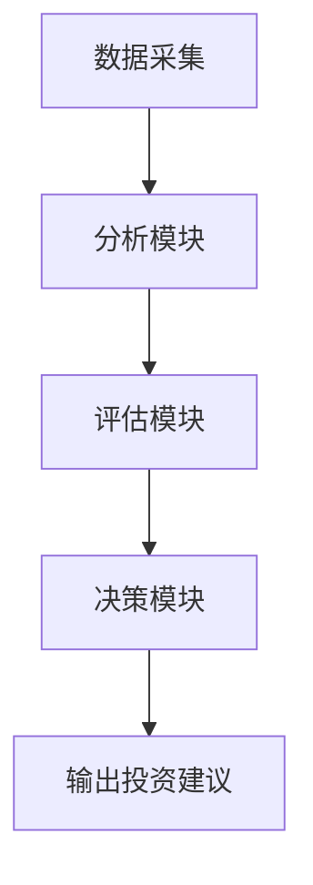
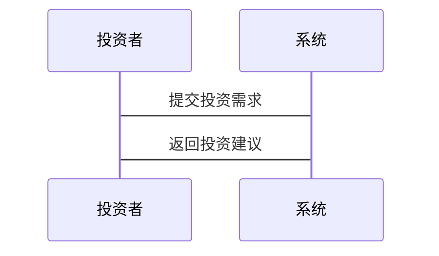

                 


# 本杰明格雷厄姆的价值投资原则

> 关键词：价值投资、本杰明·格雷厄姆、内在价值、安全边际、投资策略、风险管理

> 摘要：本杰明·格雷厄姆是价值投资的鼻祖，他的投资原则深刻影响了现代投资学。本文将详细分析格雷厄姆的价值投资原则，包括其核心概念、数学模型、系统架构以及实际案例分析。通过本篇文章，读者将深入了解如何应用这些原则进行投资决策，并掌握相关的技术细节和实现方法。

---

## 第一部分: 价值投资的背景与核心概念

### 第1章: 价值投资的起源与意义

#### 1.1 本杰明·格雷厄姆的生平简介
本杰明·格雷厄姆（Benjamin Graham）是20世纪著名的投资学家、经济学家和作家，被誉为“价值投资之父”。他出生于1894年，早年在哥伦比亚大学学习法律，后来转向金融领域。格雷厄姆的职业生涯始于1920年代，他在纽约证券交易所工作，并在1929年股市崩盘后开始发展自己的投资理论。他的思想深刻影响了包括沃伦·巴菲特在内的众多投资者。

#### 1.2 价值投资的定义与核心理念
价值投资是一种以基本面分析为基础的投资策略，其核心理念是寻找市场价格低于其内在价值的证券。格雷厄姆认为，市场价格往往波动较大，而内在价值是证券的真实价值，反映了其未来现金流的现值。价值投资者的目标是通过购买被市场低估的证券来实现长期稳定的收益。

#### 1.3 价值投资的核心原则
1. **安全边际**：购买价格低于内在价值，确保投资的安全性。
2. **内在价值**：通过基本面分析计算证券的真实价值。
3. **长期视角**：价值投资强调长期持有的策略，避免频繁交易。

### 第2章: 价值投资的核心原则

#### 2.1 投资的基本原理
1. **时间、风险与收益**：投资的回报与风险成正比，而时间是复利增长的关键因素。
2. **安全边际与内在价值**：安全边际是市场价格与内在价值之间的差距，是投资的安全垫。
3. **价值投资与投机的区分**：价值投资注重基本面分析，而投机则依赖市场情绪和短期价格波动。

#### 2.2 格雷厄姆的价值投资体系
1. **股票分类与筛选标准**：
   - 非周期性股票：稳定增长的企业，如公用事业和消费品公司。
   - 周期性股票：波动较大的行业，如原材料和制造业。
2. **内在价值的计算**：格雷厄姆提出了内在价值的计算方法，包括未来现金流的现值和残值。

### 第3章: 价值投资的哲学与心理

#### 3.1 投资者的心理与行为
1. **人性的弱点**：贪婪与恐惧是投资者的主要心理障碍。
2. **理性决策的重要性**：价值投资者需要克服情绪干扰，坚持理性分析。

#### 3.2 价值投资的哲学基础
1. **长期视角**：投资是长期的游戏，复利是价值投资的核心。
2. **耐心与纪律**：价值投资需要耐心等待好机会，同时严格遵守投资纪律。

---

## 第二部分: 价值投资的数学模型与算法原理

### 第4章: 内在价值的数学模型

#### 4.1 内在价值的计算公式
内在价值的计算基于未来现金流的现值。公式如下：

$$
内在价值 = \sum_{t=1}^{n} \frac{CF_t}{(1+r)^t} + \frac{残值}{(1+r)^n}
$$

其中：
- \( CF_t \) 是第 \( t \) 年的现金流。
- \( r \) 是折现率。
- \( n \) 是投资期限。

#### 4.2 财务指标的量化分析
1. **市盈率（P/E）**：计算公式为 \( P/E = \frac{股价}{每股收益} \)。
2. **市净率（P/B）**：计算公式为 \( P/B = \frac{股价}{每股净资产} \)。
3. **股息率**：计算公式为 \( 股息率 = \frac{股息}{股价} \times 100\% \)。

### 第5章: 价值投资的量化策略

#### 5.1 安全边际的量化计算
安全边际是市场价格与内在价值之间的差额，计算公式为：

$$
安全边际 = 内在价值 - 市场价格
$$

#### 5.2 价值投资的量化策略
1. **筛选低市盈率股票**：选择市盈率低于行业平均水平的股票。
2. **筛选低市净率股票**：选择市净率低于行业平均水平的股票。
3. **筛选高股息率股票**：选择股息率高于行业平均水平的股票。

---

## 第三部分: 价值投资的系统分析与架构设计

### 第6章: 系统架构设计

#### 6.1 系统功能设计
1. **数据采集模块**：收集股票的财务数据和市场数据。
2. **分析模块**：计算内在价值、市盈率、市净率等指标。
3. **评估模块**：筛选符合价值投资标准的股票。
4. **决策模块**：根据分析结果生成投资建议。

#### 6.2 系统架构图


### 第7章: 系统交互流程

#### 7.1 交互流程图


---

## 第四部分: 项目实战

### 第8章: 项目实战分析

#### 8.1 环境配置
1. **安装Python**：用于数据处理和分析。
2. **安装数据分析库**：如Pandas、NumPy等。

#### 8.2 核心代码实现
```python
import pandas as pd
import numpy as np

def calculate_intrinsic_value(earnings, growth_rate, discount_rate):
    # 计算未来现金流的现值
    present_value = 0
    for i in range(5):
        cash_flow = earnings * (1 + growth_rate) ** i
        present_value += cash_flow / (1 + discount_rate) ** i
    return present_value

# 示例数据
earnings = 100
growth_rate = 0.05
discount_rate = 0.08

intrinsic_value = calculate_intrinsic_value(earnings, growth_rate, discount_rate)
print(f"内在价值为: {intrinsic_value}")
```

#### 8.3 实际案例分析
假设某公司过去5年的收益为100万元，年增长率5%，折现率8%。计算其内在价值：

$$
内在价值 = \sum_{t=1}^{5} \frac{100 \times (1+0.05)^t}{(1+0.08)^t}
$$

---

## 第五部分: 结论与展望

### 第9章: 结论与小结

#### 9.1 总结
本杰明·格雷厄姆的价值投资原则强调基本面分析和长期持有。通过计算内在价值和安全边际，投资者可以找到被低估的股票，实现长期稳定的收益。

#### 9.2 展望
价值投资的未来发展方向包括：
1. **量化分析的进一步发展**：结合机器学习和大数据技术，提升投资决策的准确性。
2. **风险管理的优化**：引入更多的风险管理工具，如期权和对冲策略。

---

### 第10章: 最佳实践与注意事项

#### 10.1 最佳实践
1. **持续学习**：关注市场变化和企业基本面。
2. **严格纪律**：坚持价值投资的原则，避免情绪化决策。

#### 10.2 注意事项
1. **市场波动**：价值投资需要耐心等待市场回归内在价值。
2. **数据质量**：确保财务数据的准确性和完整性。

---

### 第11章: 拓展阅读与参考资料

#### 11.1 拓展阅读
1. 《The Intelligent Investor》 by Benjamin Graham
2. 《价值投资入门》 by 价值投资俱乐部

#### 11.2 参考资料
1. 纽约证券交易所官网
2. 价值投资论坛

---

通过以上分析，我们可以看到本杰明·格雷厄姆的价值投资原则不仅是一种投资策略，更是一种严谨的科学方法。希望本文能为读者提供有价值的见解，并帮助他们在投资领域取得成功。

