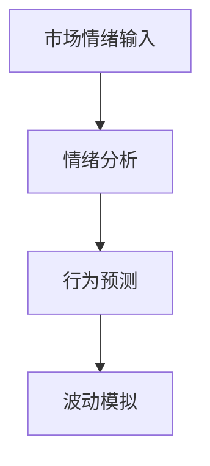
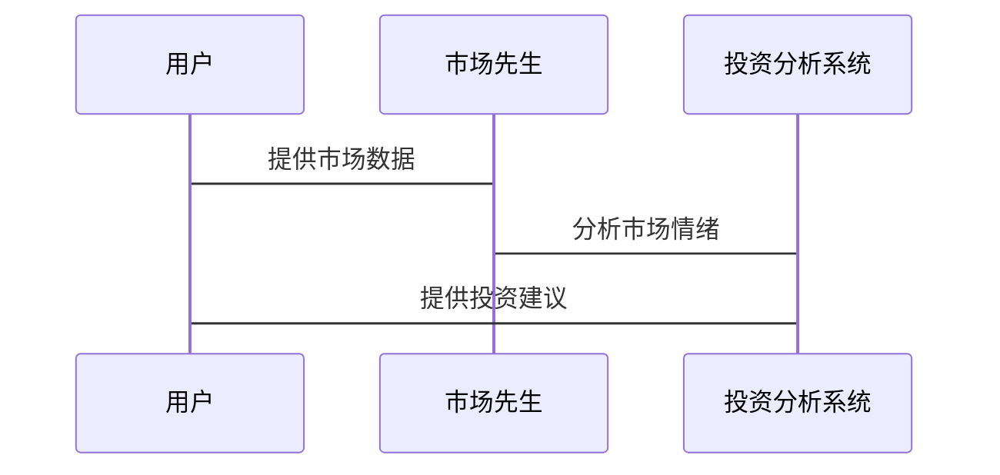

                 


# 本杰明格雷厄姆的市场先生概念

> **关键词**：市场先生，投资理论，市场情绪，投资者行为，波动性，决策机制，量化模型

> **摘要**：本杰明·格雷厄姆提出的市场先生概念是投资理论中的一个重要思想，它帮助投资者理解市场波动和投资者心理。本文将从市场先生的背景、核心概念、算法原理、数学模型、系统设计和项目实战等方面进行详细分析，帮助读者全面掌握市场先生的概念及其在投资中的应用。

---

## 第1章: 市场先生的背景与起源

### 1.1 市场先生概念的提出

#### 1.1.1 本杰明·格雷厄姆的生平简介

本杰明·格雷厄姆（Benjamin Graham）是20世纪著名的投资学家和经济学家，被誉为“价值投资之父”。他在1934年出版的《证券分析》一书中提出了许多重要的投资理论，其中最著名的概念之一就是“市场先生”。

格雷厄姆的学生包括沃伦·巴菲特等众多投资大师，他的理论对现代投资学产生了深远影响。市场先生概念是格雷厄姆在《证券分析》中提出的一个假想人物，用来解释市场的波动性和投资者的行为。

#### 1.1.2 市场先生概念的提出背景

在20世纪30年代，美国股市经历了大萧条时期，投资者对市场的不稳定性有了深刻的认识。格雷厄姆希望通过市场先生的概念，帮助投资者理解市场的波动性和非理性。他将市场先生描述为一个情绪化的投资者，其行为反映了市场的波动性。

#### 1.1.3 市场先生在投资理论中的地位

市场先生概念是格雷厄姆价值投资理论的重要组成部分。它强调了市场的波动性和非理性，提醒投资者不要被短期市场波动所左右，而应关注长期的投资价值。

---

### 1.2 市场先生概念的发展历程

#### 1.2.1 早期市场先生理论的形成

市场先生最初是一个简单的概念，用于解释市场波动性和投资者心理。格雷厄姆将其定义为一个情绪化的市场参与者，其行为受到贪婪和恐惧的驱使。

#### 1.2.2 市场先生概念的演变与扩展

随着时间的推移，市场先生的概念逐渐扩展，从最初的简单模型发展为复杂的系统模型。现代市场先生理论不仅考虑市场情绪，还考虑了市场的参与者、市场机制和经济周期等因素。

#### 1.2.3 当代市场先生理论的应用

当代市场先生理论广泛应用于投资分析、风险管理等领域。它帮助投资者理解市场的波动性，制定投资策略。

---

### 1.3 市场先生概念的核心要素

#### 1.3.1 市场情绪的波动性

市场情绪是市场先生的核心要素之一。市场先生的情绪波动性反映了市场的波动性，投资者可以通过分析市场情绪来制定投资策略。

#### 1.3.2 市场参与者的多样性

市场参与者包括个人投资者、机构投资者、基金经理等。市场参与者的多样性影响了市场的波动性和走势。

#### 1.3.3 市场机制的复杂性

市场的机制包括价格形成、交易规则等。市场机制的复杂性影响了市场的波动性和走势。

---

## 第2章: 市场先生概念的理论基础

### 2.1 市场先生的定义与特征

#### 2.1.1 市场先生的定义

市场先生是格雷厄姆提出的一个假想人物，代表市场的波动性和非理性。市场先生的行为反映了市场的波动性。

#### 2.1.2 市场先生的核心特征

市场先生的核心特征包括情绪波动性、行为非理性、市场影响力等。

#### 2.1.3 市场先生与其他市场参与者的区别

市场先生与其他市场参与者的区别在于其情绪化和非理性行为。

### 2.2 市场先生的属性对比

#### 2.2.1 市场先生与投资者的对比

市场先生代表市场的情绪和波动性，而投资者则是理性的市场参与者。

#### 2.2.2 市场先生与市场的对比

市场是一个复杂的系统，而市场先生是市场的代表人物。

#### 2.2.3 市场先生与经济周期的对比

市场先生的行为受到经济周期的影响。

### 2.3 市场先生的ER实体关系图

```mermaid
er
actor 市场先生 {
  id
  市场情绪
  市场行为
}
```

---

## 第3章: 市场先生的算法与数学模型

### 3.1 市场先生的算法原理

#### 3.1.1 市场情绪的量化方法

市场情绪可以通过多种方式量化，例如通过投资者情绪指标（AAII）、市场波动率等。

#### 3.1.2 市场行为的预测模型

市场行为可以通过时间序列模型进行预测，例如ARIMA模型。

#### 3.1.3 市场波动的模拟算法

市场波动可以通过随机游走模型或马尔可夫链模型进行模拟。

### 3.2 市场先生的算法流程图



### 3.3 市场先生的Python实现

#### 3.3.1 环境安装与配置

需要安装Python和相关库，例如pandas、numpy、scikit-learn等。

#### 3.3.2 核心代码实现

```python
def market_emotion(market_data):
    # 计算市场情绪
    return emotion_value
```

---

## 第4章: 市场先生的数学模型

### 4.1 市场情绪的量化模型

#### 4.1.1 市场情绪的数学表达式

$$ emotion = \frac{sum}{n} $$

#### 4.1.2 市场情绪的波动方程

$$ \sigma = \sqrt{\frac{1}{n}\sum_{i=1}^{n}(x_i - \mu)^2} $$

### 4.2 市场行为的预测公式

#### 4.2.1 线性回归模型

$$ y = a + bx + \epsilon $$

#### 4.2.2 时间序列模型

$$ ARIMA(p, d, q) $$

### 4.3 市场波动的模拟公式

#### 4.3.1 随机游走模型

$$ P_{t+1} = P_t + \epsilon_t $$

#### 4.3.2 马尔可夫链模型

$$ P_{t+1} = \max(P_t, \epsilon) $$

---

## 第5章: 系统分析与架构设计

### 5.1 问题场景介绍

市场先生概念的应用场景包括投资分析、风险管理等。

### 5.2 项目介绍

本项目旨在构建一个基于市场先生概念的投资分析系统。

### 5.3 系统功能设计

#### 5.3.1 领域模型


### 5.4 系统架构设计


### 5.5 系统接口设计

系统接口包括数据输入接口、情绪分析接口、行为预测接口等。

### 5.6 系统交互设计



---

## 第6章: 项目实战

### 6.1 环境安装与配置

安装Python和相关库，例如pandas、numpy、scikit-learn等。

### 6.2 核心代码实现

```python
def market_emotion(market_data):
    # 计算市场情绪
    return emotion_value
```

### 6.3 代码应用解读与分析

解释代码的功能和实现细节。

### 6.4 实际案例分析

通过具体案例分析市场先生概念的应用。

### 6.5 项目小结

总结项目实现的过程和成果。

---

## 第7章: 最佳实践与小结

### 7.1 最佳实践

投资者应结合市场先生概念和其他投资理论，制定合理的投资策略。

### 7.2 小结

市场先生概念是投资理论中的一个重要思想，帮助投资者理解市场波动和投资者心理。

### 7.3 注意事项

投资者应理性看待市场波动，避免被市场情绪左右。

### 7.4 拓展阅读

推荐阅读本杰明·格雷厄姆的《证券分析》和《投资学原理》。

---

通过以上章节的详细分析，读者可以全面理解本杰明格雷厄姆的市场先生概念，并将其应用于实际投资分析中。

