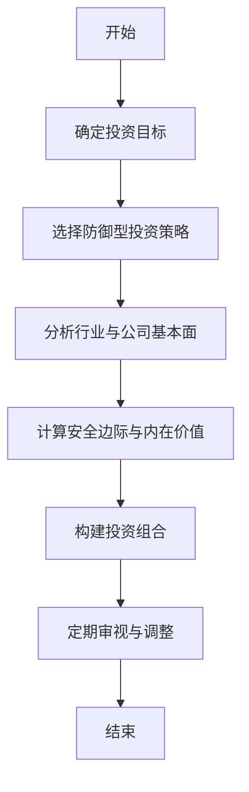
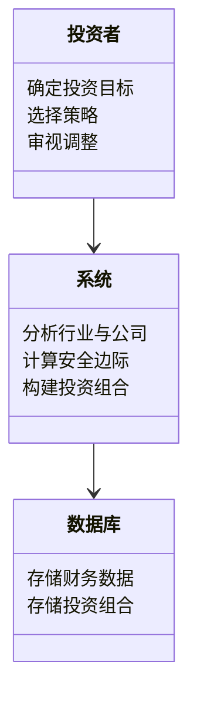

                 


# 本杰明格雷厄姆的防御型投资者策略

## 关键词：防御型投资、安全边际、长期收益、稳健策略、内在价值

## 摘要：  
防御型投资者策略是价值投资的重要组成部分，强调通过基本面分析和安全边际来实现长期稳健的收益。本文详细解析了防御型投资的核心理念、策略体系、数学模型和系统架构，并通过实际案例展示了如何在实践中应用这些方法。文章还探讨了防御型投资与其他投资策略的对比，帮助读者全面理解这一策略的优势和应用场景。

---

# 第一部分: 防御型投资者策略的核心理念

## 第1章: 防御型投资的核心概念

### 1.1 防御型投资的背景与定义

#### 1.1.1 传统投资策略的局限性  
传统投资策略往往依赖于市场的短期波动和情绪化判断，容易受到市场波动的影响，导致投资者在市场下跌时承受较大风险。这种策略忽视了企业的基本面，可能导致投资决策失误。

#### 1.1.2 防御型投资的定义与特点  
防御型投资是一种以长期稳健收益为目标的投资策略，强调通过深入的基本面分析，选择具有安全边际的优质企业进行投资。其特点是注重企业的内在价值，避免过度波动和高风险投资。

#### 1.1.3 防御型投资的哲学基础  
防御型投资的哲学基础来源于本杰明·格雷厄姆的价值投资理论，强调“价格是仆人，价值是主人”。投资者应关注企业的内在价值，而非市场的短期波动。

### 1.2 防御型投资者的特征与目标

#### 1.2.1 防御型投资者的特征  
- 注重长期稳健收益  
- 强调安全边际和风险控制  
- 偏好低波动、高分红的优质企业  

#### 1.2.2 防御型投资的目标  
防御型投资的目标是通过选择具有稳定收益和较低风险的企业，实现长期的资本增值和稳定的现金流。

#### 1.2.3 防御型投资与进攻型投资的对比  
| 投资策略 | 防御型投资 | 进攻型投资 |
|----------|-------------|------------|
| 目标     | 稳健收益    | 高收益     |
| 风险     | 低风险      | 高风险     |
| 时间跨度 | 长期        | 短期        |
| 策略     | 价值投资    | 技术分析    |

### 1.3 防御型投资的核心原则

#### 1.3.1 安全边际的概念  
安全边际是指股票价格与其内在价值之间的差距。投资者应选择价格低于内在价值的股票，以确保投资的安全性。

#### 1.3.2 股价波动与内在价值的分离  
防御型投资强调内在价值的重要性，认为股价的短期波动并不影响企业的实际价值。投资者应关注企业的基本面，而非短期市场波动。

#### 1.3.3 长期投资与价值发现  
防御型投资倡导长期投资，通过时间的积累实现资本的增值。同时，投资者应耐心寻找被市场低估的优质企业。

---

## 第2章: 防御型投资的策略体系

### 2.1 防御型投资的基本策略

#### 2.1.1 股票选择标准  
防御型投资者在选择股票时，应重点关注以下因素：  
- 企业的盈利能力  
- 财务状况的稳健性  
- 行业地位和竞争优势  
- 股价的合理性和安全边际  

#### 2.1.2 行业分析与公司分析  
防御型投资者需要对行业和公司进行全面分析，包括：  
- 行业前景和竞争格局  
- 公司的财务报表和盈利能力  
- 管理层的诚信和能力  

#### 2.1.3 财务指标评估  
防御型投资者应关注以下财务指标：  
- 市盈率（P/E）  
- 市净率（P/B）  
- 净资产收益率（ROE）  
- 资产负债率  

### 2.2 防御型投资的组合管理

#### 2.2.1 投资组合的构建原则  
防御型投资强调分散投资，避免过度集中于某一行业或公司。同时，应根据市场变化和企业基本面调整投资组合。

#### 2.2.2 风险分散与资产配置  
防御型投资者应合理配置资产，分散投资风险。通常，可以将资金分配到股票、债券、现金等不同资产类别中。

#### 2.2.3 定期审视与调整策略  
防御型投资者应定期审视投资组合，评估企业的基本面变化和市场环境的变化，及时调整投资策略。

---

## 第3章: 防御型投资的数学模型与算法

### 3.1 防御型投资的核心算法

#### 3.1.1 安全边际计算模型  
安全边际可以通过以下公式计算：  
$$ \text{安全边际} = \text{内在价值} - \text{市场价格} $$  

#### 3.1.2 内在价值评估公式  
内在价值可以通过现金流折现模型（DCF）计算：  
$$ DCF = \frac{CF_1}{(1+r)^1} + \frac{CF_2}{(1+r)^2} + \cdots + \frac{CF_n}{(1+r)^n} $$  
其中，\( CF \) 表示现金流，\( r \) 表示折现率。

#### 3.1.3 股票估值的多因子分析  
防御型投资者可以通过多因子模型对股票进行估值，综合考虑企业的盈利能力、成长性和估值水平。

### 3.2 内在价值计算的数学公式

#### 3.2.1 现金流折现模型（DCF）  
$$ DCF = \sum_{t=1}^{n} \frac{CF_t}{(1+r)^t} $$  

#### 3.2.2 市盈率与市净率的对比分析  
$$ P/E = \frac{Price}{Earnings}, \quad P/B = \frac{Price}{Book\ Value} $$  

### 3.3 防御型投资的算法流程图  



---

## 第4章: 防御型投资的系统架构设计

### 4.1 系统功能设计

#### 4.1.1 投资目标设定  
系统应根据投资者的风险承受能力和收益目标，制定防御型投资策略。

#### 4.1.2 行业与公司分析  
系统通过大数据分析和机器学习算法，对行业和公司进行基本面评估。

#### 4.1.3 财务指标评估  
系统计算企业的关键财务指标，如市盈率、市净率、ROE等，评估其投资价值。

#### 4.1.4 投资组合管理  
系统根据分析结果，构建和调整投资组合，分散风险，优化收益。

### 4.2 系统架构设计  



---

## 第5章: 防御型投资的项目实战

### 5.1 环境安装

#### 5.1.1 安装Python和相关库  
安装Python和Pandas、NumPy等数据分析库：  
```bash
pip install pandas numpy
```

### 5.2 核心实现源代码

#### 5.2.1 内在价值计算代码  
```python
import pandas as pd
import numpy as np

def calculate_intrinsic_value(cash_flows, discount_rate):
    return np.sum(cash_flows / (1 + discount_rate)**np.arange(len(cash_flows)))

# 示例数据
cash_flows = [100, 120, 150, 200]
discount_rate = 0.08

iv = calculate_intrinsic_value(cash_flows, discount_rate)
print(f"内在价值: {iv:.2f}")
```

#### 5.2.2 安全边际计算代码  
```python
def calculate_margin_of_safety(intrinsic_value, market_price):
    return intrinsic_value - market_price

# 示例数据
iv = 200
mp = 150

mos = calculate_margin_of_safety(iv, mp)
print(f"安全边际: {mos:.2f}")
```

### 5.3 案例分析

#### 5.3.1 案例选择  
以苹果公司为例，计算其内在价值和安全边际。

#### 5.3.2 计算过程  
1. 收集苹果公司的财务数据和市场数据。  
2. 计算苹果公司的内在价值。  
3. 比较市场价格与内在价值，计算安全边际。  

#### 5.3.3 结果分析  
如果苹果公司的内在价值为200美元，市场价格为150美元，则其安全边际为50美元，具备较高的投资价值。

---

## 第6章: 防御型投资的最佳实践

### 6.1 小结  
防御型投资是一种稳健的投资策略，强调安全边际和长期收益。通过基本面分析和合理分散投资，投资者可以在市场波动中保持稳健的收益。

### 6.2 注意事项  
- 防御型投资需要长期坚持，避免短期市场波动的影响。  
- 投资者应不断学习和更新自己的知识，以应对市场变化。  
- 在实际操作中，应结合市场环境和企业基本面，灵活调整投资策略。

### 6.3 拓展阅读  
- 《聪明的投资者》——本杰明·格雷厄姆  
- 《价值投资实战》——沃伦·巴菲特  

---

# 结语  
防御型投资是一种适合长期稳健投资者的策略，通过深入的基本面分析和合理的投资组合管理，投资者可以在市场波动中实现稳定的收益。希望本文能够为读者提供清晰的思路和实用的方法，帮助他们在投资道路上走得更稳更远。

