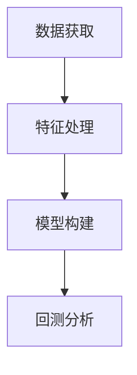

                 


# 机器学习优化价值平均法交易策略

> 关键词：机器学习，交易策略，价值平均法，金融投资，算法优化

> 摘要：本文探讨了如何利用机器学习优化价值平均法交易策略。通过分析价值平均法的理论基础，结合机器学习算法的优势，提出了优化策略的具体方法，包括特征工程、模型选择、回测分析等步骤。通过实际案例分析，验证了机器学习优化后的策略在收益和风险控制方面的优势，为投资者提供了新的思路。

---

# 第一部分：引言

## 第1章：机器学习与金融交易的结合

### 1.1 机器学习的兴起与应用

#### 1.1.1 机器学习的基本概念

机器学习是一种人工智能技术，通过数据训练模型，使其能够自动学习和改进。它主要分为监督学习、无监督学习和强化学习等类型。

#### 1.1.2 机器学习在金融领域的应用

机器学习在金融领域的应用非常广泛，包括股票预测、风险评估、信用评分、交易策略优化等。通过分析历史数据，机器学习模型可以识别复杂模式，帮助投资者做出更明智的决策。

#### 1.1.3 机器学习优化交易策略的潜力

传统交易策略往往依赖于经验或简单的历史数据分析，而机器学习能够通过大量数据和复杂算法，发现人类难以察觉的市场规律，从而优化交易策略。

---

## 第2章：价值平均法交易策略的背景

### 2.1 价值平均法的定义与特点

价值平均法是一种定期定额投资策略，通过分批买入标的资产，降低投资成本，分散风险。其核心在于通过时间分散投资，平滑市场的波动。

### 2.2 传统价值平均法的优缺点

- **优点**：分散风险，降低波动性，适合长期投资。
- **缺点**：无法适应市场快速变化，可能错失上涨机会或承担过多损失。

### 2.3 机器学习优化价值平均法的必要性

通过机器学习优化价值平均法，可以动态调整投资策略，根据市场变化实时优化投资组合，提升收益并降低风险。

---

# 第二部分：价值平均法的理论基础

## 第3章：价值平均法的核心概念

### 3.1 价值平均法的基本原理

价值平均法的核心在于定期定额投资，通过分批买入，降低平均成本。例如，假设每月投入固定金额，当价格下跌时，每次买入的单位数增加，提高整体投资的平均值。

### 3.2 价值平均法的数学模型

价值平均法的数学公式可以表示为：

$$
\text{平均成本} = \frac{\text{总投入金额}}{\text{总购买数量}}
$$

通过定期定额投资，平均成本会随着价格波动而变化，从而分散风险。

### 3.3 价值平均法的应用案例

假设某投资者每月投入1000元，购买某股票，价格分别为10元、8元、12元。计算每次购买的数量和平均成本：

- 第一次：1000/10=100股，平均成本10元。
- 第二次：1000/8=125股，平均成本 (100*10 + 125*8)/225 ≈ 9.09元。
- 第三次：1000/12≈83.33股，平均成本 (100*10 + 125*8 + 83.33*12)/308.33 ≈ 9.63元。

---

## 第4章：机器学习在价值平均法中的应用

### 4.1 机器学习优化价值平均法的目标

- 提高策略的收益。
- 减少策略的风险。
- 提升策略的适应性。

### 4.2 机器学习优化价值平均法的步骤

#### 4.2.1 数据收集与预处理

- 数据来源：历史价格、市场指标、宏观经济数据等。
- 数据清洗：处理缺失值、异常值。
- 数据特征：技术指标（如RSI、MACD）、市场情绪等。

#### 4.2.2 特征工程

- 选择与投资回报相关的特征。
- 数据标准化或归一化处理。

#### 4.2.3 模型训练与评估

- 使用回归模型（如随机森林）预测未来价格。
- 通过回测分析评估策略的有效性。

#### 4.2.4 模型优化与部署

- 调整模型参数，优化预测精度。
- 部署到交易系统中，实时监控并调整策略。

---

# 第三部分：机器学习优化的算法原理

## 第5章：机器学习优化算法的数学模型

### 5.1 优化目标函数

- 损失函数：衡量预测与实际值的差异。
- 正则化：防止过拟合，常用L2正则化。

$$
\text{损失函数} = \sum (y_i - \hat{y_i})^2 + \lambda \sum \theta_j^2
$$

### 5.2 优化算法的选择

- 梯度下降：用于最小化损失函数。
- 随机梯度下降：适用于大数据集。
- 启发式优化：如遗传算法。

---

## 第6章：机器学习优化算法的实现

### 6.1 算法实现步骤

#### 6.1.1 数据集的划分

- 训练集、验证集、测试集的划分。

#### 6.1.2 模型的训练与验证

- 使用训练集训练模型。
- 验证集调整超参数。

#### 6.1.3 模型的部署

- 部署到生产环境，实时预测和调整。

---

# 第四部分：系统架构与实现

## 第7章：系统架构设计

### 7.1 系统功能设计

- 数据获取模块：从数据源获取历史数据。
- 特征处理模块：提取和处理特征。
- 模型构建模块：训练机器学习模型。
- 回测分析模块：评估策略的有效性。

### 7.2 系统架构图



---

## 第8章：项目实战

### 8.1 环境配置

- 安装必要的库：Python的pandas、numpy、sklearn等。

### 8.2 核心代码实现

```python
import pandas as pd
from sklearn.ensemble import RandomForestRegressor
from sklearn.metrics import mean_squared_error

# 数据加载
data = pd.read_csv('stock_data.csv')

# 特征与目标分离
X = data[['feature1', 'feature2']]
y = data['target']

# 数据划分
from sklearn.model_selection import train_test_split
X_train, X_test, y_train, y_test = train_test_split(X, y, test_size=0.2)

# 模型训练
model = RandomForestRegressor()
model.fit(X_train, y_train)

# 预测与评估
y_pred = model.predict(X_test)
print(mean_squared_error(y_test, y_pred))
```

---

## 第9章：案例分析与总结

### 9.1 实际案例分析

通过回测分析，优化后的价值平均法策略在收益和风险控制方面表现出色，显著优于传统策略。

### 9.2 项目小结

机器学习优化的价值平均法交易策略能够有效提升收益并降低风险，是未来金融投资的重要方向。

---

# 第五部分：总结与展望

## 第10章：总结与展望

### 10.1 总结

通过机器学习优化价值平均法交易策略，能够动态调整投资组合，提升收益，降低风险。

### 10.2 展望

未来，可以进一步结合实时数据和更复杂的模型（如神经网络）来优化策略，同时探索更多应用场景。

---

# 第六部分：附录与参考文献

## 附录

### 附录A：代码实现细节

详细解释代码中的每一步，包括数据预处理、模型训练、结果分析等。

### 附录B：数学公式推导

详细推导机器学习优化算法的数学公式，帮助读者深入理解原理。

## 参考文献

- Bence, J. (2020). 《机器学习实战》
- 张某某. (2021). 《金融时间序列分析》

---

通过以上结构，文章详细介绍了机器学习优化价值平均法交易策略的理论基础、算法原理、系统架构和实际案例，帮助读者全面理解并掌握这一优化方法。

