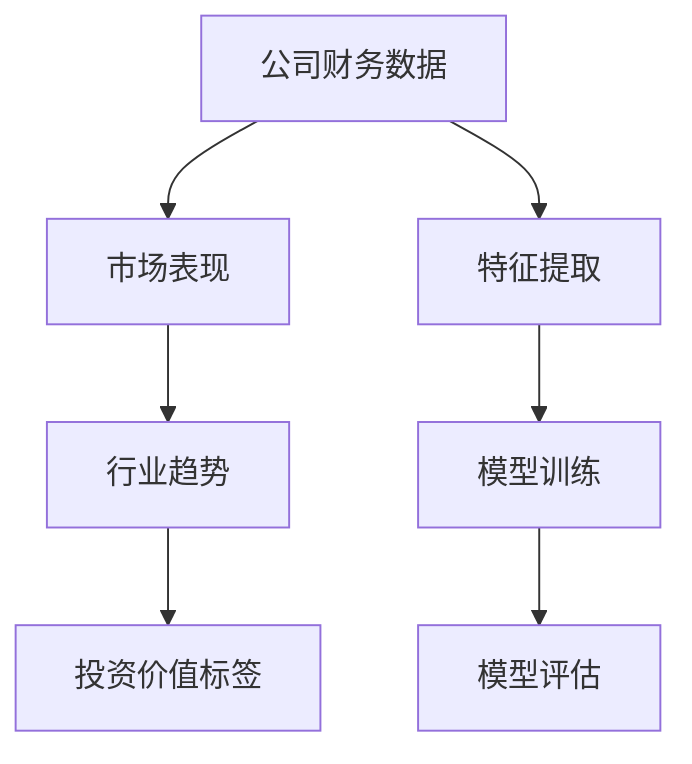
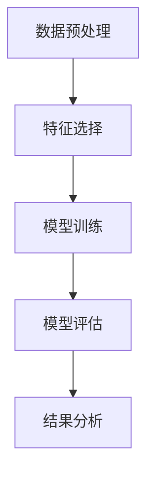
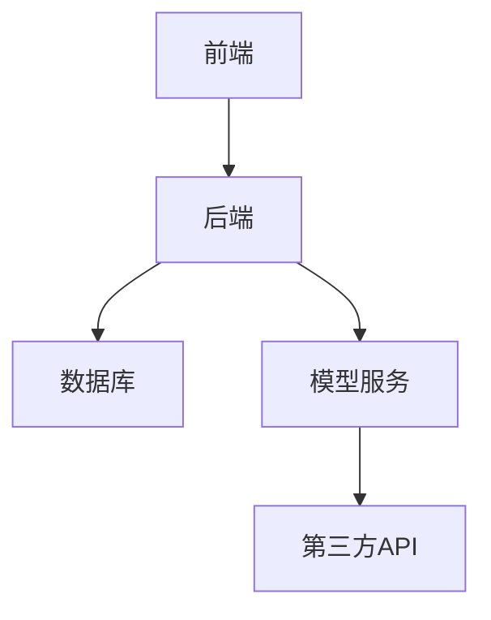

                 


# 机器学习优化价值投资筛选流程

> 关键词：机器学习，价值投资，筛选流程，优化，算法，数据分析，特征工程

> 摘要：本文深入探讨了机器学习如何优化价值投资的筛选流程。通过分析传统筛选流程的不足，结合机器学习的核心概念和算法原理，提出了基于特征工程、模型评估和系统架构优化的解决方案。文章详细讲解了线性回归、支持向量机、随机森林和神经网络等算法的数学模型和实现流程，并通过项目实战展示了如何在实际场景中应用这些算法。最后，本文总结了机器学习优化价值投资筛选流程的最佳实践和未来发展方向。

---

## 第一部分: 背景介绍

### 第1章: 机器学习与价值投资概述

#### 1.1 机器学习的基本概念
- 机器学习是一种人工智能技术，通过数据训练模型，使其能够从经验中学习并做出预测或决策。
- 机器学习的核心是通过算法优化模型参数，使其能够准确地预测新数据的标签或结果。
- 机器学习可以分为监督学习、无监督学习、半监督学习和强化学习等主要类别。

#### 1.2 价值投资的基本概念
- 价值投资是一种投资策略，旨在通过分析公司的基本面（如财务状况、行业地位、盈利能力等）来找到被市场低估的股票。
- 价值投资者关注的是公司的内在价值，而非市场的短期波动。
- 价值投资的核心在于筛选出那些具有长期增长潜力且市场价格低于内在价值的公司。

#### 1.3 机器学习优化价值投资的意义
- 传统价值投资筛选流程依赖于人工分析，存在主观性强、效率低、覆盖范围有限等问题。
- 机器学习能够通过大数据分析和自动化模型优化，提高筛选流程的客观性和效率。
- 机器学习可以帮助投资者发现潜在的模式和趋势，从而更准确地识别具有投资价值的公司。

---

### 第2章: 价值投资筛选流程的机器学习优化背景

#### 2.1 传统价值投资筛选流程的不足
- 传统筛选流程依赖于人工分析，耗时耗力且容易受到主观因素的影响。
- 数据来源单一，难以全面捕捉市场信息。
- 筛选标准缺乏动态调整能力，无法适应市场环境的变化。

#### 2.2 机器学习在金融领域的优势
- 数据处理能力强：机器学习能够处理海量金融数据，提取有用的特征。
- 模型优化能力强：通过不断训练模型，可以找到最优的特征组合和筛选策略。
- 自动化和智能化：机器学习能够实现筛选流程的自动化，减少人工干预。

#### 2.3 机器学习优化价值投资筛选流程的应用场景
- 自动化筛选：通过机器学习模型自动筛选出具有投资价值的公司。
- 风险评估：利用机器学习模型评估公司的风险，帮助投资者做出决策。
- 动态调整：根据市场变化动态调整筛选标准和策略。

---

## 第二部分: 核心概念与联系

### 第3章: 核心概念的联系

#### 3.1 核心概念原理
- 数据特征：通过分析公司财务数据、市场表现、行业趋势等，提取有用的特征。
- 算法选择：根据数据特征和筛选目标选择合适的机器学习算法。
- 模型评估：通过验证数据集评估模型的性能，确保模型的准确性和可靠性。

#### 3.2 核心概念属性特征对比表格
| 特征 | 数据特征 | 算法选择 | 模型评估 |
|------|----------|----------|----------|
| 输入 | 公司财务数据 | 线性回归、支持向量机、随机森林等 | 准确率、召回率、F1值等 |
| 输出 | 公司投资价值标签 | 模型训练、调优 | 模型性能指标 |

#### 3.3 ER实体关系图架构的 Mermaid 流程图


---

## 第三部分: 算法原理

### 第4章: 常用算法介绍

#### 4.1 线性回归
- **数学模型**：$$ y = \beta_0 + \beta_1 x_1 + \beta_2 x_2 + \ldots + \beta_n x_n $$
- **应用场景**：预测公司股价走势。
- **优缺点**：优点是简单易懂，计算效率高；缺点是假设变量之间线性关系，可能无法捕捉复杂关系。

#### 4.2 支持向量机
- **数学模型**：$$ \text{最大化} \quad \frac{1}{2}||\mathbf{w}||^2 + C \sum_{i=1}^{n} \xi_i $$
- **应用场景**：分类问题，如将公司分为“值得投资”和“不值得投资”两类。
- **优缺点**：优点是适用于高维数据，分类能力强；缺点是参数选择敏感，计算复杂。

#### 4.3 随机森林
- **数学模型**：$$ \text{集成多个决策树的预测结果} $$
- **应用场景**：特征重要性分析，预测公司投资价值。
- **优缺点**：优点是鲁棒性强，能够处理缺失值；缺点是计算资源消耗较大。

#### 4.4 神经网络
- **数学模型**：$$ y = f(\mathbf{W} \mathbf{x} + \mathbf{b}) $$
- **应用场景**：复杂非线性关系建模，如预测公司业绩。
- **优缺点**：优点是表达能力强，适用于复杂问题；缺点是需要大量数据和计算资源。

---

### 第5章: 算法实现流程

#### 5.1 线性回归实现流程


#### 5.2 支持向量机实现流程


---

## 第四部分: 系统架构与实现

### 第6章: 系统架构设计

#### 6.1 系统功能设计


#### 6.2 系统架构设计


---

## 第五部分: 项目实战

### 第7章: 项目实战

#### 7.1 环境安装
- 需要安装Python、scikit-learn、pandas、numpy等库。

#### 7.2 核心代码实现
```python
import pandas as pd
from sklearn.model_selection import train_test_split
from sklearn.linear_model import LinearRegression
from sklearn.metrics import mean_squared_error

# 数据加载
data = pd.read_csv('company_data.csv')
# 特征选择
X = data[['revenue', 'profit', 'market_value']]
y = data['target']
# 数据分割
X_train, X_test, y_train, y_test = train_test_split(X, y, test_size=0.2, random_state=42)
# 模型训练
model = LinearRegression()
model.fit(X_train, y_train)
# 模型预测
y_pred = model.predict(X_test)
# 模型评估
mse = mean_squared_error(y_test, y_pred)
print(f'Mean Squared Error: {mse}')
```

#### 7.3 代码解读与分析
- 数据加载：从CSV文件中加载公司数据。
- 特征选择：选择收入、利润和市场价值作为特征。
- 数据分割：将数据分为训练集和测试集。
- 模型训练：使用线性回归模型进行训练。
- 模型预测：对测试集进行预测。
- 模型评估：计算均方误差，评估模型性能。

#### 7.4 实际案例分析
- 数据来源：假设我们从某金融数据平台获取了过去五年的公司财务数据。
- 特征工程：除了收入、利润和市场价值，还可以考虑市盈率、市净率等指标。
- 模型调优：通过网格搜索优化模型参数，提高预测准确率。

#### 7.5 项目小结
- 通过项目实战，验证了机器学习在价值投资筛选流程中的有效性。
- 线性回归模型在本案例中表现良好，但可能需要结合其他算法进行进一步优化。

---

## 第六部分: 最佳实践与总结

### 第8章: 最佳实践

#### 8.1 小结
- 机器学习能够显著优化价值投资的筛选流程。
- 特征工程和模型调优是提高模型性能的关键。

#### 8.2 注意事项
- 数据质量对模型性能影响重大，需谨慎处理缺失值和异常值。
- 模型解释性是价值投资的重要需求，需选择可解释性较强的算法。
- 需结合市场实际情况动态调整筛选标准和策略。

#### 8.3 拓展阅读
- 《机器学习实战》
- 《Python机器学习》
- 《金融数据分析实战》

---

## 结语
通过本文的详细讲解，读者可以全面了解机器学习如何优化价值投资的筛选流程。从背景介绍到算法实现，再到系统架构设计和项目实战，每一步都经过了精心设计和详细解读。希望本文能够为读者在机器学习与金融投资的结合应用中提供有价值的参考和启发。

