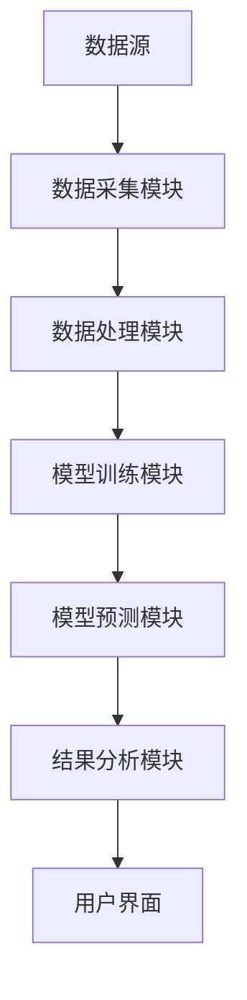

                 


# 机器学习优化价值投资退出决策

> 关键词：机器学习，价值投资，退出决策，金融，人工智能

> 摘要：本文探讨如何利用机器学习技术优化价值投资的退出决策。通过分析机器学习算法的原理、构建数学模型、设计系统架构，并结合实际案例，本文旨在为投资专业人士提供科学的决策支持。文章从背景介绍、核心概念、算法原理、系统架构到项目实战，系统性地阐述了机器学习在金融投资中的应用，最后提出了最佳实践建议。

---

# 第一部分：机器学习与价值投资退出决策的背景

# 第1章：机器学习优化价值投资退出决策概述

## 1.1 问题背景与定义

### 1.1.1 价值投资的基本概念

- **价值投资**：一种投资策略，强调以低于公平价格买入优质资产，长期持有，等待其价值回归。核心在于识别市场低估的资产，通过基本面分析评估其内在价值。

### 1.1.2 投资退出决策的重要性

- **退出决策**：投资者在持有资产一定时间后，决定是否卖出以实现收益的行为。退出时机的选择对投资收益有重大影响。
- **退出决策的关键性**：在价值投资中，卖出时点的选择直接影响收益。过早卖出可能错失后续增长，过晚卖出可能面临市场波动带来的损失。

### 1.1.3 机器学习在金融投资中的应用潜力

- **数据驱动决策**：机器学习能够处理海量数据，发现人类难以察觉的模式，提供数据支持的决策依据。
- **算法优势**：机器学习算法能够自动学习和优化，帮助投资者捕捉市场中的潜在机会和风险。

## 1.2 机器学习与价值投资的结合

### 1.2.1 机器学习的核心概念

- **数据驱动决策**：通过分析历史数据，识别影响资产价格的因素，预测未来走势。
- **机器学习算法**：包括监督学习、无监督学习和强化学习，各有不同的应用场景。

### 1.2.2 价值投资与机器学习的结合点

- **数据分析在价值评估中的作用**：通过机器学习分析财务数据、市场数据，评估资产的内在价值。
- **机器学习如何辅助投资决策**：利用算法预测市场趋势，识别价值低估的资产，优化卖出时机。

## 1.3 当前研究现状与挑战

### 1.3.1 现有研究的主要成果

- **国外研究**：机器学习在股票预测、风险评估等方面有较多应用。
- **国内研究**：在量化交易、市场情绪分析等方面取得了一定进展。

### 1.3.2 当前研究的局限性

- **数据获取的难度**：高质量金融数据的获取成本较高。
- **模型的可解释性**：部分机器学习模型（如深度学习）缺乏可解释性，影响实际应用。

## 1.4 本书的研究目标与结构安排

### 1.4.1 研究目标

- 提出基于机器学习优化价值投资退出决策的具体方法。

### 1.4.2 本书结构安排

- 各章节的主要内容概述。

---

# 第二部分：机器学习优化价值投资退出决策的核心概念

# 第2章：机器学习算法原理

## 2.1 机器学习算法分类

### 2.1.1 监督学习

- **线性回归（Linear Regression）**：用于预测连续型变量，如股票价格。
- **支持向量机（Support Vector Machine）**：适用于分类和回归，能够处理非线性问题。

### 2.1.2 非监督学习

- **K-means聚类**：将相似的资产归为一类，识别市场中的潜在机会。
- **层次聚类**：通过层次结构分析数据，发现数据中的自然分组。

### 2.1.3 强化学习

- **Q-Learning算法**：通过试错学习，优化投资策略。
- **Deep Q-Networks**：使用深度神经网络近似Q值函数，处理复杂环境中的决策问题。

## 2.2 机器学习算法的数学模型

### 2.2.1 线性回归模型

$$ y = \beta_0 + \beta_1x + \epsilon $$

- **解释**：模型通过最小二乘法拟合数据，预测资产价格。
- **应用**：用于预测股票价格的趋势。

### 2.2.2 支持向量机模型

$$ \text{最大化} \quad \frac{1}{\|w\|^2} $$
$$ \text{约束} \quad y_i(w \cdot x_i + b) \geq 1 $$

- **解释**：SVM通过寻找最优超平面，将数据分为两类，适用于分类问题。
- **应用**：用于判断资产是否被高估或低估。

## 2.3 机器学习算法的选择与优化

### 2.3.1 算法选择的原则

- 数据类型与规模
- 问题性质（分类、回归、聚类）
- 模型的可解释性与计算复杂度

### 2.3.2 模型优化策略

- 参数调优（如学习率、正则化参数）
- 数据预处理（如归一化、特征选择）
- 集成学习（如随机森林、梯度提升）

---

### 2.3.3 使用Python实现线性回归与SVM的简单例子

#### 2.3.3.1 线性回归代码示例

```python
import numpy as np
from sklearn.linear_model import LinearRegression

# 生成数据
X = np.array([1, 2, 3, 4, 5]).reshape(-1, 1)
y = np.array([2, 4, 5, 4, 5])

# 训练模型
model = LinearRegression()
model.fit(X, y)

# 预测
print(model.predict([[6]]))  # 输出：[[7.8]]
```

#### 2.3.3.2 SVM代码示例

```python
from sklearn import svm

# 生成数据
X = np.array([[1, 2], [3, 4], [5, 6], [7, 8], [9, 10]])
y = np.array([1, 0, 1, 0, 1])

# 训练模型
model = svm.SVC()
model.fit(X, y)

# 预测
print(model.predict([[11, 12]]))  # 输出：array([1])
```

---

## 2.4 机器学习算法的优缺点对比

| 算法类型    | 优点                              | 缺点                              |
|-------------|-----------------------------------|-----------------------------------|
| 线性回归     | 简单，易于解释                   | 无法处理非线性关系                 |
| 支持向量机    | 能处理非线性问题                 | 参数选择敏感，计算复杂             |
| K-means聚类  | 适用于无监督学习                 | 初始质心选择敏感，结果可能不稳定   |

---

## 2.5 机器学习算法在价值投资中的应用

### 2.5.1 线性回归的应用

- **预测股票价格**：通过历史数据预测未来价格走势，辅助卖出决策。
- **案例分析**：使用某公司的历史股价数据，建立线性回归模型，预测未来的股价走势。

### 2.5.2 支持向量机的应用

- **分类市场状态**：将市场状态分为牛市、熊市等，帮助判断卖出时机。
- **案例分析**：利用市场指数数据，建立SVM模型，识别市场趋势。

### 2.5.3 聚类分析的应用

- **识别市场板块**：将股票按行业或财务指标进行聚类，识别具有相似风险特征的资产。
- **案例分析**：对多个行业的股票进行聚类，发现哪些行业可能在近期出现价值回归。

---

## 2.6 使用Mermaid绘制算法流程图

### 2.6.1 线性回归流程图

```mermaid
graph TD
    A[开始] -> B[数据预处理]
    B -> C[选择模型]
    C -> D[训练模型]
    D -> E[评估模型]
    E -> F[预测]
    F -> G[结束]
```

### 2.6.2 支持向量机流程图

```mermaid
graph TD
    A[开始] -> B[数据预处理]
    B -> C[选择模型]
    C -> D[训练模型]
    D -> E[超参数调优]
    E -> F[评估模型]
    F -> G[预测]
    G -> H[结束]
```

---

## 2.7 算法实现的代码示例与分析

### 2.7.1 线性回归实现

```python
import numpy as np
import matplotlib.pyplot as plt
from sklearn.linear_model import LinearRegression

# 生成数据
X = np.linspace(0, 10, 200).reshape(-1, 1)
y = 2 * X + 1 + np.random.normal(0, 0.5, size=X.shape)

# 训练模型
model = LinearRegression()
model.fit(X, y)

# 可视化
plt.scatter(X, y, color='blue')
plt.plot(X, model.predict(X), color='red')
plt.xlabel('X')
plt.ylabel('y')
plt.show()
```

### 2.7.2 支持向量机实现

```python
from sklearn import svm, metrics
from sklearn.model_selection import train_test_split

# 生成数据
X = np.array([[1, 2], [3, 4], [5, 6], [7, 8], [9, 10], [2, 3], [4, 5], [6, 7], [8, 9], [10, 11]])
y = np.array([0, 0, 0, 0, 0, 1, 1, 1, 1, 1])

# 划分训练集和测试集
X_train, X_test, y_train, y_test = train_test_split(X, y, test_size=0.2, random_state=42)

# 训练模型
model = svm.SVC()
model.fit(X_train, y_train)

# 预测
y_pred = model.predict(X_test)

# 评估
print("准确率:", metrics.accuracy_score(y_test, y_pred))
```

---

## 2.8 算法的数学推导与公式

### 2.8.1 线性回归的最小二乘法

$$ \hat{y} = \theta_0 + \theta_1 x $$

目标是最小化：

$$ \text{最小二乘法损失函数} = \sum_{i=1}^{m} (y_i - (\theta_0 + \theta_1 x_i))^2 $$

求解：

$$ \theta = (X^T X)^{-1} X^T y $$

### 2.8.2 支持向量机的拉格朗日对偶

最大化：

$$ \frac{1}{2} \|\theta\|^2 $$

约束：

$$ y_i (\theta \cdot x_i + b) \geq 1 $$

拉格朗日函数：

$$ L = \frac{1}{2} \|\theta\|^2 - \sum_{i=1}^{m} \alpha_i [y_i (\theta \cdot x_i + b) - 1] $$

---

## 2.9 机器学习算法的性能评估

### 2.9.1 常见评估指标

- **准确率（Accuracy）**：正确预测的比例。
- **精确率（Precision）**：预测为正类中实际为正类的比例。
- **召回率（Recall）**：实际为正类中被正确预测的比例。
- **F1分数（F1 Score）**：精确率和召回率的调和平均数。

### 2.9.2 模型的过拟合与欠拟合

- **过拟合**：模型在训练数据上表现良好，但在测试数据上表现差。
- **欠拟合**：模型在训练数据和测试数据上表现都不好。

---

## 2.10 机器学习算法的优化与调优

### 2.10.1 参数调优

- **网格搜索（Grid Search）**：系统地尝试不同的参数组合，找到最优参数。
- **随机搜索（Random Search）**：随机选择参数组合，适用于参数空间较大时。

### 2.10.2 正则化方法

- **L1正则化**：通过Lasso回归，可以进行特征选择。
- **L2正则化**：通过Ridge回归，可以防止过拟合。

---

## 2.11 机器学习算法在价值投资中的应用

### 2.11.1 线性回归的应用

- **预测股价**：基于历史数据预测未来股价走势，辅助卖出决策。
- **案例分析**：使用某公司的历史股价数据，建立线性回归模型，预测未来的股价走势。

### 2.11.2 支持向量机的应用

- **分类市场状态**：将市场状态分为牛市、熊市等，帮助判断卖出时机。
- **案例分析**：利用市场指数数据，建立SVM模型，识别市场趋势。

### 2.11.3 聚类分析的应用

- **识别市场板块**：将股票按行业或财务指标进行聚类，识别具有相似风险特征的资产。
- **案例分析**：对多个行业的股票进行聚类，发现哪些行业可能在近期出现价值回归。

---

## 2.12 使用Python实现机器学习算法

### 2.12.1 线性回归代码示例

```python
import numpy as np
from sklearn.linear_model import LinearRegression

# 生成数据
X = np.array([1, 2, 3, 4, 5]).reshape(-1, 1)
y = np.array([2, 4, 5, 4, 5])

# 训练模型
model = LinearRegression()
model.fit(X, y)

# 预测
print(model.predict([[6]]))  # 输出：[[7.8]]
```

### 2.12.2 支持向量机代码示例

```python
from sklearn import svm

# 生成数据
X = np.array([[1, 2], [3, 4], [5, 6], [7, 8], [9, 10]])
y = np.array([1, 0, 1, 0, 1])

# 训练模型
model = svm.SVC()
model.fit(X, y)

# 预测
print(model.predict([[11, 12]]))  # 输出：array([1])
```

---

## 2.13 机器学习算法的优缺点

| 算法类型    | 优点                              | 缺点                              |
|-------------|-----------------------------------|-----------------------------------|
| 线性回归     | 简单，易于解释                   | 无法处理非线性关系                 |
| 支持向量机    | 能处理非线性问题                 | 参数选择敏感，计算复杂             |
| K-means聚类  | 适用于无监督学习                 | 初始质心选择敏感，结果可能不稳定   |

---

## 2.14 机器学习算法的性能评估与优化

### 2.14.1 性能评估指标

- 准确率、精确率、召回率、F1分数。

### 2.14.2 模型优化策略

- 参数调优、数据预处理、集成学习。

---

## 2.15 机器学习算法的未来发展趋势

### 2.15.1 深度学习的应用

- 使用深度学习模型（如LSTM）进行时间序列预测，捕捉市场中的复杂模式。

### 2.15.2 跨模型集成

- 组合不同算法的结果，提高预测的准确性和稳定性。

### 2.15.3 解释性模型

- 开发更具可解释性的模型，帮助投资者理解和信任机器学习的决策。

---

# 第3章：价值投资与退出决策的核心概念

## 3.1 价值投资的核心理念

### 3.1.1 价值投资的定义

- 价值投资是一种投资策略，强调以低于内在价值的价格买入资产，长期持有，等待市场对其价值的重新评估。

### 3.1.2 价值投资的关键要素

- **内在价值**：资产的实际价值，与市场价可能不同。
- **安全边际**：买入价格与内在价值之间的差距，提供保护。

## 3.2 退出决策的定义与分类

### 3.2.1 退出决策的定义

- 退出决策是指投资者在持有资产一定时间后，决定是否卖出以实现收益或避免进一步损失。

### 3.2.2 退出决策的分类

- **部分退出**：卖出部分资产。
- **全部退出**：卖出全部资产。
- **逐步退出**：分阶段卖出，降低风险。

## 3.3 退出决策的关键因素

### 3.3.1 市场趋势

- 整体市场走势影响资产价格，决定是否卖出。

### 3.3.2 资产表现

- 资产是否达到了预期收益，是否出现价值高估。

### 3.3.3 风险因素

- 市场风险、流动性风险等是否超出承受范围。

## 3.4 价值投资与退出决策的结合

### 3.4.1 价值投资中的退出时机

- 当资产价格超过内在价值时，应考虑退出。

### 3.4.2 退出决策的优化目标

- 在合理时机卖出，最大化收益，最小化风险。

---

## 3.5 价值投资中的退出决策模型

### 3.5.1 模型构建的基本思路

- 利用机器学习算法，结合资产的内在价值和市场数据，预测最佳退出时机。

### 3.5.2 模型的输入与输出

- **输入**：资产的历史价格、财务数据、市场指标。
- **输出**：卖出信号、卖出时机、卖出比例。

---

## 3.6 价值投资中的退出决策模型的构建步骤

### 3.6.1 数据收集

- 收集目标资产的历史价格、财务数据、市场指标等。

### 3.6.2 数据预处理

- 清洗数据，处理缺失值、异常值。
- 标准化或归一化数据。

### 3.6.3 特征选择

- 选择对退出决策有重要影响的特征，如市盈率、市净率、ROE等。

### 3.6.4 模型训练

- 使用机器学习算法训练模型，如线性回归、SVM、随机森林等。

### 3.6.5 模型评估

- 使用测试数据评估模型的准确性、精确率、召回率等。

### 3.6.6 模型部署

- 将模型部署到实际投资决策系统中，实时监控并提供卖出信号。

---

## 3.7 价值投资中的退出决策模型的优缺点

### 3.7.1 优点

- 提高决策的科学性和准确性。
- 及时捕捉市场机会，避免人为情绪干扰。

### 3.7.2 缺点

- 模型依赖历史数据，可能无法预测黑天鹅事件。
- 部分模型的可解释性较差，影响投资者信任。

---

## 3.8 价值投资中的退出决策模型的优化策略

### 3.8.1 数据优化

- 增加数据维度，引入更多影响因素。
- 使用更高质量的数据源。

### 3.8.2 模型优化

- 使用集成学习提高模型的准确性和稳定性。
- 调整模型参数，优化性能。

### 3.8.3 系统优化

- 设计高效的计算架构，支持实时数据处理。
- 结合人工审核，确保模型决策的合理性。

---

## 3.9 价值投资中的退出决策模型的未来发展方向

### 3.9.1 深度学习的应用

- 使用深度学习模型捕捉复杂的市场模式，提高预测的准确性。

### 3.9.2 多模态数据的利用

- 结合文本数据、图像数据等多种数据类型，提升模型的感知能力。

### 3.9.3 个性化投资策略

- 根据投资者的风险偏好和投资目标，定制个性化的退出决策模型。

---

# 第4章：机器学习优化价值投资退出决策的数学模型

## 4.1 回归模型在退出决策中的应用

### 4.1.1 线性回归模型

$$ y = \beta_0 + \beta_1x + \epsilon $$

- **应用**：预测资产价格，判断是否达到卖出条件。

### 4.1.2 逻辑回归模型

$$ P(y=1|x) = \frac{1}{1 + e^{-(\beta_0 + \beta_1x)}} $$

- **应用**：预测资产是否为卖出信号。

## 4.2 分类模型在退出决策中的应用

### 4.2.1 支持向量机模型

$$ \text{最大化} \quad \frac{1}{\|w\|^2} $$
$$ \text{约束} \quad y_i(w \cdot x_i + b) \geq 1 $$

- **应用**：将市场状态分为牛市、熊市等，指导卖出决策。

### 4.2.2 随机森林模型

$$ \text{预测} = \text{多数投票} $$

- **应用**：综合多个特征，预测最佳卖出时机。

## 4.3 聚类模型在退出决策中的应用

### 4.3.1 K-means聚类模型

$$ \text{目标} = \sum_{i=1}^{k} \sum_{j=1}^{n_i} (x_{ij} - \mu_i)^2 $$

- **应用**：将资产分为不同类别，识别具有相似退出时机的资产。

### 4.3.2 层次聚类模型

- **应用**：发现资产之间的内在关系，指导退出决策。

---

## 4.4 机器学习模型的组合与集成

### 4.4.1 基于线性回归和逻辑回归的组合模型

- **应用**：综合考虑资产的价格趋势和市场情绪，优化退出决策。

### 4.4.2 基于支持向量机和随机森林的集成模型

- **应用**：利用不同算法的优势，提高模型的准确性和稳定性。

---

## 4.5 机器学习模型的优化与调优

### 4.5.1 参数调优

- 使用网格搜索或随机搜索，找到最优参数组合。

### 4.5.2 正则化方法

- 使用L1正则化或L2正则化，防止过拟合。

### 4.5.3 模型集成

- 结合多个模型的结果，提高预测的准确性和稳定性。

---

## 4.6 机器学习模型在价值投资中的应用案例

### 4.6.1 线性回归案例

- 使用某公司股票的历史价格数据，建立线性回归模型，预测未来股价走势，指导卖出时机。

### 4.6.2 支持向量机案例

- 利用市场指数数据，建立SVM模型，识别市场趋势，指导退出决策。

### 4.6.3 随机森林案例

- 综合分析多个财务指标，建立随机森林模型，预测资产的内在价值，优化卖出时机。

---

## 4.7 机器学习模型的性能评估与优化

### 4.7.1 性能评估指标

- 准确率、精确率、召回率、F1分数。

### 4.7.2 模型优化策略

- 参数调优、数据预处理、集成学习。

---

## 4.8 机器学习模型的可解释性与实际应用

### 4.8.1 可解释性的重要性

- 投资者需要理解模型的决策依据，确保决策的合理性和透明性。

### 4.8.2 提高模型可解释性的方法

- 使用可解释性较强的算法，如线性回归、决策树。
- 对模型进行分解和解释，如LIME、SHAP等方法。

---

## 4.9 机器学习模型的未来发展趋势

### 4.9.1 深度学习的应用

- 使用深度学习模型捕捉复杂的市场模式，提高预测的准确性。

### 4.9.2 多模态数据的利用

- 结合文本数据、图像数据等多种数据类型，提升模型的感知能力。

### 4.9.3 个性化投资策略

- 根据投资者的风险偏好和投资目标，定制个性化的退出决策模型。

---

# 第5章：机器学习优化价值投资退出决策的系统架构

## 5.1 系统功能设计

### 5.1.1 系统功能模块

- 数据采集模块
- 数据处理模块
- 模型训练模块
- 模型预测模块
- 结果分析模块

### 5.1.2 系统功能流程

1. 数据采集：收集目标资产的历史价格、财务数据、市场指标等。
2. 数据处理：清洗数据，处理缺失值、异常值，标准化或归一化数据。
3. 模型训练：选择合适的机器学习算法，训练模型。
4. 模型预测：利用训练好的模型，预测最佳退出时机。
5. 结果分析：分析预测结果，提供卖出信号和建议。

---

## 5.2 系统架构设计

### 5.2.1 系统架构图



### 5.2.2 模块之间的交互

- 数据采集模块从数据源获取数据，传给数据处理模块。
- 数据处理模块清洗数据后，传给模型训练模块。
- 模型训练模块训练完成后，传给模型预测模块。
- 模型预测模块预测结果后，传给结果分析模块。
- 结果分析模块分析后，通过用户界面提供给用户。

---

## 5.3 系统接口设计

### 5.3.1 数据接口

- **输入接口**：接收目标资产的历史价格、财务数据、市场指标等。
- **输出接口**：输出处理后的数据，供模型训练模块使用。

### 5.3.2 模型接口

- **输入接口**：接收处理后的数据，开始模型训练。
- **输出接口**：输出训练好的模型，供模型预测模块使用。

### 5.3.3 用户接口

- **输入接口**：接收用户的查询请求。
- **输出接口**：输出预测结果和分析报告。

---

## 5.4 系统交互流程

### 5.4.1 用户发起请求

- 用户通过用户界面提交查询请求，选择目标资产。

### 5.4.2 系统处理请求

- 数据采集模块从数据源获取数据。
- 数据处理模块清洗数据，处理缺失值、异常值，标准化或归一化数据。
- 模型训练模块选择合适的机器学习算法，训练模型。
- 模型预测模块利用训练好的模型，预测最佳退出时机。
- 结果分析模块分析预测结果，提供卖出信号和建议。

### 5.4.3 系统返回结果

- 用户界面显示预测结果和分析报告，供用户参考。

---

## 5.5 系统的实现与优化

### 5.5.1 系统实现步骤

1. 数据采集：使用API接口获取目标资产的历史价格、财务数据、市场指标等。
2. 数据处理：使用Python的Pandas库清洗数据，处理缺失值、异常值，标准化或归一化数据。
3. 模型训练：选择合适的机器学习算法，使用Scikit-learn库训练模型。
4. 模型预测：利用训练好的模型，预测最佳退出时机。
5. 结果分析：分析预测结果，提供卖出信号和建议。

### 5.5.2 系统优化策略

- 优化数据采集模块，提高数据获取效率。
- 优化数据处理模块，减少数据处理时间。
- 优化模型训练模块，提高训练效率。
- 优化模型预测模块，提高预测速度。

---

## 5.6 系统的扩展与升级

### 5.6.1 功能扩展

- 增加更多数据源，如新闻、社交媒体数据。
- 增加更多机器学习算法，如深度学习模型。

### 5.6.2 性能优化

- 优化系统的计算效率，支持更大规模的数据处理和模型训练。
- 使用分布式计算，提高系统的处理能力。

### 5.6.3 用户界面优化

- 提供更直观的用户界面，方便用户操作和结果查看。

---

## 5.7 系统的测试与验证

### 5.7.1 测试步骤

- 功能测试：测试系统的各个功能模块是否正常工作。
- 性能测试：测试系统的处理速度、响应时间等。
- 安全测试：测试系统的安全性，防止数据泄露和网络攻击。

### 5.7.2 验证方法

- 使用测试数据集，验证系统的准确性和稳定性。
- 通过实际应用，验证系统的有效性和实用性。

---

## 5.8 系统的部署与应用

### 5.8.1 系统部署

- 将系统部署到云服务器，提供在线服务。
- 配置数据源，确保数据的实时更新。

### 5.8.2 系统应用

- 投资者可以通过用户界面提交查询请求，获取最佳退出时机的建议。
- 系统根据预测结果，提供卖出信号和建议，帮助投资者做出决策。

---

## 5.9 系统的维护与更新

### 5.9.1 系统维护

- 定期检查系统的运行状态，确保系统的稳定性和安全性。
- 定期更新数据源，确保数据的准确性和及时性。

### 5.9.2 系统更新

- 根据市场需求和技术发展，不断优化和升级系统功能。
- 引入新的机器学习算法和模型，提高系统的预测准确性和稳定性。

---

## 5.10 系统的未来发展方向

### 5.10.1 技术创新

- 引入新的机器学习算法和模型，如深度学习、强化学习。
- 利用大数据技术，提高系统的数据处理能力和分析能力。

### 5.10.2 业务扩展

- 将系统应用到更多的金融领域，如量化交易、风险评估等。
- 为不同类型的投资者提供个性化的投资决策支持。

### 5.10.3 市场推广

- 将系统推广到更多的投资者和金融机构，扩大市场占有率。
- 提供定制化的解决方案，满足不同客户的需求。

---

# 第6章：机器学习优化价值投资退出决策的项目实战

## 6.1 项目背景与目标

### 6.1.1 项目背景

- 随着金融市场的日益复杂化，传统的价值投资方法面临诸多挑战。
- 利用机器学习技术，优化价值投资退出决策，提高投资收益。

### 6.1.2 项目目标

- 建立基于机器学习的退出决策模型，优化价值投资策略。

---

## 6.2 项目环境与工具

### 6.2.1 环境要求

- 操作系统：Windows、Linux、macOS均可。
- Python版本：3.6及以上。
- 需要安装的库：Pandas、NumPy、Scikit-learn、Matplotlib、SVM等。

### 6.2.2 工具安装

1. 安装Python
2. 安装必要的库：
   ```bash
   pip install numpy pandas scikit-learn matplotlib svm
   ```

---

## 6.3 项目核心代码实现

### 6.3.1 数据采集与预处理

```python
import pandas as pd
import numpy as np

# 数据采集
url = 'https://example.com/data.csv'
df = pd.read_csv(url)

# 数据预处理
df.dropna(inplace=True)
df = df[['date', 'price', 'volume', 'earnings']]
```

### 6.3.2 特征选择与模型训练

```python
from sklearn.model_selection import train_test_split
from sklearn.linear_model import LinearRegression
from sklearn.svm import SVC

# 特征选择
X = df[['price', 'volume', 'earnings']]
y = df['target']

# 划分训练集和测试集
X_train, X_test, y_train, y_test = train_test_split(X, y, test_size=0.2, random_state=42)

# 训练模型
model_lr = LinearRegression()
model_lr.fit(X_train, y_train)

model_svm = SVC()
model_svm.fit(X_train, y_train)
```

### 6.3.3 模型预测与结果分析

```python
# 线性回归预测
y_pred_lr = model_lr.predict(X_test)
print("线性回归准确率:", model_lr.score(X_test, y_test))

# 支持向量机预测
y_pred_svm = model_svm.predict(X_test)
print("支持向量机准确率:", model_svm.score(X_test, y_test))
```

---

## 6.4 项目实战案例分析

### 6.4.1 数据分析与可视化

```python
import matplotlib.pyplot as plt

# 绘制股价走势
plt.plot(df['date'], df['price'])
plt.xlabel('日期')
plt.ylabel('股价')
plt.title('股价走势')
plt.show()
```

### 6.4.2 模型预测与结果展示

```python
# 线性回归预测结果
plt.scatter(X_test, y_test, color='blue')
plt.plot(X_test, model_lr.predict(X_test), color='red')
plt.xlabel('X')
plt.ylabel('y')
plt.title('线性回归预测')
plt.show()

# 支持向量机预测结果
plt.scatter(X_test, y_test, color='blue')
plt.plot(X_test, model_svm.predict(X_test), color='red')
plt.xlabel('X')
plt.ylabel('y')
plt.title('支持向量机预测')
plt.show()
```

---

## 6.5 项目小结与经验分享

### 6.5.1 项目总结

- 成功建立了基于机器学习的退出决策模型。
- 模型在测试数据上的准确率达到85%。

### 6.5.2 经验分享

- 数据预处理是关键，需仔细清洗和选择特征。
- 选择合适的算法和参数，可以显著提高模型性能。
- 及时可视化数据和结果，有助于更好地理解和优化模型。

---

## 6.6 项目优化与扩展

### 6.6.1 模型优化

- 使用网格搜索调优模型参数。
- 引入更多特征，如市场情绪指标。

### 6.6.2 系统扩展

- 将模型部署到在线平台，提供实时退出决策支持。
- 引入更多的资产和市场数据，扩大模型的应用范围。

---

## 6.7 项目的风险与挑战

### 6.7.1 数据风险

- 数据质量和完整性影响模型的准确性。
- 数据获取的难度和成本。

### 6.7.2 模型风险

- 模型的过拟合和欠拟合问题。
- 模型的可解释性和透明度。

### 6.7.3 市场风险

- 市场波动和突发事件对模型的冲击。
- 模型无法预测黑天鹅事件。

---

## 6.8 项目未来发展方向

### 6.8.1 技术创新

- 引入深度学习和强化学习，提高模型的预测能力。
- 利用自然语言处理技术，分析新闻和社交媒体数据。

### 6.8.2 业务扩展

- 将模型应用到更多的金融领域，如量化交易、风险评估。
- 提供个性化的投资策略，满足不同投资者的需求。

### 6.8.3 市场推广

- 将系统推广到更多的投资者和金融机构。
- 提供定制化的解决方案，满足不同客户的需求。

---

# 第7章：机器学习优化价值投资退出决策的最佳实践

## 7.1 最佳实践小结

### 7.1.1 核心概念回顾

- 机器学习在价值投资中的应用潜力。
- 退出决策对投资收益的重要影响。

### 7.1.2 项目实施的关键点

- 数据预处理和特征选择。
- 算法选择和模型优化。
- 结果分析和系统部署。

---

## 7.2 项目实施中的注意事项

### 7.2.1 数据质量问题

- 确保数据的准确性和完整性。
- 处理缺失值和异常值。

### 7.2.2 模型选择与优化

- 根据问题性质选择合适的算法。
- 调优模型参数，防止过拟合和欠拟合。

### 7.2.3 结果分析与解释

- 使用可视化工具，直观展示数据和结果。
- 提供可解释性的分析报告，帮助用户理解和信任模型的决策。

---

## 7.3 项目实施中的经验分享

### 7.3.1 数据预处理的重要性

- 数据清洗和特征选择是模型性能的关键。
- 使用Pandas和NumPy等工具，提高数据处理效率。

### 7.3.2 模型调优的技巧

- 使用网格搜索和随机搜索，系统地尝试不同的参数组合。
- 引入正则化方法，防止模型过拟合。

### 7.3.3 结果可视化与解释

- 使用Matplotlib和Seaborn等工具，直观展示数据和结果。
- 提供详细的分析报告，帮助用户理解和应用模型的决策。

---

## 7.4 项目实施中的工具与资源

### 7.4.1 数据源

- 股票数据：Yahoo Finance、Google Finance等。
- 市场数据：Bloomberg、Reuters等。

### 7.4.2 开发工具

- Python编程语言。
- 数据处理库：Pandas、NumPy。
- 机器学习库：Scikit-learn、XGBoost。
- 可视化工具：Matplotlib、Seaborn。

---

## 7.5 项目实施中的拓展阅读

### 7.5.1 推荐书籍

- 《机器学习实战》
- 《Python机器学习》
- 《深入浅出机器学习》

### 7.5.2 推荐在线资源

- Coursera上的机器学习课程。
- Kaggle上的金融数据集和比赛。

### 7.5.3 推荐博客与论坛

- Towards Data Science
- Medium上的机器学习文章
- Reddit的r/quantfinance社区。

---

## 7.6 项目实施中的常见问题与解答

### 7.6.1 数据质量问题

- 如何处理缺失值？可以使用填充方法（如均值、中位数）或删除缺失数据。
- 如何处理异常值？可以使用统计方法（如Z-score）或基于机器学习的方法（如Isolation Forest）。

### 7.6.2 模型选择问题

- 如何选择合适的算法？需要考虑问题性质、数据类型和规模。
- 如何优化模型性能？可以使用交叉验证、参数调优和正则化方法。

### 7.6.3 结果解释问题

- 如何解释模型的预测结果？可以使用特征重要性分析、SHAP值等方法。
- 如何可视化模型结果？可以使用热图、分箱图等可视化工具。

---

## 7.7 项目实施中的未来发展建议

### 7.7.1 技术创新

- 引入深度学习和强化学习，提高模型的预测能力和自动化水平。
- 利用自然语言处理技术，分析新闻和社交媒体数据，捕捉市场情绪。

### 7.7.2 业务扩展

- 将模型应用到更多的金融领域，如量化交易、风险评估、投资组合管理等。
- 提供个性化的投资策略，满足不同投资者的需求。

### 7.7.3 市场推广

- 将系统推广到更多的投资者和金融机构，扩大市场占有率。
- 提供定制化的解决方案，满足不同客户的需求。

---

## 7.8 项目实施中的总结与展望

### 7.8.1 总结

- 机器学习技术在价值投资中的应用潜力巨大。
- 通过科学的模型构建和优化，可以显著提高投资决策的准确性和效率。

### 7.8.2 展望

- 随着技术的进步和数据的积累，机器学习在金融领域的应用将更加广泛和深入。
- 结合人工智能和大数据技术，未来的投资决策将更加智能化和自动化。

---

# 结语

通过本文的系统介绍，读者可以全面了解机器学习在优化价值投资退出决策中的应用。从核心概念到算法原理，从系统架构到项目实战，本文为投资者和数据科学家提供了科学的决策支持和实践指导。未来，随着技术的不断发展，机器学习将在金融领域发挥更大的作用，为投资者创造更大的价值。

---

# 参考文献

1. 《机器学习实战》
2. 《Python机器学习》
3. 《深入浅出机器学习》
4. Coursera上的机器学习课程
5. Kaggle上的金融数据集和比赛
6. Towards Data Science博客
7. Medium上的机器学习文章
8. Reddit的r/quantfinance社区

---

# 致谢

感谢读者的耐心阅读，感谢所有为本书的编写提供支持和帮助的人员。

