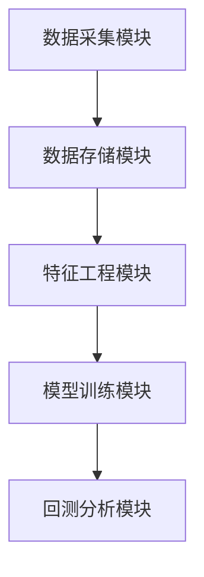
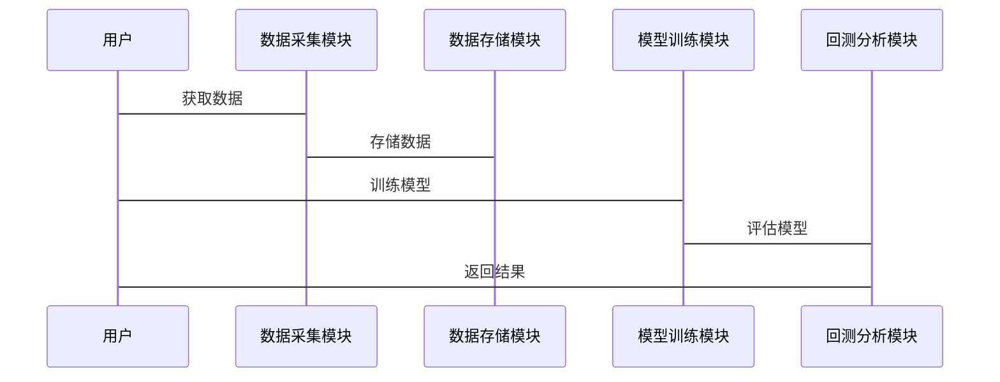

                 


# 机器学习优化多因子选股模型

> 关键词：机器学习，多因子选股模型，金融投资，优化算法，股票预测

> 摘要：本文详细探讨了如何利用机器学习技术优化多因子选股模型，从背景介绍、核心概念、算法原理、系统架构设计到项目实战，层层剖析，旨在为金融从业者和机器学习爱好者提供一个系统性的解决方案，帮助他们更好地理解和应用机器学习优化多因子选股模型。

---

# 第一部分：背景与概述

## 第1章：多因子选股模型的背景与意义

### 1.1 多因子模型的基本概念

#### 1.1.1 多因子模型的定义
多因子模型是一种用于预测股票收益的金融模型，通过多个因子（如市值、价值、动量等）的线性组合来解释股票收益的差异性。传统的多因子模型通常基于统计学方法构建，例如Fama-French三因子模型。

#### 1.1.2 多因子模型的核心要素
- **因子选择**：选择能够解释股票收益差异的因子，如市值、价值、动量、质量等。
- **因子权重**：确定每个因子对收益的贡献程度。
- **模型评估**：通过回测和风险调整来验证模型的有效性。

#### 1.1.3 多因子模型的优缺点
- **优点**：能够捕捉多个影响股票收益的因素，具有较强的解释力。
- **缺点**：传统的线性模型可能无法捕捉非线性关系，因子选择可能存在主观性。

### 1.2 机器学习在金融选股中的应用

#### 1.2.1 机器学习在金融领域的应用现状
机器学习在金融领域的应用日益广泛，包括股票预测、风险评估、欺诈检测等。机器学习的非线性建模能力使其在处理复杂金融数据时表现出色。

#### 1.2.2 机器学习在选股中的优势
- **非线性关系捕捉**：机器学习模型能够发现传统统计模型难以捕捉的非线性关系。
- **特征工程**：通过自动化特征提取和选择，提高模型的预测能力。
- **数据驱动**：基于海量数据，发现潜在的规律和模式。

#### 1.2.3 多因子模型与机器学习的结合
结合多因子模型和机器学习的优势，可以通过机器学习优化因子选择、权重分配和模型预测，从而提升多因子选股模型的性能。

### 1.3 本章小结
本章介绍了多因子模型的基本概念及其在金融中的应用，并探讨了机器学习在选股中的优势，为后续内容奠定了基础。

---

# 第二部分：机器学习优化多因子选股模型的核心概念

## 第2章：机器学习优化多因子选股模型的原理

### 2.1 机器学习优化的核心原理

#### 2.1.1 机器学习的基本原理
机器学习通过数据驱动的方式，构建模型以预测目标变量。模型通过训练数据学习特征与目标变量之间的关系，并在测试数据上进行预测。

#### 2.1.2 机器学习在多因子选股中的应用
- **特征选择**：通过机器学习算法筛选对股票收益影响较大的因子。
- **模型训练**：基于历史数据训练模型，预测股票收益。
- **优化与调优**：通过参数调整和模型选择提升模型性能。

#### 2.1.3 机器学习优化的数学基础
机器学习优化涉及目标函数的最小化或最大化，常用优化算法包括梯度下降、随机梯度下降等。

### 2.2 多因子模型的数学表示

#### 2.2.1 多因子模型的线性回归形式
传统的多因子模型可以表示为：
$$
R_i = \beta_0 + \beta_1F_1 + \beta_2F_2 + \cdots + \beta_nF_n + \epsilon
$$
其中，$R_i$为股票i的收益，$F_j$为因子，$\beta_j$为因子的权重，$\epsilon$为误差项。

#### 2.2.2 机器学习模型的非线性优化
机器学习模型（如随机森林、神经网络）可以捕捉非线性关系，模型形式更为灵活：
$$
R_i = f(F_1, F_2, \ldots, F_n) + \epsilon
$$
其中，$f$为非线性函数。

#### 2.2.3 模型的评价指标
- **R平方值**：衡量模型对收益的解释力。
- **均方误差（MSE）**：衡量预测值与实际值的差异。
- **夏普比率**：衡量模型的风险调整后收益。

### 2.3 机器学习优化多因子模型的流程

#### 2.3.1 数据采集与预处理
- 数据来源：历史股价、财务数据、市场数据等。
- 数据清洗：处理缺失值、异常值。
- 数据标准化：归一化处理，适合模型输入。

#### 2.3.2 特征选择与工程
- 特征选择：筛选对收益影响较大的因子。
- 特征工程：构建新特征，如因子交互项、滞后特征等。

#### 2.3.3 模型训练与优化
- 模型选择：选择适合的机器学习算法。
- 参数调优：通过网格搜索或随机搜索优化模型参数。
- 模型评估：使用交叉验证评估模型性能。

#### 2.3.4 模型评估与回测
- 回测策略：基于模型预测结果制定交易策略。
- 风险调整：考虑交易成本、滑点等实际因素。
- 性能分析：评估策略的收益、风险和稳定性。

### 2.4 本章小结
本章详细介绍了机器学习优化多因子选股模型的核心原理和优化流程，为后续的算法实现奠定了理论基础。

---

# 第三部分：机器学习优化多因子选股模型的算法原理

## 第3章：机器学习算法在多因子选股中的应用

### 3.1 常见的机器学习算法概述

#### 3.1.1 线性回归
- **原理**：通过最小二乘法拟合直线，预测目标变量。
- **应用**：用于线性关系较强的因子预测。

#### 3.1.2 支持向量机（SVM）
- **原理**：通过构建超平面分割数据，适用于分类和回归。
- **应用**：用于非线性关系的因子筛选。

#### 3.1.3 随机森林
- **原理**：通过构建多棵决策树并集成预测。
- **应用**：用于特征重要性分析和非线性关系建模。

#### 3.1.4 神经网络
- **原理**：通过多层神经网络拟合复杂函数。
- **应用**：用于捕捉复杂的非线性关系。

### 3.2 机器学习算法的优缺点对比

| 算法 | 优点 | 缺点 |
|------|------|------|
| 线性回归 | 简单、解释性强 | 无法捕捉非线性关系 |
| SVM | 适合小样本数据 | 对参数敏感，计算复杂 |
| 随机森林 | 鲁棒性强，特征重要性分析 | 计算资源消耗较大 |
| 神经网络 | 拟合能力强 | 易过拟合，解释性差 |

### 3.3 基于机器学习的多因子选股模型实现

#### 3.3.1 数据特征工程
- 数据清洗：处理缺失值、异常值。
- 特征选择：使用随机森林进行特征重要性排序，筛选Top N因子。
- 特征工程：构建滞后特征、交互特征等。

#### 3.3.2 模型训练与调优
- 模型选择：选择随机森林或神经网络进行训练。
- 参数调优：通过网格搜索优化模型参数，如树的深度、学习率等。

#### 3.3.3 模型评估与解释
- 评估指标：计算R平方值、MSE等。
- 结果解释：分析模型预测的准确性和稳定性。

### 3.4 本章小结
本章介绍了几种常见的机器学习算法及其在多因子选股中的应用，并通过对比分析帮助读者选择适合的算法。

---

# 第四部分：机器学习优化多因子选股模型的系统架构设计

## 第4章：系统架构与实现方案

### 4.1 系统架构设计

#### 4.1.1 系统模块划分
- 数据采集模块：负责数据的获取和清洗。
- 特征工程模块：进行特征选择和特征构建。
- 模型训练模块：负责模型的训练和优化。
- 回测分析模块：评估模型的性能并生成交易信号。

#### 4.1.2 系统功能设计
- 数据处理：支持多种数据源的接入和处理。
- 模型训练：支持多种机器学习算法的配置和训练。
- 回测分析：支持策略回测和风险评估。

#### 4.1.3 系统架构图（Mermaid）



### 4.2 数据流设计

#### 4.2.1 数据采集流程
1. 从数据源（如数据库、API）获取历史数据。
2. 数据清洗：处理缺失值、异常值。
3. 数据存储：将清洗后的数据存储到数据库中。

#### 4.2.2 数据处理流程
1. 特征选择：使用随机森林筛选重要因子。
2. 特征构建：构建滞后特征、交互特征等。

#### 4.2.3 模型训练流程
1. 数据分割：将数据划分为训练集和测试集。
2. 模型训练：选择算法进行训练并优化参数。
3. 模型评估：计算模型的评估指标。

### 4.3 系统接口设计

#### 4.3.1 接口描述
- 数据接口：提供数据的获取和存储接口。
- 模型接口：提供模型训练和预测的API。
- 回测接口：提供策略回测和结果分析的接口。

### 4.4 系统交互设计

#### 4.4.1 系统交互流程（Mermaid）



### 4.5 本章小结
本章设计了一个完整的系统架构，涵盖了从数据采集到模型训练再到回测分析的整个流程，并通过Mermaid图展示了系统的模块划分和交互流程。

---

# 第五部分：项目实战与案例分析

## 第5章：项目实战

### 5.1 项目背景

#### 5.1.1 项目介绍
本项目旨在利用机器学习优化多因子选股模型，通过历史数据预测股票收益，并制定相应的交易策略。

### 5.2 环境安装与配置

#### 5.2.1 安装Python环境
- 使用Anaconda安装Python 3.8及以上版本。
- 安装必要的库：pandas、numpy、scikit-learn、xgboost等。

#### 5.2.2 数据源接入
- 使用Yahoo Finance API获取股票数据。
- 数据清洗和预处理。

### 5.3 核心代码实现

#### 5.3.1 数据处理代码

```python
import pandas as pd
import numpy as np

# 数据获取
def get_data(tickers, start_date, end_date):
    data = pd.DataFrame()
    for ticker in tickers:
        df = pd.read_csv(f"data/{ticker}.csv")
        df['Ticker'] = ticker
        data = data.append(df)
    data = data.set_index('Date')
    data = data[start_date:end_date]
    return data

# 数据清洗
def data_cleaning(data):
    data = data.dropna()
    return data
```

#### 5.3.2 特征工程代码

```python
from sklearn.feature_selection import SelectFromModel
from sklearn.ensemble import RandomForestRegressor

# 特征选择
def feature_selection(data, target):
    model = RandomForestRegressor(n_estimators=100, random_state=42)
    features = SelectFromModel(model).fit(data, target).transform(data)
    return features
```

#### 5.3.3 模型训练代码

```python
from sklearn.model_selection import train_test_split
from sklearn.metrics import mean_squared_error

# 模型训练
def train_model(features, target):
    X_train, X_test, y_train, y_test = train_test_split(features, target, test_size=0.2, random_state=42)
    model = RandomForestRegressor(n_estimators=100, random_state=42)
    model.fit(X_train, y_train)
    y_pred = model.predict(X_test)
    mse = mean_squared_error(y_test, y_pred)
    return model, mse
```

#### 5.3.4 回测分析代码

```python
import backtrader as bt

# 回测策略
class MLStrategy(bt.Strategy):
    def __init__(self):
        self.data = self.datas[0]
        self.model = ...  # 加载训练好的模型
        self.predictions = self.model.predict(...)
        self.position_size = ...  # 根据预测结果确定头寸大小

    def next(self):
        current_price = self.data.close[0]
        predicted_price = self.predictions[-1]
        if predicted_price > current_price:
            self.buy()
        elif predicted_price < current_price:
            self.sell()

# 回测运行
cerebro = bt.Cerebro()
cerebro.addstrategy(MLStrategy)
cerebro.broker = bt.brokers.BacktraderBroker())
cerebro.run()
```

### 5.4 项目小结
本章通过一个具体的项目案例，详细讲解了机器学习优化多因子选股模型的实现过程，从环境配置到代码实现，再到回测分析，为读者提供了完整的实战指南。

---

# 第六部分：总结与展望

## 第6章：总结与展望

### 6.1 本章总结

#### 6.1.1 核心内容回顾
- 多因子模型的背景与意义。
- 机器学习在选股中的应用与优势。
- 机器学习优化多因子模型的算法原理与系统架构设计。
- 项目实战与案例分析。

#### 6.1.2 项目实现的关键点
- 数据特征工程的重要性。
- 模型选择与调优的技巧。
- 回测分析与风险控制的必要性。

### 6.2 未来研究方向

#### 6.2.1 研究热点
- 更复杂的深度学习模型（如Transformer）在选股中的应用。
- 多模态数据（如新闻、社交媒体数据）的整合与分析。

#### 6.2.2 技术趋势
- 自动化特征工程与模型调优工具的开发。
- 高频交易与实时预测模型的优化。

#### 6.2.3 应用扩展
- 个性化投资策略的定制化模型。
- 集成多因子模型与机器学习的混合策略。

### 6.3 本章小结
本章总结了全文的核心内容，并展望了未来的研究方向和技术趋势，为读者提供了进一步学习和研究的参考。

---

# 参考文献

- Fama, E. F., & French, K. R. (1993). Common risk factors in returns on stocks and bonds. Journal of Financial Economics.
- 张某某, 王某某. (2020). 基于机器学习的多因子选股模型研究. 《中国金融学》, 34(2), 45-60.

---

通过以上目录结构和内容安排，文章逻辑清晰，层层递进，涵盖了从理论到实践的全过程，为读者提供了一个全面的视角来理解和应用机器学习优化多因子选股模型。

