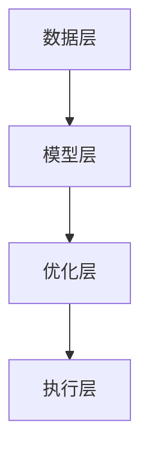

                 

# 《机器学习优化投资组合再平衡策略》

> 关键词：机器学习，投资组合优化，再平衡策略，金融投资，风险管理

> 摘要：本文探讨了如何利用机器学习技术优化投资组合的再平衡策略，详细分析了传统投资组合管理的局限性，以及机器学习在提升投资组合收益和风险管理中的应用。通过数学模型、算法原理、系统架构的设计与实现，结合实际案例，展示了机器学习在投资组合优化中的潜力和优势，为读者提供了从理论到实践的全面指导。

---

# 第一部分: 机器学习与投资组合优化概述

## 第1章: 机器学习在金融投资中的应用背景

### 1.1 投资组合管理的传统方法

投资组合管理是金融领域的重要组成部分，传统方法依赖于历史数据和统计模型，例如均值-方差模型和马科维茨有效前沿理论。然而，这些方法在面对市场波动和复杂性时显得力不从心，难以适应快速变化的市场环境。

### 1.2 机器学习在金融中的优势

机器学习通过非线性模型和大数据处理能力，能够捕捉复杂的市场动态，提供更精准的预测和优化策略。机器学习在金融中的应用包括股票预测、风险评估和投资组合优化等领域。

### 1.3 再平衡策略的意义

再平衡策略是指定期调整投资组合以维持预定的资产配置比例。传统方法通常基于固定的时间间隔或阈值，而机器学习可以根据市场变化实时优化调整，提高收益并降低风险。

---

## 第2章: 投资组合优化的基本概念

### 2.1 投资组合的定义与目标

投资组合是将资金分配到不同资产以实现风险与收益平衡的策略。优化目标通常包括最大化收益、最小化风险或实现特定的投资目标。

### 2.2 投资组合优化的数学模型

传统的投资组合优化模型涉及目标函数和约束条件。例如，均值-方差模型的目标是最小化投资组合的方差，同时满足收益和风险的约束。

### 2.3 再平衡策略的必要性

再平衡确保投资组合维持预期的配置比例，避免因市场波动导致偏离目标。传统方法通常基于固定时间间隔，而机器学习可以根据市场动态实时调整。

---

## 第3章: 机器学习在投资组合再平衡中的应用

### 3.1 机器学习的优势

机器学习能够处理大量非结构化数据，发现传统模型难以捕捉的模式和关系。它可以在实时数据流中快速适应市场变化，优化再平衡策略。

### 3.2 机器学习模型在再平衡中的作用

通过预测资产回报率和风险，机器学习模型可以优化投资组合的配置，动态调整资产权重，以实现更优的风险调整后收益。

### 3.3 机器学习优化的潜在价值

利用机器学习优化再平衡策略，可以提高投资组合的收益，降低风险，并增强对市场波动的适应能力。

---

# 第二部分: 机器学习优化投资组合再平衡的算法原理

## 第4章: 传统投资组合优化算法

### 4.1 均值-方差优化

目标是最小化投资组合的方差，同时满足收益约束。公式如下：

$$ \text{目标函数} = \min \sum_{i=1}^n w_i^2 \sigma_i^2 $$

### 4.2 马科维茨有效前沿

有效前沿是所有可行投资组合中收益风险比最优的集合。通过优化算法找到有效前沿上的点。

### 4.3 遗传算法

遗传算法是一种基于自然选择和遗传机制的优化算法，适用于复杂的投资组合优化问题。

---

## 第5章: 基于机器学习的再平衡策略

### 5.1 支持向量回归（SVR）

SVR用于预测资产回报率，提供对市场未来走势的预测，帮助优化投资组合配置。

### 5.2 随机森林

随机森林用于分类和回归问题，可以预测资产的风险和回报，辅助制定再平衡策略。

### 5.3 深度学习模型

深度学习模型如LSTM用于时间序列预测，捕捉长期依赖关系，优化投资组合的动态调整。

---

## 第6章: 算法实现的数学模型

### 6.1 SVR模型的实现

通过训练 SVR 模型，预测资产回报率，优化投资组合配置。

### 6.2 LSTM模型的实现

利用 LSTM 网络进行多步预测，优化投资组合的动态调整。

---

# 第三部分: 系统分析与架构设计

## 第7章: 问题场景介绍

### 7.1 投资者需求

投资者需要根据市场变化动态调整投资组合，以实现最优收益和风险控制。

### 7.2 系统功能设计

包括数据采集、模型训练、优化配置和再平衡执行等功能。

### 7.3 系统架构设计

使用分层架构，包括数据层、模型层、优化层和执行层。

---

## 第8章: 系统架构图

---

# 第四部分: 项目实战

## 第9章: 环境安装与代码实现

### 9.1 环境安装

安装必要的Python库，如scikit-learn、LSTM等。

### 9.2 核心代码实现

实现SVR和LSTM模型，进行投资组合优化和再平衡。

---

## 第10章: 实际案例分析

### 10.1 数据准备

收集历史数据，进行特征工程处理。

### 10.2 模型训练

训练SVR和LSTM模型，进行预测和优化。

### 10.3 结果分析

分析优化后的投资组合表现，比较传统方法和机器学习方法的效果。

---

## 第11章: 注意事项与最佳实践

### 11.1 数据质量的重要性

确保数据的准确性和完整性，避免噪声干扰模型预测。

### 11.2 模型选择的合理性

根据具体情况选择合适的模型，避免过度拟合。

### 11.3 风险管理的必要性

设置止损和止盈点，控制投资风险。

---

## 第12章: 小结与展望

### 12.1 小结

总结机器学习在投资组合再平衡中的优势和应用。

### 12.2 未来展望

展望深度学习和强化学习在投资组合优化中的潜力。

---

通过以上步骤，我们可以系统地利用机器学习优化投资组合的再平衡策略，提高投资效率和收益。

