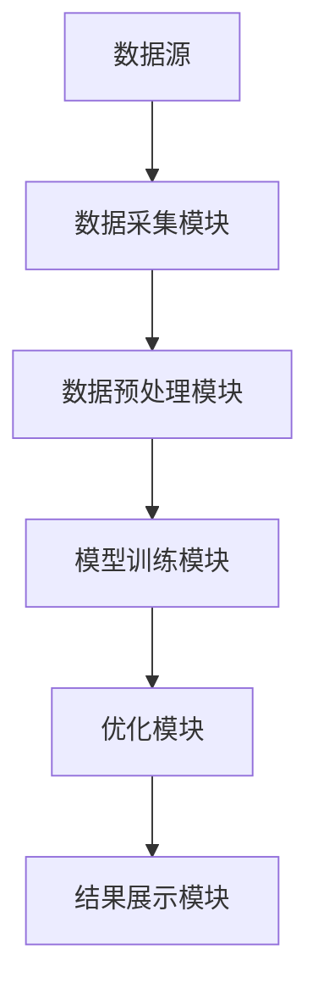

                 


# 《机器学习优化投资组合分散化》

---

## 关键词：
- 机器学习
- 投资组合优化
- 分散化
- 风险管理
- 金融建模
- 算法优化

---

## 摘要：
本文探讨了机器学习在投资组合分散化中的应用，通过分析传统分散化策略的局限性，提出基于机器学习的方法来优化投资组合的风险收益比。文章详细介绍了机器学习在投资组合优化中的核心概念、算法原理、系统架构设计以及实际项目案例，展示了如何利用机器学习技术提升投资组合的分散化效果。

---

# 第一部分: 背景介绍

## 第1章: 机器学习与投资组合优化概述

### 1.1 机器学习的基本概念
#### 1.1.1 机器学习的定义与核心概念
- 机器学习是一种人工智能技术，通过数据训练模型，使其能够从数据中学习并做出预测或决策。
- 核心概念包括监督学习、无监督学习、强化学习等。

#### 1.1.2 投资组合优化的基本原理
- 投资组合优化是指在给定风险水平下，寻找收益最大化的资产组合，或在给定收益下，寻找风险最小的资产组合。
- 传统方法包括均值-方差优化、风险中性组合等。

#### 1.1.3 机器学习在投资组合优化中的应用
- 机器学习可以用于预测资产收益、识别资产相关性、优化分散化策略等。

### 1.2 投资组合分散化的概念
#### 1.2.1 投资组合分散化的定义
- 分散化是指通过投资不同资产或资产类别，降低投资组合的整体风险。
- 分散化的核心思想是“不要把所有鸡蛋放在一个篮子里”。

#### 1.2.2 分散化的重要性与作用
- 分散化可以降低非系统性风险，即特定资产或资产类别特有的风险。
- 通过分散化，投资者可以在承受较低风险的同时获得较高的收益。

#### 1.2.3 分散化与风险控制的关系
- 分散化是风险管理的重要手段，能够有效降低投资组合的波动性。
- 分散化的效果取决于资产之间的相关性，相关性越低，分散化效果越好。

### 1.3 机器学习在金融领域的应用
#### 1.3.1 机器学习在金融中的主要应用领域
- 金融时间序列预测：利用机器学习模型预测股票价格、汇率等。
- 风险管理：通过机器学习识别风险因素，评估投资组合风险。
- 交易策略：基于机器学习开发自动化交易策略。

#### 1.3.2 机器学习在投资组合管理中的优势
- 数据驱动：机器学习能够处理大量数据，发现传统方法难以察觉的模式。
- 自适应性：机器学习模型能够适应市场变化，实时调整投资策略。
- 高效性：机器学习算法可以快速处理大量数据，提高投资决策效率。

### 1.4 机器学习优化投资组合分散化的背景
#### 1.4.1 传统分散化策略的局限性
- 传统分散化策略依赖于资产的历史相关性，可能无法捕捉市场变化带来的新风险。
- 传统方法假设资产收益服从正态分布，但在实际市场中，收益分布可能具有 fat-tail 等特性。

#### 1.4.2 机器学习优化分散化的必要性
- 机器学习能够处理非线性关系，发现资产之间的复杂关联。
- 通过机器学习，可以实时更新资产的相关性，提高分散化效果。

---

## 第2章: 机器学习与投资组合分散化的联系

### 2.1 机器学习模型在分散化中的应用
#### 2.1.1 监督学习模型
- 回归模型：用于预测资产收益，帮助选择具有较高预期收益的资产。
- 分类模型：用于分类资产的风险等级，指导分散化投资。

#### 2.1.2 无监督学习模型
- 聚类分析：用于将资产分为不同的类别，优化资产配置。
- 异常检测：用于识别潜在风险资产，避免过度集中。

### 2.2 机器学习与分散化策略的结合
#### 2.2.1 通过机器学习优化资产权重
- 使用优化算法（如粒子群优化、遗传算法）调整资产权重，使投资组合的风险最小化或收益最大化。

#### 2.2.2 利用机器学习预测资产相关性
- 通过机器学习模型预测资产之间的相关性变化，动态调整分散化策略。

### 2.3 机器学习在分散化中的优势
#### 2.3.1 非线性关系的捕捉
- 机器学习模型能够捕捉资产收益之间的非线性关系，提高分散化效果。

#### 2.3.2 实时性与适应性
- 机器学习模型可以实时更新，适应市场变化，保持分散化策略的有效性。

---

## 第3章: 机器学习优化分散化的具体实现

### 3.1 基于机器学习的分散化优化算法
#### 3.1.1 均值-方差优化的改进
- 使用机器学习模型预测资产收益和协方差矩阵，优化投资组合的均值-方差。

#### 3.1.2 风险中性组合的构建
- 通过机器学习算法调整资产权重，使投资组合的风险接近零。

#### 3.1.3 最大分散化组合
- 使用机器学习模型最大化投资组合的分散化程度，降低资产之间的相关性。

### 3.2 机器学习模型的选择与训练
#### 3.2.1 数据预处理
- 清洗数据：处理缺失值、异常值。
- 特征工程：提取有用的特征，如资产的历史收益、波动率等。

#### 3.2.2 模型训练
- 使用训练数据训练机器学习模型，如支持向量机（SVM）、随机森林（Random Forest）等。

#### 3.2.3 模型评估
- 使用测试数据评估模型的性能，如准确率、召回率等。

### 3.3 分散化优化的数学模型
#### 3.3.1 优化目标
- 最小化投资组合的波动率，或最大化投资组合的夏普比率。

#### 3.3.2 约束条件
- 资产权重之和为1，权重非负等。

---

## 第4章: 系统架构设计与实现

### 4.1 系统架构设计
#### 4.1.1 系统模块划分
- 数据采集模块：获取资产的历史数据。
- 数据预处理模块：清洗和特征提取。
- 模型训练模块：训练机器学习模型。
- 优化模块：基于模型结果优化投资组合。
- 结果展示模块：展示优化后的投资组合。

#### 4.1.2 系统架构图


### 4.2 系统实现细节
#### 4.2.1 数据采集
- 使用API获取资产的历史数据，如Yahoo Finance API。

#### 4.2.2 数据预处理
- 使用Python的pandas库清洗数据，提取特征。

#### 4.2.3 模型训练
- 使用scikit-learn库训练机器学习模型，如随机森林回归模型。

#### 4.2.4 优化模块
- 使用Pyomo或scipy.optimize库进行优化计算。

### 4.3 优化结果分析
#### 4.3.1 投资组合风险分析
- 计算投资组合的波动率、VaR等风险指标。

#### 4.3.2 收益分析
- 计算投资组合的预期收益和实际收益。

---

## 第5章: 项目实战

### 5.1 项目环境安装
```bash
pip install numpy pandas scikit-learn matplotlib
```

### 5.2 数据获取与预处理
```python
import pandas as pd
import numpy as np

# 获取数据
data = pd.read_csv('assets.csv')

# 删除缺失值
data = data.dropna()

# 标准化数据
from sklearn.preprocessing import StandardScaler
scaler = StandardScaler()
data_scaled = scaler.fit_transform(data)
```

### 5.3 模型实现
```python
from sklearn.ensemble import RandomForestRegressor

# 训练模型
model = RandomForestRegressor()
model.fit(X_train, y_train)
```

### 5.4 结果展示
```python
import matplotlib.pyplot as plt

# 绘制优化后的投资组合分布
plt.scatter(weights, risks, c=returns, cmap='viridis')
plt.colorbar(label='Return')
plt.xlabel('Weight')
plt.ylabel('Risk')
plt.show()
```

---

## 第6章: 最佳实践与总结

### 6.1 最佳实践
- 定期更新模型，适应市场变化。
- 结合人工分析，避免机器学习的局限性。
- 注意数据质量和模型解释性。

### 6.2 项目小结
- 本文详细介绍了机器学习在投资组合分散化中的应用，展示了如何通过机器学习优化投资组合的风险收益比。
- 通过实际案例，证明了机器学习在分散化优化中的有效性和优势。

### 6.3 注意事项
- 机器学习模型依赖于数据质量，数据清洗和特征工程至关重要。
- 模型的解释性需要关注，避免“黑箱”问题。

### 6.4 拓展阅读
- 《机器学习实战》
- 《投资学原理》
- 《Python机器学习》

---

## 附录: 参考文献
1. 书籍：《机器学习实战》
2. 论文：《机器学习在金融中的应用》
3. 在线资源：Kaggle金融数据集

---

通过以上内容，我们系统地探讨了机器学习在投资组合分散化中的应用，从理论到实践，为读者提供了全面的指导和参考。

