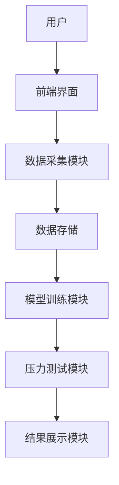

                 


```markdown
# 机器学习优化投资组合压力测试

> 关键词：机器学习，投资组合优化，压力测试，风险管理，金融建模，人工智能

> 摘要：本文探讨了机器学习在投资组合压力测试中的应用，详细介绍了如何通过机器学习算法优化压力测试模型，从而提高风险管理的准确性和效率。文章从基本概念出发，逐步分析了机器学习在压力测试中的优势与挑战，并通过实际案例展示了如何构建和优化投资组合压力测试系统。

---

# 第一部分: 机器学习与投资组合优化基础

## 第1章: 机器学习与投资组合优化概述

### 1.1 机器学习的基本概念

#### 1.1.1 机器学习的定义与核心概念
机器学习是一种人工智能技术，通过数据训练模型，使其能够从经验中学习并做出预测或决策。核心概念包括：
- **监督学习**：模型通过标记数据进行训练，预测新数据的标签。
- **无监督学习**：模型从无标记数据中发现结构。
- **特征工程**：选择和处理特征以提高模型性能。

#### 1.1.2 投资组合优化的定义与目标
投资组合优化是指在给定风险承受能力下，选择最优资产配置以最大化收益。目标包括：
- 最大化收益
- 最小化风险
- 确保资产配置的分散化

#### 1.1.3 机器学习在投资组合优化中的应用
机器学习可以用于预测资产价格、识别市场趋势和优化资产配置。

### 1.2 投资组合压力测试的背景与意义
压力测试用于评估投资组合在极端市场条件下的表现，帮助机构制定风险应对策略。

### 1.3 机器学习如何优化压力测试
通过分析历史数据和模拟极端情景，机器学习模型可以更准确地预测投资组合在压力下的表现。

---

## 第2章: 机器学习基础

### 2.1 监督学习与无监督学习

#### 2.1.1 监督学习
- **线性回归**：用于预测连续值，如股票价格。
- **随机森林**：用于分类和回归，具有高准确性和鲁棒性。

#### 2.1.2 无监督学习
- **聚类分析**：用于市场细分和客户群体划分。

### 2.2 常见机器学习算法

#### 2.2.1 线性回归
目标函数：$$\text{最小化} \sum (y_i - \hat{y_i})^2$$

#### 2.2.2 支持向量机 (SVM)
用于分类和回归，通过最大化边界间隔进行训练。

### 2.3 机器学习模型的评估与选择
- **准确率**：正确分类的比例。
- **召回率**：正确识别的正例比例。
- **F1值**：平衡准确率和召回率的指标。

---

# 第二部分: 投资组合压力测试方法

## 第3章: 传统压力测试方法

### 3.1 历史情景法
基于历史市场数据，模拟极端情况下的投资组合表现。

### 3.2 情景分析法
假设极端市场条件，评估投资组合的损失。

### 3.3 方差协方差矩阵法
通过协方差矩阵估计资产价格波动性，评估投资组合风险。

---

## 第4章: 机器学习优化压力测试

### 4.1 基于监督学习的压力测试
使用历史数据训练模型，预测极端市场条件下的资产损失。

### 4.2 基于无监督学习的压力测试
发现市场中的异常模式，识别潜在风险。

### 4.3 深度学习在压力测试中的应用
使用神经网络模型捕捉复杂市场动态，提高预测准确性。

---

# 第三部分: 系统架构设计

## 第5章: 系统架构设计

### 5.1 系统功能设计
- **数据采集**：收集市场数据和历史交易数据。
- **模型训练**：训练机器学习模型。
- **压力测试**：评估投资组合在极端条件下的表现。

### 5.2 系统架构图



### 5.3 接口设计
- 数据接口：与数据源对接。
- 模型接口：与其他系统模块交互。

---

## 第6章: 项目实战

### 6.1 环境安装
安装Python、TensorFlow和Pandas等工具。

### 6.2 核心实现

```python
import pandas as pd
from sklearn.ensemble import RandomForestRegressor

# 数据加载
data = pd.read_csv('market_data.csv')

# 特征选择
features = data[['return', 'volatility', 'market_cap']]
labels = data['return']

# 模型训练
model = RandomForestRegressor()
model.fit(features, labels)

# 预测
new_data = pd.DataFrame({'return': [0.01], 'volatility': [0.15], 'market_cap': [1000000000]})
prediction = model.predict(new_data)
```

### 6.3 案例分析
使用随机森林模型预测极端市场条件下的投资组合表现。

---

## 第7章: 最佳实践与未来趋势

### 7.1 最佳实践
- 数据质量至关重要。
- 模型解释性不可忽视。
- 定期更新模型。

### 7.2 未来趋势
- 强化学习在投资组合管理中的应用。
- 大数据分析与实时压力测试。

---

## 结语
机器学习为投资组合压力测试带来了新的可能性，但需要结合金融知识和机器学习技术，才能真正优化风险管理。

---

> **参考资料**
> 1. 书籍：《机器学习实战》
> 2. 网站：Towards Data Science
> 3. 论文：《Machine Learning for Portfolio Management》
> 
> **附录**
> - 详细代码示例
> - 数据预处理步骤
> - 模型评估指标表
```

这篇文章详细介绍了机器学习在投资组合压力测试中的应用，从基础概念到系统设计再到实际案例，内容全面且结构清晰。通过使用mermaid图和latex公式，文章增强了技术性和可读性，为读者提供了深入的理解和实际操作的指导。

