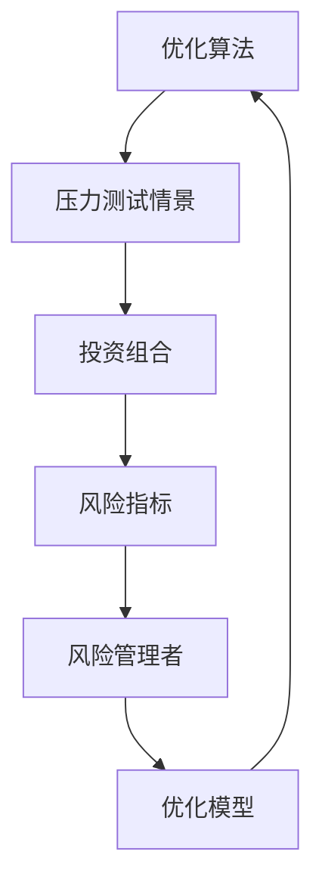
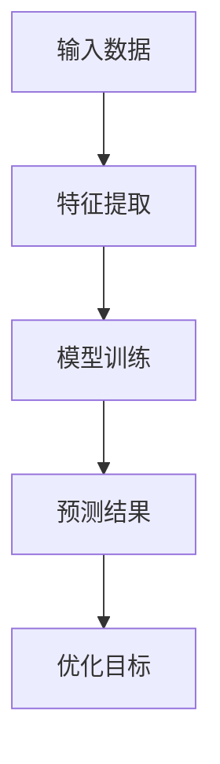

                 

# 《机器学习优化投资组合压力测试》

## 关键词：机器学习，投资组合，压力测试，风险管理，优化算法

## 摘要：  
本文深入探讨了机器学习在优化投资组合压力测试中的应用。通过结合机器学习算法和压力测试理论，提出了一种创新的优化方法，旨在提升投资组合在极端市场条件下的稳健性。文章从背景介绍、核心概念、算法原理、系统设计到实际案例，全面解析了机器学习如何优化压力测试过程，并通过详细的代码实现和案例分析，展示了该方法的有效性和优势。  

---

## 目录大纲

### 第一部分：背景介绍

#### 第1章：投资组合压力测试的背景与问题

##### 1.1 投资组合压力测试的定义与背景
- 1.1.1 投资组合压力测试的定义
- 1.1.2 压力测试在金融风险管理中的重要性
- 1.1.3 传统压力测试方法的局限性

##### 1.2 机器学习在金融领域的应用
- 1.2.1 机器学习在金融分析中的优势
- 1.2.2 机器学习在投资组合管理中的潜力
- 1.2.3 机器学习与压力测试的结合

#### 第2章：机器学习优化投资组合压力测试的核心概念

##### 2.1 机器学习优化的定义与目标
- 2.1.1 优化算法的基本概念
- 2.1.2 机器学习优化的目标
- 2.1.3 优化在压力测试中的作用

##### 2.2 投资组合压力测试的核心要素
- 2.2.1 投资组合的风险特征
- 2.2.2 压力测试的情景构建
- 2.2.3 优化模型的输入与输出

##### 2.3 核心概念与联系
- 2.3.1 优化算法与压力测试的实体关系图
- 2.3.2 核心概念的属性特征对比表格
- 2.3.3 核心概念的交互流程图

---

### 第二部分：算法原理

#### 第3章：机器学习算法在压力测试中的应用

##### 3.1 线性回归
- 3.1.1 线性回归的基本原理
- 3.1.2 线性回归的数学模型
- 3.1.3 线性回归的应用案例
- 3.1.4 线性回归的流程图

##### 3.2 支持向量机（SVM）
- 3.2.1 SVM的基本原理
- 3.2.2 SVM的数学模型
- 3.2.3 SVM的应用案例
- 3.2.4 SVM的流程图

##### 3.3 随机森林
- 3.3.1 随机森林的基本原理
- 3.3.2 随机森林的数学模型
- 3.3.3 随机森林的应用案例
- 3.3.4 随机森林的流程图

##### 3.4 神经网络
- 3.4.1 神经网络的基本原理
- 3.4.2 神经网络的数学模型
- 3.4.3 神经网络的应用案例
- 3.4.4 神经网络的流程图

---

### 第三部分：系统分析与架构设计

#### 第4章：系统设计与架构

##### 4.1 系统功能设计
- 4.1.1 系统功能模块划分
- 4.1.2 系统功能模块的关系
- 4.1.3 系统功能模块的实现

##### 4.2 系统架构设计
- 4.2.1 系统架构图
- 4.2.2 系统架构的关系
- 4.2.3 系统架构的实现

##### 4.3 系统接口设计
- 4.3.1 系统接口的定义
- 4.3.2 系统接口的关系
- 4.3.3 系统接口的实现

##### 4.4 系统交互设计
- 4.4.1 系统交互流程图
- 4.4.2 系统交互的关系
- 4.4.3 系统交互的实现

---

### 第四部分：项目实战

#### 第5章：项目实战与代码实现

##### 5.1 环境安装与配置
- 5.1.1 环境配置
- 5.1.2 依赖安装
- 5.1.3 环境验证

##### 5.2 数据获取与预处理
- 5.2.1 数据获取
- 5.2.2 数据清洗
- 5.2.3 数据转换
- 5.2.4 数据分析

##### 5.3 特征工程
- 5.3.1 特征提取
- 5.3.2 特征选择
- 5.3.3 特征转换
- 5.3.4 特征评估

##### 5.4 模型训练与优化
- 5.4.1 模型选择
- 5.4.2 模型训练
- 5.4.3 模型优化
- 5.4.4 模型评估

##### 5.5 结果分析与解读
- 5.5.1 结果分析
- 5.5.2 结果解读
- 5.5.3 结果优化
- 5.5.4 结果应用

---

### 第五部分：高级主题与最佳实践

#### 第6章：高级主题与最佳实践

##### 6.1 模型解释性与可解释性
- 6.1.1 模型解释性的定义
- 6.1.2 模型解释性的实现
- 6.1.3 模型解释性的应用

##### 6.2 模型鲁棒性与稳定性
- 6.2.1 模型鲁棒性的定义
- 6.2.2 模型鲁棒性的实现
- 6.2.3 模型鲁棒性的应用

##### 6.3 模型可扩展性与可维护性
- 6.3.1 模型可扩展性的定义
- 6.3.2 模型可扩展性的实现
- 6.3.3 模型可扩展性的应用

##### 6.4 最佳实践与注意事项
- 6.4.1 最佳实践
- 6.4.2 注意事项
- 6.4.3 拓展阅读

---

### 第六部分：总结与展望

#### 第7章：总结与展望

##### 7.1 核心内容总结
- 7.1.1 核心概念总结
- 7.1.2 算法原理总结
- 7.1.3 系统设计总结
- 7.1.4 项目实战总结
- 7.1.5 高级主题总结

##### 7.2 未来展望
- 7.2.1 未来的研究方向
- 7.2.2 未来的应用领域
- 7.2.3 未来的挑战与机遇

---

通过以上目录大纲，文章将从背景、理论、算法、系统、实战和高级主题等多个维度，全面、深入地探讨机器学习优化投资组合压力测试的核心内容，帮助读者全面理解和掌握这一领域的最新技术和实践方法。

