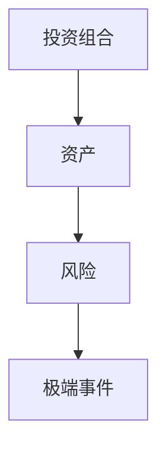
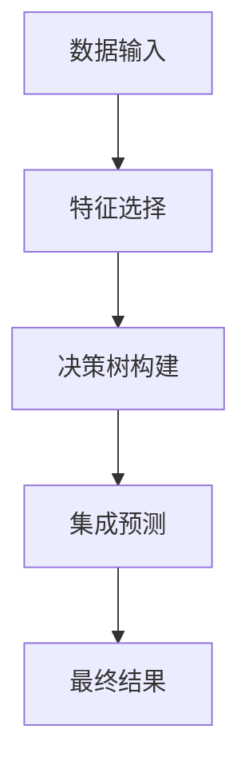
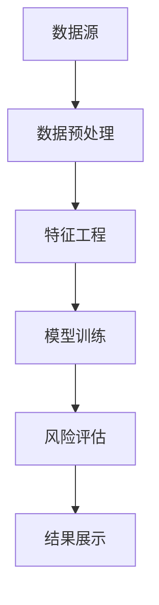
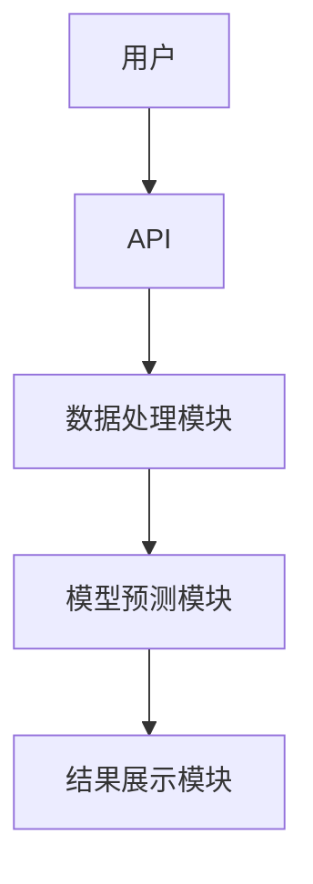
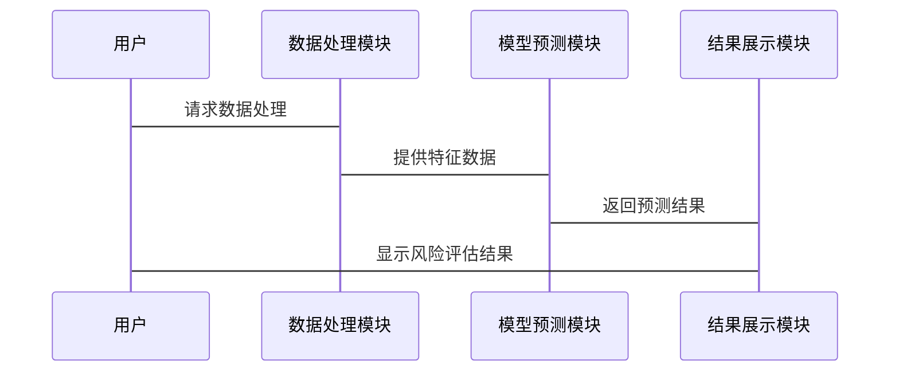

                 


# 《机器学习优化投资组合尾部风险》

---

## 关键词
机器学习, 投资组合优化, 尾部风险, 特征工程, 算法模型, 系统架构

---

## 摘要
机器学习在金融领域的应用日益广泛，尤其是在优化投资组合的尾部风险方面展现出巨大潜力。尾部风险指的是低概率但高影响的极端事件，这些事件可能对投资组合造成重大损失。传统的方法在处理尾部风险时往往显得力不从心，而机器学习凭借其强大的数据处理和模式识别能力，为优化尾部风险提供了新的解决方案。本文将深入探讨机器学习在投资组合尾部风险优化中的应用，从核心概念、算法原理、系统架构到项目实战，全面解析如何利用机器学习技术降低尾部风险，提升投资组合的稳定性。

---

# 第一部分: 机器学习与投资组合尾部风险的背景介绍

## 第1章: 机器学习与投资组合管理概述

### 1.1 机器学习的基本概念
机器学习是一种人工智能技术，通过数据训练模型，使其能够从数据中学习并做出预测或决策。它主要分为监督学习、无监督学习、半监督学习和强化学习四种类型。在金融领域，机器学习被广泛应用于股票预测、风险评估和投资组合优化等场景。

### 1.2 投资组合管理的基本原理
投资组合管理是指通过科学的方法构建和调整投资组合，以实现收益与风险的最佳平衡。现代投资组合理论（MPT）强调通过分散投资降低风险，但其在处理极端事件时存在局限性。

### 1.3 尾部风险的定义与特征
尾部风险指的是在概率分布的“尾部”区域，发生概率极低但影响极大的事件。这些事件可能引发投资组合的大幅亏损，甚至导致投资组合的崩盘。尾部风险的特征包括低发生概率、高影响性和难以预测性。

### 1.4 机器学习优化尾部风险的必要性
传统的方法在处理尾部风险时，往往依赖于历史数据和假设，而机器学习能够通过非线性模型捕捉复杂的数据模式，提高对极端事件的预测能力。此外，机器学习能够处理海量数据，发现传统方法难以察觉的潜在风险。

---

## 第2章: 机器学习优化投资组合尾部风险的核心概念与联系

### 2.1 核心概念的原理分析
- **特征工程**：特征工程是机器学习模型的基础，通过提取和处理相关特征，能够显著提高模型的预测能力。
- **机器学习模型**：模型的选择直接影响尾部风险的预测效果，如随机森林、支持向量机和神经网络等。
- **风险度量方法**：常用的风险度量方法包括VaR、CVaR和ES等，这些方法能够帮助量化投资组合的尾部风险。

### 2.2 特征工程在尾部风险优化中的作用
| 特征工程方法 | 描述 | 优缺点 |
|----------------|------|--------|
| 特征选择 | 从大量特征中筛选出对尾部风险影响最大的特征 | 优点：减少维度，提高计算效率；缺点：可能忽略非线性关系 |
| 特征变换 | 对特征进行转换，如标准化、正则化 | 优点：提升模型性能；缺点：需要选择合适的变换方法 |
| 特征组合 | 将多个特征组合成新的特征 | 优点：捕捉复杂关系；缺点：计算复杂度高 |

### 2.3 ER实体关系图架构


---

# 第二部分: 机器学习算法原理讲解

## 第3章: 机器学习算法在尾部风险优化中的应用

### 3.1 随机森林算法
随机森林是一种基于决策树的集成学习算法，通过投票或平均的方式提高模型的准确性和稳定性。其流程如下：



### 3.2 支持向量机（SVM）
SVM通过寻找最优超平面，将数据分成不同类别。其数学模型如下：

$$ \text{目标函数: } \min_{w,b} \frac{1}{2}||w||^2 + C \sum_{i=1}^n \xi_i $$
$$ \text{约束条件: } y_i(w \cdot x_i + b) \geq 1 - \xi_i $$
$$ \xi_i \geq 0 $$

### 3.3 神经网络算法
神经网络通过多层感知机模拟复杂的非线性关系。其数学模型如下：

$$ a^{(l+1)} = \sigma(w^{(l)} a^{(l)} + b^{(l)}) $$

其中，σ表示激活函数。

---

# 第三部分: 系统分析与架构设计方案

## 第4章: 系统架构设计

### 4.1 项目介绍
本项目旨在构建一个基于机器学习的投资组合尾部风险优化系统，通过数据采集、特征工程、模型训练和风险评估，为投资者提供科学的决策支持。

### 4.2 系统功能设计
- 数据采集：获取历史价格、宏观经济指标等数据。
- 数据预处理：清洗、标准化和特征工程。
- 模型训练：训练机器学习模型，预测尾部风险。
- 风险评估：计算VaR、CVaR等风险指标。
- 结果展示：可视化风险评估结果。

### 4.3 系统架构设计


### 4.4 接口设计
系统需要与数据源、数据库和用户界面进行交互。接口设计如下：



### 4.5 交互序列图


---

# 第四部分: 项目实战

## 第5章: 实际案例分析

### 5.1 环境安装
需要安装Python、Scikit-learn、XGBoost等库。

### 5.2 核心代码实现
```python
import numpy as np
import pandas as pd
from sklearn.ensemble import RandomForestClassifier
from sklearn.metrics import classification_report

# 数据加载
data = pd.read_csv('data.csv')

# 特征工程
X = data.drop('target', axis=1)
y = data['target']

# 模型训练
model = RandomForestClassifier()
model.fit(X, y)

# 模型预测
y_pred = model.predict(X)

# 结果分析
print(classification_report(y, y_pred))
```

### 5.3 案例分析
通过实际数据集，展示模型在尾部风险预测中的表现，分析其优缺点。

---

# 第五部分: 总结与展望

## 第6章: 总结与展望

### 6.1 本章小结
机器学习在优化投资组合尾部风险方面具有显著优势，但同时也面临数据不足、模型解释性差等挑战。

### 6.2 注意事项
- 数据质量对模型性能影响重大。
- 模型的解释性需进一步提升。
- 需结合实际情况选择合适的方法。

### 6.3 拓展阅读
建议阅读《机器学习实战》和《投资学原理》等书籍，深入理解机器学习与金融结合的应用。

---

通过以上内容，我们可以看到，机器学习在优化投资组合尾部风险方面具有广阔的应用前景。未来，随着技术的不断发展，相信会有更多创新的方法被应用于这一领域，为投资者提供更高效的风险管理工具。

