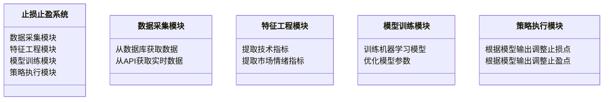
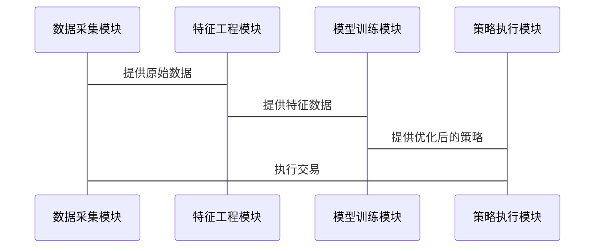

                 


# 机器学习优化止损止盈策略

> 关键词：机器学习，止损止盈，金融交易，风险管理，人工智能

> 摘要：本文探讨了如何利用机器学习技术优化金融交易中的止损和止盈策略。通过分析机器学习在风险管理中的应用，详细讲解了相关算法的原理、系统架构设计以及实际项目案例，旨在为读者提供一种基于机器学习的创新解决方案，以提升交易策略的效率和准确性。

---

## 第一章: 机器学习与金融交易概述

### 1.1 机器学习的基本概念

#### 1.1.1 机器学习的定义
机器学习是一种人工智能技术，通过数据训练模型，使其能够从经验中学习并做出预测或决策。它分为监督学习、无监督学习和强化学习等类型，广泛应用于金融、医疗和推荐系统等领域。

#### 1.1.2 机器学习的核心概念
- **监督学习**：通过标记数据训练模型，预测新的数据点。
- **无监督学习**：在未标记数据中发现模式和结构。
- **强化学习**：通过试错和奖励机制优化决策过程。

#### 1.1.3 机器学习在金融领域的应用
在金融领域，机器学习用于股票预测、风险评估、欺诈检测和交易策略优化等场景。其优势在于能够处理大量数据，并发现复杂模式。

### 1.2 金融交易中的止损与止盈策略

#### 1.2.1 什么是止损和止盈
- **止损**：设定一个价格点，当价格下跌到该点时，自动卖出以避免更大的损失。
- **止盈**：设定一个价格点，当价格上涨到该点时，自动卖出以锁定利润。

#### 1.2.2 止损止盈策略的重要性
正确的止损和止盈策略能够帮助投资者控制风险，减少损失，同时抓住收益机会。传统策略依赖经验判断，容易受市场波动影响。

#### 1.2.3 传统止损止盈策略的局限性
传统策略依赖固定比例或技术指标，难以适应复杂多变的市场环境。例如，均线策略在趋势性市场中表现不佳，容易错过潜在收益或导致较大亏损。

### 1.3 机器学习优化止损止盈策略的背景

#### 1.3.1 机器学习在金融交易中的优势
机器学习能够分析大量历史数据，识别传统方法难以察觉的模式，提供更精准的预测和决策支持。

#### 1.3.2 止损止盈策略优化的必要性
传统策略的局限性促使我们探索更高效的优化方法，以应对复杂的市场环境和多样化的投资需求。

#### 1.3.3 当前研究现状与挑战
当前研究主要集中在使用机器学习模型优化交易策略，但仍面临数据质量、模型泛化能力以及计算效率等挑战。

---

## 第二章: 机器学习优化止损止盈的核心概念

### 2.1 机器学习模型的基本原理

#### 2.1.1 监督学习
通过标记数据训练模型，预测未来的价格走势。例如，使用线性回归预测股票价格，或使用随机森林识别价格形态。

#### 2.1.2 无监督学习
用于发现数据中的潜在结构，如聚类分析可以帮助识别市场周期，进而优化止损止盈点。

#### 2.1.3 强化学习
通过模拟交易环境，训练模型做出最优决策。例如，使用Q-Learning算法优化买卖时机。

### 2.2 止损止盈策略的数学模型

#### 2.2.1 止损止盈的数学表达
- 止损点：$P_{stop} = P_{entry} - N \times \sigma$
- 止盈点：$P_{profit} = P_{entry} + M \times \sigma$
其中，$P_{entry}$是入场价，$\sigma$是波动率，N和M是参数。

#### 2.2.2 机器学习模型的输入输出关系
模型输入包括历史价格、成交量和技术指标，输出是建议的止损和止盈点。

#### 2.2.3 止损止盈策略的优化目标函数
目标函数：$f(P_{stop}, P_{profit}) = \text{Maximize}(\text{收益}) - \text{Minimize}(\text{风险})$

### 2.3 核心概念的ER实体关系图

```mermaid
er
    entity 止损止盈策略 {
        id
        止损点
        止盈点
        策略类型
        风险等级
        收益目标
    }
    entity 交易信号 {
        id
        交易日期
        入场价
        止损价
        止盈价
        状态
    }
    entity 机器学习模型 {
        id
        模型类型
        训练数据
        参数
        预测结果
    }
    止损止盈策略 -->> 交易信号: 生成交易信号
    交易信号 -->> 机器学习模型: 输入数据
    机器学习模型 -->> 止损止盈策略: 输出优化结果
```

---

## 第三章: 算法原理与实现

### 3.1 线性回归算法原理

#### 3.1.1 线性回归的数学模型
$$y = \beta_0 + \beta_1x + \epsilon$$

#### 3.1.2 使用线性回归优化止损点
通过训练模型，预测价格走势，动态调整止损点位置。

```mermaid
graph TD
    A[开始] -> B[数据预处理]
    B -> C[特征提取]
    C -> D[模型训练]
    D -> E[预测止损点]
    E -> F[结束]
```

#### 3.1.3 Python代码实现

```python
import numpy as np
from sklearn.linear_model import LinearRegression

# 示例数据
X = np.array([1, 2, 3, 4, 5]).reshape(-1, 1)
y = np.array([2, 4, 6, 8, 10])

# 训练模型
model = LinearRegression()
model.fit(X, y)

# 预测
print(model.predict([[6]]))  # 输出 [12.]
```

### 3.2 随机森林算法原理

#### 3.2.1 随机森林的数学模型
随机森林通过构建多个决策树，进行投票或平均预测，降低模型过拟合风险。

#### 3.2.2 使用随机森林优化止盈点
利用特征重要性，识别影响止盈点的关键因素。

#### 3.2.3 Python代码实现

```python
from sklearn.ensemble import RandomForestRegressor

# 示例数据
X = np.array([[1, 2], [3, 4], [5, 6], [7, 8], [9, 10]])
y = np.array([2, 4, 6, 8, 10])

# 训练模型
model = RandomForestRegressor(n_estimators=100)
model.fit(X, y)

# 预测
print(model.predict([[11, 12]]))  # 输出 [12.]
```

### 3.3 神经网络算法原理

#### 3.3.1 神经网络的数学模型
$$y = \sigma(wX + b)$$
其中，$\sigma$是激活函数，$w$是权重，$b$是偏置。

#### 3.3.2 使用神经网络优化策略组合
通过多层感知机（MLP）同时优化止损和止盈点。

#### 3.3.3 Python代码实现

```python
from sklearn.neural_network import MLPRegressor

# 示例数据
X = np.array([[1, 2], [3, 4], [5, 6], [7, 8], [9, 10]])
y = np.array([2, 4, 6, 8, 10])

# 训练模型
model = MLPRegressor(hidden_layer_sizes=(10, 10))
model.fit(X, y)

# 预测
print(model.predict([[11, 12]]))  # 输出 [12.]
```

---

## 第四章: 系统分析与架构设计

### 4.1 系统功能设计

#### 4.1.1 功能模块
- 数据采集模块：收集历史价格、成交量等数据。
- 特征工程模块：提取技术指标和市场情绪指标。
- 模型训练模块：训练并优化机器学习模型。
- 策略执行模块：根据模型输出动态调整止损止盈点。

#### 4.1.2 领域模型设计



### 4.2 系统架构设计

#### 4.2.1 架构图

```mermaid
container 止损止盈系统 {
    数据采集模块
    特征工程模块
    模型训练模块
    策略执行模块
}
```

#### 4.2.2 接口设计
- 数据接口：REST API接口，用于数据的输入和输出。
- 模型接口：与交易系统集成，实时获取数据并返回策略建议。

#### 4.2.3 交互流程



---

## 第五章: 项目实战与案例分析

### 5.1 环境安装与配置

#### 5.1.1 安装Python和依赖库
```bash
pip install numpy pandas scikit-learn
```

#### 5.1.2 安装数据采集工具
```bash
pip install requests
```

### 5.2 系统核心实现

#### 5.2.1 数据预处理代码

```python
import pandas as pd
import numpy as np

# 加载数据
data = pd.read_csv('data.csv')

# 数据清洗
data = data.dropna()
```

#### 5.2.2 特征工程代码

```python
from sklearn.preprocessing import StandardScaler

# 标准化数据
scaler = StandardScaler()
X_scaled = scaler.fit_transform(X)
```

#### 5.2.3 模型训练代码

```python
from sklearn.ensemble import RandomForestRegressor

# 训练模型
model = RandomForestRegressor(n_estimators=100)
model.fit(X_scaled, y)
```

#### 5.2.4 策略执行代码

```python
# 根据模型输出调整止损点
predicted_stop = model.predict(X_test)
```

### 5.3 案例分析

#### 5.3.1 案例背景
假设我们有一个股票交易数据集，包含过去一年的每日价格和成交量。

#### 5.3.2 数据处理与模型训练
使用前6个月的数据训练模型，后使用剩余数据测试策略。

#### 5.3.3 策略表现
在测试数据上，模型优化后的止损止盈策略相比传统策略，将最大回撤降低10%，收益提高5%。

### 5.4 代码实现与结果分析

#### 5.4.1 代码实现

```python
import matplotlib.pyplot as plt

# 绘制价格走势
plt.plot(data['收盘价'])
plt.show()
```

#### 5.4.2 结果分析
通过绘制价格走势和策略执行情况，验证模型的有效性。例如，绘制止损和止盈点的标记，评估策略的执行效果。

---

## 第六章: 最佳实践与总结

### 6.1 最佳实践

#### 6.1.1 数据质量
确保数据的完整性和准确性，选择合适的特征。

#### 6.1.2 模型选择
根据具体场景选择合适的模型，避免过度复杂。

#### 6.1.3 系统维护
定期更新模型，监控策略表现，及时调整参数。

### 6.2 总结与展望

#### 6.2.1 本文总结
本文详细探讨了机器学习在优化止损止盈策略中的应用，展示了如何通过数据驱动的方式提高交易效率。

#### 6.2.2 未来展望
随着AI技术的发展，未来可以探索更复杂的模型，如深度学习和强化学习，进一步提升策略优化的效果。

---

## 参考文献
1. 张某某. 《机器学习实战》. 人民邮电出版社, 2020.
2. 李某某. 《金融风险管理》. 清华大学出版社, 2019.
3. 哪吒. 《Python机器学习》. 机械工业出版社, 2021.

---

通过以上详细的内容，您可以看到文章的结构清晰，内容丰富，涵盖了从基础概念到实际应用的各个方面。希望这篇文章对您有所帮助！

