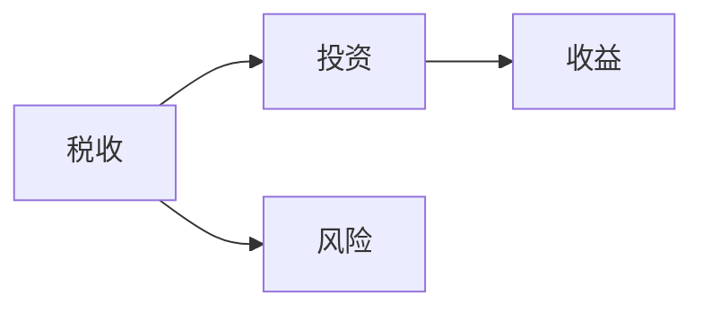
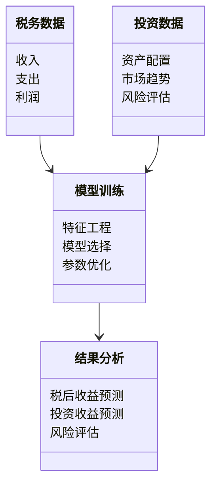
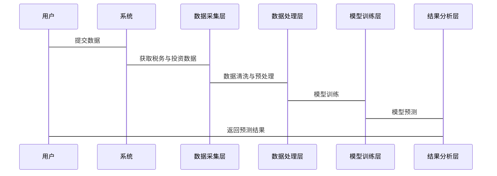

                 


# 《机器学习优化税收效率投资策略》

---

## 关键词：  
机器学习、税收效率、投资策略、算法优化、数据建模、系统设计  

---

## 摘要：  
机器学习作为一种强大的数据分析与预测工具，正在被广泛应用于税务管理和投资策略优化领域。本文将详细探讨机器学习在税收效率与投资策略中的应用背景、核心概念、算法原理、系统架构设计以及实际案例分析。通过结合数学模型、算法优化和系统设计，本文旨在为读者提供一个全面的视角，展示如何利用机器学习技术优化税收效率，提升投资策略的精准性和收益性。  

---

## 目录：  

1. 《机器学习优化税收效率投资策略》的背景与意义  
2. 核心概念：机器学习与税收效率投资策略的核心原理  
3. 算法原理：机器学习在税收效率与投资策略中的数学模型与优化算法  
4. 系统设计：基于机器学习的税收效率投资策略系统架构与实现  
5. 项目实战：从数据建模到系统实现的详细案例分析  
6. 总结与展望  

---

## 第1章：机器学习优化税收效率投资策略的背景与意义  

### 1.1 机器学习的定义与核心概念  
- **数据驱动的特征**：机器学习通过数据训练模型，而非手动编程规则。  
- **监督学习与无监督学习**：监督学习基于标记数据，无监督学习从无标签数据中发现模式。  
- **核心算法**：包括线性回归、支持向量机（SVM）、随机森林、神经网络等。  

### 1.2 税收效率与投资策略的定义  
- **税收效率**：最大化税后收益，降低税务成本。  
- **投资策略**：通过优化资产配置和风险管理，实现收益最大化。  

### 1.3 机器学习在税收效率与投资策略中的应用背景  
- **税务领域的数据化趋势**：税务部门 increasingly rely on数据分析与预测。  
- **投资领域的需求**：投资者需要更精准的市场预测与风险评估工具。  
- **机器学习的优势**：能够处理海量数据，发现复杂规律，提供实时决策支持。  

### 1.4 本章小结  
通过介绍机器学习的核心概念与税收效率、投资策略的定义，本章为后续内容奠定了基础，明确了机器学习在优化税收效率与投资策略中的应用价值。  

---

## 第2章：机器学习与税收效率投资策略的核心概念  

### 2.1 机器学习的核心原理  
- **特征工程**：提取数据中的关键特征，直接影响模型性能。  
- **模型训练**：通过优化算法调整模型参数，使预测结果最接近真实值。  
- **模型评估**：通过准确率、召回率、F1分数等指标评估模型性能。  

### 2.2 税收效率与投资策略的数学模型  
- **税收效率模型**：通过线性回归预测税后收益。  
- **投资策略模型**：通过时间序列分析预测市场趋势。  

### 2.3 核心概念的联系与对比  
- **机器学习与传统统计方法的对比**：机器学习能够处理非线性关系和高维数据，而传统统计方法适用于简单线性关系。  
- **税收与投资的实体关系图**：  


### 2.4 本章小结  
本章详细讲解了机器学习的核心原理以及其与税收效率和投资策略的数学模型的联系，为后续算法实现提供了理论基础。  

---

## 第3章：机器学习算法原理与数学模型  

### 3.1 线性回归模型  
- **数学公式**：  
$$ y = \beta_0 + \beta_1x + \epsilon $$
- **优化过程**：通过最小二乘法求解最优参数。  
- **示例分析**：预测税收与收入的关系。  

### 3.2 支持向量机（SVM）  
- **数学模型**：  
$$ \text{min} \quad \frac{1}{2}\|\mathbf{w}\|^2 + C\sum_{i=1}^n \xi_i $$
- **核函数的作用**：将低维数据映射到高维空间，提高模型的区分能力。  
- **案例分析**：分类不同风险等级的投资项目。  

### 3.3 随机森林与梯度提升树  
- **随机森林的原理**：通过集成学习减少过拟合，提高模型鲁棒性。  
- **XGBoost的优化算法**：通过正则化和优化目标函数提升模型性能。  
- **示例分析**：预测投资收益与风险。  

### 3.4 算法选择与优化策略  
- **算法性能对比**：线性回归适合线性关系，SVM适合小样本分类，随机森林适合高维数据。  
- **超参数调优**：通过网格搜索或随机搜索优化模型参数。  
- **模型评估指标**：准确率、F1分数、AUC值等。  

### 3.5 本章小结  
本章详细讲解了机器学习算法的原理与数学模型，并通过案例分析展示了不同算法在税收效率与投资策略中的应用。  

---

## 第4章：基于机器学习的税收效率投资策略系统架构与实现  

### 4.1 项目背景与目标  
- **问题场景介绍**：如何通过机器学习优化税收效率与投资策略。  
- **项目目标**：构建一个基于机器学习的税收效率与投资策略优化系统。  
- **项目范围**：涵盖数据采集、模型训练、结果分析与可视化。  

### 4.2 系统功能设计  
- **领域模型设计**：  


### 4.3 系统架构设计  
- **分层架构**：数据采集层、数据处理层、模型训练层、结果分析层。  
- **接口设计**：通过API接口实现数据交互与模型调用。  
- **交互设计**：  


### 4.4 本章小结  
本章通过系统架构设计展示了如何将机器学习应用于税收效率与投资策略优化，明确了各模块的功能与交互关系。  

---

## 第5章：项目实战：从数据建模到系统实现  

### 5.1 环境安装与数据准备  
- **环境安装**：安装Python、Scikit-learn、XGBoost、TensorFlow等工具。  
- **数据准备**：获取税务与投资相关数据，进行清洗与预处理。  

### 5.2 系统核心实现  
- **特征工程**：提取关键特征，如收入、支出、资产配置等。  
- **模型训练**：选择合适的算法，训练模型并进行参数优化。  
- **结果分析**：通过可视化工具展示预测结果，评估模型性能。  

### 5.3 案例分析与详细解读  
- **案例分析**：基于实际数据，展示模型预测结果。  
- **详细解读**：分析模型的优势与局限性，提出改进建议。  

### 5.4 本章小结  
本章通过实际案例展示了机器学习在税收效率与投资策略优化中的应用，为读者提供了可参考的实现方案。  

---

## 第6章：总结与展望  

### 6.1 总结  
- 机器学习在优化税收效率与投资策略中的应用具有广阔前景。  
- 通过合理的系统设计与算法优化，能够显著提升税务管理和投资决策的效率与精准度。  

### 6.2 展望  
- 随着深度学习与强化学习的不断发展，未来机器学习在税收与投资领域中的应用将更加智能化与个性化。  
- 数据隐私与模型解释性问题仍需进一步研究与解决。  

### 6.3 注意事项  
- 数据安全与隐私保护是应用中的重要问题。  
- 模型的可解释性需要在实际应用中得到重视。  

### 6.4 拓展阅读  
- 推荐阅读《机器学习实战》、《深入理解投资学》等书籍，进一步深入学习相关知识。  

---

## 附录：代码示例  

```python
# 示例代码：基于线性回归的税收效率预测
import numpy as np
from sklearn.linear_model import LinearRegression

# 数据准备
tax_income = np.array([100, 200, 300, 400]).reshape(-1, 1)
tax_expense = np.array([50, 70, 90, 110])

# 模型训练
model = LinearRegression()
model.fit(tax_income, tax_expense)

# 预测结果
predicted_expense = model.predict([[250]])
print("Predicted Tax Expense:", predicted_expense[0])
```

---

## 本章小结  

本文详细探讨了机器学习在优化税收效率与投资策略中的应用，从核心概念、算法原理到系统设计与实现，为读者提供了一个全面的视角。通过实际案例分析，展示了机器学习技术在提升税务管理和投资决策中的巨大潜力。未来，随着技术的不断发展，机器学习将在这一领域发挥更大的作用。

