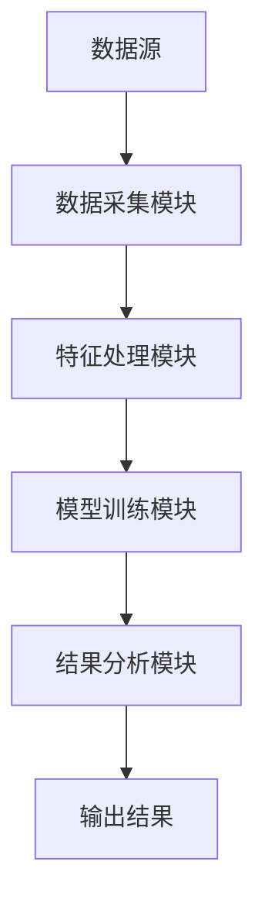

                 


# 机器学习优化费雪成长股选择过程

> 关键词：机器学习，费雪成长股，股票选择，优化过程，算法

> 摘要：本文探讨如何利用机器学习优化费雪成长股的选择过程。通过分析费雪成长股的特点和机器学习的优势，结合具体算法和系统设计，提出了一套优化选股的解决方案，并通过项目实战验证了其有效性。

---

## 第一部分: 机器学习与费雪成长股投资的背景

### 第1章: 机器学习与费雪成长股投资的背景

#### 1.1 机器学习的基本概念
- **1.1.1 机器学习的定义与核心概念**
  机器学习是一种人工智能技术，通过数据训练模型，使其能够从经验中学习并做出预测或决策。
  - 核心概念：数据、特征、标签、模型、训练、测试。
  
- **1.1.2 机器学习的分类与特点**
  - 分类：监督学习、无监督学习、半监督学习、强化学习。
  - 特点：数据驱动、模式识别、自动化决策。

- **1.1.3 机器学习在金融领域的应用**
  - 股票预测、风险评估、交易策略优化、客户画像。

- **1.1.4 机器学习优化股票选择的必要性**
  - 数据量大、模式复杂、人工分析效率低。

#### 1.2 费雪成长股投资理论
- **1.2.1 费雪投资理论的起源与发展**
  - 费雪投资理论由Benjamin Graham提出，强调基本面分析和长期投资。

- **1.2.2 费雪成长股的核心特征**
  - 高成长性、良好财务状况、行业地位稳固。

- **1.2.3 费雪成长股投资策略的优缺点**
  - 优点：长期收益稳定。
  - 缺点：需要大量人工分析，耗时且易受主观影响。

#### 1.3 机器学习在金融投资中的应用前景
- **1.3.1 机器学习在金融中的主要应用领域**
  - 股票预测、风险管理、量化交易。

- **1.3.2 机器学习在股票投资中的优势**
  - 处理大量数据、发现复杂模式、提高决策效率。

- **1.3.3 机器学习优化股票选择的必要性**
  - 提高选股准确性、降低投资风险。

#### 1.4 本章小结
本章介绍了机器学习的基本概念及其在金融中的应用，分析了费雪成长股的特点，阐述了机器学习在优化股票选择中的作用。

---

## 第二部分: 机器学习优化费雪成长股选择的核心概念

### 第2章: 机器学习的核心概念与原理

#### 2.1 监督学习与非监督学习
- **2.1.1 监督学习的定义与特点**
  - 定义：给定标注数据，训练模型预测新数据的标签。
  - 特点：需要大量标注数据，适用于分类和回归任务。
  - 示例：逻辑回归用于股票涨跌预测。

- **2.1.2 非监督学习的定义与特点**
  - 定义：无标签数据，寻找数据中的隐藏结构。
  - 特点：适用于聚类任务。
  - 示例：K-means用于客户分群。

- **2.1.3 监督学习与非监督学习的对比**
  - 数据需求：监督学习需要标注，非监督学习不需要。
  - 任务类型：监督学习适用于分类和回归，非监督学习适用于聚类和关联规则挖掘。

#### 2.2 特征工程与数据预处理
- **2.2.1 特征工程的定义与作用**
  - 定义：通过提取和处理数据特征，提高模型性能。
  - 作用：特征选择、降维、处理缺失值、标准化。

- **2.2.2 数据预处理的步骤与方法**
  - 清洗数据：去除噪声、填充缺失值。
  - 转换特征：如将文本特征向量化（TF-IDF）。
  - 标准化：将数据归一化，适合距离计算的算法（如KNN）。

- **2.2.3 特征选择与降维技术**
  - 特征选择：基于统计（如p值）或模型（如Lasso）选择重要特征。
  - 降维：主成分分析（PCA）减少特征维度。

#### 2.3 机器学习模型的评估与优化
- **2.3.1 模型评估的指标与方法**
  - 分类：准确率、精确率、召回率、F1分数。
  - 回归：均方误差（MSE）、平均绝对误差（MAE）。

- **2.3.2 超参数调优与模型优化**
  - 超参数：如学习率、正则化系数。
  - 调优方法：网格搜索、随机搜索、贝叶斯优化。

- **2.3.3 模型过拟合与欠拟合的解决方法**
  - 过拟合：减少模型复杂度、增加数据量、正则化。
  - 欠拟合：增加模型复杂度、使用更复杂的算法。

#### 2.4 本章小结
本章详细讲解了监督学习和非监督学习的概念，特征工程和数据预处理的重要性，以及模型评估和优化的方法。

---

## 第三部分: 费雪成长股的特征分析与数据准备

### 第3章: 费雪成长股的特征分析

#### 3.1 费雪成长股的基本面分析
- **3.1.1 营收与利润增长率**
  - 收入增长率：年收入增长百分比。
  - 净利润增长率：净利润年增长百分比。

- **3.1.2 净利润率与ROE**
  - 净利润率：净利润/收入。
  - ROE：净利润/股东权益。

- **3.1.3 行业地位与竞争优势**
  - 市场份额、行业排名、竞争优势。

#### 3.2 费雪成长股的技术分析
- **3.2.1 股价走势与成交量分析**
  - 股价趋势：上涨、下跌、震荡。
  - 成交量：交易活跃度。

- **3.2.2 技术指标的应用**
  - MACD：动量指标，判断趋势。
  - RSI：相对强度指数，判断超买超卖。

- **3.2.3 市盈率与市净率的分析**
  - 市盈率：股价/每股收益。
  - 市净率：股价/每股净资产。

#### 3.3 数据集的构建与特征选择
- **3.3.1 数据来源与数据清洗**
  - 数据来源：财务报表、股票价格、行业报告。
  - 数据清洗：处理缺失值、异常值。

- **3.3.2 特征的选择与标准化**
  - 特征选择：基于相关性分析选择重要特征。
  - 标准化：将特征值标准化，适合模型输入。

- **3.3.3 数据集的划分与交叉验证**
  - 划分：训练集、验证集、测试集。
  - 交叉验证：K折交叉验证评估模型泛化能力。

#### 3.4 本章小结
本章分析了费雪成长股的基本面和技术面特征，介绍了数据集的构建和特征处理方法。

---

## 第四部分: 基于机器学习的费雪成长股选择算法

### 第4章: 常见机器学习算法及其在选股中的应用

#### 4.1 线性回归与逻辑回归
- **4.1.1 线性回归的原理与应用**
  - 线性回归模型：$y = \beta_0 + \beta_1x + \epsilon$。
  - 应用：预测股票价格。
  - 代码示例：
  ```python
  import numpy as np
  from sklearn.linear_model import LinearRegression

  # 假设X是特征矩阵，y是目标变量
  model = LinearRegression()
  model.fit(X, y)
  predictions = model.predict(X)
  ```

- **4.1.2 逻辑回归**
  - 逻辑回归模型：$P(y=1|x) = \frac{1}{1 + e^{-\beta_0 - \beta_1x}}$。
  - 应用：分类问题，如判断股票是否上涨。
  - 代码示例：
  ```python
  from sklearn.linear_model import LogisticRegression

  model = LogisticRegression()
  model.fit(X, y)
  predictions = model.predict(X)
  ```

#### 4.2 支持向量机（SVM）
- **4.2.1 SVM的原理与应用**
  - 支持向量机通过找到超平面分割数据。
  - 应用：分类问题。
  - 代码示例：
  ```python
  from sklearn.svm import SVC

  model = SVC()
  model.fit(X, y)
  predictions = model.predict(X)
  ```

#### 4.3 随机森林与梯度提升树
- **4.3.1 随机森林的原理与应用**
  - 由多个决策树组成，减少过拟合。
  - 应用：特征重要性分析。
  - 代码示例：
  ```python
  from sklearn.ensemble import RandomForestClassifier

  model = RandomForestClassifier()
  model.fit(X, y)
  ```

- **4.3.2 梯度提升树的原理与应用**
  - 通过梯度下降优化目标函数。
  - 应用：回归和分类。
  - 代码示例：
  ```python
  from sklearn.ensemble import GradientBoostingClassifier

  model = GradientBoostingClassifier()
  model.fit(X, y)
  ```

#### 4.4 本章小结
本章介绍了几种常用的机器学习算法，并展示了它们在股票选择中的应用。

---

## 第五部分: 系统架构与项目实战

### 第5章: 系统架构设计与实现

#### 5.1 问题场景介绍
- 优化目标：提高费雪成长股选择的准确性。
- 核心问题：如何高效地从海量数据中筛选出符合费雪成长股特征的股票。

#### 5.2 系统功能设计
- 数据采集模块：收集股票数据。
- 特征处理模块：提取和处理特征。
- 模型训练模块：训练机器学习模型。
- 结果分析模块：输出选股结果。

#### 5.3 系统架构设计（Mermaid图）


#### 5.4 接口设计与交互
- 数据接口：RESTful API。
- 用户交互：命令行或图形界面。

#### 5.5 本章小结
本章设计了完整的系统架构，为后续实现奠定了基础。

---

## 第六部分: 项目实战与总结

### 第6章: 项目实战

#### 6.1 环境安装与配置
- 安装Python、NumPy、Pandas、Scikit-learn、Matplotlib。

#### 6.2 数据采集与预处理
- 使用Yahoo Finance API获取股票数据。
- 数据清洗：处理缺失值、异常值。

#### 6.3 模型实现与训练
- 选择逻辑回归模型。
- 训练模型并进行交叉验证。

#### 6.4 结果分析与优化
- 分析模型性能，调整超参数。
- 使用混淆矩阵和ROC曲线评估分类效果。

#### 6.5 代码示例
```python
import pandas as pd
from sklearn.model_selection import train_test_split
from sklearn.linear_model import LogisticRegression
from sklearn.metrics import accuracy_score, confusion_matrix

# 数据加载与处理
data = pd.read_csv('stock_data.csv')
X = data.drop('target', axis=1)
y = data['target']

# 划分训练集和测试集
X_train, X_test, y_train, y_test = train_test_split(X, y, test_size=0.2)

# 模型训练
model = LogisticRegression()
model.fit(X_train, y_train)

# 预测与评估
y_pred = model.predict(X_test)
print("准确率:", accuracy_score(y_test, y_pred))
print("混淆矩阵:", confusion_matrix(y_test, y_pred))
```

#### 6.6 本章小结
本章通过实战项目，详细展示了机器学习在优化费雪成长股选择中的应用。

---

## 第七部分: 总结与展望

### 第7章: 总结与展望

#### 7.1 全文总结
- 机器学习为优化费雪成长股选择提供了强大工具。
- 关键技术包括特征工程、模型选择和系统架构设计。

#### 7.2 进一步优化的方向
- 结合时间序列分析模型（如LSTM）。
- 引入外部数据（如新闻、社交媒体数据）。
- 优化特征选择策略，提升模型泛化能力。

#### 7.3 小结
机器学习在股票选择中的应用前景广阔，未来将结合更多先进技术，进一步提升选股的准确性和效率。

---

# 结语
通过本文的详细讲解，读者可以全面了解机器学习优化费雪成长股选择的过程。从理论到实践，从算法到系统设计，相信读者能够将这些知识应用于实际投资中，提高选股效率和准确性。

--- 

希望这篇技术博客文章能够为您提供有价值的信息和启发！如果有任何问题或需要进一步的解释，请随时联系我。

