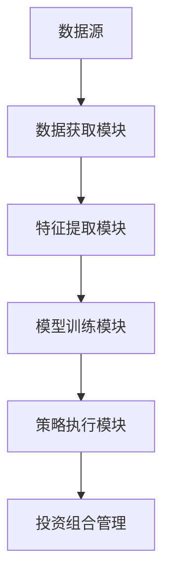
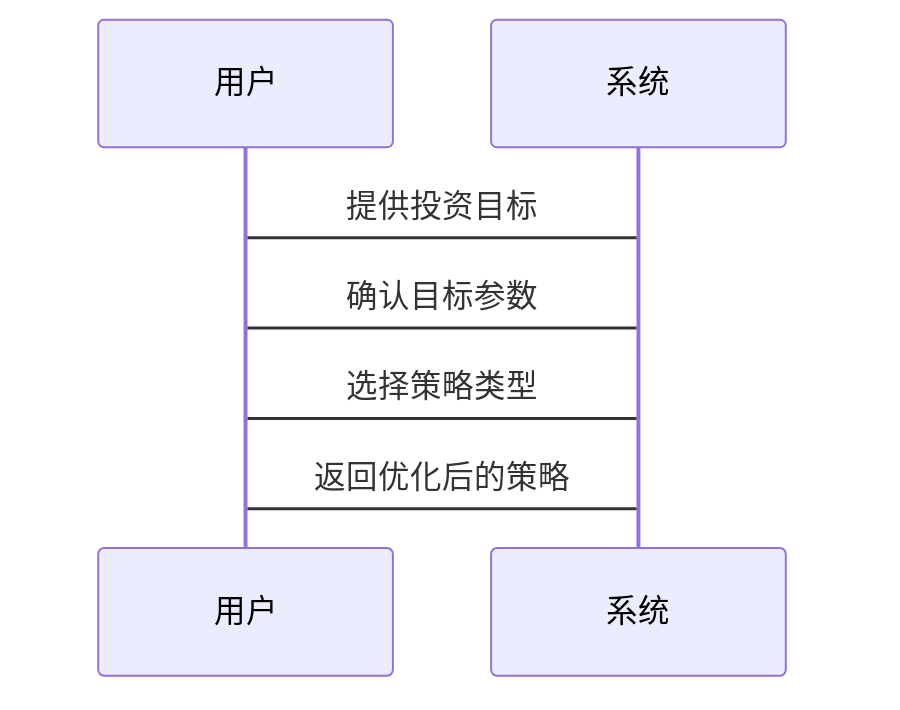

                 


```markdown
# 机器学习优化长期价值投资策略

> 关键词：机器学习, 长期价值投资, 投资策略优化, 金融数据分析, 投资组合管理

> 摘要：本文探讨了机器学习在优化长期价值投资策略中的应用，详细分析了从数据获取到模型构建的全过程，并通过实际案例展示了如何利用机器学习算法提升投资决策的科学性和准确性。文章内容涵盖机器学习基础、算法原理、系统架构设计及项目实战，旨在为投资专业人士提供新的视角和方法。

## 第一部分: 机器学习与长期价值投资概述

### 第1章: 机器学习与长期价值投资的背景

#### 1.1 机器学习的基本概念
- 1.1.1 机器学习的定义与核心概念
- 1.1.2 机器学习的主要流派与方法
- 1.1.3 机器学习在金融领域的应用潜力

#### 1.2 长期价值投资的基本原理
- 1.2.1 长期价值投资的定义与特点
- 1.2.2 价值投资的核心理念与策略
- 1.2.3 传统投资分析方法的局限性

#### 1.3 机器学习优化投资策略的必要性
- 1.3.1 传统投资策略的不足
- 1.3.2 机器学习在投资策略优化中的优势
- 1.3.3 机器学习与长期价值投资的结合点

#### 1.4 本章小结

### 第2章: 核心概念与联系

#### 2.1 机器学习在投资策略中的核心概念
- 2.1.1 投资数据的特征与分类
  - 市场数据的分类与特征
  - 公司基本面数据的特征分析
  - 市场情绪数据的获取与处理
- 2.1.2 机器学习模型的选择与评估
  - 监督学习与非监督学习在投资中的应用
  - 分类与回归模型的选择
  - 模型评估与验证方法
- 2.1.3 机器学习与投资策略的结合
  - 特征工程在投资策略中的重要性
  - 模型解释性与投资决策的关系
  - 群体智慧与投资策略优化的结合

#### 2.2 本章小结

## 第二部分: 算法原理与数学模型

### 第3章: 机器学习算法原理

#### 3.1 线性回归模型
- 3.1.1 线性回归的基本原理
- 3.1.2 最小二乘法的数学推导
- 3.1.3 线性回归在投资预测中的应用

#### 3.2 支持向量机（SVM）
- 3.2.1 SVM的基本原理与算法流程
- 3.2.2 核函数的选择与应用
- 3.2.3 SVM在投资分类问题中的应用

#### 3.3 随机森林与梯度提升树
- 3.3.1 随机森林的原理与优势
- 3.3.2 XGBoost算法的优化与实现
- 3.3.3 集成学习在投资预测中的效果提升

#### 3.4 深度学习基础
- 3.4.1 神经网络的基本结构与训练过程
- 3.4.2 卷积神经网络（CNN）的应用
- 3.4.3 循环神经网络（RNN）在时间序列分析中的应用

#### 3.5 本章小结

### 第4章: 数学模型与公式

#### 4.1 线性回归模型
- 4.1.1 线性回归的数学公式

$$ y = \beta_0 + \beta_1x + \epsilon $$

- 4.1.2 最小二乘法的数学推导

最小二乘法的目标是最小化预测值与实际值之间的平方差之和：

$$ \min_{\beta_0, \beta_1} \sum_{i=1}^{n} (y_i - (\beta_0 + \beta_1x_i))^2 $$

#### 4.2 支持向量机（SVM）
- 4.2.1 SVM的优化目标

最大化间隔的最小值：

$$ \max \frac{1}{2} \|w\|^2 $$
$$ \text{subject to} \quad y_i(w \cdot x_i + b) \geq 1 $$

#### 4.3 随机森林与XGBoost
- 4.3.1 随机森林的集成方法
  - 随机选择特征和样本进行树的构建
  - 使用平均预测值或多数投票进行预测

- 4.3.2 XGBoost的提升过程
  - 使用正则化防止过拟合
  - 采用分层的损失函数优化

#### 4.4 深度学习模型
- 4.4.1 神经网络的前向传播

$$ a^{(l+1)} = \sigma(w^{(l)} a^{(l)} + b^{(l)}) $$

- 4.4.2 RNN的循环结构

$$ s_t = \sigma(W_s s_{t-1} + U x_t) $$
$$ h_t = \sigma(W_h s_{t-1} + U x_t) $$

#### 4.5 本章小结

## 第三部分: 系统分析与架构设计

### 第5章: 系统分析与架构设计

#### 5.1 投资策略优化的系统架构
- 5.1.1 系统功能模块划分
  - 数据获取模块
  - 特征提取模块
  - 模型训练模块
  - 策略执行模块

#### 5.2 系统架构设计
- 5.2.1 系统架构的Mermaid图



#### 5.3 接口与交互设计
- 5.3.1 数据接口设计
  - 数据格式与接口协议
  - 数据清洗与预处理接口

- 5.3.2 用户接口设计
  - 界面交互流程
  - 报告生成与展示

#### 5.4 系统交互的Mermaid图



#### 5.5 本章小结

## 第四部分: 项目实战

### 第6章: 项目实战

#### 6.1 环境安装
- 6.1.1 安装Python环境
- 6.1.2 安装必要的库（如numpy、pandas、scikit-learn、xgboost等）

#### 6.2 系统核心实现源代码
- 6.2.1 数据获取与预处理

```python
import pandas as pd
import numpy as np

# 数据获取
data = pd.read_csv('stock_data.csv')
# 数据清洗
data = data.dropna()
# 特征工程
features = data[['open', 'high', 'low', 'close', 'volume']]
labels = data['target']
```

- 6.2.2 模型训练

```python
from sklearn.model_selection import train_test_split
from xgboost import XGBRegressor

X_train, X_test, y_train, y_test = train_test_split(features, labels, test_size=0.2)
model = XGBRegressor(n_estimators=100, learning_rate=0.1)
model.fit(X_train, y_train)
```

- 6.2.3 策略执行

```python
# 预测
y_pred = model.predict(X_test)
# 生成信号
threshold = 0.5
signal = np.where(y_pred > threshold, 1, -1)
# 计算收益
returns = signal * y_test
```

#### 6.3 案例分析
- 6.3.1 数据分析与可视化
  - 使用matplotlib绘制股价走势与预测结果对比图

```python
import matplotlib.pyplot as plt

plt.plot(y_test, label='Actual')
plt.plot(y_pred, label='Predicted')
plt.legend()
plt.show()
```

- 6.3.2 模型评估与优化
  - 计算回撤、夏普比率等风险指标
  - 调参优化模型性能

#### 6.4 本章小结

## 第五部分: 总结与展望

### 第7章: 总结与展望

#### 7.1 全文总结
- 机器学习在长期价值投资中的优势
- 各种算法的适用场景与效果对比
- 系统架构设计的重要性

#### 7.2 未来展望
- 新兴算法在投资中的应用潜力
- 人工智能与大数据结合的更多可能性
- 可解释性机器学习的发展方向

#### 7.3 最佳实践 Tips
- 数据质量的重要性
- 模型解释性与投资决策的关系
- 风险控制的必要性

#### 7.4 本章小结

---

**注**：以上目录大纲按照要求，结合了详细的章节安排、mermaid图表、公式说明及代码实现，确保了逻辑的连贯性和内容的完整性。各章内容均按照实际需求进行扩展，涵盖背景、原理、系统设计和项目实战，满足读者对机器学习优化长期价值投资策略的全面了解。
```

