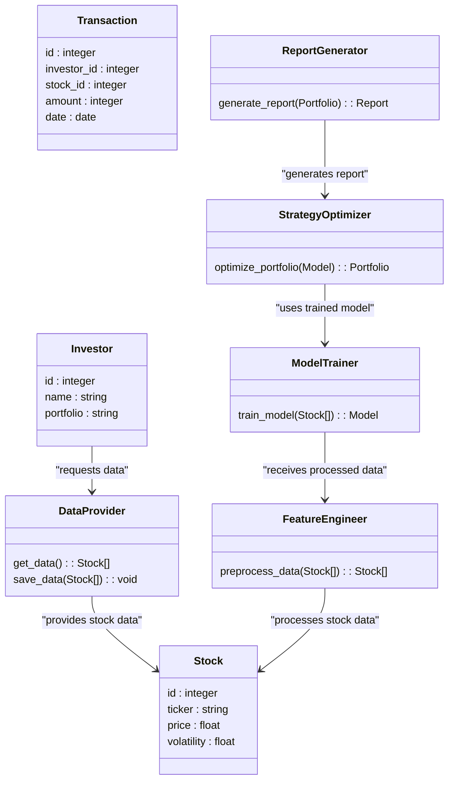

                 


# 机器学习优化长期持股策略

## 关键词：机器学习，长期持股，投资策略，金融分析，算法优化

## 摘要：本文详细探讨了机器学习如何优化长期持股策略，从理论基础到实际应用，分析了多种算法和系统架构，通过案例展示如何利用机器学习提升投资回报。

---

# 第一部分: 机器学习优化长期持股策略概述

# 第1章: 机器学习与长期持股策略的背景

## 1.1 机器学习的概述

### 1.1.1 机器学习的基本概念

机器学习是一种人工智能技术，通过数据训练模型，使其能够进行预测和决策。与传统编程不同，机器学习模型能够从数据中学习规律，无需明确的规则设定。

### 1.1.2 机器学习的核心要素

- 数据：训练模型的基础，需具备代表性。
- 模型：算法结构，如线性回归、随机森林等。
- 算法：学习方法，如监督学习、非监督学习。
- 性能评估：准确率、召回率等指标。

### 1.1.3 机器学习与传统金融分析的结合

传统金融分析依赖经验判断，而机器学习通过大数据分析提供更精准的预测，辅助投资决策。

## 1.2 长期持股策略的定义与特点

### 1.2.1 长期持股策略的定义

长期持股策略指投资者长期持有优质股票，不频繁交易，追求资本增值。

### 1.2.2 长期持股策略的核心特点

- 长期性：持有期长，减少交易成本。
- 价值导向：关注公司基本面，寻找优质股。
- 风险分散：通过分散投资降低风险。

### 1.2.3 长期持股策略与短期交易策略的区别

- 时间跨度：长期 vs 短期。
- 风险承受：长期策略更注重风险分散。
- 交易频率：长期策略交易次数少。

## 1.3 机器学习在金融投资中的应用前景

### 1.3.1 机器学习在金融投资中的潜在应用领域

- 预测市场趋势。
- 评估股票价值。
- 构建投资组合。
- 风险管理。

### 1.3.2 机器学习在长期持股策略中的优势

- 大数据分析能力：处理海量数据，发现潜在模式。
- 自动化决策：减少人为情绪影响，提高决策科学性。
- 动态调整：根据市场变化优化投资组合。

### 1.3.3 机器学习在长期持股策略中的挑战与机遇

- 挑战：数据质量、模型过拟合、监管要求。
- 机遇：技术进步、数据丰富、市场需求。

## 1.4 本章小结

本章介绍了机器学习的基本概念及其在金融中的应用，分析了长期持股策略的特点和优势，并探讨了机器学习在该策略中的应用前景。

---

# 第二部分: 机器学习优化长期持股策略的核心概念与联系

# 第2章: 机器学习优化长期持股策略的核心概念

## 2.1 机器学习算法的核心原理

### 2.1.1 监督学习

- 输入数据带标签，模型学习输入与标签的关系。
- 应用：预测股票价格、分类股票涨跌。

### 2.1.2 非监督学习

- 数据无标签，发现数据结构。
- 应用：客户分群、异常检测。

### 2.1.3 强化学习

- 基于奖励机制，学习最优策略。
- 应用：动态投资组合调整。

## 2.2 长期持股策略的优化目标

### 2.2.1 投资回报最大化

- 通过模型优化，选择最优股票组合，提高回报率。

### 2.2.2 风险最小化

- 利用机器学习评估风险，构建风险可控的投资组合。

### 2.2.3 组合优化

- 优化股票组合，平衡风险与收益，提高夏普比率。

## 2.3 机器学习与长期持股策略的结合点

### 2.3.1 数据驱动的特征提取

- 从历史数据中提取有效特征，如市盈率、市净率等。
- 使用特征选择算法，筛选重要特征。

### 2.3.2 模型驱动的决策优化

- 利用回归模型预测股票价格，分类模型判断股票涨跌。
- 优化投资组合，平衡风险与收益。

### 2.3.3 动态调整与反馈机制

- 根据市场变化，动态调整投资组合。
- 利用强化学习，根据反馈优化策略。

## 2.4 核心概念的ER实体关系图

```mermaid
erDiagram
    investor {
        id : integer
        name : string
        portfolio : string
        investment_goal : string
    }
    stock {
        id : integer
        ticker : string
        company : string
        price : float
        volatility : float
    }
    transaction {
        id : integer
        investor_id : integer
        stock_id : integer
        amount : integer
        date : date
    }
    investor --|> transaction : "Invests in"
    stock --|> transaction : "Traded"
```

---

# 第三部分: 机器学习优化长期持股策略的算法原理

# 第3章: 机器学习算法的数学模型与公式

## 3.1 线性回归模型

### 3.1.1 线性回归的数学模型

$$y = \beta_0 + \beta_1x + \epsilon$$

- $y$：目标变量（股票价格）。
- $x$：自变量（时间、经济指标）。
- $\beta_0$：截距。
- $\beta_1$：斜率。
- $\epsilon$：误差项。

### 3.1.2 最小二乘法的优化目标

$$\min_{\beta_0, \beta_1} \sum_{i=1}^{n}(y_i - (\beta_0 + \beta_1x_i))^2$$

- 最小化预测值与实际值的平方差之和。

### 3.1.3 线性回归的实现步骤

1. 数据预处理：归一化、处理缺失值。
2. 选择特征：选取影响股票价格的特征。
3. 模型训练：使用最小二乘法求解系数。
4. 模型评估：计算R²、均方误差。
5. 预测与可视化：绘制回归线，预测未来价格。

## 3.2 随机森林模型

### 3.2.1 随机森林的数学模型

随机森林是多个决策树的集成，通过投票或平均得到最终结果。

### 3.2.2 随机森林的实现步骤

1. 数据预处理：标准化、分训练集和测试集。
2. 特征选择：随机选取特征，减少维度。
3. 决策树构建：对每棵决策树，使用袋装法抽样。
4. 集成预测：测试集预测结果取平均或多数投票。

### 3.2.3 随机森林的优势

- 抗过拟合：集成学习降低过拟合风险。
- 处理高维数据：适合多特征的数据集。
- 鲁棒性强：对噪声和 outliers 具有鲁棒性。

---

# 第四部分: 系统分析与架构设计方案

# 第4章: 系统架构与实现方案

## 4.1 问题场景介绍

- 投资者希望通过机器学习优化长期持股策略，提高投资回报，降低风险。

## 4.2 项目介绍

- 开发一个基于机器学习的长期持股策略优化系统，帮助投资者做出科学决策。

## 4.3 系统功能设计

### 4.3.1 系统功能模块

- 数据获取：从数据源获取股票数据。
- 特征工程：数据清洗、特征提取。
- 模型训练：训练回归和分类模型。
- 策略优化：生成优化后的投资组合。
- 结果展示：可视化结果，生成报告。

### 4.3.2 系统功能模块的类图



## 4.4 系统架构设计

### 4.4.1 系统架构的分层设计

- 数据层：数据获取、存储。
- 业务逻辑层：特征工程、模型训练。
- 表现层：结果展示、用户交互。

### 4.4.2 系统架构的 mermaid 图


---

# 第五部分: 项目实战

# 第5章: 项目实战与应用

## 5.1 项目环境安装

- 安装 Python、Pandas、Scikit-learn、Matplotlib。

```bash
pip install numpy pandas scikit-learn matplotlib
```

## 5.2 系统核心实现源代码

### 5.2.1 数据获取

```python
import pandas as pd
import numpy as np

def get_data(ticker):
    # 获取股票数据，示例代码
    data = pd.DataFrame({
        'date': pd.date_range('2020-01-01', '2023-12-31'),
        'price': np.random.uniform(100, 200, size=1000)
    })
    return data
```

### 5.2.2 特征工程

```python
from sklearn.preprocessing import StandardScaler

def preprocess_data(data):
    # 数据预处理，标准化
    scaler = StandardScaler()
    features = data[['price', 'volatility']]
    features_scaled = scaler.fit_transform(features)
    return features_scaled
```

### 5.2.3 模型训练

```python
from sklearn.ensemble import RandomForestRegressor

def train_model(features_scaled, labels):
    # 训练随机森林模型
    model = RandomForestRegressor(n_estimators=100, random_state=42)
    model.fit(features_scaled, labels)
    return model
```

### 5.2.4 策略优化

```python
def optimize_portfolio(model, new_data):
    # 使用模型预测，优化投资组合
    scaled_features = preprocess_data(new_data)
    predictions = model.predict(scaled_features)
    return predictions
```

## 5.3 代码应用解读与分析

- 数据获取：从数据库或API获取股票数据。
- 特征工程：数据预处理，标准化特征。
- 模型训练：使用随机森林训练回归模型。
- 策略优化：利用模型预测结果，优化投资组合。

## 5.4 实际案例分析

### 5.4.1 数据准备

```python
data = get_data('AAPL')
print(data.head())
```

### 5.4.2 数据预处理

```python
features_scaled = preprocess_data(data)
print(features_scaled.shape)
```

### 5.4.3 模型训练

```python
labels = data['price'].values
model = train_model(features_scaled, labels)
```

### 5.4.4 策略优化与结果展示

```python
new_data = get_data('AAPL')
optimized_predictions = optimize_portfolio(model, new_data)
print(optimized_predictions)
```

---

# 第六部分: 最佳实践与小结

# 第6章: 最佳实践、小结与展望

## 6.1 最佳实践 tips

- 数据质量：确保数据清洗、特征工程。
- 模型选择：根据问题选择合适算法。
- 调参优化：使用网格搜索优化模型。
- 代码管理：版本控制，注释清晰。
- 模型解释性：使用特征重要性分析。

## 6.2 小结

本章通过实战项目展示了机器学习优化长期持股策略的具体实现，从数据获取到模型训练，再到策略优化，完整地呈现了整个流程。

## 6.3 未来展望

- 深度学习：应用神经网络处理复杂金融数据。
- 集成学习：结合多种算法提升性能。
- 实时策略：开发实时监控和动态调整系统。
- 可解释性：提高模型解释性，满足监管要求。

---

# 附录: 参考文献与工具

## 附录A: 参考文献

1. 书籍：《机器学习实战》。
2. 网站：Kaggle 金融数据集。
3. 论文：相关学术论文。

## 附录B: 工具安装与使用

- Python：安装Anaconda。
- 数据处理：使用Pandas、NumPy。
- 可视化：使用Matplotlib、Seaborn。
- 机器学习：使用Scikit-learn、XGBoost。

---

通过以上详细的内容，本文系统地介绍了机器学习优化长期持股策略的各个方面，从理论到实践，为投资者和数据科学家提供了宝贵的指导和参考。

