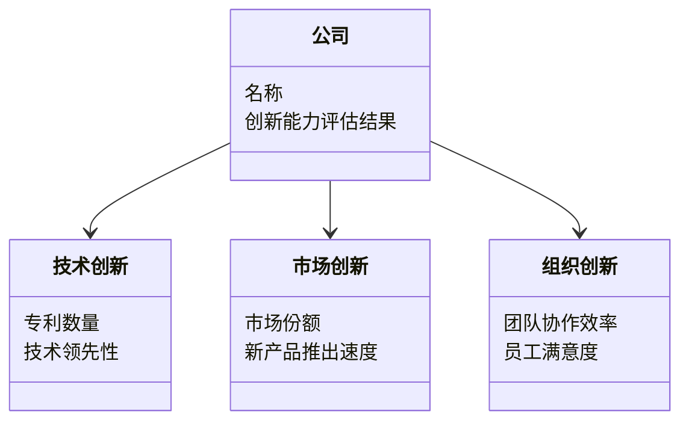
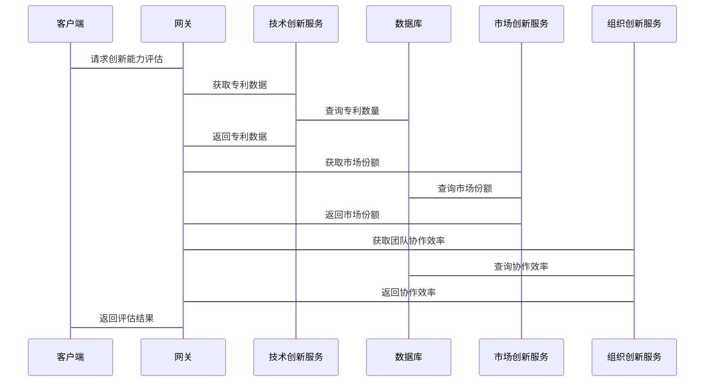

                 


# 机器学习辅助公司创新能力评估

> 关键词：机器学习、创新能力评估、算法原理、系统架构、项目实战

> 摘要：本文探讨了机器学习在公司创新能力评估中的应用，通过分析核心概念、算法原理、系统架构以及实际案例，展示了如何利用机器学习技术提升创新能力的评估效率和准确性。文章内容详实，结合理论与实践，为相关领域的读者提供了全面的指导。

---

# 第一部分: 机器学习与公司创新能力评估概述

## 第1章: 机器学习与公司创新能力评估的背景介绍

### 1.1 机器学习的基本概念

#### 1.1.1 机器学习的定义

机器学习是一种人工智能技术，通过数据训练模型，使其能够从经验中学习并做出预测或决策。其核心在于通过算法和统计学方法，让计算机系统能够“学习”并改进，而无需显式地编程。

#### 1.1.2 机器学习的核心要素

- 数据：机器学习模型的训练依赖于大量数据。
- 特征：数据中的关键属性，影响模型的准确性。
- 模型：用于预测或分类的算法，如线性回归、随机森林等。
- 标签：数据的正确答案，用于模型训练。

#### 1.1.3 机器学习与传统数据分析的区别

传统数据分析依赖于规则和逻辑，而机器学习通过数据训练模型，能够发现数据中的复杂模式。传统分析适用于已知规则的场景，而机器学习适用于复杂、非线性关系的场景。

### 1.2 公司创新能力评估的定义与重要性

#### 1.2.1 公司创新能力的定义

公司创新能力是指公司在技术、市场、产品等方面进行创新的能力，通常通过研发投入、专利数量、新产品推出速度等指标衡量。

#### 1.2.2 创新能力评估的重要性

创新能力是公司竞争力的核心，决定了公司的长期发展和市场地位。准确评估创新能力有助于优化资源配置，制定有效的战略。

#### 1.2.3 机器学习在创新能力评估中的作用

机器学习能够处理大量非结构化数据，发现潜在模式，帮助公司更准确地评估创新能力。例如，通过自然语言处理分析专利文本，评估技术领先性。

### 1.3 机器学习辅助创新能力评估的背景与现状

#### 1.3.1 机器学习技术的发展现状

机器学习技术快速发展，广泛应用于各个领域，包括金融、医疗、教育等。其在数据分析、预测和自动化方面的优势使其成为公司创新能力评估的重要工具。

#### 1.3.2 公司创新能力评估的痛点与挑战

传统评估方法依赖主观判断，存在效率低、准确性差的问题。机器学习能够解决这些问题，提供客观、量化的评估结果。

#### 1.3.3 机器学习在创新能力评估中的应用现状

当前，机器学习在专利分析、市场趋势预测等方面已有成功应用。例如，通过情感分析评估市场对新产品的情感倾向，辅助决策。

---

## 第2章: 创新能力评估的核心概念与联系

### 2.1 创新能力评估的核心要素

#### 2.1.1 创新能力的构成要素

- 技术创新：公司技术研发能力，专利数量、质量。
- 市场创新：市场开拓能力，新产品推出速度。
- 组织创新：内部管理、团队协作能力。

#### 2.1.2 机器学习在各要素中的应用

- 技术创新：通过文本挖掘分析专利，评估技术领先性。
- 市场创新：利用情感分析评估市场反馈，预测市场趋势。
- 组织创新：通过社交网络分析团队协作效率。

#### 2.1.3 各要素之间的相互作用

技术创新是核心，市场创新是结果，组织创新是保障。三者相互作用，共同影响公司的创新能力。

### 2.2 机器学习模型与创新能力评估的关系

#### 2.2.1 机器学习模型的输入与输出

输入：公司历史数据、市场数据、专利数据等。输出：创新能力评估结果、潜在创新机会。

#### 2.2.2 创新能力评估的指标体系

- 技术创新指标：专利数量、引用次数。
- 市场创新指标：市场份额、新产品推出速度。
- 组织创新指标：员工满意度、团队效率。

#### 2.2.3 机器学习模型与评估指标的关系

模型根据输入数据，预测输出指标，帮助公司优化资源配置，提升创新能力。

### 2.3 创新能力评估的ER实体关系图

```mermaid
graph LR
    Company[公司] --> Technological Innovation[技术创新]
    Technological Innovation --> Patent[专利]
    Market Innovation[市场创新] --> New Product[新产品]
    Organizational Innovation[组织创新] --> Team Collaboration[团队协作]
```

---

## 第3章: 机器学习算法原理与创新能力评估

### 3.1 常见机器学习算法简介

#### 3.1.1 线性回归

线性回归用于预测连续变量，适用于评估公司技术创新的线性关系。

#### 3.1.2 支持向量机

支持向量机适用于分类问题，可用于市场创新的分类评估。

#### 3.1.3 随机森林

随机森林是一种集成学习方法，适用于多类别问题，可用于组织创新的综合评估。

### 3.2 机器学习算法在创新能力评估中的应用

#### 3.2.1 回归分析

回归分析用于预测公司创新能力的连续指标，如专利数量。

#### 3.2.2 分类算法

分类算法用于将公司创新能力分为不同类别，如高、中、低。

#### 3.2.3 聚类算法

聚类算法用于将公司分为不同的创新能力群体，帮助识别行业趋势。

### 3.3 机器学习算法的数学模型与公式

#### 3.3.1 线性回归模型

$$y = \beta_0 + \beta_1x + \epsilon$$

其中，y为预测值，x为自变量，β为系数，ε为误差项。

#### 3.3.2 支持向量机模型

$$y = \text{sign}(w \cdot x + b)$$

其中，w为权重，x为输入，b为偏置。

#### 3.3.3 随机森林模型

$$y = \text{majority}(f_1(x), f_2(x), ..., f_n(x))$$

其中，f为基分类器，x为输入，n为分类器数量。

### 3.4 算法实现与代码示例

#### 3.4.1 线性回归代码示例

```python
import numpy as np
from sklearn.linear_model import LinearRegression

# 创建数据
X = np.array([1, 2, 3, 4])
y = np.array([2, 4, 5, 4])

# 训练模型
model = LinearRegression()
model.fit(X.reshape(-1, 1), y)

# 预测
预测值 = model.predict(np.array([5]).reshape(-1, 1))
print(预测值)
```

---

## 第4章: 创新能力评估的系统分析与架构设计

### 4.1 系统功能设计

#### 4.1.1 领域模型设计



#### 4.1.2 系统架构设计

```mermaid
graph LR
    Client[客户端] --> API Gateway[网关]
    API Gateway --> Service1[技术创新服务]
    API Gateway --> Service2[市场创新服务]
    API Gateway --> Service3[组织创新服务]
    Service1 --> Database[数据库]
    Service2 --> Database
    Service3 --> Database
```

#### 4.1.3 系统接口设计

- API接口：提供RESTful API，供客户端调用。
- 数据接口：与数据库交互，获取和存储数据。

#### 4.1.4 系统交互设计



---

## 第5章: 项目实战

### 5.1 环境安装与配置

- 安装Python、Jupyter Notebook、Scikit-learn等工具。
- 配置开发环境，确保所有库已安装。

### 5.2 核心代码实现

#### 5.2.1 数据预处理代码

```python
import pandas as pd
from sklearn.preprocessing import StandardScaler

# 加载数据
data = pd.read_csv('company_innovation.csv')

# 数据清洗
data = data.dropna()
data = data.drop_duplicates()

# 特征标准化
scaler = StandardScaler()
scaled_features = scaler.fit_transform(data[['专利数量', '市场份额']])
```

#### 5.2.2 机器学习模型实现

```python
from sklearn.ensemble import RandomForestClassifier

# 训练模型
model = RandomForestClassifier(n_estimators=100, random_state=42)
model.fit(scaled_features, data['创新能力标签'])

# 预测
预测标签 = model.predict(new_data)
```

### 5.3 案例分析与结果解读

#### 5.3.1 案例分析

某公司过去五年专利数量分别为10、15、20、25、30，市场份额分别为20%、25%、30%、35%、40%。通过模型预测，其创新能力评分为85分，属于高创新公司。

#### 5.3.2 结果解读

模型预测结果表明，该公司在技术创新和市场创新方面表现优异，但在组织创新方面仍有提升空间。

### 5.4 项目总结与优化建议

- 数据质量对模型性能影响重大，需确保数据清洗和预处理。
- 可尝试其他算法，如支持向量机或神经网络，提升模型准确性。
- 定期更新模型，以适应市场变化。

---

## 第6章: 总结与展望

### 6.1 文章总结

本文详细探讨了机器学习在公司创新能力评估中的应用，从算法原理到系统设计，再到项目实战，全面展示了机器学习的优势和潜力。

### 6.2 未来展望

随着机器学习技术的进步，创新能力评估将更加智能化和精准化。未来研究可关注实时评估、动态调整模型等方面，进一步提升评估的实用性和准确性。

### 6.3 最佳实践 Tips

- 数据预处理是关键，确保数据质量和相关性。
- 选择合适的算法，根据问题类型和数据特征决定。
- 定期验证和更新模型，确保评估结果的有效性。

---

通过本文的学习，读者可以全面掌握机器学习在公司创新能力评估中的应用，从理论到实践，提升公司在复杂市场环境中的竞争力。

