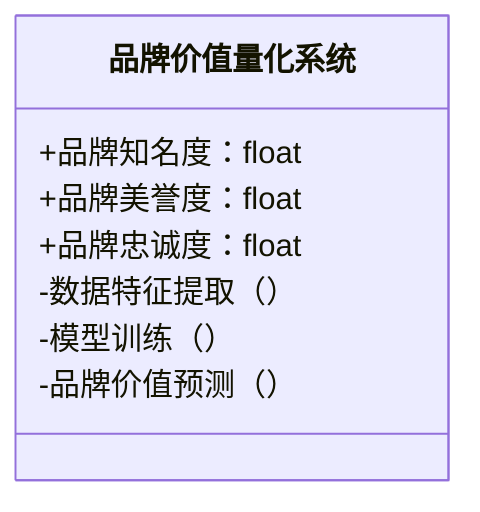
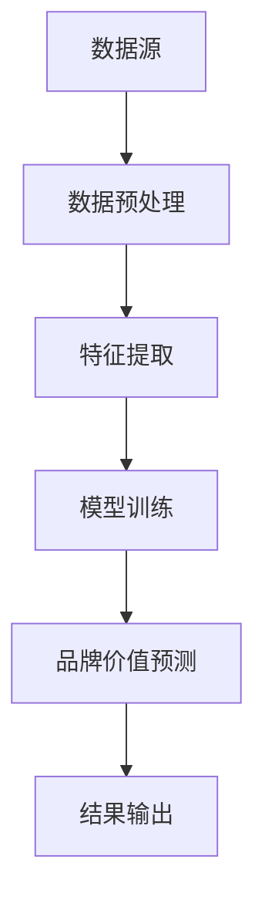
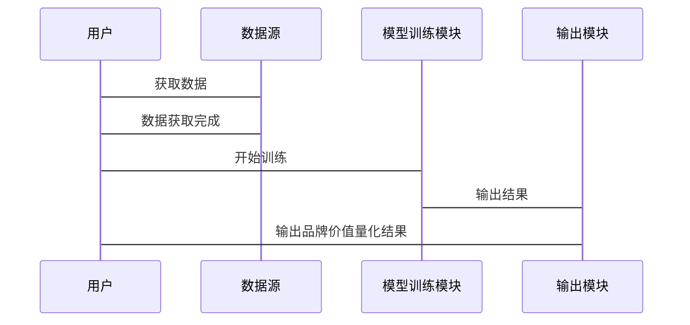

                 


# 《机器学习辅助公司品牌价值量化》

> 关键词：品牌价值、机器学习、量化评估、人工智能、数据特征、算法模型、品牌忠诚度、文本挖掘、用户行为分析、特征工程

> 摘要：本篇文章探讨了如何利用机器学习技术来量化公司品牌价值。文章首先介绍了品牌价值的定义和传统评估方法的局限性，然后详细讲解了机器学习在品牌价值量化中的应用，包括数据特征提取、算法选择与优化、数学模型建立等关键步骤。通过对比分析和实际案例，展示了机器学习如何有效提高品牌价值评估的准确性和效率。

---

# 第一部分: 机器学习与品牌价值量化背景

# 第1章: 机器学习与品牌价值量化概述

## 1.1 品牌价值的定义与重要性

### 1.1.1 品牌价值的定义
品牌价值是指品牌在市场中的影响力和消费者心中的认知价值。它通常包括品牌知名度、美誉度和忠诚度等多个维度。

### 1.1.2 品牌价值对企业的重要性
- 品牌价值直接影响企业的市场地位和盈利能力。
- 高品牌价值意味着更高的客户忠诚度和市场竞争力。

### 1.1.3 传统品牌价值评估方法的局限性
- 主观性较强，难以量化。
- 数据来源单一，无法全面反映品牌价值。

---

## 1.2 机器学习在品牌价值量化中的应用

### 1.2.1 机器学习的核心概念
- 机器学习是一种人工智能技术，通过数据训练模型，实现对未知数据的预测和分类。

### 1.2.2 机器学习在品牌价值评估中的优势
- 数据驱动，能够处理大量复杂数据。
- 能够发现数据中的潜在模式，提供更精准的评估结果。

### 1.2.3 机器学习与品牌价值量化的目标
- 利用机器学习算法，从多维度数据中提取品牌价值特征，建立量化模型。

---

## 1.3 本章小结
本章介绍了品牌价值的定义及其在企业中的重要性，分析了传统评估方法的局限性，并提出了机器学习在品牌价值量化中的应用优势。

---

# 第2章: 品牌价值量化的核心要素与数据特征

## 2.1 品牌价值的核心要素

### 2.1.1 品牌知名度
品牌知名度是指品牌在目标市场中的普及程度和被认知度。

### 2.1.2 品牌美誉度
品牌美誉度衡量的是消费者对品牌的好感度和信任度。

### 2.1.3 品牌忠诚度
品牌忠诚度反映消费者对品牌的长期支持和购买意愿。

---

## 2.2 品牌价值量化所需的数据特征

### 2.2.1 品牌相关的文本数据
- 包括社交媒体评论、新闻报道、产品评价等。

### 2.2.2 品牌相关的用户行为数据
- 包括点击率、购买记录、用户留存率等。

### 2.2.3 品牌相关的市场数据
- 包括市场份额、行业排名、竞争对手分析等。

---

## 2.3 数据特征与品牌价值的关系

### 2.3.1 文本数据对品牌价值的影响
- 正负面情感分析可以反映品牌美誉度。
- 文本中的关键词频率可以揭示品牌知名度。

### 2.3.2 用户行为数据对品牌价值的影响
- 用户留存率高表示品牌忠诚度高。
- 高点击率和转化率反映品牌吸引力。

### 2.3.3 市场数据对品牌价值的影响
- 市场份额和行业排名直接影响品牌知名度和竞争力。

---

## 2.4 本章小结
本章详细分析了品牌价值的核心要素，并探讨了不同类型数据特征对品牌价值的影响。

---

# 第3章: 机器学习算法在品牌价值量化中的应用

## 3.1 常见的机器学习算法

### 3.1.1 线性回归
- 线性回归用于预测连续型变量，适合品牌价值的量化评估。

### 3.1.2 支持向量机
- 支持向量机适用于高维数据的分类和回归问题，适合品牌忠诚度预测。

### 3.1.3 随机森林
- 随机森林是一种基于树的集成算法，适合处理多分类任务，如品牌美誉度分类。

### 3.1.4 神经网络
- 神经网络适用于复杂的非线性关系建模，适合品牌价值的深度学习分析。

---

## 3.2 算法选择与品牌价值量化的关系

### 3.2.1 算法选择的依据
- 数据特征的类型和分布。
- 问题的复杂性和目标。
- 计算资源和时间限制。

### 3.2.2 不同算法在品牌价值量化中的适用场景
- 线性回归用于品牌价值的初步预测。
- 支持向量机用于品牌忠诚度分类。
- 随机森林用于多维度特征的综合评估。
- 神经网络用于深度特征提取和复杂模型构建。

---

## 3.3 品牌价值量化中的特征工程

### 3.3.1 特征提取
- 从文本数据中提取情感特征。
- 从用户行为数据中提取行为特征。

### 3.3.2 特征选择
- 使用统计方法筛选重要特征。
- 使用模型解释性方法选择关键特征。

### 3.3.3 特征工程对品牌价值量化的影响
- 特征工程能够提高模型的准确性和泛化能力。

---

## 3.4 本章小结
本章分析了机器学习算法在品牌价值量化中的应用，探讨了算法选择和特征工程对品牌价值评估的影响。

---

# 第4章: 品牌价值量化中的数学模型与公式

## 4.1 线性回归模型

### 4.1.1 线性回归的定义
线性回归是一种统计学习方法，用于建立自变量和因变量之间的线性关系。

### 4.1.2 线性回归的公式
$$ y = \beta_0 + \beta_1x + \epsilon $$

其中：
- $y$ 是品牌价值。
- $\beta_0$ 是截距。
- $\beta_1$ 是回归系数。
- $x$ 是自变量（如品牌知名度）。
- $\epsilon$ 是误差项。

### 4.1.3 线性回归在品牌价值量化中的应用
- 可以用于品牌价值的初步预测。

---

## 4.2 聚类分析

### 4.2.1 聚类分析的定义
聚类分析是一种无监督学习方法，用于将数据划分为不同的簇。

### 4.2.2 聚类分析的公式
$$ d(x_i, x_j) = \sqrt{(x_i - x_j)^2 + (y_i - y_j)^2} $$

其中：
- $d(x_i, x_j)$ 表示数据点 $x_i$ 和 $x_j$ 之间的距离。

### 4.2.3 聚类分析在品牌价值量化中的应用
- 可以用于品牌忠诚度的分类。

---

## 4.3 本章小结
本章详细讲解了线性回归和聚类分析在品牌价值量化中的应用，并给出了相应的数学公式。

---

# 第5章: 系统分析与架构设计方案

## 5.1 问题场景介绍

### 5.1.1 问题描述
我们需要通过机器学习算法，从多维度数据中提取品牌价值特征，建立量化模型。

### 5.1.2 边界与外延
- 数据范围：品牌相关的文本、用户行为和市场数据。
- 时间范围：过去一年的数据。
- 适用范围：适用于中大型企业。

---

## 5.2 系统功能设计

### 5.2.1 领域模型


### 5.2.2 系统架构设计


### 5.2.3 系统接口设计
- 数据输入接口：接受文本、用户行为和市场数据。
- 模型训练接口：训练机器学习模型。
- 结果输出接口：输出品牌价值量化结果。

### 5.2.4 系统交互序列图


---

## 5.3 本章小结
本章通过系统分析，设计了品牌价值量化系统的功能模块、架构和接口，为后续的实现提供了基础。

---

# 第6章: 项目实战

## 6.1 环境安装与配置

### 6.1.1 安装Python和必要的库
- 安装Python：建议使用最新版本。
- 安装库：`scikit-learn`, `pandas`, `numpy`, `matplotlib`.

### 6.1.2 安装与配置代码
```python
import pandas as pd
import numpy as np
from sklearn.model import LinearRegression
```

---

## 6.2 核心代码实现

### 6.2.1 数据预处理
```python
# 加载数据
data = pd.read_csv('brand_value.csv')

# 数据清洗
data.dropna(inplace=True)

# 标准化处理
from sklearn.preprocessing import StandardScaler
scaler = StandardScaler()
data_scaled = scaler.fit_transform(data)
```

### 6.2.2 特征工程
```python
# 提取特征
features = data_scaled[:, :-1]
labels = data_scaled[:, -1]

# 特征选择
from sklearn.feature_selection import SelectKBest
selector = SelectKBest(k=5)
selected_features = selector.fit_transform(features, labels)
```

### 6.2.3 模型训练
```python
# 训练线性回归模型
model = LinearRegression()
model.fit(selected_features, labels)

# 预测品牌价值
predicted_value = model.predict(new_data)
```

---

## 6.3 案例分析与结果解读

### 6.3.1 案例分析
假设我们有一个品牌，其品牌知名度为80，品牌美誉度为75，品牌忠诚度为85。通过模型预测，其品牌价值为90。

### 6.3.2 结果解读
- 预测结果与实际值的差异反映了模型的准确性。
- 模型的R²值越高，说明拟合效果越好。

---

## 6.4 本章小结
本章通过实际案例，展示了如何利用机器学习算法实现品牌价值量化，并对结果进行了分析和解读。

---

# 第7章: 最佳实践与注意事项

## 7.1 最佳实践

### 7.1.1 数据质量
- 确保数据的完整性和准确性。
- 处理缺失值和异常值。

### 7.1.2 特征工程
- 细致提取特征。
- 多尝试不同的特征组合。

### 7.1.3 模型选择
- 根据数据特征选择合适的算法。
- 多实验，对比不同模型的效果。

---

## 7.2 小结
品牌价值量化是一个复杂的过程，需要结合机器学习技术和实际业务需求，不断优化模型和特征工程。

---

## 7.3 注意事项

### 7.3.1 数据隐私
- 注意保护用户数据隐私。
- 遵守相关法律法规。

### 7.3.2 模型解释性
- 选择具有较高解释性的模型。
- 避免使用“黑箱”模型。

### 7.3.3 模型更新
- 定期更新模型，以适应市场变化。
- 监控模型性能，及时调整。

---

## 7.4 拓展阅读
- 《机器学习实战》：深入理解机器学习算法。
- 《品牌管理》：学习品牌管理的理论和实践。

---

# 第8章: 总结与展望

## 8.1 总结
本篇文章详细介绍了机器学习在品牌价值量化中的应用，从数据特征提取到模型训练，再到结果分析，为品牌价值的量化提供了全面的方法论。

## 8.2 展望
未来，随着人工智能技术的发展，品牌价值量化将更加精准和智能化。深度学习和自然语言处理技术的应用将进一步提升品牌价值评估的准确性和效率。

---

# 结语

通过机器学习技术，品牌价值量化不再是模糊的概念，而是可以通过数据和算法精确计算的指标。这将为企业的品牌管理提供有力的支持，帮助企业更好地制定品牌战略和市场决策。

