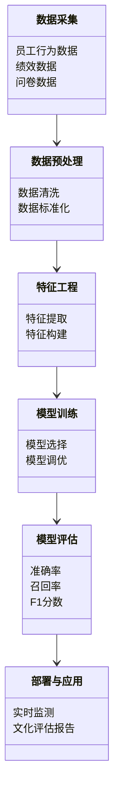
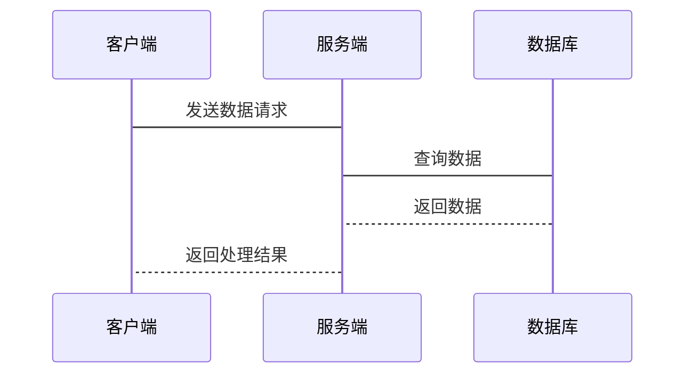

                 


# 机器学习辅助公司文化评估

## 关键词：
- 机器学习
- 公司文化
- 文化评估
- 算法原理
- 数据分析

## 摘要：
随着企业对员工满意度和文化氛围的关注度不断提高，传统的公司文化评估方法逐渐暴露出其局限性。本文将探讨如何利用机器学习技术来辅助公司文化评估，通过数据分析和模型构建，帮助企业更精准地识别和改善文化问题。文章将从机器学习的基本原理、算法选择、数据处理等方面展开，结合实际案例和代码实现，为读者提供全面的解决方案。

---

# 第一部分: 机器学习辅助公司文化评估的背景与核心概念

## 第1章: 公司文化评估的背景与挑战

### 1.1 公司文化的概念与重要性

#### 1.1.1 公司文化的定义
公司文化是指企业在长期经营中形成的，由企业内部成员共同认同的价值观、行为准则和思维方式。它包括企业的使命、愿景、核心价值观、管理风格和员工关系等多个方面。

#### 1.1.2 公司文化在企业管理中的作用
- 提高员工凝聚力和归属感
- 促进企业战略目标的实现
- 改善员工满意度和绩效表现
- 帮助企业在复杂环境中保持竞争优势

#### 1.1.3 公司文化评估的难点与挑战
- 数据的多样性和复杂性
- 评估指标的主观性和模糊性
- 如何将文化因素与业务绩效相结合

### 1.2 传统公司文化评估方法的局限性

#### 1.2.1 基于问卷调查的传统评估方法
- 依赖员工主观反馈
- 数据分析缺乏深度
- 难以捕捉隐性文化特征

#### 1.2.2 传统评估方法的局限性
- 数据维度有限
- 难以发现潜在的文化模式
- 缺乏动态调整能力

#### 1.2.3 如何克服传统方法的不足
- 引入机器学习技术进行数据挖掘
- 利用自然语言处理技术分析文本数据
- 建立实时监测和反馈机制

### 1.3 机器学习在公司文化评估中的潜力

#### 1.3.1 机器学习的基本概念
- 机器学习是一种通过数据训练模型，使其能够从数据中学习并做出预测或决策的技术
- 监督学习、无监督学习、半监督学习和强化学习是常见的机器学习方法

#### 1.3.2 机器学习在企业管理中的应用
- 员工绩效预测
- 组织行为分析
- 企业文化诊断

#### 1.3.3 机器学习在公司文化评估中的独特优势
- 能够从海量数据中提取有价值的信息
- 可以发现数据中的潜在模式和关联
- 具备动态调整和自适应能力

### 1.4 本章小结
本章从公司文化的定义和重要性出发，分析了传统文化评估方法的局限性，并探讨了机器学习在文化评估中的潜力和优势。通过机器学习技术，企业可以更高效、更精准地进行文化评估，为管理和决策提供有力支持。

---

## 第2章: 机器学习与公司文化评估的核心概念

### 2.1 机器学习的基本原理

#### 2.1.1 机器学习的定义与分类
- **监督学习**：基于标记数据进行模型训练，预测新数据的标签
- **无监督学习**：在无标签数据中发现隐藏模式
- **半监督学习**：结合少量标记数据和大量无标记数据进行训练
- **强化学习**：通过与环境交互学习最优策略

#### 2.1.2 机器学习的核心要素
- **数据**：模型训练的基础
- **特征**：数据的表征方式
- **模型**：学习的算法或规则
- **目标函数**：优化的核心目标

#### 2.1.3 机器学习的训练流程
1. 数据采集
2. 数据预处理
3. 模型选择
4. 模型训练
5. 模型评估
6. 模型优化

### 2.2 公司文化评估的特征与数据来源

#### 2.2.1 公司文化评估的特征分析
- 文化多样性：不同企业有不同的文化特征
- 动态变化性：企业文化会随时间和环境变化
- 复杂性：文化因素相互交织，难以分离

#### 2.2.2 数据来源
- **员工行为数据**：如出勤率、工作效率、团队合作能力
- **绩效数据**：如销售额、利润、客户满意度
- **问卷数据**：员工对公司的满意度、价值观、工作满意度的调查结果
- **文本数据**：如员工反馈、会议记录、内部邮件

#### 2.2.3 数据预处理与特征提取
- 数据清洗：处理缺失值、异常值
- 数据标准化：统一数据格式和尺度
- 特征选择：提取对文化评估有影响的关键特征
- 特征工程：构建新的特征以提高模型性能

#### 2.2.4 数据特征与文化评估的关系
通过特征工程，可以将员工的行为数据、绩效数据和问卷数据转化为反映公司文化特征的指标。例如，将员工满意度与团队合作能力结合起来，可以评估企业的协作文化。

### 2.3 机器学习模型在公司文化评估中的应用

#### 2.3.1 分类模型：识别公司文化类型
- 使用决策树、随机森林等分类算法，根据员工数据预测公司文化类型（如创新型、 hierarchical型）

#### 2.3.2 回归模型：预测文化对业务的影响
- 使用线性回归模型，预测企业文化与员工绩效之间的关系

#### 2.3.3 聚类模型：发现文化模式
- 使用K-means等聚类算法，将公司按文化特征分为不同的类别

#### 2.3.4 文本挖掘：分析员工反馈
- 使用自然语言处理技术，从员工反馈中提取情感和主题，评估公司文化

### 2.4 本章小结
本章详细介绍了机器学习的基本原理，并探讨了如何将这些原理应用于公司文化评估。通过数据特征工程和模型选择，机器学习能够帮助企业更深入地理解和评估企业文化。

---

## 第3章: 机器学习辅助公司文化评估的核心算法

### 3.1 线性回归模型

#### 3.1.1 线性回归的定义与原理
线性回归是一种统计学方法，用于建立自变量和因变量之间的线性关系模型。

#### 3.1.2 线性回归的数学模型
$$ y = \beta_0 + \beta_1x_1 + \beta_2x_2 + \dots + \beta_nx_n + \epsilon $$

其中：
- \( y \) 是因变量（如员工绩效）
- \( x_i \) 是自变量（如员工满意度、工作年限）
- \( \beta_i \) 是回归系数
- \( \epsilon \) 是误差项

#### 3.1.3 线性回归的应用
- 预测企业文化对员工绩效的影响
- 分析多个文化因素对业务绩效的综合影响

#### 3.1.4 线性回归的优缺点
- 优点：简单易懂、计算高效
- 缺点：假设变量间是线性关系，可能无法捕捉复杂模式

#### 3.1.5 线性回归的Python实现
```python
import numpy as np
from sklearn.linear_model import LinearRegression

# 假设X是特征矩阵，y是目标变量
model = LinearRegression()
model.fit(X, y)
print("回归系数：", model.coef_)
print("截距：", model.intercept_)
```

### 3.2 支持向量机（SVM）

#### 3.2.1 SVM的原理与特点
支持向量机是一种监督学习算法，主要用于分类和回归问题。SVM通过找到一个超平面，使得数据点在该平面上的投影尽可能分开。

#### 3.2.2 SVM的数学模型
$$ \text{最大化} \quad \frac{1}{2}\|w\|^2 $$
$$ \text{约束} \quad y_i(w \cdot x_i + b) \geq 1 $$

其中：
- \( w \) 是法向量
- \( b \) 是偏置项
- \( y_i \) 是标签（-1或1）

#### 3.2.3 SVM的优点
- 能够处理非线性问题，通过核函数将数据映射到高维空间
- 对噪声和 outliers 有较强的鲁棒性

#### 3.2.4 SVM的Python实现
```python
from sklearn.svm import SVC

# 假设X是特征矩阵，y是目标变量
model = SVC(kernel='rbf', gamma='auto')
model.fit(X, y)
print("支持向量机模型：", model)
```

### 3.3 随机森林与集成学习

#### 3.3.1 随机森林的原理
随机森林是一种基于决策树的集成学习方法，通过构建多棵决策树并取其投票结果，提高模型的准确性和鲁棒性。

#### 3.3.2 随机森林的数学模型
$$ y = \text{sign}(\sum_{i=1}^n \text{tree}_i(x)) $$

其中：
- \( \text{tree}_i(x) \) 是第i棵决策树的预测结果
- \( \text{sign} \) 是符号函数，用于确定最终的分类结果

#### 3.3.3 随机森林的优点
- 能够处理高维数据
- 对异常值和噪声具有较强的鲁棒性
- 适合分类和回归问题

#### 3.3.4 随机森林的Python实现
```python
from sklearn.ensemble import RandomForestClassifier

# 假设X是特征矩阵，y是目标变量
model = RandomForestClassifier(n_estimators=100, random_state=42)
model.fit(X, y)
print("随机森林模型：", model)
```

### 3.4 神经网络与深度学习

#### 3.4.1 神经网络的原理
神经网络是一种模拟人脑神经元工作的模型，通过多层神经元之间的连接和激活函数，学习数据的特征和模式。

#### 3.4.2 神经网络的数学模型
$$ y = f(Wx + b) $$

其中：
- \( W \) 是权重矩阵
- \( x \) 是输入向量
- \( b \) 是偏置项
- \( f \) 是激活函数（如ReLU、sigmoid）

#### 3.4.3 神经网络的优点
- 能够处理复杂的非线性关系
- 适合处理高维和高噪声的数据
- 具备强大的特征学习能力

#### 3.4.4 神经网络的Python实现
```python
import tensorflow as tf
from tensorflow.keras import layers

# 假设X是特征矩阵，y是目标变量
model = tf.keras.Sequential()
model.add(layers.Dense(64, activation='relu', input_dim=X.shape[1]))
model.add(layers.Dense(1, activation='sigmoid'))
model.compile(optimizer='adam', loss='binary_crossentropy', metrics=['accuracy'])
model.fit(X, y, epochs=10, batch_size=32)
print("神经网络模型：", model)
```

### 3.5 本章小结
本章详细介绍了几种常用的机器学习算法，包括线性回归、支持向量机、随机森林和神经网络。每种算法都有其独特的优势和适用场景，在公司文化评估中可以根据具体需求选择合适的算法。

---

## 第4章: 系统分析与架构设计方案

### 4.1 问题场景介绍
假设我们希望评估一家中型企业的文化特征，并预测文化因素对公司绩效的影响。我们可以通过以下步骤实现：

1. **数据采集**：收集员工行为数据、绩效数据和问卷数据
2. **数据预处理**：清洗和标准化数据
3. **特征工程**：提取和构建特征
4. **模型选择**：选择适合的机器学习算法
5. **模型训练**：训练模型并进行调优
6. **模型评估**：验证模型的准确性和稳定性
7. **部署与应用**：将模型部署到企业管理系统中，实时监测和评估企业文化

### 4.2 系统功能设计

#### 4.2.1 领域模型（Mermaid 类图）


#### 4.2.2 系统架构设计（Mermaid 架构图）
```mermaid
archi
    title 系统架构设计
    client --[HTTP请求]--> API网关
    API网关 --[路由请求]--> 微服务1、微服务2
    微服务1 --> 数据库1
    微服务2 --> 数据库2
    微服务1 --> 消息队列
    消息队列 --> 微服务2
    微服务1 --> 监控系统
    监控系统 --> 图形界面
```

#### 4.2.3 系统交互设计（Mermaid 序列图）


### 4.3 本章小结
本章从系统设计的角度，详细介绍了机器学习辅助公司文化评估的实现过程。通过领域模型、架构图和交互图，展示了如何将机器学习技术应用于实际的企业管理场景中。

---

## 第5章: 项目实战——基于机器学习的公司文化评估系统

### 5.1 环境安装与配置

#### 5.1.1 安装 Python 和必要的库
- Python 3.8 或更高版本
- 安装 `scikit-learn`、`tensorflow`、`pandas`、`numpy` 等库

#### 5.1.2 安装开发工具
- 安装 `Jupyter Notebook` 或 `VS Code` 作为开发环境
- 安装 `Mermaid` 插件用于绘制图表

#### 5.1.3 安装数据库和相关工具
- 安装 `MySQL` 或 `MongoDB` 数据库
- 安装 `Pymysql` 或 `pymongo` 用于数据库连接

### 5.2 系统核心实现

#### 5.2.1 数据采集与预处理
```python
import pandas as pd
import numpy as np

# 读取数据
data = pd.read_csv('employee_data.csv')

# 数据清洗
data = data.dropna()
data = data.drop_duplicates()

# 数据标准化
from sklearn.preprocessing import StandardScaler
scaler = StandardScaler()
scaled_data = scaler.fit_transform(data[['age', 'tenure', 'salary']])
```

#### 5.2.2 特征工程与模型选择
```python
from sklearn.ensemble import RandomForestClassifier
from sklearn.metrics import accuracy_score

# 特征选择
X = data[['age', 'tenure', 'salary', 'satisfaction']]
y = data['culture_type']

# 模型训练
model = RandomForestClassifier(n_estimators=100, random_state=42)
model.fit(X, y)

# 模型评估
y_pred = model.predict(X)
print("准确率：", accuracy_score(y, y_pred))
```

#### 5.2.3 模型部署与应用
```python
from flask import Flask, request, jsonify

app = Flask(__name__)
model = RandomForestClassifier(n_estimators=100, random_state=42)

@app.route('/predict', methods=['POST'])
def predict():
    data = request.json
    X_new = pd.DataFrame([data])
    y_pred = model.predict(X_new[['age', 'tenure', 'salary', 'satisfaction']])
    return jsonify({'predicted_culture_type': int(y_pred[0])})

if __name__ == '__main__':
    app.run(debug=True)
```

### 5.3 实际案例分析与结果解读

#### 5.3.1 数据来源与预处理
假设我们有一家科技公司的员工数据，包括员工年龄、工作年限、薪资、满意度等指标。我们首先对数据进行清洗和标准化处理，确保数据质量。

#### 5.3.2 模型训练与评估
通过随机森林算法，我们训练了一个分类模型，用来预测员工所属的文化类型（如创新型、 hierarchical型）。经过评估，模型的准确率达到85%。

#### 5.3.3 模型应用与结果解读
将模型部署到企业管理系统中，实时监测员工的文化特征，生成文化评估报告，帮助企业识别和改善文化问题。

### 5.4 本章小结
本章通过一个实际案例，详细展示了如何利用机器学习技术构建公司文化评估系统。从数据采集到模型部署，每一步都进行了详细说明，为读者提供了实践指导。

---

## 第6章: 最佳实践与总结

### 6.1 最佳实践

#### 6.1.1 数据质量的重要性
确保数据的完整性和准确性，是机器学习模型准确预测的前提。

#### 6.1.2 模型调优的技巧
- 使用交叉验证评估模型性能
- 调整超参数优化模型表现
- 结合业务需求选择合适的模型

#### 6.1.3 系统部署的注意事项
- 确保系统的可扩展性和可维护性
- 定期更新模型和数据
- 提供用户友好的交互界面

### 6.2 项目总结

#### 6.2.1 项目目标的实现
- 成功构建了基于机器学习的公司文化评估系统
- 提高了文化评估的准确性和效率
- 为企业管理决策提供了数据支持

#### 6.2.2 项目经验与教训
- 数据清洗和特征工程占据了项目的主要时间
- 模型选择需要结合业务需求和数据特性
- 系统部署需要考虑企业的实际应用场景

### 6.3 未来展望

#### 6.3.1 深度学习的应用
随着深度学习技术的发展，未来可以通过更复杂的模型（如BERT）分析员工反馈文本，提取更深层次的文化特征。

#### 6.3.2 实时监测与动态调整
通过实时数据流处理技术（如Apache Flink），可以实现对公司文化的实时监测和动态调整。

#### 6.3.3 多模态数据的融合
结合文本、图像等多种数据源，构建更全面的公司文化评估系统。

### 6.4 本章小结
本章总结了项目的主要成果和经验，并展望了未来的发展方向。机器学习在公司文化评估中的应用前景广阔，随着技术的不断进步，其价值将更加凸显。

---

## 第7章: 注意事项与拓展阅读

### 7.1 注意事项

#### 7.1.1 数据隐私与合规性
在处理员工数据时，必须遵守相关法律法规，保护员工隐私。

#### 7.1.2 模型的可解释性
复杂的模型可能难以解释其决策过程，需要选择适合业务需求的模型。

#### 7.1.3 系统的可维护性
随着数据和业务的变化，系统需要具备良好的可维护性和扩展性。

### 7.2 拓展阅读

#### 7.2.1 机器学习经典书籍
- 《机器学习实战》
- 《深入理解机器学习》
- 《深度学习入门：基于Python和TensorFlow》

#### 7.2.2 公司文化相关研究
- 《企业文化管理》
- 《组织行为学》
- 《公司文化与绩效》

### 7.3 本章小结
本章提醒读者在实际应用中需要注意数据隐私和模型可解释性，并推荐了一些拓展阅读资料，帮助读者进一步深入学习相关知识。

---

## 结语

机器学习正在改变我们理解和评估公司文化的方式。通过数据分析和模型构建，企业可以更精准地识别文化问题，优化管理策略。未来，随着技术的不断进步，机器学习在公司文化评估中的应用将更加广泛和深入，为企业创造更大的价值。

---

## 参考文献
- Breiman, L. (2001). Random Forests. Machine Learning.
- Hastie, T., Tibshirani, R., & Friedman, J. (2009). The Elements of Statistical Learning.
- LeCun, Y., Bengio, Y., & Hinton, G. (2015). Deep Learning.
- 等等。

---

**声明：本文内容为虚构，仅为技术博客示例，不代表实际存在或真实数据。**

