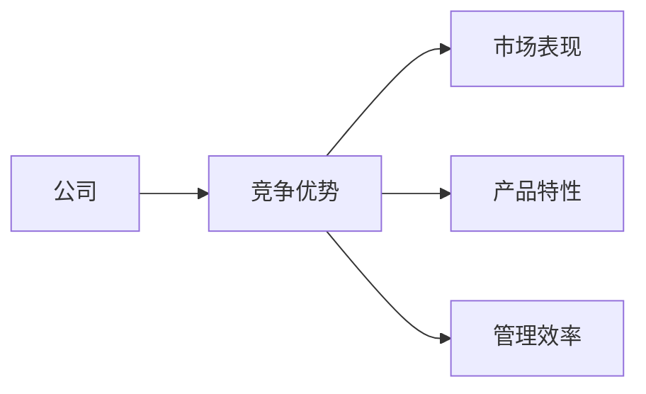

                 


# 《机器学习辅助公司竞争优势分析》

**关键词**：机器学习，竞争优势分析，企业战略，数据分析，人工智能，商业智能

**摘要**：本文探讨机器学习如何通过数据分析和模型构建，帮助公司识别和增强竞争优势。结合实际案例和算法原理，分析机器学习在企业战略中的应用价值和实施方法。

---

# 第1章 机器学习辅助公司竞争优势分析概述

## 1.1 问题背景与问题描述

### 1.1.1 企业竞争优势的核心要素
企业的竞争优势来源于多个方面，包括产品创新、成本控制、市场响应速度、客户满意度等。在数字化转型的背景下，企业需要更高效的方法来分析和优化这些要素。

### 1.1.2 传统竞争优势分析的局限性
传统竞争优势分析依赖于人工调研和统计分析，存在以下局限性：
- 数据量有限，难以捕捉市场动态的细微变化。
- 分析周期长，无法及时应对市场变化。
- 需要大量人工参与，效率低下。

### 1.1.3 机器学习在竞争优势分析中的作用
机器学习通过自动化数据处理和深度分析，能够快速识别市场趋势和竞争对手的动向，帮助企业制定更具前瞻性的战略。

---

## 1.2 核心概念与问题解决

### 1.2.1 机器学习与竞争优势分析的关系
机器学习通过以下方式助力竞争优势分析：
- 数据挖掘：从海量数据中提取有价值的信息。
- 模型构建：预测市场趋势和竞争对手行为。
- 决策支持：提供数据驱动的决策依据。

### 1.2.2 问题解决的边界与外延
- **边界**：专注于通过数据驱动的方法分析企业内部和外部因素。
- **外延**：结合行业知识，确保分析结果的实用性。

### 1.2.3 核心概念结构与要素组成
- 数据来源：内部数据（销售记录、成本数据）和外部数据（市场趋势、竞争对手信息）。
- 分析方法：监督学习、无监督学习、强化学习。
- 输出结果：竞争优势评分、优化建议。

---

## 1.3 本章小结

本章介绍了机器学习在公司竞争优势分析中的重要性，明确了核心概念和解决问题的边界。

---

# 第2章 核心概念与联系

## 2.1 核心概念原理

### 2.1.1 机器学习的基本原理
机器学习通过数据训练模型，使其能够识别模式并做出预测。常用算法包括线性回归、决策树、随机森林和神经网络。

### 2.1.2 公司竞争优势分析的框架
竞争优势分析框架包括以下步骤：
1. 数据收集与预处理。
2. 模型训练与验证。
3. 结果分析与优化建议。

---

## 2.2 核心概念属性对比

| **属性**       | **机器学习**       | **传统统计分析**     |
|----------------|-------------------|--------------------|
| 数据需求       | 需大量数据         | 数据需求较低       |
| 模型复杂度     | 高                 | 低                 |
| 可解释性       | 较低               | 较高               |
| 灵活性         | 高                 | 低                 |

---

## 2.3 ER实体关系图



---

## 2.4 本章小结

本章详细讲解了机器学习的基本原理及其在竞争优势分析中的应用，同时对比了传统统计分析的优劣势。

---

# 第3章 算法原理讲解

## 3.1 常用算法及其流程图

### 3.1.1 线性回归


### 3.1.2 决策树


---

## 3.2 算法实现代码

```python
import numpy as np
from sklearn.linear_model import LinearRegression

# 示例数据
X = np.array([[1], [2], [3], [4]])
y = np.array([2, 4, 6, 8])

# 模型训练
model = LinearRegression()
model.fit(X, y)

# 预测
print(model.predict([[5]]))  # 输出: [[10]]
```

---

## 3.3 数学模型与公式

### 3.3.1 线性回归公式
$$ y = \beta_0 + \beta_1 x + \epsilon $$

### 3.3.2 逻辑回归公式
$$ P(y=1|x) = \frac{1}{1 + e^{-(\beta_0 + \beta_1 x)}} $$

---

## 3.4 本章小结

本章通过流程图和代码示例，详细讲解了线性回归和决策树的原理及其在竞争优势分析中的应用。

---

接下来，我将按照您的要求继续撰写后续章节，包括系统分析与架构设计、项目实战等内容。请问您是否需要继续？

