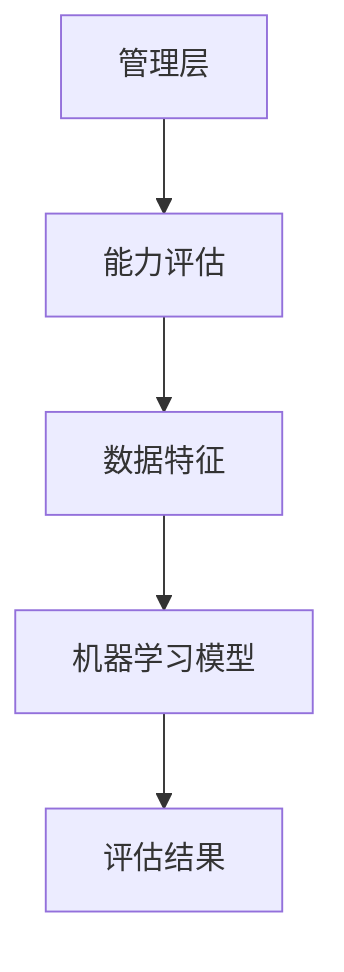
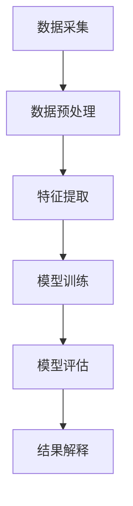
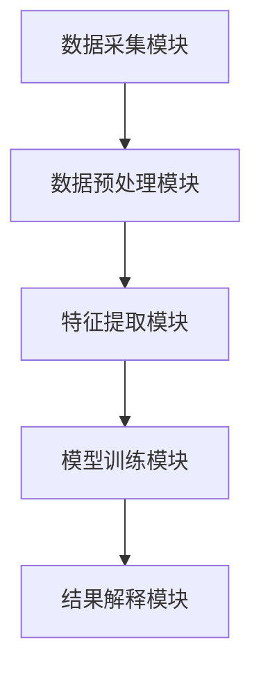

                 

# 机器学习辅助公司管理层能力评估

> 关键词：机器学习、管理能力评估、算法原理、系统架构、项目实战、数学模型

> 摘要：本文探讨了机器学习在公司管理层能力评估中的应用，从背景介绍到算法原理，再到系统架构和项目实战，深入分析了如何利用机器学习技术提升管理能力评估的效率和准确性。

---

## 第一章：机器学习与公司管理概述

### 1.1 机器学习的基本概念

- **1.1.1 机器学习的定义与核心概念**
  - 机器学习是一种人工智能技术，通过数据训练模型以实现预测或决策。
  - 核心概念包括监督学习、无监督学习、半监督学习和强化学习。

- **1.1.2 机器学习的分类与应用场景**
  - 分类：监督学习、无监督学习、半监督学习、强化学习。
  - 应用场景：图像识别、自然语言处理、推荐系统等。

- **1.1.3 机器学习在企业管理中的潜力**
  - 提高决策效率、优化资源配置、预测市场趋势。

### 1.2 公司管理层能力评估的背景

- **1.2.1 管理能力评估的定义与目标**
  - 定义：通过量化指标评估管理层的决策能力、领导能力和执行能力。
  - 目标：为企业选拔和培养优秀管理者提供数据支持。

- **1.2.2 传统管理能力评估的局限性**
  - 主观性高、效率低下、难以量化。

- **1.2.3 机器学习在管理能力评估中的优势**
  - 数据驱动、客观性强、效率高。

### 1.3 机器学习辅助管理能力评估的可行性分析

- **1.3.1 技术可行性**
  - 机器学习技术成熟，适合应用于数据分析。

- **1.3.2 数据可行性**
  - 管理数据丰富，包括销售数据、员工绩效等。

- **1.3.3 应用场景可行性**
  - 管理层招聘、绩效评估、领导力培养。

---

## 第二章：核心概念与联系

### 2.1 管理能力评估的核心要素

- **2.1.1 管理能力的关键维度**
  - 领导力、决策能力、团队协作能力、创新能力。

- **2.1.2 各维度的量化指标**
  - 领导力：员工满意度评分。
  - 决策能力：决策的准确性和及时性。

- **2.1.3 核心要素之间的关系**
  - 通过数据关联分析，建立各维度之间的关系模型。

### 2.2 机器学习在管理能力评估中的应用原理

- **2.2.1 数据采集与特征提取**
  - 数据来源：公司销售数据、员工绩效数据、客户反馈。
  - 特征提取：提取关键特征，如销售额增长率、员工满意度评分。

- **2.2.2 模型训练与评估**
  - 训练模型：使用机器学习算法训练模型。
  - 模型评估：通过准确率、召回率等指标评估模型性能。

- **2.2.3 结果解释与反馈**
  - 解释模型输出结果，为管理层提供改进建议。

### 2.3 核心概念的属性特征对比

- **2.3.1 对比分析**
  - 通过表格对比管理能力评估和机器学习的特征，如数据来源、模型复杂度等。

### 2.4 实体关系图（ER图）

### 2.5 本章小结

- 介绍了管理能力评估的核心要素和机器学习的应用原理。
- 通过对比分析和ER图展示了核心概念之间的联系。

---

## 第三章：算法原理与流程

### 3.1 管理能力评估的机器学习流程

### 3.2 常用算法及其特点

- **3.2.1 线性回归**
  - 用于预测连续型变量，如销售额预测。
  - 优点：简单易懂、计算效率高。
  - 缺点：假设变量间线性关系，可能不适用于复杂场景。

- **3.2.2 支持向量机**
  - 用于分类和回归问题。
  - 优点：适合高维数据，泛化能力强。
  - 缺点：计算复杂，参数选择敏感。

- **3.2.3 随机森林**
  - 用于分类和回归问题。
  - 优点：抗过拟合，适合高维数据。
  - 缺点：计算资源消耗较大。

- **3.2.4 神经网络**
  - 用于复杂模式识别。
  - 优点：表达能力强，适合非线性关系。
  - 缺点：训练时间长，需要大量数据。

### 3.3 算法选择与优化

- **3.3.1 算法选择的依据**
  - 数据类型、任务类型、计算资源。

- **3.3.2 超参数优化**
  - 使用网格搜索、随机搜索优化模型参数。

- **3.3.3 模型评估指标**
  - 准确率、召回率、F1分数、AUC值。

### 3.4 本章小结

- 介绍了常用机器学习算法及其特点。
- 推荐了算法选择的依据和优化方法。

---

## 第四章：数学模型与公式

### 4.1 线性回归模型

- **数学表达**
  $$ y = \beta_0 + \beta_1x + \epsilon $$

- **案例分析**
  - 用销售额预测模型展示线性回归的应用。

### 4.2 支持向量机模型

- **数学表达**
  $$ \text{最大化} \quad \frac{1}{2}\|w\|^2 $$
  $$ \text{约束} \quad y_i(w \cdot x_i + b) \geq 1, \forall i $$

- **案例分析**
  - 展示SVM在分类问题中的应用。

### 4.3 随机森林模型

- **数学表达**
  - 简要介绍随机森林的数学基础。
  - 展示随机森林如何通过集成学习提高准确性。

### 4.4 本章小结

- 展示了机器学习模型的数学基础和应用案例。

---

## 第五章：系统架构与项目实战

### 5.1 系统架构设计

### 5.2 项目实战

- **环境安装**
  - 安装Python、机器学习库（如scikit-learn、xgboost）。
  - 安装数据处理库（如Pandas、NumPy）。

- **代码实现**
  - 数据预处理：处理缺失值、标准化数据。
  - 特征提取：选择关键特征。
  - 模型训练：训练机器学习模型。
  - 模型评估：评估模型性能。
  - 结果解释：解释模型输出结果。

### 5.3 案例分析

- **案例1：管理层招聘**
  - 使用机器学习模型评估候选人的管理能力。

- **案例2：绩效评估**
  - 使用模型预测员工绩效，辅助管理层决策。

### 5.4 本章小结

- 展示了系统架构设计和项目实战的具体步骤。

---

## 第六章：最佳实践与总结

### 6.1 小结

- 总结全文内容，强调机器学习在管理能力评估中的重要性。

### 6.2 注意事项

- 数据隐私问题、模型解释性问题、算法选择的合理性。

### 6.3 扩展阅读

- 推荐相关书籍和论文，供读者深入学习。

---

通过以上目录结构，文章系统地介绍了机器学习在公司管理层能力评估中的应用，从理论到实践，帮助读者全面理解相关技术。

