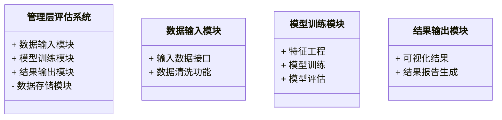
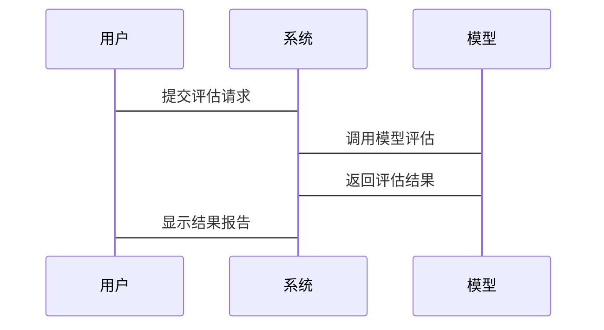

                 


# 目录大纲：机器学习辅助公司管理层评估

## 文章标题：机器学习辅助公司管理层评估

> 关键词：机器学习，公司管理层评估，数据分析，算法原理，系统架构，项目实战

> 摘要：本文系统地探讨了机器学习在公司管理层评估中的应用。通过背景介绍、核心概念、算法原理、系统架构和项目实战，详细分析了机器学习如何提升评估效率和准确性。文章结合实际案例，展示了如何利用数据驱动的方法优化管理层决策过程，为公司管理层提供了科学的评估工具和方法。

---

## 目录大纲：

### 第一部分：背景介绍

#### 第1章：机器学习与公司管理层评估的背景

##### 1.1 问题背景
- 1.1.1 公司管理层评估的重要性
- 1.1.2 传统评估方法的局限性
- 1.1.3 机器学习在现代评估中的潜力

##### 1.2 问题描述
- 1.2.1 管理层评估的主要挑战
- 1.2.2 数据驱动决策的需求
- 1.2.3 机器学习如何解决评估难题

##### 1.3 问题解决
- 1.3.1 机器学习在评估中的应用
- 1.3.2 数据收集与处理的重要性
- 1.3.3 模型训练与优化的步骤

##### 1.4 边界与外延
- 1.4.1 机器学习评估的适用范围
- 1.4.2 与其他评估方法的对比
- 1.4.3 技术边界与伦理问题

---

### 第二部分：核心概念与联系

#### 第2章：机器学习的核心原理

##### 2.1 核心概念原理
- 2.1.1 机器学习的基本概念
- 2.1.2 监督学习、无监督学习和强化学习的区别
- 2.1.3 管理层评估中的特征工程

##### 2.2 核心概念对比表格
- 2.2.1 不同机器学习算法的对比分析
- 2.2.2 各算法的优缺点总结

##### 2.3 ER实体关系图
- 2.3.1 数据模型设计
- 2.3.2 实体间的关系展示

---

### 第三部分：算法原理讲解

#### 第3章：常用机器学习算法

##### 3.1 算法流程图
- 3.1.1 算法选择与流程展示

##### 3.2 Python代码实现
- 3.2.1 线性回归、随机森林、神经网络的代码示例

##### 3.3 数学模型与公式
- 3.3.1 线性回归的数学模型：$$y = \beta_0 + \beta_1x + \epsilon$$
- 3.3.2 随机森林的决策树原理
- 3.3.3 神经网络的激活函数：$$\sigma(z) = \frac{1}{1 + e^{-z}}$$

---

### 第四部分：系统分析与架构设计

#### 第4章：系统设计与架构

##### 4.1 项目场景介绍
- 4.1.1 管理层评估的典型场景
- 4.1.2 系统目标与功能概述

##### 4.2 系统功能设计
- 4.2.1 领域模型类图展示
- 4.2.2 功能模块划分

##### 4.3 系统架构设计
- 4.3.1 分层架构图展示
- 4.3.2 模块间交互流程

##### 4.4 系统接口设计
- 4.4.1 数据输入输出接口
- 4.4.2 模型训练接口

##### 4.5 系统交互序列图
- 4.5.1 用户与系统交互流程
- 4.5.2 模型调用与结果反馈流程

---

### 第五部分：项目实战

#### 第5章：项目实战与案例分析

##### 5.1 环境安装与数据准备
- 5.1.1 开发环境搭建
- 5.1.2 数据收集与清洗

##### 5.2 核心代码实现
- 5.2.1 数据预处理代码
- 5.2.2 模型训练与优化代码

##### 5.3 案例分析与结果解读
- 5.3.1 具体案例分析
- 5.3.2 模型评估与结果解读

##### 5.4 代码应用解读
- 5.4.1 代码功能模块分析
- 5.4.2 实际应用中的注意事项

---

### 第六部分：最佳实践与小结

#### 第6章：最佳实践与总结

##### 6.1 最佳实践
- 6.1.1 数据质量的重要性
- 6.1.2 模型选择与调优的技巧
- 6.1.3 系统部署与维护的建议

##### 6.2 小结
- 6.2.1 机器学习在管理层评估中的应用总结
- 6.2.2 未来研究方向与技术趋势

##### 6.3 注意事项
- 6.3.1 数据隐私与安全问题
- 6.3.2 模型解释性与可信赖性
- 6.3.3 技术与业务结合的平衡

##### 6.4 拓展阅读
- 6.4.1 推荐的机器学习书籍与资源
- 6.4.2 相关领域的最新研究进展

---

## 附录：代码与图表

### 附录A：核心代码片段

```python
# 线性回归示例
import numpy as np
from sklearn.linear_model import LinearRegression

X = np.array([[1], [2], [3], [4]])
y = np.array([2, 4, 6, 8])
model = LinearRegression()
model.fit(X, y)
print(model.coef_)
print(model.intercept_)
```

### 附录B：Mermaid图表

#### 类图


#### 序列图


---

## 结语

本文系统地探讨了机器学习在公司管理层评估中的应用，从理论到实践，结合实际案例，为读者提供了全面的指导。通过本文的学习，读者可以掌握如何利用机器学习技术优化公司管理层的评估过程，提升决策的科学性和准确性。

