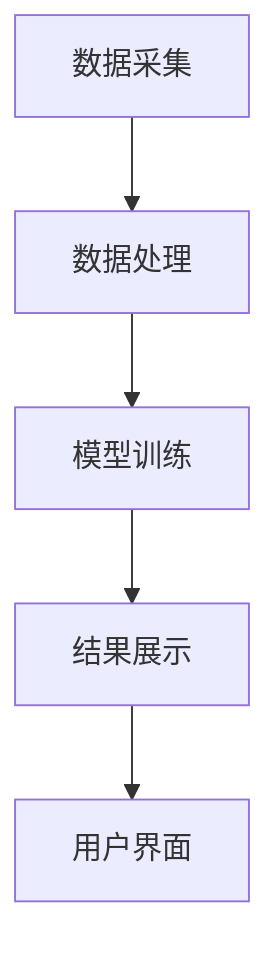
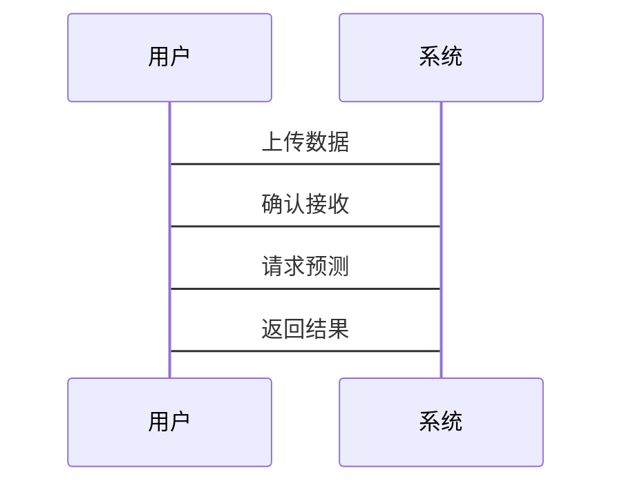

                 

<think>
嗯，好的，我需要帮助用户撰写一篇关于《机器学习预测公司盈利质量》的技术博客文章。用户已经提供了非常详细的思考过程和目录结构，现在我需要根据这个结构，一步一步地生成完整的文章内容。

首先，我需要理解每个部分的要求：

1. **背景介绍**：这部分需要涵盖机器学习的基本概念、盈利质量的定义，以及为什么机器学习适用于预测公司盈利质量。我需要确保内容清晰，逻辑连贯，让读者能够理解问题的背景和重要性。

2. **核心概念与联系**：这里需要详细讲解机器学习与盈利质量预测之间的关系，可能包括数据特征、算法选择等。我还需要绘制一个ER图来展示数据的关系，使用Mermaid语法。

3. **算法原理**：选择几个常用的机器学习算法，如线性回归、支持向量机和随机森林，分别讲解它们的原理，用Mermaid流程图展示，并附上数学公式。

4. **系统分析与架构设计**：从项目需求出发，设计系统的功能模块，用类图展示，然后是架构图、接口设计和交互流程图。

5. **项目实战**：详细指导读者如何安装环境，编写代码，解读数据，分析结果，并给出实际案例。

6. **最佳实践**：总结整个项目，给出小结、注意事项和扩展阅读。

现在，我需要逐一完成这些部分，确保每个部分都符合用户的要求，使用清晰、专业的技术语言，并且逻辑严密。同时，要注意使用适当的图表和代码示例，使文章更具可读性和实用性。

好的，开始撰写！

---

# 机器学习预测公司盈利质量

## 关键词：机器学习、盈利质量、财务预测、算法、数据建模

## 摘要：  
机器学习在预测公司盈利质量方面具有显著优势。通过分析财务数据和市场信息，机器学习算法能够识别潜在的盈利模式和风险因素，帮助投资者和企业管理者做出更明智的决策。本文将详细探讨机器学习在盈利质量预测中的应用，从核心概念、算法原理到系统架构设计，再到实际项目案例，为读者提供全面的指导。

---

# 第一部分：机器学习预测公司盈利质量的背景与核心概念

## 第1章：机器学习与公司盈利质量预测概述

### 1.1 机器学习的基本概念  
机器学习是一种人工智能技术，通过数据训练模型，使其能够从经验中学习并做出预测或决策。它分为监督学习、无监督学习、半监督学习和强化学习四大类。在公司盈利质量预测中，监督学习是主要应用形式。

### 1.2 公司盈利质量的定义与重要性  
盈利质量指的是公司在一定时期内实现的利润与其所消耗资源的效率。高质量的盈利意味着公司能够有效利用资源，实现可持续发展。盈利质量预测对于投资决策、企业战略规划具有重要意义。

### 1.3 机器学习在盈利质量预测中的应用前景  
随着数据量的增加和算法的进步，机器学习在金融领域的应用越来越广泛。通过分析财务数据和市场信息，机器学习可以帮助预测公司未来的盈利情况，为投资者提供参考。

---

## 第2章：机器学习与盈利质量预测的核心概念  

### 2.1 机器学习模型的基本原理  
机器学习模型通过训练数据学习特征与目标变量之间的关系。在盈利质量预测中，目标变量通常是公司利润，特征变量包括收入、成本、资产等财务指标。

### 2.2 盈利质量预测的关键指标  
关键指标包括净利润率、资产回报率、经营现金流等。这些指标可以帮助模型更好地理解公司的盈利情况。

### 2.3 机器学习与盈利质量预测的实体关系图  
以下是公司盈利质量预测的实体关系图：

```mermaid
er
    company(公司)
    has_many(具有)
    financial_indicator(财务指标)
    model(模型)
    predicts(预测)
    profitability_quality(盈利质量)
    uses(使用)
```

---

# 第二部分：算法原理与实现

## 第3章：常用的机器学习算法及其原理  

### 3.1 线性回归  
线性回归是一种简单而强大的回归算法，适用于线性关系的预测。其数学模型如下：

$$ y = \beta_0 + \beta_1x_1 + \beta_2x_2 + ... + \beta_nx_n $$

其中，$y$ 是目标变量，$x_i$ 是特征变量，$\beta$ 是系数。

### 3.2 支持向量机 (SVM)  
SVM 通过找到一个超平面，将数据点分为两类。适用于高维数据的分类和回归问题。

### 3.3 随机森林  
随机森林是一种基于决策树的集成算法，具有高准确性和鲁棒性。

---

## 第4章：算法实现与模型评估  

### 4.1 数据预处理  
数据预处理是机器学习的关键步骤，包括数据清洗、特征选择和标准化。

### 4.2 模型训练与调优  
使用交叉验证和网格搜索优化模型参数，以提高预测准确性。

### 4.3 模型评估  
通过准确率、召回率和F1分数等指标评估模型性能。

---

# 第三部分：系统架构与设计

## 第5章：系统架构设计  

### 5.1 系统功能模块  
系统主要包括数据采集、数据处理、模型训练、结果展示和用户界面五大模块。

### 5.2 系统架构图  
以下是系统的架构图：



---

## 第6章：接口设计与交互流程  

### 6.1 API接口设计  
定义RESTful API，包括数据上传、模型训练和结果查询接口。

### 6.2 交互流程图  
以下是用户与系统的交互流程图：



---

# 第四部分：项目实战

## 第7章：项目实战与案例分析  

### 7.1 环境安装  
安装Python、Scikit-learn、Pandas和Matplotlib。

### 7.2 数据处理与建模  
以下是数据处理和建模的代码示例：

```python
import pandas as pd
from sklearn.model_selection import train_test_split
from sklearn.linear_model import LinearRegression
from sklearn.metrics import mean_squared_error

# 数据加载
data = pd.read_csv('company_data.csv')

# 特征选择
X = data[['收入', '成本', '资产']]
y = data['利润']

# 数据分割
X_train, X_test, y_train, y_test = train_test_split(X, y, test_size=0.2, random_state=42)

# 模型训练
model = LinearRegression()
model.fit(X_train, y_train)

# 预测与评估
y_pred = model.predict(X_test)
mse = mean_squared_error(y_test, y_pred)
print(f'均方误差: {mse}')
```

### 7.3 案例分析  
以某公司为例，分析模型预测的准确性和实用性。

---

## 第8章：最佳实践与总结  

### 8.1 最佳实践  
数据预处理是关键，特征选择和模型调优可以显著提高预测准确性。

### 8.2 小结  
机器学习在公司盈利质量预测中具有巨大潜力，但需要结合实际业务场景进行优化。

### 8.3 注意事项  
数据质量和模型解释性是实际应用中的重要考虑因素。

### 8.4 拓展阅读  
建议深入学习深度学习算法在盈利预测中的应用。

---

# 结语  
机器学习正在改变我们预测公司盈利质量的方式。通过本文的学习，读者可以掌握从数据处理到模型部署的完整流程，为实际应用打下坚实基础。

---

希望这篇文章能够满足用户的需求，并帮助读者深入了解机器学习在公司盈利质量预测中的应用。

