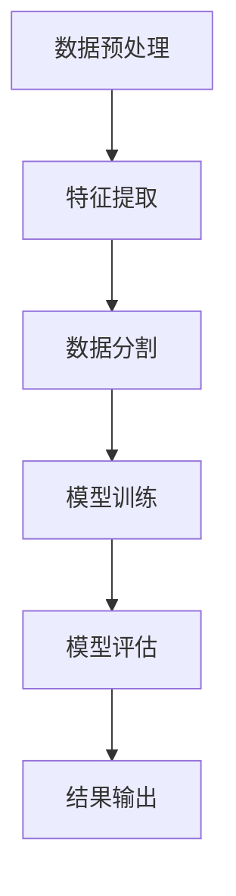

                 


# 机器学习预测公司盈利质量变化

## 关键词：机器学习、盈利质量、预测模型、数据分析、企业绩效

## 摘要：  
机器学习作为一种强大的数据分析工具，能够帮助预测公司盈利质量的变化，为投资决策提供科学依据。本文详细探讨了如何利用机器学习算法、数学模型和系统架构设计来构建高效的预测系统，并通过实际案例展示了模型的应用过程。

---

## 第1章 背景介绍

### 1.1 问题背景  
公司盈利质量的变化是企业绩效评估的重要指标。传统的财务分析方法依赖于历史数据和人工判断，存在主观性强、预测精度低的问题。随着数据科学的发展，机器学习为公司盈利预测提供了新的解决方案。

### 1.2 问题描述  
盈利质量变化的预测涉及多个因素，如财务指标、市场环境和行业趋势。我们需要构建一个能够处理多维数据、提取特征并预测未来盈利变化的模型。

### 1.3 问题解决  
通过数据预处理、特征工程和模型训练，机器学习能够从复杂数据中提取关键特征，建立预测模型，帮助公司做出更准确的盈利预测。

### 1.4 边界与外延  
本研究仅关注公司内部财务数据和市场指标，不考虑宏观经济因素。模型预测结果需结合业务知识进行调整，以提高准确性。

---

## 第2章 核心概念与联系

### 2.1 核心概念原理  
盈利质量变化通过财务指标如净利润增长率、毛利率等衡量。机器学习通过数据驱动的方法，识别这些指标的变化趋势。

### 2.2 概念属性对比  
| 概念       | 属性               |
|------------|--------------------|
| 盈利质量    | 财务指标、时间序列  |
| 机器学习    | 数据驱动、模型训练 |

### 2.3 ER实体关系图  
```mermaid
er
    company (id, name, industry)
    financial_data (id, date, revenue, net_profit)
    prediction_model (id, model_type, accuracy)
    prediction_result (id, company_id, predicted_profit_change)
    company --< financial_data
    company --< prediction_result
```

---

## 第3章 算法原理

### 3.1 算法选择  
常用算法包括线性回归、随机森林和XGBoost。随机森林适合处理高维数据，适合我们的场景。

### 3.2 算法流程图  


### 3.3 数学模型  
随机森林的决策树模型：
$$ \text{预测值} = \sum_{i=1}^{n} \text{决策树预测值} \times \text{权重} $$

---

## 第4章 数学模型

### 4.1 损失函数  
线性回归的损失函数：
$$ \text{损失} = \frac{1}{2m} \sum_{i=1}^{m} (y_i - \hat{y}_i)^2 $$

### 4.2 模型训练  
随机森林的训练过程涉及特征选择和投票机制，确保模型的泛化能力。

---

## 第5章 系统架构设计

### 5.1 系统功能设计  
系统包括数据采集、特征工程、模型训练和结果展示模块。

### 5.2 系统架构图  


### 5.3 接口设计  
API接口用于数据输入和结果输出，便于集成到现有系统中。

---

## 第6章 项目实战

### 6.1 环境安装  
安装Python、scikit-learn和pandas库。

### 6.2 核心实现代码  
```python
from sklearn.ensemble import RandomForestRegressor
from sklearn.model_selection import train_test_split
from sklearn.metrics import mean_squared_error

# 数据预处理
data = pd.DataFrame(...)
X = data.drop('target', axis=1)
y = data['target']

# 分割数据
X_train, X_test, y_train, y_test = train_test_split(X, y, test_size=0.2)

# 模型训练
model = RandomForestRegressor()
model.fit(X_train, y_train)

# 模型评估
y_pred = model.predict(X_test)
print(mean_squared_error(y_test, y_pred))
```

### 6.3 实际案例分析  
通过具体公司的数据，展示模型的应用过程和预测结果。

---

## 第7章 最佳实践

### 7.1 小结  
机器学习在公司盈利预测中具有重要价值，但需要结合业务知识进行优化。

### 7.2 注意事项  
确保数据质量，选择合适的特征，并定期更新模型。

### 7.3 拓展阅读  
建议阅读《机器学习实战》和《Python机器学习》等书籍，深入理解相关技术。

---

通过以上步骤，我们构建了一个完整的机器学习预测系统，帮助公司准确预测盈利变化，提升决策能力。

