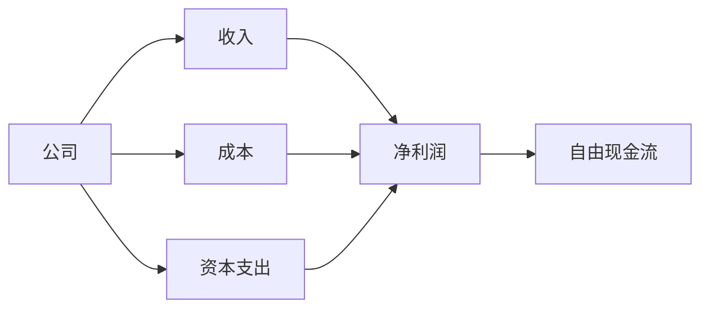

                 


# 机器学习预测公司自由现金流

> 关键词：机器学习，自由现金流，时间序列预测，回归模型，特征工程，算法实现

> 摘要：本文详细探讨了机器学习在预测公司自由现金流中的应用，从背景知识到算法实现，从系统设计到项目实战，系统性地介绍了如何利用机器学习技术构建高效的现金流预测模型。文章首先介绍了机器学习和自由现金流的基本概念，分析了机器学习在金融预测中的优势。接着深入讲解了时间序列预测的核心算法，包括线性回归、随机森林和支持向量回归的原理与实现。最后，通过一个完整的项目实战，展示了如何从数据预处理到模型部署，构建一个实际可用的现金流预测系统。

---

# 第一部分: 机器学习预测公司自由现金流的背景与基础

# 第1章: 机器学习与自由现金流预测的背景介绍

## 1.1 机器学习的基本概念

### 1.1.1 机器学习的定义与核心概念
机器学习是一种人工智能技术，通过数据训练模型，使其能够从经验中“学习”并做出预测或决策。其核心概念包括：
- **监督学习**：给定输入和输出，训练模型预测新输入的输出。
- **无监督学习**：从无标签数据中发现模式。
- **回归**：预测连续值（如自由现金流）。
- **分类**：预测离散值（如股票涨跌）。

### 1.1.2 机器学习与传统统计学的区别
- 传统统计学：假设数据分布已知，依赖假设检验。
- 机器学习：不依赖明确的假设，通过数据直接训练模型，适用于复杂非线性关系。

### 1.1.3 机器学习在金融领域的应用前景
金融领域的数据通常具有复杂性、非线性和噪声多的特点，机器学习在这些方面具有显著优势。例如：
- 股价预测
- 风险评估
- 现金流预测

---

## 1.2 自由现金流的概念与重要性

### 1.2.1 自由现金流的定义与计算公式
自由现金流（Free Cash Flow，FCF）是公司在扣除所有支出后的剩余现金，可用于偿还债务、投资或其他用途。计算公式为：
$$ \text{FCF} = \text{EBITDA} - \text{资本支出} - \text{运营资本变化} $$

### 1.2.2 自由现金流在企业估值中的作用
自由现金流是企业估值的核心指标，常用于计算企业价值（EV）和市盈率（P/E）等关键指标。例如：
- EV = FCF × 现金流折现率
- 通过预测未来现金流，可以评估企业的内在价值。

### 1.2.3 自由现金流预测的挑战与意义
- **挑战**：现金流受宏观经济、行业周期和公司战略等多种因素影响，具有高度不确定性。
- **意义**：准确的现金流预测有助于企业制定财务计划、优化资本结构和提升投资决策。

---

## 1.3 机器学习在自由现金流预测中的应用背景

### 1.3.1 传统财务预测方法的局限性
- 传统方法（如线性回归）假设变量间线性关系，难以捕捉复杂模式。
- 无法有效处理高维数据和非线性关系。

### 1.3.2 机器学习在时间序列预测中的优势
- 能够捕捉非线性关系。
- 可以处理高维特征。
- 具备良好的泛化能力。

### 1.3.3 自由现金流预测的业务场景与目标
- **业务场景**：企业财务管理、投资决策、风险管理。
- **目标**：通过机器学习模型，提高现金流预测的准确性和及时性，优化企业资源配置。

---

## 1.4 本章小结
本章介绍了机器学习的基本概念、自由现金流的定义与重要性，以及机器学习在现金流预测中的应用背景。接下来将深入探讨现金流预测的核心概念与联系。

---

# 第2章: 自由现金流预测的核心概念与联系

## 2.1 自由现金流预测的核心要素

### 2.1.1 收入预测
- **定义**：预测公司未来收入。
- **影响因素**：市场需求、价格、销售策略。

### 2.1.2 成本预测
- **定义**：预测公司运营成本。
- **影响因素**：原材料价格、人工成本、生产效率。

### 2.1.3 资本支出预测
- **定义**：预测公司未来资本支出。
- **影响因素**：投资计划、市场需求、技术更新。

### 2.1.4 现金流量的净现值计算
- **定义**：将未来现金流折现到当前时点的值。
- **公式**：
$$ \text{NPV} = \sum_{t=1}^{n} \frac{\text{CF}_t}{(1 + r)^t} $$

---

## 2.2 机器学习模型的核心原理

### 2.2.1 监督学习与回归模型
- **监督学习**：给定输入特征和目标变量，训练模型预测目标变量。
- **回归模型**：用于预测连续值（如现金流）。

### 2.2.2 时间序列预测的特征
- **自相关性**：当前值与过去值相关。
- **趋势**：数据呈现上升或下降趋势。
- **季节性**：数据周期性波动。

### 2.2.3 特征工程的重要性
- **特征选择**：选择对预测目标有显著影响的特征。
- **特征变换**：对特征进行标准化、归一化处理。
- **特征组合**：将多个特征组合成新特征。

---

## 2.3 自由现金流预测的ER实体关系图



---

## 2.4 本章小结
本章分析了自由现金流预测的核心要素，包括收入、成本和资本支出预测，并探讨了机器学习模型的核心原理和特征工程的重要性。接下来将详细介绍机器学习算法的原理与数学模型。

---

# 第3章: 机器学习算法原理与数学模型

## 3.1 线性回归模型

### 3.1.1 线性回归的数学公式
$$ y = \beta_0 + \beta_1x + \epsilon $$

### 3.1.2 最小二乘法的原理
- **目标**：最小化预测值与真实值的平方差之和。
$$ \text{最小化} \sum_{i=1}^{n} (y_i - \hat{y}_i)^2 $$

### 3.1.3 线性回归的假设检验
- **假设**：线性关系、独立性、同方差、无多重共线性。

---

## 3.2 随机森林模型

### 3.2.1 随机森林的原理
- **树投票机制**：通过多个决策树投票决定最终预测结果。
- **袋装法**：通过 bootstrap 样本来减少过拟合。

### 3.2.2 随机森林的特征重要性分析
- **特征重要性**：通过计算每个特征在决策树中的分裂贡献度来衡量其重要性。

### 3.2.3 随机森林的数学公式
$$ y = \sum_{i=1}^{n} \text{Tree}_i(x) $$

---

## 3.3 支持向量回归模型

### 3.3.1 支持向量机的原理
- **目标**：在高维空间中找到一个超平面，使数据点尽可能靠近该平面。

### 3.3.2 核函数的选择
- **常用核函数**：线性核、多项式核、径向基函数（RBF）核。

### 3.3.3 SVR的数学公式
$$ y = \text{sign}( \sum_{i=1}^{n} \alpha_i y_i K(x, x_i) + b ) $$

---

## 3.4 本章小结
本章详细介绍了三种常用的机器学习算法，包括线性回归、随机森林和支持向量回归的原理与数学模型。接下来将探讨系统分析与架构设计方案。

---

# 第4章: 系统分析与架构设计方案

## 4.1 项目背景与目标

### 4.1.1 项目背景
- **目标**：构建一个基于机器学习的自由现金流预测系统。
- **数据来源**：公司财务报表、行业数据、宏观经济指标。

### 4.1.2 项目目标
- **短期目标**：建立一个能够预测未来现金流的模型。
- **长期目标**：优化模型性能，实现实时预测。

---

## 4.2 系统功能设计

### 4.2.1 数据采集模块
- **功能**：从数据库或API获取历史财务数据。
- **工具**：Python的pandas库。

### 4.2.2 特征工程模块
- **功能**：对数据进行清洗、特征选择和特征变换。
- **工具**：Scikit-learn的preprocessing模块。

### 4.2.3 模型训练模块
- **功能**：训练机器学习模型。
- **工具**：Scikit-learn的回归模型。

### 4.2.4 模型评估模块
- **功能**：评估模型性能。
- **指标**：均方误差（MSE）、R²分数。

---

## 4.3 系统架构设计

### 4.3.1 系统架构图


### 4.3.2 接口设计
- **数据接口**：API接口用于数据输入和输出。
- **模型接口**：API接口用于模型调用。

---

## 4.4 本章小结
本章从系统设计的角度，详细介绍了自由现金流预测系统的功能模块和架构设计。接下来将通过项目实战，展示如何从数据预处理到模型部署，构建一个实际可用的现金流预测系统。

---

# 第5章: 项目实战

## 5.1 数据预处理

### 5.1.1 数据清洗
- **步骤**：处理缺失值、异常值和重复值。
- **代码示例**：
```python
import pandas as pd
data = pd.read_csv('financial_data.csv')
data.dropna(inplace=True)
```

### 5.1.2 特征选择
- **步骤**：选择对现金流影响较大的特征，如收入、成本、资本支出。
- **代码示例**：
```python
from sklearn.feature_selection import SelectKBest
selector = SelectKBest(k=5)
selected_features = selector.fit_transform(data, target)
```

---

## 5.2 模型实现

### 5.2.1 线性回归模型实现
- **代码示例**：
```python
from sklearn.linear_model import LinearRegression
model = LinearRegression()
model.fit(X_train, y_train)
```

### 5.2.2 随机森林模型实现
- **代码示例**：
```python
from sklearn.ensemble import RandomForestRegressor
model = RandomForestRegressor(n_estimators=100)
model.fit(X_train, y_train)
```

---

## 5.3 模型评估与优化

### 5.3.1 模型评估
- **指标**：均方误差（MSE）、R²分数。
- **代码示例**：
```python
from sklearn.metrics import mean_squared_error, r2_score
y_pred = model.predict(X_test)
print(mean_squared_error(y_test, y_pred))
print(r2_score(y_test, y_pred))
```

### 5.3.2 模型优化
- **方法**：超参数调优（如网格搜索）。
- **代码示例**：
```python
from sklearn.model_selection import GridSearchCV
param_grid = {'n_estimators': [100, 200], 'max_depth': [None, 10]}
grid_search = GridSearchCV(RandomForestRegressor(), param_grid)
grid_search.fit(X_train, y_train)
print(grid_search.best_params_)
```

---

## 5.4 本章小结
本章通过一个完整的项目实战，展示了如何利用机器学习技术预测公司自由现金流。从数据预处理到模型实现，再到模型评估与优化，提供了详细的实现步骤和代码示例。

---

# 第6章: 最佳实践与总结

## 6.1 小结
- **核心内容**：机器学习在自由现金流预测中的应用。
- **关键点**：特征工程、模型选择、数据预处理。

## 6.2 注意事项
- **数据质量**：确保数据准确性和完整性。
- **模型选择**：根据业务需求选择合适的算法。
- **模型解释性**：确保模型结果可解释。

## 6.3 未来展望
- **技术进步**：深度学习在时间序列预测中的应用。
- **数据来源**：更多数据源的引入，如社交媒体数据。
- **模型优化**：结合领域知识优化模型性能。

---

# 附录: 参考文献与拓展阅读

- 常玉春. 机器学习实战[M]. 北京: 清华大学出版社, 2018.
- 李航. 统计学习题集[M]. 北京: 清华大学出版社, 2019.
- 张博. 时间序列分析与应用[M]. 北京: 清华大学出版社, 2020.

---

以上是《机器学习预测公司自由现金流》的完整目录和内容框架，涵盖了从基础理论到实际应用的各个方面，适合技术读者深入理解和实践。

