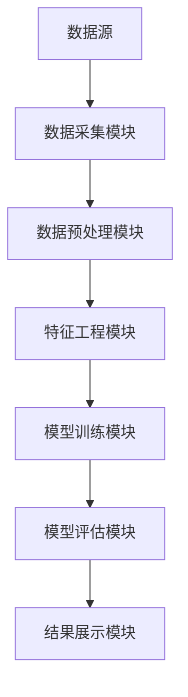

                 


# 机器学习预测公司自由现金流趋势

**关键词**：机器学习，自由现金流，时间序列分析，LSTM，ARIMA，财务预测，现金流预测

**摘要**：  
机器学习在预测公司自由现金流方面展现出了巨大的潜力。本文将从背景介绍、核心概念、算法原理、系统架构设计、项目实战到总结与展望，全面探讨如何利用机器学习技术预测公司自由现金流的趋势。通过对时间序列分析、常见机器学习算法（如ARIMA和LSTM）的详细讲解，以及系统架构设计和项目实战的指导，本文旨在为读者提供一套完整的解决方案，帮助他们理解和应用这些技术来提升财务预测的准确性。

---

## 第一部分：机器学习预测公司自由现金流趋势的背景与基础

### 第1章：自由现金流预测的背景与意义

#### 1.1 什么是自由现金流
自由现金流（Free Cash Flow，FCF）是指公司在支付了所有运营费用、税费以及再投资所需的资本支出后，仍然剩余的现金流量。它是评估企业财务健康状况的重要指标，也是企业价值评估的关键组成部分。自由现金流的预测对于企业制定财务决策、优化资本分配以及评估投资项目的可行性具有重要意义。

#### 1.2 机器学习与财务预测的结合
机器学习是一种人工智能技术，通过数据训练模型来识别模式和趋势，并能够自适应地改进预测结果。与传统的统计方法相比，机器学习在处理复杂数据和非线性关系方面具有显著优势。在财务预测领域，机器学习已经被广泛应用于股票价格预测、信用评分、风险评估等领域。然而，自由现金流的预测由于其复杂性和波动性，仍然面临诸多挑战。

#### 1.3 自由现金流预测中的机器学习优势
机器学习在自由现金流预测中的优势主要体现在以下几个方面：
1. **非线性关系建模**：机器学习能够捕捉数据中的非线性关系，这对于复杂金融数据的建模尤为重要。
2. **特征工程**：通过机器学习算法，可以自动提取和选择与目标变量相关的特征，减少人为干预。
3. **实时更新**：机器学习模型可以实时更新，以适应市场环境的变化，从而提高预测的准确性。

---

### 第2章：机器学习预测自由现金流的核心概念

#### 2.1 时间序列分析的基本原理
时间序列分析是一种统计方法，用于分析和预测随时间变化的数据。时间序列数据具有以下特点：
1. **趋势性**：数据可能表现出长期的趋势，如增长或下降。
2. **季节性**：数据可能在特定时间段内重复出现某种模式。
3. **随机性**：数据中可能包含无法用明确模式解释的噪声。

常见的时序分析方法包括ARIMA（自回归积分滑动平均模型）、Prophet、LSTM等。

#### 2.2 机器学习在时间序列预测中的应用
在时间序列预测中，机器学习算法可以分为传统方法和深度学习方法两类：
1. **传统方法**：
   - ARIMA：通过自回归和滑动平均的组合模型来预测未来的值。
   - SARIMA：在ARIMA的基础上加入了季节性成分，适用于具有周期性数据的情况。
2. **深度学习方法**：
   - LSTM（长短期记忆网络）：一种特殊的循环神经网络，能够有效捕捉时间序列中的长期依赖关系。
   - Transformer：近年来在自然语言处理领域表现出色，也在时间序列预测中得到了广泛应用。

---

## 第二部分：机器学习预测自由现金流的算法原理

### 第3章：时间序列预测的数学模型与算法

#### 3.1 ARIMA模型的数学公式
ARIMA模型由以下几个部分组成：
1. **自回归部分（AR）**：当前值与过去若干期的值相关。
2. **滑动平均部分（MA）**：当前值与过去若干期的随机误差相关。
3. **积分部分（I）**：为了处理非平稳序列，引入差分操作。

ARIMA模型的通用公式为：
$$
y_t = \phi_1 y_{t-1} + \phi_2 y_{t-2} + \dots + \phi_p y_{t-p} + \theta_1 \epsilon_{t-1} + \theta_2 \epsilon_{t-2} + \dots + \theta_q \epsilon_{t-q} + \epsilon_t
$$
其中，$p$ 是AR的阶数，$q$ 是MA的阶数。

#### 3.2 LSTM模型的原理与公式
LSTM通过引入记忆单元（Cell）和遗忘门（Forget Gate）、输入门（Input Gate）、输出门（Output Gate）来捕捉长期依赖关系。LSTM的核心公式包括：
1. **遗忘门**：决定哪些信息需要遗忘：
   $$
   f_t = \sigma(w_f \cdot [h_{t-1}, x_t] + b_f)
   $$
2. **输入门**：决定哪些新信息需要存储到记忆单元中：
   $$
   i_t = \sigma(w_i \cdot [h_{t-1}, x_t] + b_i)
   $$
3. **记忆单元**：更新记忆单元的值：
   $$
   c_t = f_t \cdot c_{t-1} + i_t \cdot \tilde{c}_t
   $$
   其中，$\tilde{c}_t = \tanh(w_c \cdot [h_{t-1}, x_t] + b_c)$。
4. **输出门**：决定哪些信息需要输出：
   $$
   o_t = \sigma(w_o \cdot [h_{t-1}, x_t] + b_o)
   $$
5. **最终输出**：
   $$
   h_t = o_t \cdot \tanh(c_t)
   $$

---

### 第4章：机器学习预测自由现金流的系统架构设计

#### 4.1 系统设计概述
系统的目标是通过机器学习算法预测公司自由现金流的趋势。系统主要包括以下几个功能模块：
1. **数据采集**：从数据库或公开数据源获取历史财务数据。
2. **数据预处理**：清洗数据，处理缺失值、异常值等。
3. **特征工程**：提取与自由现金流相关的特征。
4. **模型训练**：选择合适的算法训练预测模型。
5. **模型评估**：通过回测等方式评估模型的性能。
6. **结果展示**：将预测结果可视化，并提供相应的分析报告。

#### 4.2 系统架构图
以下是系统的架构设计图：



---

## 第三部分：机器学习预测自由现金流的项目实战

### 第5章：项目实战

#### 5.1 环境安装
首先需要安装以下Python库：
```bash
pip install numpy pandas scikit-learn tensorflow keras matplotlib
```

#### 5.2 数据预处理与特征选择
以下是一个简单的数据预处理示例：

```python
import pandas as pd
import numpy as np

# 假设df是包含历史财务数据的DataFrame
df = pd.read_csv('financial_data.csv')

# 删除缺失值
df.dropna(inplace=True)

# 标准化数据
from sklearn.preprocessing import StandardScaler
scaler = StandardScaler()
scaled_data = scaler.fit_transform(df[['revenue', 'expenses', 'net_income']])
```

#### 5.3 模型训练与调优
以下是一个使用LSTM模型训练的示例：

```python
from tensorflow.keras.models import Sequential
from tensorflow.keras.layers import LSTM, Dense, Dropout

# 模型定义
model = Sequential()
model.add(LSTM(128, input_shape=(timesteps, features)))
model.add(Dropout(0.2))
model.add(Dense(1))
model.compile(loss='mean_squared_error', optimizer='adam')

# 训练模型
model.fit(X_train, y_train, epochs=50, batch_size=32, validation_split=0.2)
```

---

## 第四部分：总结与展望

### 第6章：总结与展望

#### 6.1 总结
本文详细探讨了机器学习在预测公司自由现金流中的应用。通过介绍时间序列分析的基本原理、常见机器学习算法的优缺点，以及系统架构设计和项目实战，为读者提供了一套完整的解决方案。

#### 6.2 展望
尽管机器学习在自由现金流预测中已经取得了一些成果，但仍有许多挑战需要克服，例如如何处理数据的稀疏性、如何提高模型的解释性等。未来的研究可以进一步探索更先进的算法，如Transformer模型，并结合领域知识，提高预测的准确性和实用性。

---

通过以上内容，读者可以系统地了解机器学习在预测公司自由现金流中的应用，并能够实际操作相关项目，提升自身的技术水平和应用能力。

