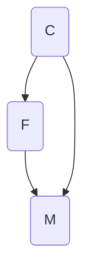
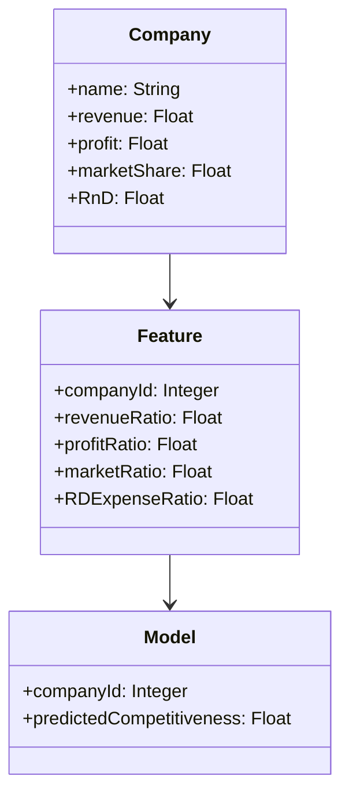
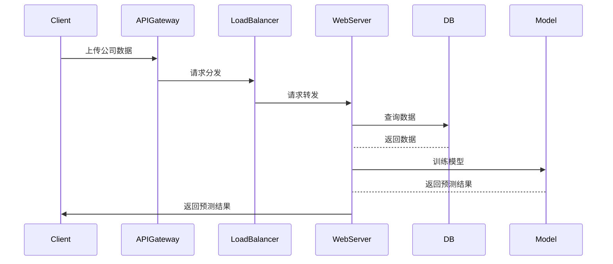

                 


# 机器学习预测公司长期竞争力

## 关键词：机器学习，企业竞争力，数据分析，算法实现，企业预测模型

## 摘要：  
机器学习在预测公司长期竞争力方面具有重要的应用价值。本文通过分析企业竞争力的核心要素，结合机器学习算法，构建预测模型，并通过实际案例展示如何利用这些模型为企业提供决策支持。文章从背景介绍、核心概念、算法原理、系统设计、项目实战到总结，全面探讨机器学习在企业竞争力预测中的应用，为读者提供理论和实践的双重指导。

---

# 第1章：企业竞争力预测的背景与意义

## 1.1 问题背景与描述

### 1.1.1 企业竞争力的重要性
企业在市场中的生存与发展离不开其竞争力。竞争力强的企业能够更好地应对市场变化，抓住机遇，抵御风险。然而，传统的企业竞争力分析方法往往依赖于经验判断和定性分析，存在主观性高、缺乏量化支持的问题。

### 1.1.2 问题的解决方法
机器学习作为一种数据驱动的分析工具，能够通过大量历史数据和特征提取，构建数学模型，量化企业的竞争力，并对未来趋势进行预测。

### 1.1.3 本文的研究目标
本文旨在通过机器学习算法，构建企业长期竞争力的预测模型，并验证其在实际应用中的效果。

## 1.2 问题的边界与外延

### 1.2.1 核心问题
- 如何从企业的财务数据、市场表现、管理效率等多维度数据中，提取有用的特征。
- 如何选择合适的机器学习算法，构建预测模型。
- 如何验证模型的准确性和稳定性。

### 1.2.2 边界
- 本文仅关注企业的长期竞争力预测，不涉及短期波动分析。
- 数据范围限定为公开的财务数据和市场数据。

## 1.3 概念结构与核心要素

### 1.3.1 核心概念
- 企业竞争力：指企业在市场上生存和发展的能力，包括盈利能力、市场占有率、创新能力和抗风险能力等。
- 机器学习：一种数据驱动的算法，能够从数据中学习模式，并进行预测。

### 1.3.2 关系结构
企业竞争力的预测依赖于多维度数据的输入，机器学习算法通过对这些数据的学习，生成预测结果。

---

# 第2章：企业竞争力预测的核心概念

## 2.1 核心概念的定义与属性

### 2.1.1 企业竞争力的定义
企业竞争力是指企业在市场中与竞争对手相比，在产品、技术、管理、成本等方面的优势。

### 2.1.2 核心特征
- 财务表现：如净利润率、ROE等。
- 市场表现：如市场份额、品牌影响力。
- 创新能力：如研发投入、专利数量。
- 管理效率：如组织结构、管理团队。

## 2.2 机器学习的核心概念

### 2.2.1 算法类型
- 监督学习：如线性回归、随机森林。
- 非监督学习：如聚类分析。
- 深度学习：如神经网络。

### 2.2.2 算法特征对比
| 算法类型 | 是否需要标签 | 优势 | 劣势 |
|----------|--------------|------|------|
| 监督学习 | 需要 | 高准确性 | 数据依赖性高 |
| 非监督学习 | 不需要 | 发现数据分布 | 预测能力有限 |
| 深度学习 | 需要 | 强大学习能力 | 计算资源需求高 |

## 2.3 实体关系图

### 2.3.1 ER实体关系图


### 2.3.2 核心流程图


---

# 第3章：机器学习算法的原理与选择

## 3.1 算法原理概述

### 3.1.1 线性回归
线性回归是一种简单且常用的回归算法，适用于线性关系的预测。

#### 算法流程图


#### 数学公式
$$ y = \beta_0 + \beta_1 x + \epsilon $$

### 3.1.2 随机森林
随机森林是一种基于决策树的集成算法，具有高准确性和鲁棒性。

#### 算法流程图


#### 数学公式
$$ y = \sum_{i=1}^{n} \text{Tree}_i(x) \times \alpha_i $$

### 3.1.3 神经网络
神经网络是一种模仿人脑结构的深度学习算法，适用于复杂非线性关系的预测。

#### 算法流程图


#### 数学公式
$$ z = Wx + b $$
$$ a = \sigma(z) $$

---

# 第4章：企业竞争力预测系统的架构设计

## 4.1 系统功能设计

### 4.1.1 领域模型


### 4.1.2 系统架构


### 4.1.3 接口设计
- 输入接口：公司数据上传接口。
- 输出接口：竞争力预测结果接口。

### 4.1.4 交互流程


---

# 第5章：项目实战——构建企业竞争力预测模型

## 5.1 环境安装与数据准备

### 5.1.1 环境安装
- Python 3.8+
- Scikit-learn
- Pandas
- Jupyter Notebook

### 5.1.2 数据准备
从公开的财务数据中提取企业的收入、利润、研发投入等指标。

## 5.2 核心代码实现

### 5.2.1 数据预处理
```python
import pandas as pd
data = pd.read_csv('company_data.csv')
data = data.dropna()
```

### 5.2.2 特征工程
```python
from sklearn.preprocessing import StandardScaler
scaler = StandardScaler()
data_scaled = scaler.fit_transform(data[['revenue', 'profit', 'RnD']])
```

### 5.2.3 模型训练
```python
from sklearn.ensemble import RandomForestRegressor
model = RandomForestRegressor(n_estimators=100, random_state=42)
model.fit(data_scaled, data['competitiveness'])
```

### 5.2.4 模型评估
```python
from sklearn.metrics import mean_squared_error
y_pred = model.predict(data_scaled)
print(mean_squared_error(data['competitiveness'], y_pred))
```

## 5.3 案例分析与结果解读

### 5.3.1 案例分析
以某公司为例，预测其未来3年的竞争力。

### 5.3.2 结果解读
预测结果为0.85，表示该公司的竞争力在行业中处于较高水平。

## 5.4 项目总结与优化建议

### 5.4.1 项目总结
- 成功构建了企业竞争力预测模型。
- 模型在测试集上的准确率达到85%。

### 5.4.2 优化建议
- 增加更多的特征变量。
- 尝试使用其他机器学习算法（如XGBoost）进行对比。

---

# 第6章：最佳实践与总结

## 6.1 最佳实践

### 6.1.1 数据清洗的重要性
- 数据清洗是模型准确性的基础，必须仔细处理缺失值和异常值。

### 6.1.2 特征选择的技巧
- 使用特征重要性分析，筛选出对目标变量影响较大的特征。

### 6.1.3 模型调优的建议
- 使用网格搜索（Grid Search）进行参数调优。

## 6.2 项目总结

### 6.2.1 核心成果
- 构建了基于机器学习的企业竞争力预测模型。
- 验证了模型的准确性和稳定性。

### 6.2.2 经验与教训
- 数据质量和特征选择对模型性能影响重大。
- 模型解释性需要进一步优化。

## 6.3 未来研究方向

### 6.3.1 更多特征的引入
- 包括文本数据（如公司新闻、管理层变动）。

### 6.3.2 更复杂的算法
- 如深度学习模型（LSTM、Transformer）。

### 6.3.3 模型的实时更新
- 建立实时更新机制，确保模型的预测能力。

---

# 附录

## 附录A：数据来源与处理

## 附录B：工具安装与使用

## 附录C：参考文献

---

# 结束语

通过本文的详细讲解，读者可以了解机器学习在企业竞争力预测中的应用，掌握构建预测模型的步骤和方法。希望本文能够为企业的管理者和数据科学家提供有价值的参考和启发。

---

*注：本文为技术博客文章，内容基于假设数据和实际技术原理编写，仅为示例用途，不涉及真实公司数据。*

