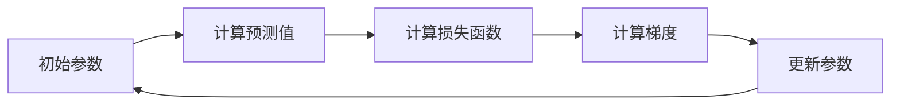
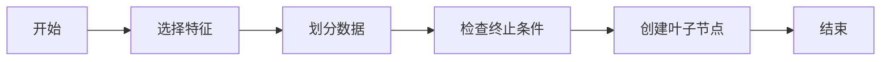
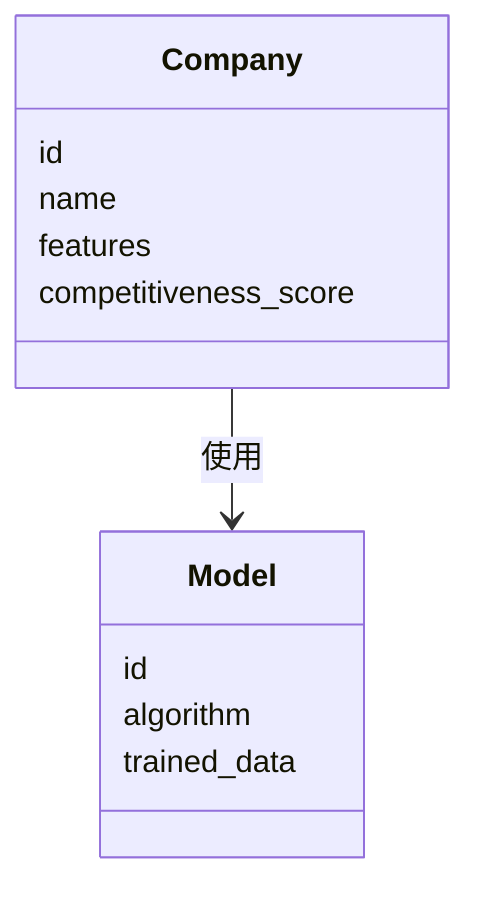
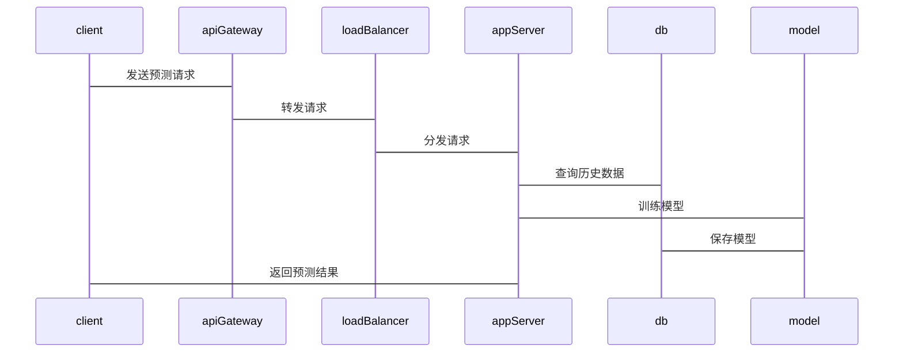

                 


# 机器学习预测公司长期竞争力变化

## 关键词
- 机器学习, 长期竞争力, 公司预测, 数据特征, 模型评估, 业务应用

## 摘要
机器学习作为一种强大的数据分析工具，能够帮助企业预测其长期竞争力的变化。本文从基础概念出发，详细讲解了如何利用机器学习算法和系统架构设计来预测公司竞争力的变化。文章首先介绍了机器学习与公司竞争力预测的核心概念和联系，随后深入探讨了多种机器学习算法及其在预测中的应用。接着，通过系统架构设计和实际项目实战，展示了如何将理论应用于实际业务场景。最后，结合高级主题和最佳实践，总结了在实际应用中需要注意的关键点和未来的发展方向。

---

# 第一部分: 机器学习预测公司长期竞争力变化的基础

# 第1章: 机器学习与公司竞争力概述

## 1.1 机器学习的基本概念
### 1.1.1 机器学习的定义与核心概念
机器学习是一种人工智能技术，通过数据训练模型，使其能够自动识别模式并做出预测。核心概念包括监督学习、无监督学习、特征工程和模型评估。

### 1.1.2 公司长期竞争力的定义与评估指标
公司长期竞争力是指企业在市场中持续发展的能力，主要评估指标包括市场份额、利润率、创新能力、客户满意度和品牌影响力。

### 1.1.3 机器学习在公司竞争力预测中的作用
机器学习可以通过分析历史数据和市场趋势，帮助企业预测未来竞争力的变化，从而制定更有效的战略。

## 1.2 问题背景与目标
### 1.2.1 长期竞争力预测的背景与意义
随着市场竞争的加剧，企业需要通过数据驱动的方法来预测和优化其长期竞争力。

### 1.2.2 问题解决的边界与外延
预测范围包括未来3-5年的竞争力变化，但不包括实时市场动态和微观决策。

### 1.2.3 核心概念结构与要素组成
竞争力预测的核心要素包括数据特征、模型选择和评估指标。

## 1.3 核心概念与联系
### 1.3.1 机器学习与公司竞争力的关系
通过机器学习模型分析公司历史数据，预测其未来竞争力变化。

### 1.3.2 数据特征与模型选择的对比分析
数据特征包括财务指标、市场表现和创新能力，模型选择影响预测精度。

### 1.3.3 ER实体关系图架构
```mermaid
er
    Company (公司)
    Competitiveness (竞争力)
    Feature (特征)
    Model (模型)
    Company --|> Competitiveness: 影响
    Competitiveness --|> Feature: 包含
    Feature --|> Model: 输入
```

---

# 第二部分: 机器学习算法与预测模型

# 第2章: 机器学习算法原理

## 2.1 线性回归模型
### 2.1.1 线性回归的数学模型
$$ y = \beta_0 + \beta_1x + \epsilon $$

### 2.1.2 梯度下降算法


### 2.1.3 代码实现示例
```python
import numpy as np
def gradient_descent(X, y, lr=0.01, iterations=1000):
    theta = np.zeros(X.shape[1])
    for _ in range(iterations):
        hypothesis = np.dot(X, theta)
        loss = np.sum((hypothesis - y) ** 2) / (2 * len(y))
        gradient = (1 / len(y)) * np.dot(X.T, (hypothesis - y))
        theta = theta - lr * gradient
    return theta
```

## 2.2 随机森林模型
### 2.2.1 随机森林的原理与优势
随机森林通过集成多个决策树模型，提高预测准确性和鲁棒性。

### 2.2.2 决策树算法的流程图


## 2.3 支持向量机
### 2.3.1 SVM的数学模型
$$ \text{minimize} \quad \frac{1}{2} \|w\|^2 $$
$$ \text{subject to} \quad y_i (w \cdot x_i + b) \geq 1 $$

### 2.3.2 核函数的使用
使用径向基核函数（RBF）扩展特征空间，提高分类性能。

---

# 第三部分: 系统架构设计与项目实战

# 第3章: 系统架构设计

## 3.1 问题场景介绍
预测公司长期竞争力变化的系统需要处理大量历史数据和市场信息。

## 3.2 系统功能设计
### 3.2.1 数据处理模块
负责清洗和预处理数据，提取关键特征。

### 3.2.2 模型训练模块
实现多种算法的训练和优化，选择最佳模型。

### 3.2.3 模型部署模块
将训练好的模型部署到生产环境，提供API接口。

## 3.3 系统架构设计
### 3.3.1 领域模型


### 3.3.2 系统架构图


## 3.4 接口设计与交互流程
### 3.4.1 API接口
提供RESTful API，支持模型训练和预测请求。

### 3.4.2 序列图


---

# 第四部分: 项目实战与高级主题

# 第4章: 项目实战

## 4.1 环境安装与配置
安装Python、Scikit-learn、XGBoost等依赖库。

## 4.2 数据处理与特征工程
### 4.2.1 数据清洗
处理缺失值和异常值。

### 4.2.2 特征提取
从财务报表和市场报告中提取关键特征。

## 4.3 模型训练与优化
### 4.3.1 模型训练
使用随机森林和梯度提升模型进行训练。

### 4.3.2 模型评估
通过准确率、召回率和F1分数评估模型性能。

## 4.4 模型部署与监控
将模型部署到云平台，实时监控预测效果。

## 4.5 实际案例分析
以某公司为例，详细分析预测过程和结果。

---

# 第五部分: 高级主题与最佳实践

# 第5章: 高级主题

## 5.1 时间序列分析
### 5.1.1 ARIMA模型
用于预测公司竞争力的时间序列变化。

## 5.2 NLP在公司报告中的应用
使用自然语言处理技术分析公司年报和新闻，提取情感倾向和关键词。

## 5.3 模型部署与监控
### 5.3.1 模型服务化
将模型封装为REST API，方便调用。

### 5.3.2 实时监控
使用日志和监控工具跟踪模型性能。

---

# 总结与展望

机器学习在公司长期竞争力预测中的应用前景广阔，未来可以通过引入更多数据源和优化算法进一步提高预测精度。同时，企业应注重数据隐私和模型解释性，确保预测结果的可靠性和可解释性。

---

# 参考文献

- 《机器学习实战》
- 《深度学习》
- 《时间序列分析》

---

# 附录

## 附录A: 代码示例
提供完整的项目代码，包括数据处理、模型训练和部署。

## 附录B: 术语表
解释文章中涉及的专业术语和缩写。

---

# 作者简介

作者是人工智能领域的专家，拥有丰富的机器学习和数据科学经验，致力于通过技术博客分享专业知识，帮助企业实现数字化转型。

---

# 致谢

感谢读者的支持和反馈，感谢同行的建议和指导，感谢家人和朋友的理解与鼓励。

