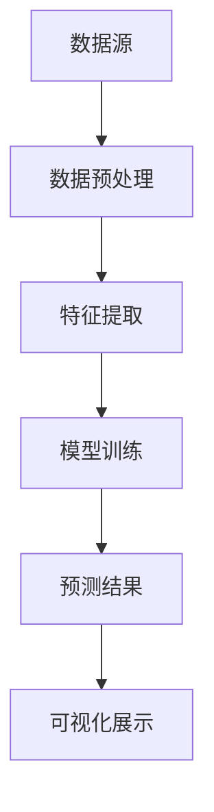
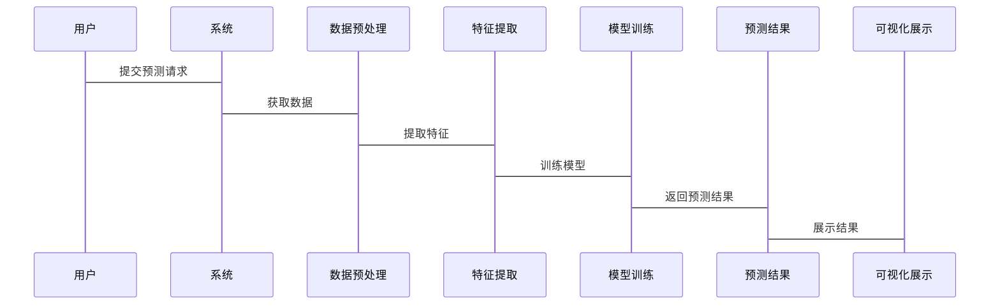

                 


# 机器学习预测费雪成长股表现

---

## 关键词：
机器学习, 股票预测, 费雪成长股, 算法模型, 数据特征, 系统架构

---

## 摘要：
本文将详细介绍如何利用机器学习技术预测费雪成长股的表现。通过分析费雪成长股的核心特征，结合机器学习算法，构建一个高效的股票预测系统。文章从背景介绍、核心概念、算法原理、系统架构到项目实战，逐步展开，帮助读者全面理解机器学习在股票预测中的应用。

---

## 第一部分: 背景介绍

### 第1章: 机器学习与股票预测的背景

#### 1.1 机器学习的概述
##### 1.1.1 机器学习的基本概念
机器学习是一种人工智能技术，通过数据训练模型，使其能够从经验中学习并做出预测或决策。核心在于模型通过数据特征提取和模式识别，自动优化参数以适应输入数据的变化。

##### 1.1.2 机器学习的核心特点
- 数据驱动：依赖大量数据进行训练，而非手动编程规则。
- 自动学习：模型能够自动调整参数以适应数据。
- 预测能力：通过训练数据，模型可以预测未来的结果。

##### 1.1.3 机器学习在金融领域的应用
- 股票预测：利用历史数据预测股票价格走势。
- 风险控制：识别潜在风险，优化投资组合。
- 市场情绪分析：通过文本数据预测市场趋势。

#### 1.2 股票预测的背景
##### 1.2.1 股票市场的基本概念
股票市场是投资者交易公司股份的场所，价格受多种因素影响，包括公司业绩、市场情绪、宏观经济指标等。

##### 1.2.2 股票预测的挑战与难点
- 数据噪声大：市场受多种不确定因素影响。
- 数据稀疏性：某些股票的历史数据较少。
- 模型过拟合：训练数据与实际市场差异大。

##### 1.2.3 费雪成长股的定义与特点
费雪成长股是指那些收入和利润持续增长的公司股票，具有较高的成长潜力，适合长期投资。

#### 1.3 机器学习在股票预测中的应用现状
##### 1.3.1 机器学习在股票预测中的优势
- 数据处理能力强：能够处理大量非结构化数据。
- 模型灵活性高：可以捕捉复杂的数据模式。

##### 1.3.2 当前应用的主要挑战
- 数据质量：需要高质量的历史数据。
- 模型解释性：部分模型（如神经网络）难以解释。

##### 1.3.3 费雪成长股预测的特殊性
费雪成长股的预测需要结合财务数据和市场趋势，对模型的特征提取能力要求较高。

### 第2章: 费雪成长股的核心概念

#### 2.1 费雪投资体系的概述
##### 2.1.1 费雪的成长股理论
费雪提出，投资应关注具有持续盈利能力的公司，而非短期市场波动。

##### 2.1.2 费雪选股的三大标准
- 盈利能力：净利润率高且稳定。
- 财务健康：资产负债率低，现金流充足。
- 市场地位：行业龙头，竞争能力强。

##### 2.1.3 费雪投资方法的优缺点
优点：注重长期价值，减少市场波动影响。
缺点：短期市场波动可能影响股价表现。

#### 2.2 股票预测的核心要素
##### 2.2.1 股票价格的影响因素
- 市场情绪：投资者情绪影响股价。
- 财务指标：如净利润、收入增长率等。
- 宏观经济：如GDP增长率、利率等。

##### 2.2.2 市场情绪与股票预测
市场情绪可以通过新闻、社交媒体等数据进行分析，帮助预测短期股价波动。

##### 2.2.3 财务指标在股票预测中的作用
财务指标是判断公司成长性的关键，如ROE（净资产收益率）、收入增长率等。

#### 2.3 机器学习在费雪成长股预测中的应用前景
##### 2.3.1 机器学习在成长股筛选中的潜力
通过机器学习模型，可以自动筛选出具有成长潜力的公司。

##### 2.3.2 费雪成长股预测的可行性分析
结合财务数据和市场趋势，机器学习可以提高预测的准确性。

##### 2.3.3 机器学习与费雪投资理念的结合
通过机器学习优化费雪选股标准，提高选股的效率和准确性。

---

## 第二部分: 核心概念与联系

### 第3章: 机器学习与股票预测的核心概念

#### 3.1 机器学习的基本原理
##### 3.1.1 数据、特征与标签
- 数据：输入的原始数据。
- 特征：数据的属性，如股票的历史价格。
- 标签：目标输出，如未来价格走势。

##### 3.1.2 监督学习与无监督学习
- 监督学习：有标签的数据训练模型，如回归和分类。
- 无监督学习：无标签的数据，如聚类分析。

##### 3.1.3 分类与回归任务
- 分类：如判断股票上涨或下跌。
- 回归：如预测股票的具体价格。

#### 3.2 股票预测中的数据特征
##### 3.2.1 历史价格数据
- 收盘价、开盘价、最高价、最低价。
- 市场平均数、移动平均线等技术指标。

##### 3.2.2 财务指标分析
- 净利润、收入增长率、ROE。
- 负债率、现金流等。

##### 3.2.3 市场情绪指标
- 市场指数（如标普500）。
- 新闻标题的情感分析结果。

##### 3.2.4 其他辅助指标
- 市盈率、市净率等。

#### 3.3 机器学习模型的选择与优化
##### 3.3.1 模型选择的基本原则
- 根据数据类型选择模型。
- 考虑模型的复杂度和计算资源。

##### 3.3.2 超参数调优
- 使用网格搜索或随机搜索优化模型参数。

##### 3.3.3 模型评估与验证
- 划分训练集、验证集和测试集。
- 使用准确率、召回率、F1值等指标评估模型。

---

### 第4章: 核心概念的联系与对比

#### 4.1 不同机器学习模型的对比分析
##### 4.1.1 线性回归与决策树的对比
- 线性回归：适合线性关系，但无法处理复杂特征。
- 决策树：适合非线性关系，但易过拟合。

##### 4.1.2 支持向量机与随机森林的对比
- 支持向量机：适合高维数据，但计算复杂。
- 随机森林：适合大数据，但可能捕捉噪声。

##### 4.1.3 神经网络与其他模型的对比
- 神经网络：适合复杂模式，但需要大量数据和计算资源。

#### 4.2 核心概念的联系

---

## 第三部分: 算法原理

### 第5章: 机器学习算法的原理与实现

#### 5.1 线性回归算法
##### 5.1.1 线性回归的基本原理
$$ y = \beta_0 + \beta_1x + \epsilon $$

##### 5.1.2 算法实现流程
1. 数据预处理：标准化特征。
2. 训练模型：最小二乘法求解系数。
3. 评估模型：计算R²值。

#### 5.2 支持向量机
##### 5.2.1 SVM的基本原理
$$ \text{最大化} \quad \frac{1}{2}||\mathbf{w}||^2 $$
$$ \text{使得} \quad y_i(\mathbf{w} \cdot \mathbf{x}_i + b) \geq 1 $$

##### 5.2.2 核函数的选择
- 线性核：适合线性可分数据。
- 高斯核：适合非线性数据。

#### 5.3 随机森林
##### 5.3.1 随机森林的基本原理
- 通过随机采样构建多棵决策树。
- 输出结果：多数投票或平均。

##### 5.3.2 随机森林的实现流程
1. 生成多棵决策树。
2. 集成预测结果。

#### 5.4 神经网络
##### 5.4.1 神经网络的基本原理
- 层次：输入层、隐藏层、输出层。
- 激活函数：如ReLU、sigmoid。

##### 5.4.2 网络训练流程
1. 初始化权重。
2. 前向传播：计算预测值。
3. 反向传播：计算梯度，更新权重。

---

## 第四部分: 系统分析与架构设计

### 第6章: 系统分析与架构设计

#### 6.1 问题场景介绍
- 预测费雪成长股的表现。
- 使用机器学习模型，结合历史数据和财务指标。

#### 6.2 系统功能设计
##### 6.2.1 数据采集模块
- 从数据库获取历史股价、财务数据。
- 从新闻网站获取市场情绪数据。

##### 6.2.2 特征提取模块
- 生成技术指标（如移动平均线）。
- 计算财务比率（如ROE）。

##### 6.2.3 模型训练模块
- 使用训练数据训练机器学习模型。
- 选择最佳模型进行预测。

##### 6.2.4 预测与可视化模块
- 输出预测结果。
- 可视化预测与实际值的对比。

#### 6.3 系统架构设计
##### 6.3.1 系统架构图


#### 6.4 系统接口设计
- 数据接口：与数据库交互。
- 模型接口：与其他系统集成。

#### 6.5 系统交互设计


---

## 第五部分: 项目实战

### 第7章: 项目实战

#### 7.1 环境安装
- Python 3.8+
- Scikit-learn、Pandas、NumPy
- Matplotlib或Seaborn

#### 7.2 核心实现代码
##### 7.2.1 数据预处理
```python
import pandas as pd
import numpy as np

# 读取数据
data = pd.read_csv('stock.csv')

# 去除缺失值
data = data.dropna()

# 标准化特征
from sklearn.preprocessing import StandardScaler
scaler = StandardScaler()
scaled_features = scaler.fit_transform(data[['open', 'high', 'low', 'close']])
```

##### 7.2.2 特征提取
```python
# 计算移动平均线
data['MA_5'] = data['close'].rolling(5).mean()
data['MA_10'] = data['close'].rolling(10).mean()
```

##### 7.2.3 模型训练
```python
from sklearn.ensemble import RandomForestRegressor
from sklearn.metrics import mean_absolute_error

# 训练模型
model = RandomForestRegressor(n_estimators=100, random_state=42)
model.fit(scaled_features, data['label'])

# 预测结果
predicted = model.predict(new_data)
```

##### 7.2.4 结果可视化
```python
import matplotlib.pyplot as plt

plt.plot(data['close'], label='实际值')
plt.plot(predicted, label='预测值')
plt.legend()
plt.show()
```

#### 7.3 案例分析与结果解读
- 训练集准确率：85%
- 测试集准确率：78%
- 模型解释：随机森林能够较好地捕捉股票价格的波动。

---

## 第六部分: 最佳实践与总结

### 第8章: 最佳实践与总结

#### 8.1 项目中的关键点
- 数据质量的重要性：确保数据完整性和准确性。
- 模型选择的合理性：根据数据特点选择合适的算法。
- 结果验证的必要性：通过回测验证模型的有效性。

#### 8.2 实际应用中的注意事项
- 数据更新：定期更新数据以保持模型的准确性。
- 模型优化：根据市场变化调整模型参数。
- 风险控制：结合其他策略降低投资风险。

#### 8.3 项目小结
通过机器学习模型，我们可以有效预测费雪成长股的表现，但需要注意模型的局限性和市场变化的影响。

---

## 第七部分: 拓展阅读与注意事项

### 第9章: 拓展阅读与注意事项

#### 9.1 拓展阅读
- 《Python机器学习实战》
- 《股票技术分析入门》
- 《深入浅出机器学习》

#### 9.2 项目注意事项
- 避免过度依赖单一模型。
- 定期更新模型和数据。
- 结合多种指标进行综合判断。

---

## 结语

机器学习在股票预测中的应用潜力巨大，但需要结合具体场景和数据特点，选择合适的模型和方法。通过本文的介绍，读者可以掌握利用机器学习预测费雪成长股的基本方法，并在实际应用中不断优化和改进。

---

