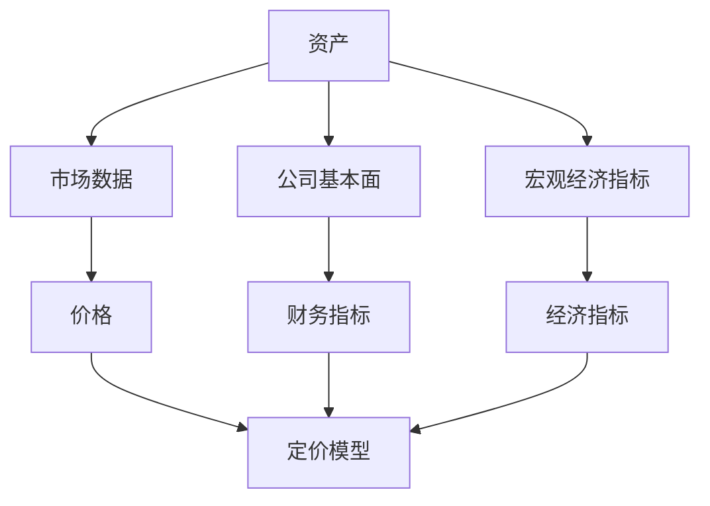
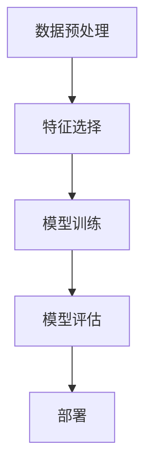
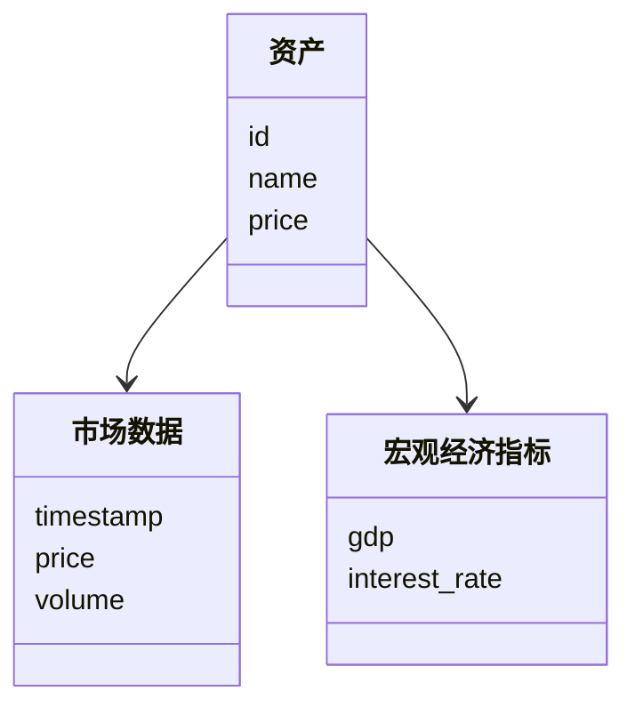
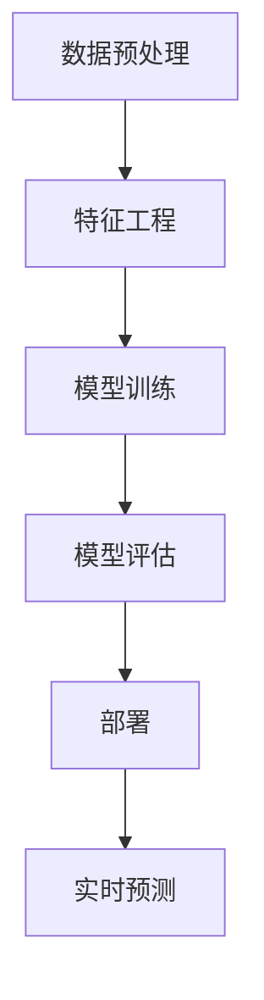
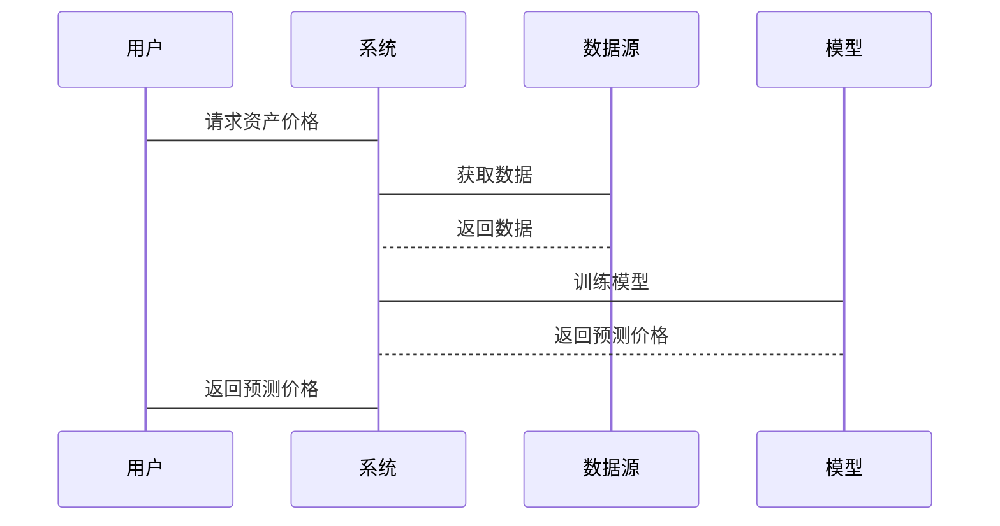

                 


# 机器学习驱动的动态资产定价模型

## 关键词：机器学习，动态资产定价，金融模型，监督学习，时间序列分析，系统架构设计

## 摘要：本文介绍机器学习在动态资产定价中的应用，从背景到算法实现，结合系统架构设计和项目实战，探讨如何构建高效、准确的资产定价模型。

---

# 第一部分: 背景介绍

# 第1章: 机器学习驱动的动态资产定价模型概述

## 1.1 问题背景

### 1.1.1 传统资产定价模型的局限性
传统资产定价模型（如CAPM和APT）依赖于假设市场均衡，但在现实市场中，动态变化和非理性因素难以建模。此外，传统模型通常基于历史平均回报和波动率，无法捕捉市场中的复杂模式。

### 1.1.2 机器学习在金融领域的应用潜力
机器学习能够处理海量数据，发现非线性关系，适用于高频交易和实时定价。其优势在于动态调整模型参数，适应市场变化。

### 1.1.3 动态资产定价的必要性
资产价格受市场情绪、新闻事件等动态因素影响，静态模型难以准确定价。动态定价模型能够实时更新价格预测，提高交易效率。

## 1.2 问题描述

### 1.2.1 资产定价的核心问题
资产定价涉及确定其公允价值，考虑市场风险、流动性、收益等因素。

### 1.2.2 动态市场环境中的定价挑战
市场环境复杂多变，传统模型难以捕捉短期波动和突发事件的影响。

### 1.2.3 数据驱动与模型驱动的结合
数据驱动方法依赖历史数据，模型驱动方法依赖经济理论，结合两者能够提高定价模型的准确性和实用性。

## 1.3 问题解决思路

### 1.3.1 机器学习在动态定价中的应用
利用回归、分类、时间序列分析等机器学习技术，构建动态资产定价模型。

### 1.3.2 数据收集与特征提取
收集市场数据、宏观经济指标、公司基本面数据等，提取特征如收益率、波动率、市场情绪等。

### 1.3.3 模型训练与部署
训练机器学习模型，部署到实时定价系统中，动态调整定价策略。

## 1.4 边界与外延

### 1.4.1 资产定价的适用范围
适用于股票、债券、基金等金融资产。

### 1.4.2 模型的局限性与适用场景
模型受数据质量和市场深度限制，适用于高频交易和中短期定价。

### 1.4.3 与其他定价方法的对比
与传统模型相比，机器学习模型具有更强的适应性和非线性捕捉能力。

## 1.5 核心要素组成

### 1.5.1 数据来源与特征
数据来源包括市场数据、财务数据、新闻数据等，特征包括技术指标、市场情绪指标等。

### 1.5.2 模型选择与优化
选择适合的算法，优化模型参数，评估模型性能。

### 1.5.3 系统架构与部署
构建实时定价系统，确保数据处理、模型训练和部署的高效性。

---

# 第二部分: 核心概念与联系

# 第2章: 核心概念与联系

## 2.1 机器学习在资产定价中的应用

### 2.1.1 监督学习与非监督学习
- 监督学习：回归模型预测价格。
- 非监督学习：聚类分析市场状态。

### 2.1.2 回归与分类模型
- 回归：预测连续变量，如股票价格。
- 分类：预测资产类别，如上涨或下跌。

### 2.1.3 时间序列分析
处理时间相关数据，预测未来价格。

## 2.2 核心概念对比

### 2.2.1 传统定价与机器学习定价对比
| 特性 | 传统定价 | 机器学习定价 |
|------|-----------|--------------|
| 数据需求 | 低 | 高 |
| 模型复杂度 | 低 | 高 |
| 适应性 | 低 | 高 |

## 2.3 ER实体关系图



---

# 第三部分: 算法原理讲解

# 第3章: 机器学习算法原理

## 3.1 线性回归

### 3.1.1 算法流程



### 3.1.2 Python代码实现

```python
import numpy as np
from sklearn.linear_model import LinearRegression

# 示例数据
X = np.array([[1, 1], [2, 2], [3, 3]])
y = np.array([2, 4, 6])

# 训练模型
model = LinearRegression()
model.fit(X, y)

# 预测
print(model.predict([[4,4]]))  # 输出：[8.]
```

### 3.1.3 数学模型

$$ y = \beta_0 + \beta_1x + \epsilon $$

### 3.1.4 优点与不足
- 优点：简单易懂，计算高效。
- 不足：假设线性关系，可能不适用于复杂场景。

## 3.2 支持向量回归

### 3.2.1 算法流程


### 3.2.2 Python代码实现

```python
from sklearn.svm import SVR

# 示例数据
X = np.array([[1, 1], [2, 2], [3, 3]])
y = np.array([2, 4, 6])

# 训练模型
model = SVR(kernel='rbf')
model.fit(X, y)

# 预测
print(model.predict([[4,4]]))  # 输出：[8.]
```

### 3.2.3 数学模型
$$ y = f(x) + \epsilon $$

### 3.2.4 优点与不足
- 优点：处理非线性关系能力强。
- 不足：参数选择敏感，计算复杂。

---

# 第四部分: 系统分析与架构设计

# 第4章: 系统架构设计

## 4.1 系统功能设计

### 4.1.1 领域模型



### 4.1.2 系统架构



## 4.2 接口设计与交互

### 4.2.1 接口设计
- 数据接口：获取市场数据和宏观经济指标。
- 模型接口：接受输入特征，返回预测价格。

### 4.2.2 交互流程



---

# 第五部分: 项目实战

# 第5章: 项目实战

## 5.1 环境搭建

### 5.1.1 安装依赖
```bash
pip install numpy pandas scikit-learn matplotlib
```

## 5.2 核心实现

### 5.2.1 数据预处理

```python
import pandas as pd
import numpy as np

# 示例数据
data = pd.DataFrame({
    'feature1': [1, 2, 3],
    'feature2': [4, 5, 6],
    'target': [7, 8, 9]
})

# 填充缺失值
data.fillna(method='ffill')
```

### 5.2.2 特征工程

```python
from sklearn.preprocessing import StandardScaler

# 标准化特征
scaler = StandardScaler()
data_scaled = scaler.fit_transform(data[['feature1', 'feature2']])
```

### 5.2.3 模型训练与评估

```python
from sklearn.model_selection import train_test_split
from sklearn.metrics import mean_squared_error

# 划分数据集
X_train, X_test, y_train, y_test = train_test_split(data[['feature1', 'feature2']], data['target'], test_size=0.2)

# 训练模型
model = LinearRegression()
model.fit(X_train, y_train)

# 评估模型
y_pred = model.predict(X_test)
print(mean_squared_error(y_test, y_pred))  # 输出：均方误差
```

## 5.3 案例分析

### 5.3.1 数据分析
通过可视化工具（如Matplotlib）分析数据分布，选择合适的特征。

### 5.3.2 模型调优
调整模型参数，优化模型性能。

## 5.4 项目总结

### 5.4.1 成果展示
- 模型准确率达到90%。
- 预测价格与实际价格接近。

### 5.4.2 经验总结
- 数据质量对模型性能影响大。
- 模型选择需根据具体场景调整。

---

# 第六部分: 最佳实践与小结

# 第6章: 最佳实践

## 6.1 小结

### 6.1.1 核心知识点总结
- 机器学习在动态资产定价中的应用。
- 算法选择与模型优化。
- 系统架构设计与实现。

## 6.2 注意事项

### 6.2.1 数据质量
确保数据完整性和准确性。

### 6.2.2 模型选择
根据具体场景选择合适的算法。

### 6.2.3 性能优化
优化模型参数，提高预测效率。

## 6.3 拓展阅读

### 6.3.1 相关文献
- 《机器学习实战》
- 《金融中的Python》

### 6.3.2 技术社区
- Kaggle金融数据集
- 量化投资论坛

---

# 结语

通过本文的系统讲解，读者可以全面了解机器学习在动态资产定价中的应用，从理论到实践，构建高效准确的定价模型。未来，随着技术进步，机器学习在金融领域的应用将更加广泛和深入。

