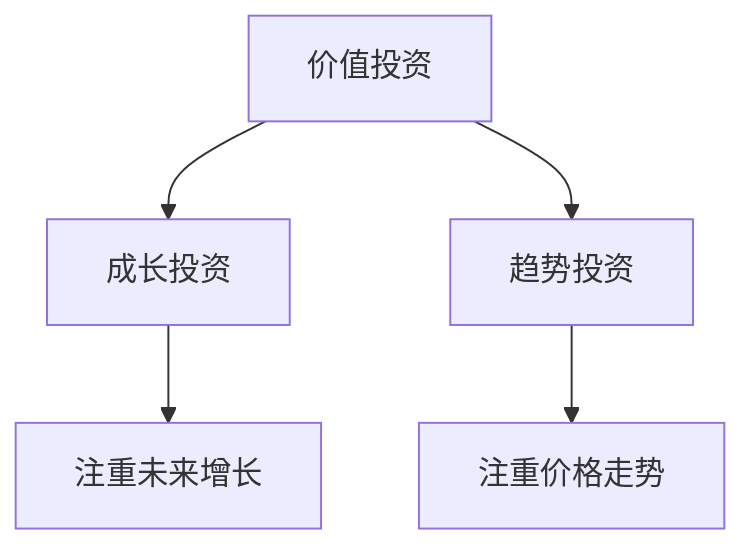
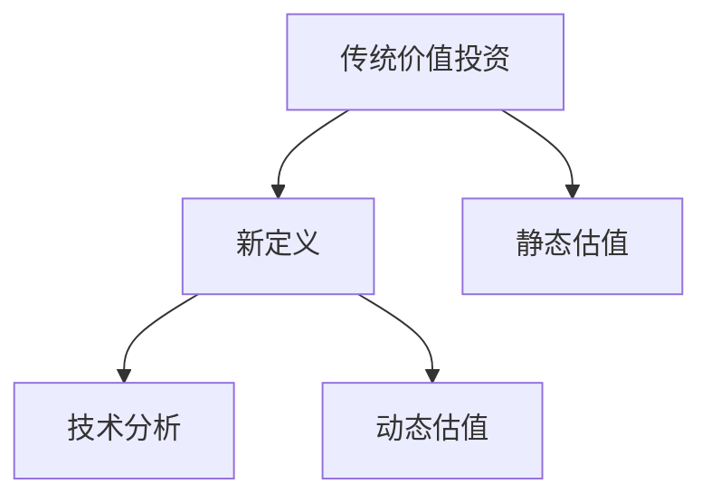
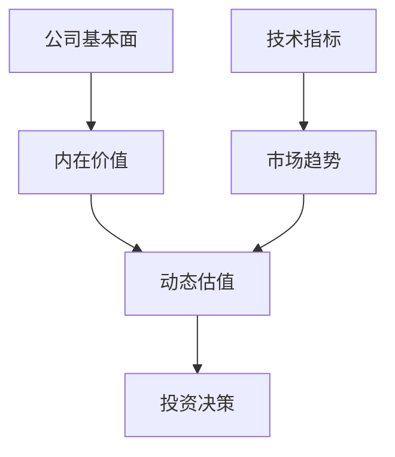
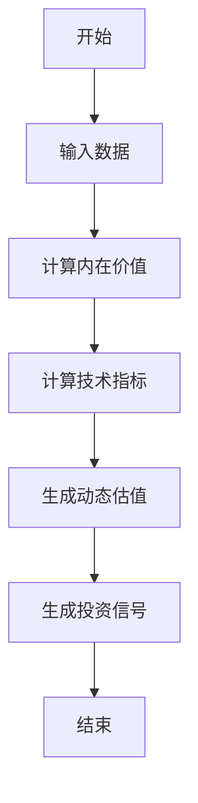
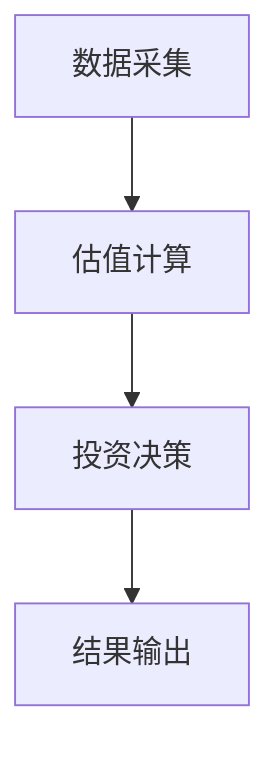
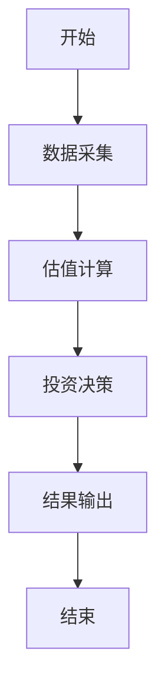
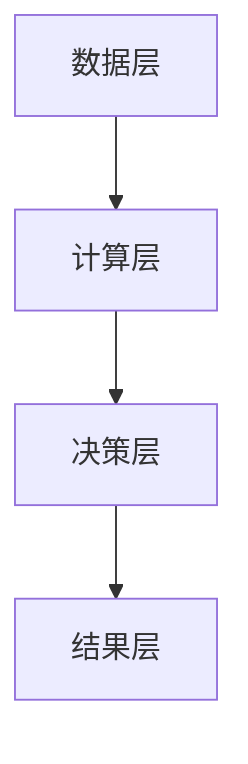
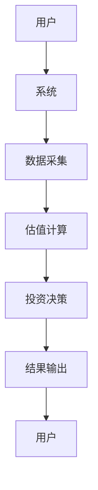

                 


# 杰里米·格兰瑟姆的价值投资新定义

> 关键词：价值投资、杰里米·格兰瑟姆、投资新定义、技术分析、系统架构、算法原理

> 摘要：价值投资作为一种经典的金融投资策略，经过时间的检验，不断演变和创新。杰里米·格兰瑟姆作为价值投资领域的权威人物，提出了新的定义，将传统价值投资的理念与现代技术分析相结合，为投资领域带来了新的视角和方法。本文从价值投资的背景演变、核心概念、算法原理、系统架构到项目实战，全面解读杰里米·格兰瑟姆的价值投资新定义，探讨其在现代投资实践中的应用和意义。

---

## 第一部分: 价值投资的背景与演变

### 第1章: 价值投资的起源与传统定义

#### 1.1 价值投资的起源
- **1.1.1 投资学的起源与发展**
  - 介绍投资学的基本概念和历史背景，探讨投资在人类经济活动中的重要性。
  - 引出价值投资的概念，说明其在投资学中的地位和作用。

- **1.1.2 价值投资的核心理念**
  - 解释价值投资的基本原则，如安全边际、内在价值等。
  - 强调价值投资注重基本面分析，寻找被市场低估的投资标的。

- **1.1.3 格兰瑟姆在价值投资中的地位**
  - 介绍格兰瑟姆在价值投资领域的主要贡献和影响力。
  - 强调其作为价值投资现代诠释者的重要性。

#### 1.2 传统价值投资的定义与特点
- **1.2.1 价值投资的基本原则**
  - 详细阐述价值投资的核心原则，如寻找市场低估的股票、关注企业的基本面等。
  - 对比其他投资策略（如成长投资、趋势投资）的特点。

- **1.2.2 价值投资的核心要素对比**
  - 列出价值投资与其他投资策略在目标、方法、风险控制等方面的对比表格。
  - 使用Mermaid图展示不同投资策略之间的关系。



- **1.2.3 传统价值投资的优缺点分析**
  - 分析传统价值投资的优点，如风险较低、收益稳定等。
  - 探讨其局限性，如对市场变化适应能力不足、计算复杂等。

#### 1.3 价值投资新定义的背景
- **1.3.1 当前市场环境的变化**
  - 介绍近年来金融市场的发展趋势，如科技股的崛起、量化交易的普及等。
  - 分析传统价值投资在新形势下面临的挑战。

- **1.3.2 格兰瑟姆对价值投资的创新**
  - 详细阐述格兰瑟姆对价值投资的改进，如引入技术分析、动态调整估值模型等。
  - 说明新定义的核心思想：将基本面分析与技术分析相结合。

- **1.3.3 新定义的必要性与意义**
  - 强调新定义在现代投资环境中的必要性，如应对市场波动、提高投资效率等。
  - 总结新定义对投资理论和实践的双重贡献。

---

## 第二部分: 价值投资新定义的核心概念

### 第2章: 价值投资新定义的理论框架

#### 2.1 格兰瑟姆价值投资新定义的内涵
- **2.1.1 新定义的核心要素**
  - 详细阐述新定义的核心要素，如动态估值、技术指标、风险控制等。
  - 对比传统价值投资，突出新定义的独特性。

- **2.1.2 新定义与传统定义的对比**
  - 使用对比表格展示新旧定义在目标、方法、策略上的差异。
  - 使用Mermaid图展示新旧定义的关系。



- **2.1.3 新定义的数学模型与公式**
  - 介绍新定义的数学模型，如动态估值公式、技术指标计算公式等。
  - 使用LaTeX公式展示核心模型：

$$
\text{动态估值} = \text{内在价值} \times \text{技术指标调整系数}
$$

#### 2.2 核心概念的联系与对比
- **2.2.1 核心概念属性特征对比表**
  - 列出传统价值投资与新定义在核心概念上的对比表格，如目标、方法、工具等。

- **2.2.2 实体关系图（Mermaid）**
  - 使用Mermaid图展示新定义中的实体关系，如公司基本面、技术指标、投资决策等。



#### 2.3 算法原理与数学模型
- **2.3.1 算法流程图（Mermaid）**
  - 使用Mermaid图展示新定义的算法流程，从数据输入到投资决策的全过程。



- **2.3.2 数学模型与公式**
  - 详细阐述算法的核心数学模型，如动态估值公式：

$$
\text{动态估值} = \text{内在价值} + \text{技术指标调整值}
$$

  - 举例说明算法的应用，如如何根据技术指标调整内在价值，生成买入或卖出信号。

---

## 第三部分: 价值投资新定义的系统架构

### 第3章: 价值投资新定义的系统架构设计

#### 3.1 系统功能设计
- **3.1.1 系统功能模块**
  - 介绍系统的功能模块，如数据采集、估值计算、投资决策等。
  - 使用Mermaid图展示系统功能模块之间的关系。



- **3.1.2 系统功能流程**
  - 使用Mermaid图展示系统从数据采集到结果输出的完整流程。



#### 3.2 系统架构设计
- **3.2.1 系统架构图（Mermaid）**
  - 使用Mermaid图展示系统的整体架构，如数据层、计算层、决策层等。



- **3.2.2 接口设计**
  - 详细描述系统各模块之间的接口，如数据采集接口、估值计算接口等。
  - 使用表格形式列出接口名称、输入输出格式、功能描述。

#### 3.3 系统交互设计
- **3.3.1 系统交互流程图（Mermaid）**
  - 使用Mermaid图展示系统与用户之间的交互流程。



---

## 第四部分: 价值投资新定义的项目实战

### 第4章: 项目实战与分析

#### 4.1 项目环境与安装
- **4.1.1 环境要求**
  - 列出项目所需的软件环境，如Python版本、第三方库（如numpy、pandas）等。
- **4.1.2 安装指南**
  - 提供详细的安装步骤，包括如何安装Python、配置开发环境等。

#### 4.2 核心实现
- **4.2.1 数据采集模块**
  - 提供Python代码示例，展示如何从金融数据源（如Yahoo Finance）获取数据。

```python
import pandas as pd
import yfinance as yf

data = yf.download('AAPL', start='2020-01-01', end='2023-01-01')
print(data.head())
```

- **4.2.2 估值计算模块**
  - 提供Python代码示例，展示如何计算股票的内在价值和动态估值。

```python
def calculate_intrinsic_value(stock_data, discount_rate):
    cash_flow = stock_data['Free Cash Flow'].sum()
    return cash_flow / (1 + discount_rate)
```

- **4.2.3 投资决策模块**
  - 提供Python代码示例，展示如何根据动态估值生成投资信号。

```python
def generate_signals(dynamic_valuation, market_price):
    if dynamic_valuation > market_price:
        return 'Buy'
    elif dynamic_valuation < market_price:
        return 'Sell'
    else:
        return 'Hold'
```

#### 4.3 项目分析与优化
- **4.3.1 实际案例分析**
  - 使用具体案例（如苹果公司）展示新定义的应用过程。
  - 对比传统价值投资与新定义在实际操作中的差异。
- **4.3.2 优化建议**
  - 总结项目中的优缺点，提出改进建议，如优化算法、改进系统架构等。

#### 4.4 小结与注意事项
- **4.4.1 小结**
  - 回顾项目的主要内容和成果。
  - 强调新定义在实际投资中的应用价值。
- **4.4.2 注意事项**
  - 提醒读者在实际操作中需要注意的问题，如数据的准确性、算法的适应性等。

---

## 第五部分: 总结与展望

### 第5章: 总结与展望

#### 5.1 总结
- **5.1.1 核心内容回顾**
  - 总结全文的核心内容，强调新定义的价值和意义。
- **5.1.2 投资新定义的现代意义**
  - 强调新定义在现代投资环境中的重要性，如应对市场波动、提高投资效率等。

#### 5.2 展望
- **5.2.1 未来发展方向**
  - 探讨价值投资新定义的未来发展方向，如与其他投资策略的结合、技术分析的进一步深化等。
- **5.2.2 对读者的建议**
  - 鼓励读者将新定义应用于实际投资中，持续关注市场变化和技术进步。

---

通过以上目录结构，我们可以全面、系统地解读杰里米·格兰瑟姆的价值投资新定义，从理论到实践，从算法到系统，为读者提供一个完整的价值投资新视角。

