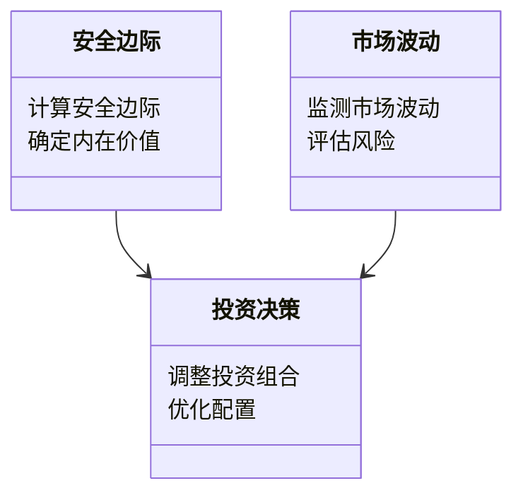
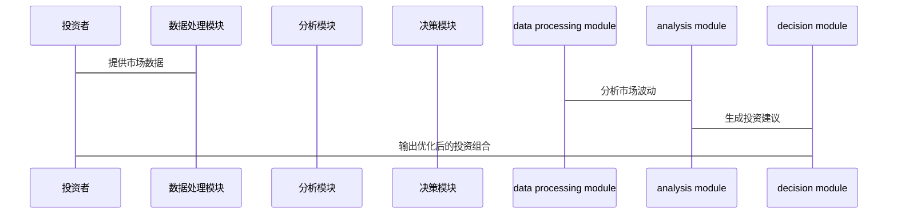

                 


# 《杰里米·格兰瑟姆的价值投资新思维》

> 关键词：价值投资，杰里米·格兰瑟姆，安全边际，内在价值，市场波动，风险管理，投资策略

> 摘要：本文深入探讨了杰里米·格兰瑟姆的价值投资理论及其新思维，分析了其核心概念、算法原理、数学模型和系统架构，并结合实际案例进行详细解读，总结了最佳实践和注意事项。

---

## 第一部分：价值投资基础

### 第1章：价值投资概述

#### 1.1 价值投资的定义与核心理念

##### 1.1.1 价值投资的定义
价值投资是一种基于对公司内在价值的评估，以低于其内在价值的价格买入并长期持有的投资策略。其核心在于寻找市场先生的错误定价。

##### 1.1.2 格兰瑟姆的价值投资核心理念
格兰瑟姆提出的价值投资理念包括：
- **安全边际**：买入价格应显著低于内在价值，以降低投资风险。
- **市场先生理论**：市场波动是投资者的朋友，而非敌人。
- **长期投资**：通过时间的积累实现财富增长。

##### 1.1.3 价值投资与传统投资的区别
| 特性 | 价值投资 | 传统投资 |
|------|----------|----------|
| 核心目标 | 寻找被低估的资产 | 追求短期收益 |
| 投资策略 | 长期持有，注重安全边际 | 短期交易，关注市场趋势 |
| 风险管理 | 强调安全边际 | 依赖止损和止盈 |

#### 1.2 价值投资的核心原则

##### 1.2.1 市场先生理论
市场先生是市场波动的化身，投资者应利用市场的非理性波动，而非被其左右。

##### 1.2.2 安全边际的概念
安全边际是买入价格与内在价值之间的差距，公式为：
$$ \text{安全边际} = \text{内在价值} - \text{买入价格} $$

##### 1.2.3 内在价值的计算方法
内在价值的计算公式为：
$$ \text{内在价值} = \frac{\text{未来现金流的现值}}{1 + r} $$
其中，$r$ 为折现率。

#### 1.3 价值投资的适用场景与局限性

##### 1.3.1 价值投资的适用场景
- 市场处于低估状态。
- 投资者具备长期投资的耐心。

##### 1.3.2 价值投资的局限性
- 市场长期被高估时难以找到合适标的。
- 需要较高的研究能力和信息获取能力。

---

## 第二部分：格兰瑟姆的价值投资新思维

### 第2章：价值投资的新发展

#### 2.1 格兰瑟姆投资理论的演变

##### 2.1.1 传统价值投资的局限性
传统价值投资在面对市场波动加剧和资产多样化需求时显得力不从心。

##### 2.1.2 新思维的提出背景
随着市场的复杂化，格兰瑟姆提出新思维以应对以下挑战：
- 市场波动加剧。
- 信息不对称加剧。
- 投资者行为的变化。

##### 2.1.3 新思维与传统理论的对比
| 特性 | 传统价值投资 | 新价值投资 |
|------|--------------|------------|
| 核心理念 | 价格与价值的偏离 | 动态调整安全边际 |
| 投资策略 | 单一资产配置 | 多资产配置 |
| 风险管理 | 仅关注价格波动 | 综合考虑系统性风险 |

---

## 第三部分：价值投资新思维的实践应用

### 第3章：价值投资新思维的系统架构

#### 3.1 系统功能设计

##### 3.1.1 领域模型


#### 3.2 系统架构设计

```mermaid
architectural
    数据源 --> 数据处理 --> 分析模块 --> 决策模块
    分析模块 --> 可视化界面
```

#### 3.3 系统交互设计



---

## 第四部分：项目实战与最佳实践

### 第4章：价值投资新思维的项目实战

#### 4.1 环境安装与数据获取

##### 4.1.1 安装Python环境
使用Anaconda或虚拟环境安装Python 3.8以上版本。

##### 4.1.2 数据获取
通过Yahoo Finance获取历史数据。

#### 4.2 核心代码实现

##### 4.2.1 计算内在价值
```python
def calculate_intrinsic_value(cash_flows, discount_rate):
    present_value = sum(cash_flows / (1 + discount_rate) ** i for i in range(len(cash_flows)))
    return present_value
```

##### 4.2.2 计算安全边际
```python
def calculate_margin_of_safety(intrinsic_value, market_price):
    return intrinsic_value - market_price
```

#### 4.3 实际案例分析
以某公司为例，计算其内在价值和安全边际，优化投资组合配置。

---

## 第五部分：总结与展望

### 5.1 总结
杰里米·格兰瑟姆的价值投资新思维在传统价值投资的基础上，加入了风险管理、动态调整和多资产配置等新理念，使投资策略更加灵活和稳健。

### 5.2 展望
未来，价值投资将更加依赖量化分析和系统性风险管理，投资者需不断学习和适应市场变化。

---

### 最佳实践 tips

- **保持学习**：市场变化快，需不断更新知识。
- **风险控制**：安全边际是投资的核心。
- **长期视角**：耐心是价值投资的关键。

---

通过以上内容，我们系统地分析了杰里米·格兰瑟姆的价值投资新思维，并结合实际案例进行了详细解读，希望能为读者提供有价值的见解和实践指导。

