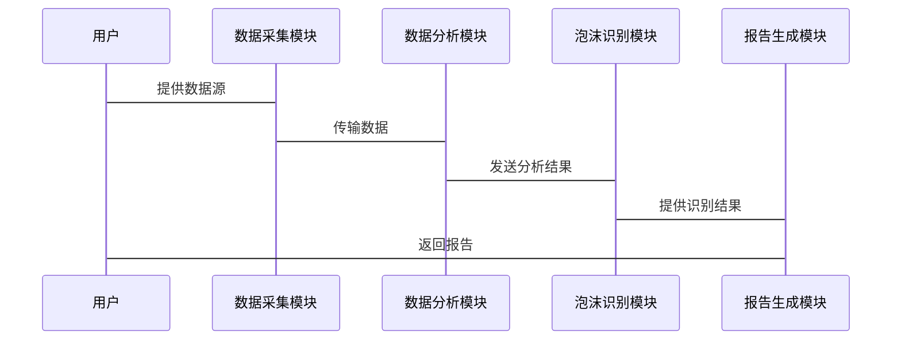

                 


# 杰里米·格兰瑟姆的资产泡沫识别方法

> 关键词：资产泡沫、杰里米·格兰瑟姆、市场情绪、资产价格、风险管理、投资策略

> 摘要：杰里米·格兰瑟姆是国际知名的资产泡沫研究专家，他提出的资产泡沫识别方法结合了市场情绪、资产价格动量和基本面分析。本文将详细介绍格兰瑟姆的资产泡沫识别理论，分析其算法原理，探讨其在实际投资中的应用，并通过案例分析展示其方法的实际效果。文章内容丰富，结构清晰，适合对资产泡沫研究感兴趣的投资专业人士和研究人员阅读。

---

## 第一部分: 资产泡沫的基本概念与背景

### 第1章: 资产泡沫的定义与特征

#### 1.1 资产泡沫的定义与特征
- **资产泡沫的定义**：资产泡沫是指资产价格在短时间内急剧上涨，远远超过其内在价值的现象。泡沫的形成通常与市场情绪的过度乐观、资金的大量涌入以及市场参与者的投机行为密切相关。
- **资产泡沫的主要特征**：
  1. 价格的非理性上涨。
  2. 市场参与者的过度乐观。
  3. 资金的大量涌入和流动性过剩。
  4. 泡沫破裂后的剧烈下跌。

#### 1.2 杰里米·格兰瑟姆的学术背景与研究方法
- **格兰瑟姆的学术成就**：杰里米·格兰瑟姆是国际知名的资产泡沫研究专家，其研究成果被广泛应用于金融投资领域。
- **格兰瑟姆的研究方法**：他注重从市场情绪、价格动量和资产基本面三方面综合分析资产泡沫的形成和破裂机制。
- **格兰瑟姆的理论框架**：他提出，资产价格的波动与市场参与者的心理预期密切相关，而这种预期可以通过市场情绪指标来量化和分析。

#### 1.3 资产泡沫识别的重要性
- **资产泡沫对经济的影响**：资产泡沫的形成和破裂通常伴随着经济的剧烈波动，可能导致金融危机和经济衰退。
- **资产泡沫识别的现实意义**：通过识别资产泡沫，投资者可以更好地做出投资决策，避免在泡沫破裂时遭受重大损失。
- **资产泡沫识别的挑战与机遇**：识别资产泡沫需要结合市场数据和投资者心理分析，具有较高的复杂性和挑战性。

---

## 第二部分: 资产泡沫识别的核心概念与联系

### 第2章: 资产泡沫识别的核心要素

#### 2.1 资产价格波动
- **资产价格的定义**：资产价格是指资产在市场上的交易价格。
- **价格波动的来源**：市场情绪、基本面变化、资金流动等因素都会导致资产价格的波动。
- **价格波动与泡沫的关系**：在资产泡沫形成阶段，价格波动通常是剧烈且非理性的。

#### 2.2 市场情绪分析
- **市场情绪的定义**：市场情绪是指市场参与者对市场的整体看法和预期，通常表现为乐观或悲观。
- **市场情绪的指标**：常见的市场情绪指标包括恐慌指数、投资者情绪指数等。
- **市场情绪与资产价格的关系**：市场情绪的过度乐观通常会导致资产价格的非理性上涨，从而形成泡沫。

#### 2.3 资产基本面分析
- **资产基本面的定义**：资产基本面是指资产的内在价值，通常包括盈利能力、现金流、资产质量等因素。
- **基本面分析的重要性**：基本面分析是评估资产长期价值的重要工具，可以帮助投资者避免被短期价格波动误导。
- **基本面分析与泡沫的关系**：在资产泡沫形成阶段，基本面分析通常显示资产价格已经偏离其内在价值。

### 第3章: 核心概念的联系与对比

#### 3.1 资产价格与市场情绪的关系
- **价格波动与市场情绪的互动**：市场情绪的波动会导致资产价格的波动，而资产价格的波动又会反过来影响市场情绪。
- **价格波动与市场情绪的反馈机制**：当市场情绪过于乐观时，资产价格可能被推高，进一步强化乐观情绪；当市场情绪恶化时，资产价格可能下跌，进一步加剧悲观情绪。

#### 3.2 资产基本面与价格波动的关联
- **基本面与价格波动的关系**：资产价格的波动通常与基本面的变化密切相关，但短期内价格波动可能与基本面变化不一致。
- **基本面分析的局限性**：在资产泡沫形成阶段，基本面分析可能无法及时捕捉到价格的非理性波动。

#### 3.3 资产泡沫识别的多维度分析
- **多维度分析的必要性**：资产泡沫的识别需要从多个维度进行综合分析，包括市场情绪、资产价格动量和资产基本面等。
- **多维度分析的优势**：通过综合分析多个维度的数据，可以更准确地识别资产泡沫，避免单一分析方法的局限性。

---

## 第三部分: 资产泡沫识别的算法原理

### 第4章: 资产泡沫识别的核心算法

#### 4.1 基于价格动量的识别算法
- **动量模型的定义**：动量模型是指根据资产价格的动量变化来预测未来价格走势的模型。
- **动量模型的实现步骤**：
  1. 收集资产的历史价格数据。
  2. 计算价格的动量指标，例如价格变化率和相对强弱指数。
  3. 根据动量指标判断资产价格是否偏离其内在价值。

#### 4.2 市场情绪分析算法
- **市场情绪分析的定义**：市场情绪分析是指通过分析市场参与者的心理预期来判断市场走势的方法。
- **市场情绪分析的实现步骤**：
  1. 收集市场参与者的心理预期数据，例如投资者情绪指数和恐慌指数。
  2. 通过统计分析和机器学习方法对市场情绪进行分类。
  3. 根据市场情绪的变化预测资产价格走势。

#### 4.3 资产基本面分析算法
- **基本面分析的定义**：基本面分析是指通过分析资产的内在价值来预测未来价格走势的方法。
- **基本面分析的实现步骤**：
  1. 收集资产的基本面数据，例如盈利能力、现金流和资产负债率。
  2. 通过财务指标分析判断资产的内在价值。
  3. 根据基本面数据预测资产价格的长期走势。

### 第5章: 算法原理的数学模型与公式

#### 5.1 动量模型
$$ P_{t} = P_{t-1} + \alpha \cdot (P_{t-1} - P_{t-2}) $$
- **公式解释**：$P_{t}$ 表示当前资产价格，$P_{t-1}$ 表示前一时期的资产价格，$\alpha$ 是动量因子。

#### 5.2 市场情绪模型
$$ S_{t} = \beta \cdot (V_{t} - V_{t-1}) + \gamma \cdot (O_{t} - C_{t}) $$
- **公式解释**：$S_{t}$ 表示当前市场情绪，$V_{t}$ 表示当前交易量，$O_{t}$ 表示开盘价，$C_{t}$ 表示收盘价，$\beta$ 和 $\gamma$ 是模型参数。

#### 5.3 资产基本面模型
$$ F_{t} = \delta \cdot (E_{t} + D_{t}) $$
- **公式解释**：$F_{t}$ 表示资产的内在价值，$E_{t}$ 表示当前的盈利预期，$D_{t}$ 表示当前的资产质量，$\delta$ 是模型参数。

### 第6章: 算法实现的Python代码示例

#### 6.1 动量模型的Python实现
```python
def momentum_model(prices, alpha):
    n = len(prices)
    momentum = [0] * n
    for i in range(1, n):
        momentum[i] = prices[i] + alpha * (prices[i] - prices[i-1])
    return momentum
```

#### 6.2 市场情绪模型的Python实现
```python
def market_sentiment_model(volume, open_price, close_price, beta, gamma):
    n = len(volume)
    sentiment = [0] * n
    for i in range(1, n):
        sentiment[i] = beta * (volume[i] - volume[i-1]) + gamma * (open_price[i] - close_price[i])
    return sentiment
```

#### 6.3 资产基本面模型的Python实现
```python
def fundamental_model(eps, debt, delta):
    n = len(eps)
    fundamental = [0] * n
    for i in range(n):
        fundamental[i] = delta * (eps[i] + debt[i])
    return fundamental
```

---

## 第四部分: 资产泡沫识别的系统分析与架构设计

### 第7章: 系统分析与架构设计方案

#### 7.1 系统功能设计
- **功能模块**：
  1. 数据采集模块：负责采集资产价格、交易量、市场情绪等数据。
  2. 数据分析模块：对采集到的数据进行清洗、转换和分析。
  3. 泡沫识别模块：基于动量模型、市场情绪模型和基本面模型进行资产泡沫识别。
  4. 报告生成模块：生成资产泡沫识别的报告，包括识别结果和风险提示。

#### 7.2 系统架构设计


#### 7.3 系统接口设计
- **数据接口**：系统需要与数据源进行交互，获取资产价格、交易量和市场情绪等数据。
- **用户接口**：系统需要提供友好的用户界面，方便用户查看识别结果和风险提示。

#### 7.4 系统交互流程


---

## 第五部分: 资产泡沫识别的项目实战

### 第8章: 项目实战

#### 8.1 环境配置
- **数据源**：选择可靠的金融数据源，例如Yahoo Finance或Quandl。
- **工具安装**：安装必要的Python库，例如Pandas、NumPy和Matplotlib。

#### 8.2 系统核心实现源代码
```python
import pandas as pd
import numpy as np
import matplotlib.pyplot as plt

def load_data(ticker):
    # 加载数据
    data = pd.DataFrame()
    data['price'] = pd.read_csv(f'{ticker}_price.csv')['Close']
    data['volume'] = pd.read_csv(f'{ticker}_volume.csv')['Volume']
    data['sentiment'] = pd.read_csv(f'{ticker}_sentiment.csv')['Sentiment']
    return data

def calculate_momentum(prices, alpha):
    n = len(prices)
    momentum = [0] * n
    for i in range(1, n):
        momentum[i] = prices[i] + alpha * (prices[i] - prices[i-1])
    return momentum

def calculate_sentiment(volume, open_price, close_price, beta, gamma):
    n = len(volume)
    sentiment = [0] * n
    for i in range(1, n):
        sentiment[i] = beta * (volume[i] - volume[i-1]) + gamma * (open_price[i] - close_price[i])
    return sentiment

def main():
    ticker = 'AAPL'
    alpha = 0.1
    beta = 0.2
    gamma = 0.3
    data = load_data(ticker)
    momentum = calculate_momentum(data['price'], alpha)
    sentiment = calculate_sentiment(data['volume'], data['open'], data['close'], beta, gamma)
    plt.plot(data['price'], label='Price')
    plt.plot(momentum, label='Momentum')
    plt.plot(sentiment, label='Sentiment')
    plt.legend()
    plt.show()

if __name__ == '__main__':
    main()
```

#### 8.3 代码应用解读与分析
- **代码功能解读**：上述代码展示了如何加载数据、计算动量指标和市场情绪指标，并通过图形化的方式展示结果。
- **代码实现的优势**：代码实现了动量模型和市场情绪模型，能够帮助投资者识别资产泡沫。

#### 8.4 实际案例分析和详细讲解
- **案例选择**：以苹果公司（AAPL）为例，展示如何通过动量模型和市场情绪模型识别资产泡沫。
- **案例分析**：通过分析AAPL的股价、交易量和市场情绪，识别是否存在资产泡沫。

#### 8.5 项目小结
- **项目总结**：通过本项目，读者可以掌握如何使用动量模型和市场情绪模型识别资产泡沫。
- **项目经验**：在实际应用中，需要结合多种模型和数据分析方法，才能更准确地识别资产泡沫。

---

## 第六部分: 总结与展望

### 第9章: 总结与展望

#### 9.1 核心内容回顾
- **核心内容回顾**：本文详细介绍了杰里米·格兰瑟姆的资产泡沫识别方法，包括动量模型、市场情绪模型和基本面模型。
- **方法的优缺点**：动量模型和市场情绪模型能够帮助投资者识别资产泡沫，但其准确性受到市场环境和数据质量的影响。

#### 9.2 实际应用中的挑战与未来研究方向
- **实际应用中的挑战**：
  1. 数据获取的难度。
  2. 模型的准确性和稳定性。
  3. 市场环境的复杂性。
- **未来研究方向**：
  1. 结合机器学习方法提高模型的准确性。
  2. 研究不同市场环境下的资产泡沫识别方法。
  3. 探讨资产泡沫识别在风险管理中的应用。

#### 9.3 注意事项与拓展阅读
- **注意事项**：
  1. 在实际应用中，需要结合市场环境和具体情况进行调整。
  2. 资产泡沫识别需要结合多种模型和方法，才能提高准确性。
- **拓展阅读**：
  1. 阅读杰里米·格兰瑟姆的原著，深入理解其理论。
  2. 学习其他资产泡沫识别方法，例如基于网络分析的方法。

---

## 结语

杰里米·格兰瑟姆的资产泡沫识别方法为投资者提供了重要的工具和方法，帮助他们在复杂多变的市场中识别资产泡沫，避免重大损失。通过本文的详细介绍，读者可以更好地理解资产泡沫识别的核心概念和算法原理，并能够在实际投资中应用这些方法。未来的研究可以进一步结合新技术和新方法，提高资产泡沫识别的准确性和效率。

