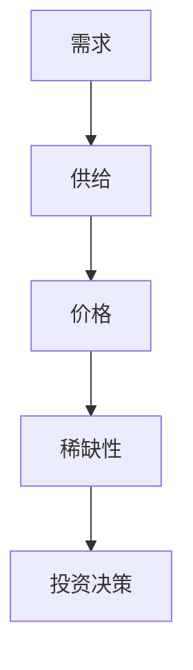
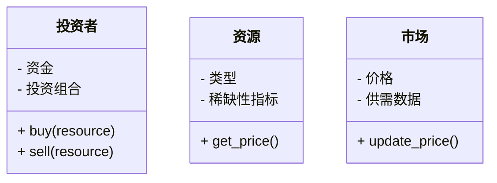
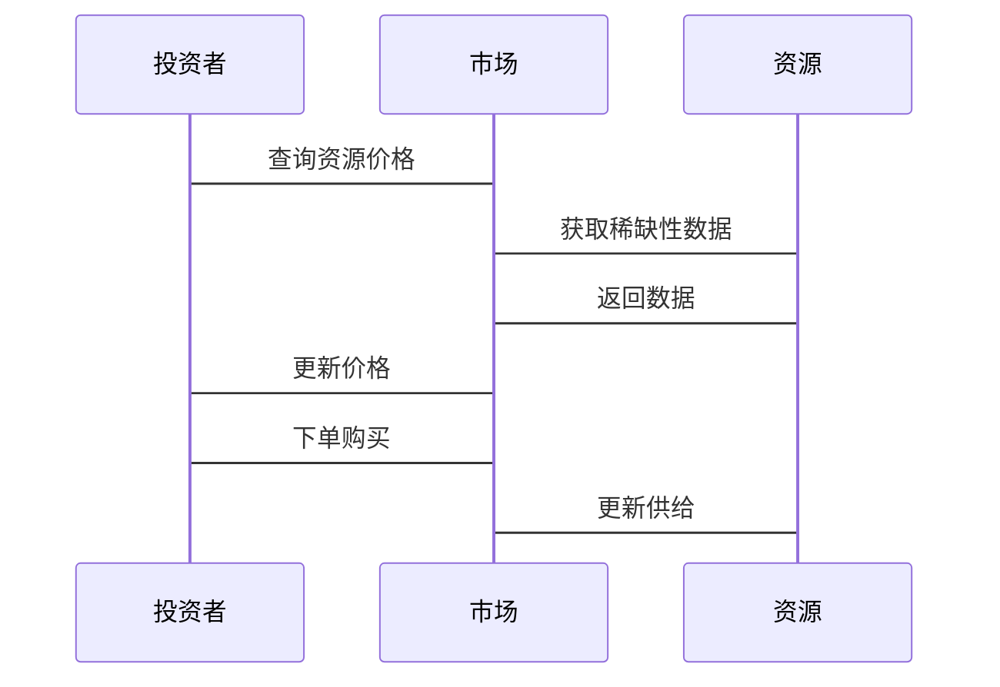

                 


# 杰里米·格兰瑟姆的资源稀缺性投资理论

## 关键词：
- 资源稀缺性
- 投资理论
- 供需模型
- 资产价格
- 稀缺性投资

## 摘要：
本文系统地介绍杰里米·格兰瑟姆的资源稀缺性投资理论，从理论背景、核心概念、算法原理、系统架构到项目实战，层层剖析。文章首先分析资源稀缺性的定义与现状，接着探讨其与投资的联系，然后通过供需模型和数学公式深入阐述算法原理，再结合系统架构图和项目案例详细讲解实战应用，最后总结最佳实践与注意事项，为投资者提供深度洞察。

---

# 第一部分: 资源稀缺性投资理论的背景与核心概念

## 第1章: 资源稀缺性投资理论的背景介绍

### 1.1 资源稀缺性的定义与问题背景
#### 1.1.1 资源稀缺性的基本概念
资源稀缺性是指某种资源在当前或未来的需求下，供给无法满足需求的状态。这种稀缺性可能源于自然限制、技术限制或人为因素。

#### 1.1.2 资源稀缺性与经济发展的关系
资源稀缺性直接影响经济发展，可能导致价格上涨、生产受限和市场失衡。稀缺资源往往成为经济增长的关键瓶颈。

#### 1.1.3 当前全球资源短缺的现状分析
当前，全球面临能源危机、水资源短缺、矿产资源枯竭等问题。这些短缺不仅影响经济，还威胁社会稳定。

### 1.2 资源稀缺性投资理论的核心问题
#### 1.2.1 投资者如何应对资源稀缺性
投资者需要识别稀缺资源、评估其价值，并在市场中找到投资机会。

#### 1.2.2 资源稀缺性对资产价格的影响
稀缺性直接推高资源价格，影响投资者的收益和风险评估。

#### 1.2.3 资源稀缺性与投资机会的关联
稀缺资源往往成为高回报投资的焦点，投资者需要抓住这些机会。

### 1.3 资源稀缺性投资理论的边界与外延
#### 1.3.1 理论的适用范围
适用于自然资源、能源、技术资源等领域，但需结合具体市场环境。

#### 1.3.2 理论的局限性与不足
理论可能忽略短期市场波动和政策干预的影响。

#### 1.3.3 相关领域的交叉与融合
与经济学、环境科学、技术趋势等领域密切相关。

### 1.4 资源稀缺性投资理论的核心要素
#### 1.4.1 资源供给与需求的关系
供需失衡是稀缺性产生的根源。

#### 1.4.2 资源价格波动的机制
价格由供需关系决定，稀缺性加剧价格波动。

#### 1.4.3 投资者行为对资源稀缺性的影响
投资者行为可能加剧或缓解资源稀缺性。

### 1.5 本章小结
本章介绍了资源稀缺性的定义、现状及其与投资的关系，为后续分析奠定基础。

---

## 第2章: 资源稀缺性投资理论的核心概念与联系

### 2.1 资源稀缺性的核心原理
#### 2.1.1 资源稀缺性的供需模型
供需模型是理解稀缺性的关键工具，分析供给和需求的变化对价格的影响。

#### 2.1.2 资源稀缺性与市场均衡的关系
稀缺性打破市场均衡，导致价格波动和资源重新分配。

#### 2.1.3 资源稀缺性对资产配置的影响
投资者需根据稀缺性调整资产配置，分散风险。

### 2.2 资源稀缺性与投资回报的属性对比
| 属性 | 资源稀缺性 | 投资回报 |
|------|------------|----------|
| 时间性 | 短期或长期 | 短期或长期 |
| 可测量性 | 可量化 | 可量化 |
| 变化性 | 可能变化 | 可能变化 |

#### 2.2.1 资源稀缺性属性的特征分析
资源稀缺性具有时间性、可测量性和变化性等特征。

#### 2.2.2 投资回报的属性特征
投资回报同样具有时间性和可测量性，但更受市场波动影响。

#### 2.2.3 两者之间的关联性分析
资源稀缺性直接影响投资回报，但需考虑其他因素如市场情绪。

### 2.3 资源稀缺性投资的ER实体关系图
```mermaid
er
actor: 投资者
actor -|> resource: 资源
actor -|> market: 市场
market -|> price: 价格
resource -|> scarcity: 稀缺性
```

### 2.4 本章小结
本章通过供需模型和属性对比，深入分析资源稀缺性与投资回报的关系。

---

## 第3章: 资源稀缺性投资理论的算法原理

### 3.1 资源稀缺性供需模型的算法流程


### 3.2 资源稀缺性供需模型的数学公式
需求函数：$$ Q_d = a - bp $$
供给函数：$$ Q_s = c + dp $$
均衡条件：$$ Q_d = Q_s $$

### 3.3 资源稀缺性投资的Python实现
```python
def calculate_supply_demand(price):
    demand = a - b * price
    supply = c + d * price
    return demand, supply

# 示例
a = 100
b = 2
c = 50
d = 3
price = 20

demand, supply = calculate_supply_demand(price)
print(f"需求：{demand}, 供给：{supply}")
```

### 3.4 本章小结
本章通过算法流程和数学公式，展示资源稀缺性如何影响投资决策。

---

## 第4章: 资源稀缺性投资理论的系统分析与架构设计

### 4.1 问题场景介绍
分析能源危机下的资源稀缺性投资机会。

### 4.2 系统功能设计
领域模型：


### 4.3 系统架构设计


### 4.4 系统交互设计


### 4.5 本章小结
本章通过系统架构和交互图，展示资源稀缺性投资的实现过程。

---

## 第5章: 资源稀缺性投资理论的项目实战

### 5.1 环境安装与数据收集
安装Python，收集能源价格数据。

### 5.2 系统核心实现
```python
import pandas as pd

# 数据收集
data = pd.DataFrame({
    '价格': [20, 25, 30, 35, 40],
    '稀缺性': [0.8, 0.7, 0.6, 0.5, 0.4]
})

# 数据分析
data['投资建议'] = data['稀缺性'].apply(lambda x: '买入' if x > 0.6 else '观望')
print(data)
```

### 5.3 案例分析与结果解读
分析石油资源的稀缺性，生成投资建议。

### 5.4 本章小结
本章通过实战项目，展示资源稀缺性投资的实现过程。

---

## 第6章: 资源稀缺性投资理论的最佳实践与注意事项

### 6.1 最佳实践
- 长期视角
- 风险管理
- 定期评估

### 6.2 小结
资源稀缺性投资需结合市场环境和投资者行为，合理配置资产。

### 6.3 注意事项
- 短期波动
- 政策影响
- 技术进步

### 6.4 拓展阅读
推荐阅读杰里米·格兰瑟姆的相关著作，深入理解资源稀缺性投资。

---

## 附录
- 术语表
- 参考文献
- 代码仓库

---

# 结语
杰里米·格兰瑟姆的资源稀缺性投资理论为投资者提供了独特的视角，通过理论与实践的结合，帮助投资者在资源短缺的市场中抓住机遇，规避风险。

