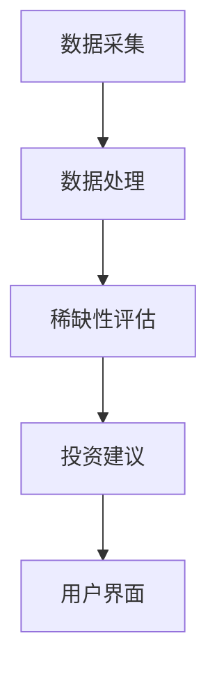

                 


# 杰里米·格兰瑟姆的资源稀缺性投资理论

## 关键词：资源稀缺性、投资理论、杰里米·格兰瑟姆、经济学、经济周期、投资策略

## 摘要：  
杰里米·格兰瑟姆的资源稀缺性投资理论是一种基于资源短缺对经济和投资市场影响的理论。该理论认为，资源的稀缺性是推动价格上涨和投资机会的重要因素。本文将从资源稀缺性的定义、其与经济周期的关系、数学模型、系统架构设计以及实际项目案例等方面，全面解析这一理论的核心内容和实际应用。

---

## 第一部分：资源稀缺性投资理论的背景与核心概念

### 第1章：资源稀缺性问题的背景

#### 1.1 资源稀缺性的定义与内涵
- **资源稀缺性**是指某种资源的供给量无法满足市场需求的情况，这种失衡会导致资源价格的上涨。
- 资源可以是自然资源（如石油、矿产）或人力资源（如技术人才）。
- 稀缺性是经济学中的基本概念，但其对投资市场的影响往往被低估。

#### 1.2 资源稀缺性与经济发展的关系
- 经济发展需要资源支持，资源的稀缺性会制约经济增长。
- 稀缺性通过价格信号影响市场供需，进而影响投资决策。

#### 1.3 资源稀缺性问题的全球性挑战
- 全球化背景下，资源分布不均导致某些地区面临严重稀缺性问题。
- 人口增长和工业化加剧了资源需求，进一步放大了稀缺性的影响。

---

### 第2章：资源稀缺性投资理论的核心要素

#### 2.1 资源稀缺性的衡量标准
- **供给量**：资源的实际储量或生产能力。
- **需求量**：市场对资源的需求总量。
- **替代性**：是否存在可替代资源，替代性越低，稀缺性影响越大。

#### 2.2 资源稀缺性与市场价格的关系
- 稀缺性直接导致价格上涨。
- 价格是供需关系的晴雨表，投资者可以通过价格变化预测稀缺性趋势。

#### 2.3 资源稀缺性对投资决策的影响
- 稀缺性高的资源通常具有较高的投资价值。
- 投资者应关注稀缺性变化，提前布局相关资产。

---

## 第二部分：资源稀缺性与经济周期的互动关系

### 第3章：经济周期的基本理论

#### 3.1 经济周期的定义与阶段划分
- 经济周期包括复苏、繁荣、衰退和萧条四个阶段。
- 在繁荣阶段，资源需求激增，稀缺性加剧。

#### 3.2 资源稀缺性与经济周期的互动机制
- 稀缺性推动价格上涨，进而影响企业利润和消费者行为。
- 在衰退阶段，需求下降，稀缺性缓解，价格回落。

#### 3.3 资源稀缺性与经济周期的动态平衡
- 经济周期波动与资源稀缺性相互作用，形成复杂的动态平衡。
- 投资者应关注周期性变化，灵活调整投资策略。

---

## 第三部分：资源稀缺性投资理论的数学模型与算法原理

### 第4章：资源稀缺性定价模型

#### 4.1 模型的基本假设
- 市场供需关系决定价格。
- 资源稀缺性是影响价格的主要因素。
- 投资者理性决策，追求最大收益。

#### 4.2 模型的数学表达式
$$ P = f(R, S, D) $$
其中，P为价格，R为资源储量，S为替代资源的可获得性，D为需求弹性。

#### 4.3 模型的验证与应用
- 使用历史数据验证模型的准确性。
- 应用模型预测未来价格走势。

### 第5章：资源稀缺性风险评估算法

#### 5.1 算法的输入变量
- 资源储量、替代性、需求弹性。

#### 5.2 算法的计算步骤
1. 采集资源相关数据。
2. 计算资源稀缺性指数。
3. 评估投资风险等级。

#### 5.3 算法的输出结果
- 风险等级（低、中、高）。
- 投资建议（买入、持有、卖出）。

---

## 第四部分：资源稀缺性投资理论的系统架构设计

### 第6章：系统功能设计

#### 6.1 资源数据采集模块
- 采集全球资源储量、价格等数据。
- 数据来源包括政府报告、市场调研等。

#### 6.2 资源稀缺性评估模块
- 使用数学模型计算稀缺性指数。
- 生成风险评估报告。

#### 6.3 投资决策支持模块
- 提供投资建议，包括资产配置和风险提示。

### 第7章：系统架构设计

#### 7.1 分层架构设计
- 数据采集层：负责数据的收集与存储。
- 业务逻辑层：处理数据，运行算法。
- 用户界面层：展示结果，供投资者决策。

#### 7.2 模块之间的交互关系
- 数据采集模块向业务逻辑层传递数据。
- 业务逻辑层向用户界面层输出结果。

#### 7.3 系统的可扩展性设计
- 支持新增资源种类和算法优化。
- 系统架构便于后续功能扩展。

---

## 第五部分：资源稀缺性投资理论的项目实战

### 第8章：项目环境搭建

#### 8.1 开发工具安装
- 安装Python、Jupyter Notebook等工具。
- 安装相关库（如Pandas、NumPy、Matplotlib）。

#### 8.2 数据源获取
- 从公开数据源获取资源数据，如国际能源署（IEA）报告。
- 数据清洗与预处理。

#### 8.3 系统框架选择
- 使用Flask或Django构建Web界面。
- 使用MongoDB存储数据。

### 第9章：核心功能实现

#### 9.1 数据采集与处理
- 编写Python脚本，从API获取数据。
- 使用Pandas进行数据清洗。

#### 9.2 稀缺性评估算法实现
- 编写函数，计算资源稀缺性指数。
- 使用Matplotlib绘制图表，展示结果。

#### 9.3 投资决策支持实现
- 根据算法结果，生成投资建议。
- 用户界面展示结果。

### 第10章：实际案例分析

#### 10.1 案例背景
- 某种矿产资源的稀缺性分析。
- 当前市场价格趋势。

#### 10.2 数据分析与结果解读
- 使用模型预测未来价格走势。
- 提供投资建议，如增持或减持。

#### 10.3 案例小结
- 理论与实践结合，验证模型的有效性。

---

## 第六部分：资源稀缺性投资理论的总结与展望

### 第11章：总结与启示

#### 11.1 理论的核心思想
- 资源稀缺性是投资的重要因素。
- 投资者应关注稀缺性变化，灵活调整策略。

#### 11.2 理论的实践意义
- 为投资者提供科学的决策依据。
- 帮助投资者规避风险，抓住机会。

### 第12章：注意事项与投资建议

#### 12.1 投资者注意事项
- 稀缺性分析需结合其他因素，如政策、技术。
- 风险评估需动态调整。

#### 12.2 投资策略建议
- 长期关注稀缺性高的资源。
- 短期根据市场波动灵活操作。

### 第13章：拓展阅读与深入学习

#### 13.1 相关书籍推荐
- 《杰里米·格兰瑟姆投资备忘录》。
- 《稀缺：资源、决策与经济学之路》。

#### 13.2 其他学习资源
- 学术论文、行业报告、在线课程。

---

## 附录：资源稀缺性投资理论的数学模型与代码示例

### 附录A：数学模型代码

```python
import pandas as pd
import numpy as np
import matplotlib.pyplot as plt

def calculateScarceIndex(resource储量,替代资源可获得性,需求弹性):
    return resource储量 * (替代资源可获得性 / 需求弹性)

# 示例数据
resource储量 = 100
替代资源可获得性 = 50
需求弹性 = 2

scarce_index = calculateScarceIndex(resource储量, 替代资源可获得性, 需求弹性)
print("稀缺性指数:", scarce_index)
```

### 附录B：系统架构图



---

## 结语

杰里米·格兰瑟姆的资源稀缺性投资理论为我们提供了一个全新的视角，帮助我们更好地理解资源短缺对投资市场的影响。通过理论与实践的结合，投资者可以更科学地进行决策，抓住稀缺性带来的投资机会，规避相关风险。

