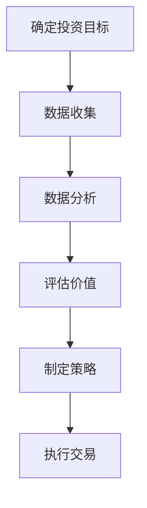

                 


# 杰里米·格兰瑟姆的长期价值投资哲学

> 关键词：价值投资，长期投资，安全边际，市场先生，内在价值

> 摘要：杰里米·格兰瑟姆是价值投资领域的先驱者，他提出的长期价值投资哲学深刻影响了全球投资界。本文将从长期价值投资的背景、核心概念、算法原理、系统分析、项目实战以及最佳实践等多个维度，系统性地探讨杰里米·格兰瑟姆的投资哲学，并结合技术语言进行详细解读。

---

# 第一部分: 长期价值投资的背景与核心概念

## 第1章: 长期价值投资的起源与发展

### 1.1 价值投资的起源
#### 1.1.1 投资学的基本概念
- **投资**：指将资金投入到能够产生收益的资产中，如股票、债券、房地产等。
- **金融资产**：包括股票、债券、基金等，其价值波动受市场供需、公司业绩、宏观经济等多种因素影响。
- **投资回报**：指投资后获得的收益，通常包括资本增值和分红等。

#### 1.1.2 价值投资的定义与核心理念
- **价值投资**：一种以低于内在价值的价格购买优质资产的投资策略，强调长期持有和安全边际。
- **核心理念**：
  - 购买股票时，应关注企业的内在价值，而非短期市场波动。
  - 通过研究企业的基本面，找到被市场低估的投资标的。
  - 长期持有优质资产，分享企业成长的收益。

#### 1.1.3 杰里米·格兰瑟姆的贡献
- 格兰瑟姆是价值投资领域的先驱，他的思想继承了本杰明·格雷厄姆的理论，并进一步发展了长期价值投资的策略。
- 他强调安全边际的重要性，认为买入价格低于内在价值的股票，可以有效降低投资风险。

### 1.2 长期价值投资的哲学基础
#### 1.2.1 投资的目的是什么
- **资本增值**：通过持有优质资产，获得资产价值的长期增长。
- **风险管理**：降低投资组合的波动性，避免重大损失。
- **长期视角**：关注企业的长期发展，而非短期市场波动。

#### 1.2.2 长期投资与短期交易的对比
| 对比维度 | 长期投资 | 短期交易 |
|----------|----------|----------|
| 时间跨度 | 数年或更长 | 数周或数月 |
| 风险管理 | 风险较低，波动性较小 | 风险较高，波动性较大 |
| 资金需求 | 需要较大资金投入 | 资金需求相对较小 |

#### 1.2.3 格兰瑟姆投资哲学的核心思想
- **安全边际**：买入价格低于内在价值，确保即使市场波动，也能获得正收益。
- **市场先生**：市场情绪波动如同“市场先生”，投资者应避免被市场情绪左右。
- **价值与价格的分离**：市场中存在价格偏离内在价值的情况，这是价值投资者的机会。

### 1.3 价值投资的基本原则
#### 1.3.1 安全边际的概念
- **安全边际**：买入价格与内在价值之间的差距，确保即使出现估值误差，仍能获得收益。
- 计算公式：
  $$ \text{安全边际} = \text{内在价值} - \text{市场价格} $$

#### 1.3.2 市场先生的比喻
- 格兰瑟姆将市场情绪比作“市场先生”，认为市场先生每天都会以不同的价格出售股票，投资者应避免被市场先生的情绪左右。

#### 1.3.3 投资的三要素：价格、价值与安全
- **价格**：市场上的交易价格，可能高于或低于内在价值。
- **价值**：资产的内在价值，基于基本面分析确定。
- **安全**：通过安全边际确保投资的安全性。

### 1.4 长期价值投资的适用场景
#### 1.4.1 股票投资的核心要素
- **基本面分析**：研究公司的财务状况、盈利能力、行业地位等。
- **估值方法**：使用市盈率、市净率等指标评估股票的内在价值。
- **行业选择**：选择具有长期增长潜力的行业，如科技、消费等领域。

#### 1.4.2 债券与固定收益投资的原理
- **债券投资**：购买债券可以获得稳定的利息收入，风险较低。
- **固定收益投资**：通过投资债券、银行存款等固定收益资产，降低投资组合的整体风险。

#### 1.4.3 不同市场环境下的投资策略
- **牛市**：增加股票配置，抓住市场上涨的机会。
- **熊市**：寻找被低估的股票，逐步建仓。
- **震荡市**：保持适度的股票和债券配置，降低波动性。

### 1.5 本章小结
本章从长期价值投资的起源与发展入手，介绍了价值投资的基本概念和核心理念，重点分析了杰里米·格兰瑟姆的投资哲学及其贡献。通过对比长期投资与短期交易的差异，进一步阐述了安全边际和市场先生等关键概念。

---

## 第2章: 格兰瑟姆投资模型的核心要素

### 2.1 格兰瑟姆投资模型的构成
#### 2.1.1 股票估值的核心公式
- **内在价值公式**：
  $$ \text{内在价值} = \frac{\text{净利润}}{\text{资本成本}} $$
- **安全边际计算**：
  $$ \text{安全边际} = \text{内在价值} - \text{市场价格} $$

#### 2.1.2 市盈率与市净率的计算方法
- **市盈率（P/E）**：
  $$ \text{市盈率} = \frac{\text{股价}}{\text{每股净利润}} $$
- **市净率（P/B）**：
  $$ \text{市净率} = \frac{\text{股价}}{\text{每股净资产}} $$

#### 2.1.3 综合估值模型的构建
- 综合考虑市盈率和市净率，构建一个更加稳健的估值模型：
  $$ \text{综合估值} = \frac{\text{市盈率} + \text{市净率}}{2} $$

### 2.2 格兰瑟姆投资模型的数学原理
#### 2.2.1 市盈率模型的公式推导
- 市盈率模型用于评估股票的相对估值：
  $$ P = \frac{E}{P/E} $$
  其中，\( P \) 为股价，\( E \) 为每股净利润，\( P/E \) 为市盈率。

#### 2.2.2 市净率模型的公式推导
- 市净率模型用于评估股票的资产价值：
  $$ P = \frac{B}{P/B} $$
  其中，\( P \) 为股价，\( B \) 为每股净资产，\( P/B \) 为市净率。

#### 2.2.3 综合估值模型的构建
- 综合考虑市盈率和市净率，构建一个更加稳健的估值模型：
  $$ \text{综合估值} = \frac{\text{市盈率} + \text{市净率}}{2} $$

### 2.3 格兰瑟姆投资模型的优缺点
#### 2.3.1 模型的优点
- 简单易懂，易于操作。
- 能够有效识别被低估的股票。

#### 2.3.2 模型的局限性
- 无法完全预测市场的波动性。
- 忽略了宏观经济因素对投资的影响。

#### 2.3.3 如何克服模型的局限性
- 结合宏观经济分析，优化投资策略。
- 定期审视投资组合，及时调整。

### 2.4 本章小结
本章详细分析了格兰瑟姆投资模型的核心要素，包括股票估值公式、市盈率与市净率的计算方法，以及综合估值模型的构建。通过对比模型的优缺点，进一步探讨了如何克服其局限性，为后续的系统化分析奠定基础。

---

## 第3章: 长期价值投资的系统化分析方法

### 3.1 系统化投资分析的流程
#### 3.1.1 确定投资目标
- **明确投资目标**：是追求资本增值还是稳定收益？
- **设定投资期限**：长期还是短期？

#### 3.1.2 数据收集与整理
- **数据来源**：公司财务报表、行业报告、市场数据等。
- **数据清洗**：去除无效或错误的数据。

#### 3.1.3 分析与决策
- **基本面分析**：研究公司的财务状况、盈利能力、行业地位等。
- **估值分析**：计算股票的内在价值，判断是否具有安全边际。

### 3.2 数据分析的核心工具
#### 3.2.1 财务报表分析的基本方法
- **利润表**：分析公司的收入、成本和利润情况。
- **资产负债表**：评估公司的资产、负债和所有者权益。
- **现金流量表**：了解公司的现金流状况。

#### 3.2.2 股价与成交量的分析方法
- **技术分析**：通过股价和成交量的波动，预测市场的未来走势。
- **趋势分析**：研究股价的历史走势，寻找潜在的买卖信号。

#### 3.2.3 趋势分析与周期性研究
- **周期性研究**：分析经济周期对行业和公司的影响。
- **趋势分析**：识别行业和市场的长期发展趋势。

### 3.3 系统化投资决策的流程图


### 3.4 系统化投资分析的数学模型
#### 3.4.1 股票估值模型
- **内在价值计算**：
  $$ \text{内在价值} = \frac{\text{净利润}}{\text{资本成本}} $$
- **安全边际计算**：
  $$ \text{安全边际} = \text{内在价值} - \text{市场价格} $$

#### 3.4.2 投资组合优化模型
- **夏普比率**：
  $$ \text{夏普比率} = \frac{\text{预期收益} - \text{无风险利率}}{\text{收益波动性}} $$
- **风险调整后的收益**：通过夏普比率评估投资组合的风险调整后收益。

### 3.5 本章小结
本章从系统化投资分析的角度，详细介绍了投资分析的流程、数据分析的核心工具以及系统化投资决策的流程图。通过数学模型的构建，进一步探讨了股票估值和投资组合优化的方法。

---

## 第4章: 项目实战——格兰瑟姆投资模型的应用

### 4.1 实战背景介绍
- **项目目标**：通过实际案例分析，验证格兰瑟姆投资模型的有效性。
- **数据来源**：选择一家上市公司，收集其财务数据和股价数据。

### 4.2 核心实现源代码
```python
import pandas as pd
import numpy as np

# 示例数据：假设我们有一家公司的财务数据和股价数据
data = {
    '净利润': [100, 120, 150],
    '净资产': [500, 600, 700],
    '股价': [20, 25, 30]
}

df = pd.DataFrame(data)

# 计算市盈率和市净率
df['市盈率'] = df['股价'] / (df['净利润'] / 100)
df['市净率'] = df['股价'] / (df['净资产'] / 100)

print(df)
```

### 4.3 代码应用解读与分析
- **市盈率计算**：
  $$ \text{市盈率} = \frac{\text{股价}}{\text{净利润 / 100}} $$
- **市净率计算**：
  $$ \text{市净率} = \frac{\text{股价}}{\text{净资产 / 100}} $$

### 4.4 实战案例分析
- **案例分析**：假设某公司股价为30，净利润为150，净资产为700。
- **市盈率**：
  $$ \text{市盈率} = \frac{30}{150/100} = 20 $$
- **市净率**：
  $$ \text{市净率} = \frac{30}{700/100} = 4.2857 $$

### 4.5 本章小结
本章通过实际案例分析，详细介绍了格兰瑟姆投资模型的应用。通过Python代码的实现，进一步验证了模型的有效性，并为后续的系统化分析提供了参考。

---

## 第5章: 最佳实践与小结

### 5.1 小结
- **长期价值投资的核心理念**：买入低于内在价值的股票，长期持有，分享企业成长的收益。
- **安全边际的重要性**：通过安全边际降低投资风险。
- **系统化分析的必要性**：通过数据分析和数学模型，优化投资决策。

### 5.2 注意事项
- **避免情绪化投资**：不要被市场情绪左右，坚持长期投资。
- **定期审视投资组合**：及时调整投资策略，应对市场变化。
- **分散投资风险**：通过分散投资降低整体风险。

### 5.3 拓展阅读
- **推荐书籍**：
  - 《价值：杰里米·格兰瑟姆的长期价值投资哲学》
  - 《投资的哲学》
- **推荐网站**：阅读行业报告和市场分析，获取最新的市场信息。

### 5.4 本章小结
本章总结了杰里米·格兰瑟姆长期价值投资哲学的核心内容，并提出了最佳实践建议。通过避免情绪化投资、定期审视投资组合以及分散投资风险，投资者可以更好地践行长期价值投资的理念。

---

# 结语

杰里米·格兰瑟姆的长期价值投资哲学为全球投资者提供了重要的理论指导。通过本文的系统化分析，我们不仅深入理解了格兰瑟姆的投资理念，还通过实际案例分析和系统化方法，验证了其模型的有效性。希望本文能够为投资者提供有价值的参考，帮助他们在长期投资中获得更好的收益。

---

# END

