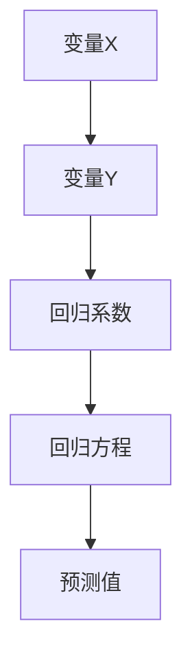
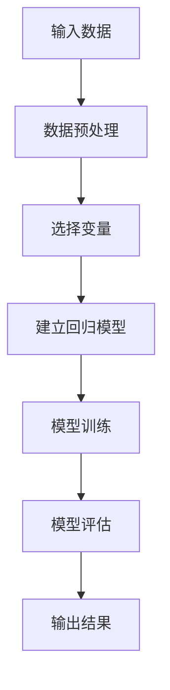
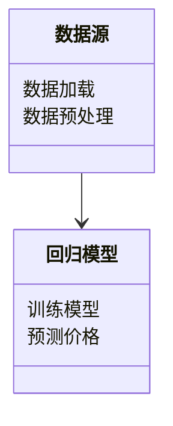

                 


# 杰里米格兰瑟姆的均值回归理论

## 关键词：均值回归，杰里米格兰瑟姆，投资学，统计学，回归分析

## 摘要：均值回归是一种统计学方法，用于分析变量之间的关系。本文将详细介绍杰里米格兰瑟姆的均值回归理论，涵盖其背景、核心概念、算法实现、数学模型、系统架构设计、项目实战以及最佳实践等内容，帮助读者深入理解并应用该理论。

---

# 第1章: 均值回归理论的背景与核心概念

## 1.1 均值回归理论的起源与发展

### 1.1.1 均值回归理论的起源

均值回归理论起源于统计学领域，其核心思想是通过回归分析来研究变量之间的关系。19世纪末，弗朗西斯·高尔顿在研究遗传学时，发现子代的身高会向平均身高回归，这一发现为均值回归理论奠定了基础。

### 1.1.2 均值回归理论的发展历程

随着统计学的发展，均值回归理论不断完善。20世纪初，卡尔·皮尔逊和弗朗西斯·高尔顿进一步发展了回归分析的方法。杰里米·格兰瑟姆在其研究中将均值回归理论应用于投资学，提出了著名的“均值回归投资策略”。

### 1.1.3 均值回归理论在投资学中的应用

在投资学中，均值回归理论被广泛应用于预测资产价格和风险管理。杰里米·格兰瑟姆提出，资产价格通常会回归其历史均值，投资者可以根据这一理论制定投资策略。

## 1.2 均值回归理论的核心概念

### 1.2.1 均值回归的定义与内涵

均值回归是指变量在长期趋势中会回归其历史平均值的现象。在统计学中，均值回归通常用于研究变量之间的线性关系。

### 1.2.2 均值回归的数学表达式

均值回归的数学公式可以表示为：

$$ y = a + bx + \epsilon $$

其中，\( y \) 是因变量，\( x \) 是自变量，\( a \) 是截距，\( b \) 是回归系数，\( \epsilon \) 是误差项。

### 1.2.3 均值回归与其它统计方法的对比

均值回归与其他统计方法（如逻辑回归、时间序列分析等）在应用场景和数学模型上有显著区别。例如，逻辑回归适用于二分类问题，而均值回归适用于线性关系的预测。

## 1.3 均值回归理论在投资中的应用

### 1.3.1 均值回归在股票投资中的应用

杰里米·格兰瑟姆将均值回归理论应用于股票投资，提出了“价值投资”策略。他认为，股票价格会回归其内在价值，投资者可以通过分析市盈率、市净率等指标来寻找被低估的股票。

### 1.3.2 均值回归在风险管理中的作用

均值回归可以帮助投资者识别市场异常波动，并制定相应的风险管理策略。例如，当市场出现剧烈波动时，投资者可以利用均值回归理论来预测市场的回归趋势。

### 1.3.3 均值回归与市场周期的关系

均值回归理论与市场周期密切相关。在市场繁荣时期，资产价格通常会高于其均值；而在市场衰退时期，资产价格则会回归其均值。投资者可以根据市场周期的变化调整其投资策略。

## 1.4 本章小结

本章介绍了均值回归理论的起源与发展，阐述了其在投资学中的核心概念和应用。通过对比均值回归与其他统计方法，进一步明确了其在股票投资和风险管理中的重要性。

---

# 第2章: 均值回归理论的核心原理

## 2.1 均值回归的数学推导

### 2.1.1 随机变量与期望值的定义

在统计学中，随机变量是指可能取多个值的变量，期望值是随机变量的平均值。例如，股票价格是一个随机变量，其期望值是其历史平均价格。

### 2.1.2 均值回归的数学公式推导

均值回归的数学推导基于最小二乘法。假设我们有 \( n \) 对数据点 \( (x_i, y_i) \)，则回归线的斜率 \( b \) 和截距 \( a \) 可以通过以下公式计算：

$$ b = \frac{n\sum x_i y_i - \sum x_i \sum y_i}{n\sum x_i^2 - (\sum x_i)^2} $$

$$ a = \frac{\sum y_i - b \sum x_i}{n} $$

### 2.1.3 均值回归的假设条件与限制

均值回归的假设条件包括线性关系、正态分布、同方差性和无自相关性等。如果这些假设不成立，回归结果可能不可靠。

## 2.2 均值回归的核心属性对比

### 2.2.1 线性回归与非线性回归的对比

线性回归假设变量之间是线性关系，而非线性回归则允许变量之间的关系是非线性的。例如，多项式回归是一种非线性回归方法。

### 2.2.2 时间序列与横截面数据的对比

时间序列数据是指按时间顺序排列的数据，而横截面数据是指同一时间点上不同个体的数据。均值回归可以应用于这两种数据类型，但方法有所不同。

### 2.2.3 均值回归与中位数回归的对比

均值回归基于最小二乘法，而中位数回归基于中位数的最小化。均值回归对异常值敏感，而中位数回归则相对稳健。

## 2.3 均值回归的ER实体关系图

以下是均值回归的ER实体关系图：



## 2.4 本章小结

本章详细推导了均值回归的数学公式，并对比了其与其他统计方法的核心属性。通过ER实体关系图，进一步明确了均值回归的变量关系。

---

# 第3章: 均值回归理论的算法实现

## 3.1 均值回归算法的流程图

以下是均值回归算法的流程图：



## 3.2 均值回归的Python实现

### 3.2.1 环境安装与配置

安装Python环境并安装必要的库：

```bash
pip install numpy pandas scikit-learn
```

### 3.2.2 数据加载与预处理

```python
import numpy as np
import pandas as pd
# 加载数据
data = pd.read_csv('data.csv')
# 数据预处理
data = data.dropna()
```

### 3.2.3 模型训练与评估

```python
from sklearn.linear_model import LinearRegression
model = LinearRegression()
model.fit(X_train, y_train)
print('回归系数:', model.coef_)
```

## 3.3 均值回归的数学模型

均值回归的数学模型可以表示为：

$$ y = a + bx + \epsilon $$

其中，\( y \) 是因变量，\( x \) 是自变量，\( a \) 是截距，\( b \) 是回归系数，\( \epsilon \) 是误差项。

## 3.4 均值回归的实际案例分析

假设我们有以下数据：

| x | y |
|---|---|
| 1 | 2 |
| 2 | 3 |
| 3 | 4 |
| 4 | 5 |
| 5 | 6 |

通过均值回归，我们可以得到回归系数为1，截距为1，回归方程为：

$$ y = 1 + 1x $$

## 3.5 本章小结

本章通过流程图和代码示例，详细介绍了均值回归算法的实现过程。通过数学模型和实际案例分析，进一步加深了对均值回归理论的理解。

---

# 第4章: 系统分析与架构设计方案

## 4.1 问题场景介绍

我们希望利用均值回归理论来预测股票价格。通过分析历史数据，我们可以建立回归模型，预测未来的价格趋势。

## 4.2 系统功能设计

### 4.2.1 领域模型类图

以下是领域模型类图：



### 4.2.2 系统架构设计

以下是系统架构设计图：


### 4.2.3 系统接口设计

系统接口包括数据输入接口和结果输出接口。数据输入接口用于加载数据，结果输出接口用于显示预测结果。

### 4.2.4 系统交互序列图

以下是系统交互序列图：

```mermaid
graph LR
    A[用户] --> B[数据源]: 请求数据
    B --> C[数据预处理]: 处理数据
    C --> D[训练模型]: 训练模型
    D --> A[用户]: 返回预测结果
```

## 4.3 本章小结

本章通过系统分析和架构设计，明确了均值回归理论在股票价格预测中的应用。通过类图和序列图，进一步展示了系统的实现流程。

---

# 第5章: 项目实战

## 5.1 项目介绍

本项目旨在利用均值回归理论预测股票价格。我们将使用历史数据，建立回归模型，并验证模型的准确性。

## 5.2 核心实现源代码

以下是核心代码：

```python
import numpy as np
import pandas as pd
from sklearn.linear_model import LinearRegression
from sklearn.metrics import mean_squared_error

# 加载数据
data = pd.read_csv('stock_prices.csv')

# 数据预处理
data = data.dropna()

# 划分训练集和测试集
X = data[['time']]
y = data['price']
X_train, X_test, y_train, y_test = train_test_split(X, y, test_size=0.2, random_state=42)

# 训练模型
model = LinearRegression()
model.fit(X_train, y_train)

# 预测结果
y_pred = model.predict(X_test)

# 评估模型
mse = mean_squared_error(y_test, y_pred)
print('均方误差:', mse)
```

## 5.3 代码应用解读与分析

通过上述代码，我们可以训练均值回归模型，并预测股票价格。模型的均方误差越小，说明预测越准确。

## 5.4 实际案例分析

假设我们有以下数据：

| 时间 | 价格 |
|------|------|
| 1    | 100  |
| 2    | 110  |
| 3    | 120  |
| 4    | 130  |
| 5    | 140  |

通过均值回归模型，我们可以预测未来的时间点6的价格。

## 5.5 本章小结

本章通过项目实战，详细介绍了均值回归理论的应用过程。通过代码实现和案例分析，进一步验证了均值回归理论的有效性。

---

# 第6章: 最佳实践 tips、小结、注意事项、拓展阅读

## 6.1 小结

均值回归理论是一种重要的统计学方法，广泛应用于投资学和数据分析领域。通过本文的介绍，我们深入理解了均值回归的核心概念和实现过程。

## 6.2 注意事项

在应用均值回归理论时，需要注意以下几点：

1. **数据质量**：确保数据的完整性和准确性。
2. **假设条件**：检查均值回归的假设条件是否满足。
3. **模型评估**：通过均方误差等指标评估模型的准确性。

## 6.3 拓展阅读

1. **《回归分析》**：深入理解回归分析的理论与应用。
2. **《统计学习习》**：进一步掌握统计学的基本概念和方法。

---

# 附录

## 附录A: 均值回归相关术语表

- **回归分析**：研究变量之间关系的方法。
- **回归系数**：回归方程中的斜率。
- **均方误差**：回归模型的评估指标。

## 附录B: 均值回归相关工具

- **Python**：常用的编程语言，支持多种回归分析库。
- **R语言**：另一种常用的统计学编程语言。

---

# 结束语

通过本文的详细介绍，我们希望读者能够深入理解杰里米格兰瑟姆的均值回归理论，并能够在实际应用中灵活运用。均值回归理论作为一种经典的统计学方法，将继续在投资学和数据分析领域发挥重要作用。

---

