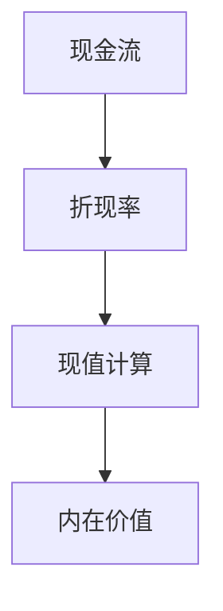

                 


# 杰里米格兰瑟姆的资产定价理论

> 关键词：杰里米格兰瑟姆，资产定价，价值投资，内在价值，安全边际

> 摘要：本文深入探讨了杰里米格兰瑟姆的资产定价理论，分析其核心概念、投资策略、数学模型和实际案例。通过详细解释内在价值评估、市场周期理论、选股策略及投资组合管理，本文为读者提供了全面的理解和应用指导。

---

## 第一部分: 资产定价理论的背景与重要性

### 第1章: 资产定价理论的背景与重要性

#### 1.1 资产定价理论的定义与核心概念
##### 1.1.1 资产定价的基本问题
资产定价的核心在于确定资产的公允价值，这涉及市场参与者的预期、风险偏好和市场流动性等因素。本文通过分析这些因素，揭示了资产定价的复杂性。

##### 1.1.2 资产定价理论的演变
从古典经济学到现代金融学，资产定价理论经历了从简单到复杂的演变。本文梳理了这一过程，强调了格兰瑟姆在其中的独特贡献。

##### 1.1.3 格兰瑟姆在资产定价中的贡献
作为价值投资的倡导者，格兰瑟姆提出了内在价值的概念，强调市场情绪和基本面分析的重要性。

#### 1.2 投资者行为与市场效率
##### 1.2.1 投资者心理与市场波动
投资者的心理偏差如过度乐观和从众心理如何影响市场波动，格兰瑟姆对此进行了深入分析。

##### 1.2.2 市场有效性的不同观点
本文探讨了有效市场假说与格兰瑟姆的价值投资理念之间的冲突，指出市场短期波动与长期价值的分离。

##### 1.2.3 格兰瑟姆的价值投资理念
格兰瑟姆的价值投资强调安全边际和长期持有，本文通过图表分析其与传统投资策略的差异。

---

## 第二部分: 格兰瑟姆的内在价值评估方法

### 第2章: 内在价值评估的核心方法

#### 2.1 现金流折现模型（DCF）
##### 2.1.1 DCF模型的步骤
1. 估计未来现金流。
2. 选择合适的折现率。
3. 计算现值并加总，得出内在价值。

##### 2.1.2 使用mermaid绘制DCF模型


#### 2.2 市盈率与市净率分析
##### 2.2.1 市盈率分析
通过比较市盈率与行业平均，识别低估或高估的股票。公式为P/E = 价格/每股收益。

##### 2.2.2 市净率分析
适用于资产密集型行业，公式为P/B = 价格/每股净资产。

---

## 第三部分: 格兰瑟姆的市场周期理论

### 第3章: 市场周期与投资机会

#### 3.1 市场周期的四个阶段
##### 3.1.1 衰退期
市场低迷，股票价格低于内在价值，提供买入机会。

##### 3.1.2 复苏期
市场逐步复苏，价值投资者开始布局。

##### 3.1.3 繁荣期
市场过度上涨，投资者需警惕风险。

##### 3.1.4 衰退期
市场恐慌，股票价格可能远低于内在价值。

#### 3.2 市场情绪与投资者行为
##### 3.2.1 市场情绪的波动
通过分析市场情绪指数，识别投资机会。

##### 3.2.2 投资者心理对市场的影响
过度自信和恐惧如何影响投资决策。

---

## 第四部分: 格兰瑟姆的选股策略

### 第4章: 选股策略与风险控制

#### 4.1 选股的基本原则
##### 4.1.1 寻找低估的股票
通过比较市盈率和市净率，识别低估股票。

##### 4.1.2 公司基本面分析
分析财务报表，评估公司盈利能力和成长性。

##### 4.1.3 财务指标评估
重点关注ROE、债务水平和现金流状况。

#### 4.2 格兰瑟姆的筛选标准
##### 4.2.1 市盈率低于平均值
##### 4.2.2 市净率低于行业平均水平
##### 4.2.3 股息率合理范围
股息率不宜过高或过低。

---

## 第五部分: 投资策略的数学模型

### 第5章: 数学模型与实战应用

#### 5.1 内在价值计算公式
使用DCF模型计算内在价值：
$$ V = \sum_{t=1}^{n} \frac{CF_t}{(1 + r)^t} + \frac{TV}{(1 + r)^n} $$
其中，CF_t是第t年的现金流，r是折现率，TV是终值。

#### 5.2 市场情绪指数计算
通过Python代码计算市场情绪指数：
```python
import pandas as pd
import numpy as np

def calculate_market_sentiment(stocks, benchmark):
    sentiment = stocks / benchmark
    avg_sentiment = np.mean(sentiment)
    return avg_sentiment
```

---

## 第六部分: 投资实战与案例分析

### 第6章: 实战案例分析

#### 6.1 可口可乐的内在价值评估
##### 6.1.1 公司基本面分析
分析可口可乐的盈利能力、市场份额和现金流。

##### 6.1.2 计算内在价值
使用DCF模型计算可口可乐的内在价值，与当前股价对比。

#### 6.2 通用电气的案例
##### 6.2.1 识别风险
分析通用电气的债务水平和现金流状况。

##### 6.2.2 投资决策
基于内在价值和市场情绪，决定是否买入或卖出。

---

## 第七部分: 投资策略与风险管理

### 第7章: 投资策略与风险管理

#### 7.1 投资组合管理
##### 7.1.1 分散投资
通过多样化降低风险。

##### 7.1.2 定期再平衡
根据市场变化调整投资组合。

#### 7.2 风险管理策略
##### 7.2.1 设置止损点
防止损失过大。

##### 7.2.2 资金管理
合理分配资金，避免过度集中。

---

## 第八部分: 总结与展望

### 第8章: 总结与展望

#### 8.1 格兰瑟姆理论的总结
##### 8.1.1 核心观点回顾
内在价值、安全边际和长期持有。

#### 8.2 投资实战技巧
##### 8.2.1 选择低估股票的方法
##### 8.2.2 如何进行风险评估
##### 8.2.3 长期投资的重要性

#### 8.3 注意事项与未来研究
##### 8.3.1 格兰瑟姆理论的局限性
##### 8.3.2 未来研究方向
结合现代金融理论，进一步优化资产定价模型。

---

通过以上结构，本文系统地介绍了杰里米格兰瑟姆的资产定价理论，从理论基础到实际应用，帮助读者全面理解和应用这一投资策略。

