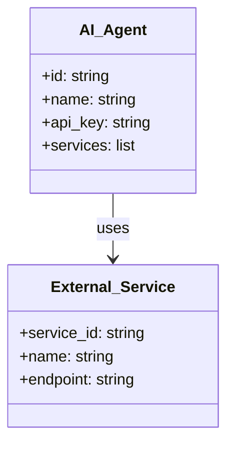
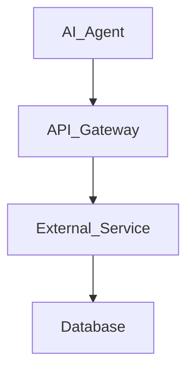
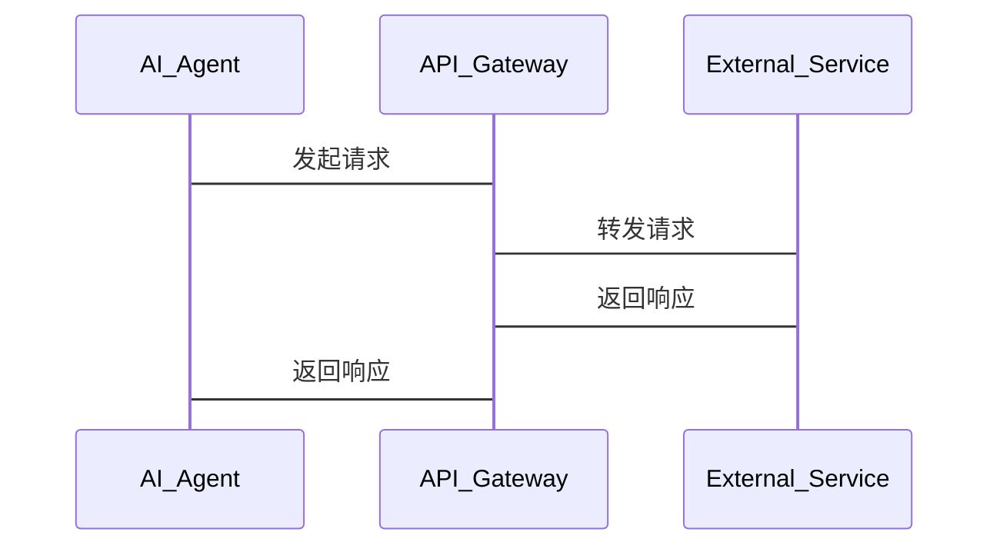

                 


# 构建AI Agent的API集成能力：连接外部服务

## 关键词：AI Agent, API集成, 外部服务, RESTful API, OAuth2.0, 系统架构, 项目实战

## 摘要：本文详细探讨了构建AI Agent的API集成能力，重点介绍了API的设计原则、核心算法、系统架构和实际项目案例。通过分析API的重要性、挑战与解决方案，帮助读者掌握AI Agent与外部服务连接的关键技术。

---

# 第一部分: AI Agent与API集成的背景与基础

## 第1章: AI Agent与API集成概述

### 1.1 AI Agent的基本概念

#### 1.1.1 AI Agent的定义
AI Agent（人工智能代理）是一种能够感知环境、自主决策并执行任务的智能实体。它可以理解用户需求，主动提供解决方案，并与外部系统交互。

#### 1.1.2 AI Agent的核心特征
- **自主性**：无需外部干预，自主决策。
- **反应性**：实时感知环境变化并调整行为。
- **目标导向**：基于目标执行任务。
- **社交能力**：与人类或其他系统有效交互。

#### 1.1.3 AI Agent与传统程序的区别
| 特性 | AI Agent | 传统程序 |
|------|----------|----------|
| 决策 | 自主决策 | 严格遵循指令 |
| 学习 | 可学习和适应 | 无法学习 |
| 交互 | 具备社交能力 | 仅执行任务 |

### 1.2 API集成的背景与重要性

#### 1.2.1 API的定义与作用
API（应用程序编程接口）是系统间的通信接口，允许不同系统交换数据或调用功能。它是AI Agent连接外部服务的桥梁。

#### 1.2.2 API在AI Agent中的应用场景
- 数据获取：从第三方服务获取数据。
- 服务调用：调用外部API执行特定任务。
- 实时交互：与用户或其他系统实时通信。

#### 1.2.3 API集成对AI Agent能力的提升
- **扩展性**：通过API连接更多服务，增强功能。
- **复用性**：复用现有服务，减少开发成本。
- **灵活性**：快速适应环境变化。

### 1.3 AI Agent与外部服务连接的挑战

#### 1.3.1 API兼容性问题
- 不同API的协议和格式差异可能导致兼容性问题。
- 需要处理版本更新和接口变更。

#### 1.3.2 数据安全与隐私保护
- API集成可能涉及敏感数据，需防止数据泄露和未授权访问。
- 遵守数据保护法规，如GDPR。

#### 1.3.3 API性能优化
- 高并发调用可能导致性能瓶颈。
- 需优化API调用频率和数据传输效率。

### 1.4 本章小结
本章介绍了AI Agent的基本概念和API集成的重要性，分析了集成过程中的主要挑战，并为后续章节奠定了基础。

---

# 第二部分: API集成的核心概念与技术

## 第2章: API的设计与分类

### 2.1 API的设计原则

#### 2.1.1 RESTful API设计规范
REST（Representational State Transfer）是设计API的常用风格，强调资源和操作的统一。

- **资源导向**：将API设计为资源的集合，每个资源对应一个URL。
- **统一接口**：使用HTTP动词（GET、POST、PUT、DELETE）操作资源。

#### 2.1.2 API版本控制策略
- **URI版本控制**：通过在URL中添加版本号。
- **HTTP头部版本控制**：通过添加版本相关的HTTP头。
- **内容协商**：通过Accept头指定数据格式版本。

#### 2.1.3 API文档编写标准
- **开放API规范**：使用Swagger或OpenAPI定义接口文档。
- **文档托管平台**：使用GitHub或Confluence托管API文档。

### 2.2 API的分类与应用场景

#### 2.2.1 REST API
- **特点**：基于HTTP协议，支持JSON数据格式。
- **应用场景**：Web应用、移动应用。

#### 2.2.2 GraphQL API
- **特点**：客户端指定所需数据，减少多次请求。
- **应用场景**：数据复杂度高的场景，如社交网络。

#### 2.2.3 Web Socket API
- **特点**：双向通信，实时性强。
- **应用场景**：实时聊天、游戏服务器。

### 2.3 API的协议与实现方式

#### 2.3.1 HTTP协议
- **请求方法**：GET、POST、PUT、DELETE。
- **状态码**：200、404、500等。

#### 2.3.2 JSON与XML数据格式
- **JSON**：轻量级，易于解析。
- **XML**：结构化强，但解析复杂。

#### 2.3.3 OAuth2.0认证机制
- **授权码流**：适用于Web应用。
- **简化流程**：适用于移动应用。

### 2.4 本章小结
本章详细讲解了API的设计原则、分类和协议，为后续实现奠定了理论基础。

---

# 第三部分: API集成的算法原理与实现

## 第3章: API请求与响应流程

### 3.1 API请求流程

#### 3.1.1 请求发起
- **发起方**：AI Agent。
- **请求方式**：HTTP GET、POST等。

#### 3.1.2 请求路由
- **路由表**：根据URL将请求分发到相应服务。
- **中间件处理**：如API Gateway处理请求。

### 3.2 API响应流程

#### 3.2.1 响应处理
- **解析响应**：将返回的数据解析为可用格式。
- **错误处理**：处理HTTP错误码和异常情况。

#### 3.2.2 响应返回
- **数据转换**：将数据转换为适合展示的格式。
- **返回客户端**：通过HTTP响应返回客户端。

### 3.3 API认证与授权

#### 3.3.1 OAuth2.0认证流程
1. **授权码获取**：客户端请求授权码。
2. **令牌获取**：使用授权码换取访问令牌。
3. **令牌验证**：验证访问令牌的有效性。

#### 3.3.2 RESTful API设计流程
1. **资源识别**：识别需要操作的资源。
2. **操作定义**：定义资源的CRUD操作。
3. **接口设计**：设计接口的URL和HTTP方法。

### 3.4 本章小结
本章通过详细分析API请求与响应的流程，讲解了API集成的关键步骤和认证机制。

---

# 第四部分: 系统架构与设计

## 第4章: 系统架构设计

### 4.1 领域模型设计

#### 4.1.1 领域模型概述
- **领域模型**：AI Agent需要处理的核心业务逻辑。
- **数据模型**：定义数据结构和关系。

#### 4.1.2 领域模型类图


### 4.2 系统架构设计

#### 4.2.1 系统架构图


### 4.3 接口设计与交互

#### 4.3.1 接口设计
- **输入**：API请求参数。
- **输出**：API响应结果。

#### 4.3.2 交互流程


### 4.4 本章小结
本章通过系统架构设计和交互流程图，展示了AI Agent如何通过API集成外部服务。

---

# 第五部分: 项目实战

## 第5章: 项目实战：AI Agent集成API

### 5.1 环境搭建

#### 5.1.1 工具安装
- **Python**：编程语言。
- **Flask**：Web框架。
- **Postman**：API测试工具。

#### 5.1.2 依赖库安装
- **requests**：HTTP请求库。
- **flask**：API框架。

### 5.2 系统核心实现

#### 5.2.1 API Gateway实现
```python
from flask import Flask
app = Flask(__name__)

@app.route('/api', methods=['GET', 'POST'])
def handle_request():
    # 获取请求参数
    endpoint = request.args.get('endpoint')
    method = request.args.get('method')
    data = request.json
    
    # 调用外部服务
    response = requests.request(method, endpoint, json=data)
    
    return response.text
```

#### 5.2.2 AI Agent实现
```python
import requests

class AI_Agent:
    def __init__(self, api_key):
        self.api_key = api_key
    
    def call_api(self, endpoint, method, data=None):
        headers = {'Authorization': f'Bearer {self.api_key}'}
        response = requests.request(method, endpoint, headers=headers, json=data)
        return response.json()
```

### 5.3 代码实现与解读

#### 5.3.1 API Gateway代码解读
- **Flask框架**：创建一个简单的Web服务器。
- **路由处理**：处理来自AI Agent的API请求，并转发到外部服务。

#### 5.3.2 AI Agent代码解读
- **API Key管理**：通过API Key进行身份认证。
- **API调用**：通过requests库调用外部API，并返回结果。

### 5.4 案例分析与总结

#### 5.4.1 案例分析
- **场景**：AI Agent调用天气API获取天气信息。
- **实现步骤**：
  1. AI Agent获取天气API的访问令牌。
  2. 调用天气API获取天气数据。
  3. 处理数据并返回给用户。

#### 5.4.2 经验总结
- **安全性**：妥善管理API Key，防止泄露。
- **性能优化**：缓存常用数据，减少API调用次数。
- **错误处理**：记录日志，快速定位问题。

### 5.5 本章小结
本章通过一个实际案例展示了AI Agent如何集成外部API，并总结了项目实施的经验和注意事项。

---

# 第六部分: 最佳实践与扩展阅读

## 第6章: 最佳实践

### 6.1 安全性注意事项
- **API Key管理**：使用加密方式存储API Key。
- **HTTPS通信**：确保API通信使用SSL加密。
- **访问控制**：限制API的访问权限。

### 6.2 性能优化建议
- **缓存机制**：缓存常用数据，减少API调用次数。
- **限流策略**：防止API被滥用，限制调用频率。
- **负载均衡**：分散API请求压力。

### 6.3 文档管理
- **API文档**：使用Swagger等工具生成API文档。
- **版本控制**：记录API接口的变更历史。
- **反馈机制**：收集用户对API的使用反馈。

### 6.4 本章小结
本章总结了API集成中的最佳实践，帮助读者在实际项目中避免常见错误，提升系统性能和安全性。

---

## 结语
通过本文的详细讲解，读者可以全面掌握构建AI Agent的API集成能力，从理论到实践，从设计到实现，为实际项目提供了坚实的基础。未来，随着技术的发展，API集成将更加重要，希望本文能为读者提供有价值的指导和参考。

---

## 参考文献
- RESTful API设计规范
- OAuth2.0官方文档
- OpenAPI Specifications
- Flask官方文档
- Swagger UI官方文档

