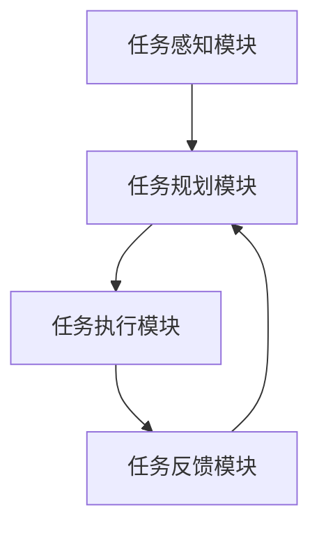

                 


# 构建AI Agent的动态任务规划与执行框架

---

## 关键词：
AI Agent, 动态任务规划, 执行框架, 多智能体协作, 强化学习, 任务分解

---

## 摘要：
本文详细探讨了构建AI Agent的动态任务规划与执行框架的核心原理、算法实现及系统设计。从AI Agent的基本概念出发，分析了动态任务规划的重要性与挑战，深入讲解了基于模型与无模型的动态任务规划算法，结合多智能体协作的任务分配与通信机制，提出了一个完整的动态任务规划与执行框架。通过实际案例分析，展示了如何在复杂动态环境中实现高效的AI Agent任务规划与执行。

---

# 第1章: AI Agent与动态任务规划概述

## 1.1 AI Agent的基本概念

### 1.1.1 AI Agent的定义
AI Agent（人工智能代理）是指能够感知环境、自主决策并执行任务的智能实体。它可以是一个软件程序、机器人或其他智能系统，具备以下核心特征：
- **自主性**：能够独立决策和行动，无需外部干预。
- **反应性**：能够实时感知环境并做出响应。
- **目标导向性**：具备明确的目标，并通过行动实现目标。

### 1.1.2 AI Agent的核心特征
AI Agent的设计需要考虑以下几个方面：
- **感知能力**：通过传感器或其他输入方式感知环境状态。
- **推理能力**：基于感知信息进行逻辑推理，生成决策。
- **行动能力**：根据决策执行具体操作，如发送消息、驱动设备等。

### 1.1.3 动态任务规划的定义与特点
动态任务规划是指在不确定、动态变化的环境中，AI Agent根据实时信息调整任务优先级和执行顺序的过程。其特点包括：
- **实时性**：能够快速响应环境变化。
- **灵活性**：能够适应任务目标的变化。
- **鲁棒性**：在面对不确定性时仍能完成任务。

---

## 1.2 动态任务规划的重要性

### 1.2.1 动态环境下的任务规划需求
在现实场景中，环境往往是动态变化的，例如交通调度中的车辆路径规划、物流配送中的订单分配等。AI Agent需要能够根据实时信息调整任务执行策略。

### 1.2.2 动态任务规划的核心价值
动态任务规划能够提高AI Agent的适应性和效率，使其在复杂环境中仍能高效完成任务。例如，在自动驾驶中，动态任务规划可以帮助车辆实时调整路径以应对交通拥堵。

### 1.2.3 动态任务规划的应用场景
动态任务规划广泛应用于以下场景：
- **物流配送**：根据实时交通状况调整配送路径。
- **智能交通系统**：实时优化交通流量。
- **机器人协作**：多机器人协作完成复杂任务。

---

## 1.3 动态任务规划的现状与挑战

### 1.3.1 当前研究进展
目前，动态任务规划的研究主要集中在以下几个方面：
- 基于强化学习的动态任务规划算法。
- 多智能体协作的任务分配与协调。

### 1.3.2 动态任务规划的主要挑战
动态任务规划面临以下挑战：
- **环境不确定性**：如何在不确定的环境中做出最优决策。
- **任务冲突**：多个任务之间的优先级如何协调。
- **计算效率**：动态规划算法的计算效率直接影响任务执行的实时性。

### 1.3.3 未来研究方向
未来的研究可以集中在以下几个方向：
- **强化学习优化**：进一步提高强化学习算法的效率和效果。
- **多智能体协作优化**：研究如何在大规模多智能体系统中实现高效的动态任务规划。

---

## 1.4 本章小结
本章介绍了AI Agent的基本概念、动态任务规划的重要性及其在现实中的应用场景，并分析了动态任务规划面临的挑战和未来研究方向。

---

# 第2章: 任务规划与执行的核心概念

## 2.1 任务规划的基本原理

### 2.1.1 任务分解与组合
任务分解是将复杂任务分解为多个子任务，例如将“完成订单”分解为“接收订单”、“分配配送员”、“配送”等步骤。任务组合则是将这些子任务按照一定的顺序组合起来。

### 2.1.2 任务优先级与调度
任务优先级决定了任务的执行顺序。例如，在紧急订单优先处理的场景中，紧急订单的优先级高于普通订单。

### 2.1.3 任务执行的状态管理
任务执行的状态管理包括任务的启动、执行、完成和终止等状态的管理。

---

## 2.2 动态环境中的任务规划

### 2.2.1 动态环境的定义与特征
动态环境是指环境状态会随着时间推移而发生变化的环境。例如，交通流量的变化、天气的变化等。

### 2.2.2 动态任务的变化类型
动态任务的变化类型包括：
- **任务目标变化**：任务的目标发生改变，例如从“配送货物”改为“优先配送紧急订单”。
- **任务优先级变化**：任务的优先级发生变化，例如紧急订单的优先级提高。

### 2.2.3 动态任务规划的适应性要求
动态任务规划需要具备以下适应性要求：
- **实时感知**：能够实时感知环境变化。
- **动态调整**：能够根据环境变化动态调整任务执行计划。

---

## 2.3 多智能体协作的任务规划

### 2.3.1 多智能体协作的定义
多智能体协作是指多个AI Agent协同工作，共同完成一个或多个任务。

### 2.3.2 多智能体任务分配与协调
多智能体任务分配需要考虑以下因素：
- **任务分配策略**：例如基于优先级的任务分配、基于能力的任务分配。
- **任务协调机制**：例如任务同步、任务排队。

### 2.3.3 多智能体协作中的通信机制
多智能体协作需要高效的通信机制，例如通过消息队列或事件总线进行通信。

---

## 2.4 本章小结
本章详细介绍了任务规划的基本原理、动态环境中的任务规划以及多智能体协作的任务规划。

---

# 第3章: 动态任务规划算法原理

## 3.1 基于模型的动态任务规划算法

### 3.1.1 基于状态空间的搜索算法
基于状态空间的搜索算法是一种经典的动态任务规划算法，例如A*算法和Dijkstra算法。

#### A*算法
A*算法是一种基于优先队列的最短路径搜索算法，其搜索策略基于启发式函数。

$$ f(n) = g(n) + h(n) $$

其中：
- \( g(n) \) 表示从起点到节点n的已知成本。
- \( h(n) \) 表示从节点n到目标的估计成本。

#### Dijkstra算法
Dijkstra算法是一种单源最短路径算法，适用于图中所有节点的最短路径计算。

$$ \text{初始化：} \quad \text{所有节点的距离初始化为无穷大，起点距离为0} $$
$$ \text{循环：} \quad \text{取出距离最近的节点，更新其邻接节点的距离} $$

---

### 3.1.2 基于马尔可夫决策过程的规划算法
马尔可夫决策过程（MDP）是一种用于描述决策过程的数学模型，广泛应用于强化学习领域。

$$ \text{状态转移概率：} \quad P(s', r | s, a) $$
$$ \text{值函数：} \quad V(s) = \max_{a} \sum_{s'} P(s', r | s, a) [r + V(s')] $$

---

### 3.1.3 基于图模型的任务规划算法
基于图模型的任务规划算法将任务分解为图中的节点，任务之间的依赖关系为边。

$$ \text{图模型表示：} \quad G = (N, E) $$
其中，\( N \) 是节点集合，\( E \) 是边集合。

---

## 3.2 基于无模型的动态任务规划算法

### 3.2.1 基于强化学习的动态任务规划
强化学习是一种通过试错机制学习最优策略的方法。

$$ \text{策略优化：} \quad \theta_{t+1} = \theta_t + \alpha (r + \gamma V(s) - Q(s, a)) \cdot \nabla Q(s, a, \theta_t) $$

其中：
- \( \alpha \) 是学习率。
- \( \gamma \) 是折扣因子。
- \( Q(s, a, \theta_t) \) 是Q值函数。

---

### 3.2.2 基于Q-learning的动态任务规划
Q-learning是一种经典的强化学习算法，适用于离散动作空间和状态空间。

$$ Q(s, a) = Q(s, a) + \alpha [r + \gamma \max Q(s', a') - Q(s, a)] $$

---

### 3.2.3 基于深度强化学习的动态任务规划
深度强化学习结合了深度学习和强化学习的优势，适用于高维状态空间和动作空间。

$$ \text{深度Q网络：} \quad Q(s, a) = \text{神经网络}(s) \cdot a $$

---

## 3.3 动态任务规划的混合方法

### 3.3.1 混合规划算法的定义
混合规划算法是将基于模型和无模型的动态任务规划算法结合起来，利用两者的优势。

### 3.3.2 基于模型与无模型的混合规划
混合规划算法可以根据环境的动态性选择不同的规划方法。

### 3.3.3 混合规划算法的优势与挑战
混合规划算法的优势在于能够同时利用基于模型算法的精确性和无模型算法的灵活性。

---

## 3.4 本章小结
本章详细介绍了动态任务规划的主要算法，包括基于模型的算法、基于无模型的算法以及混合方法。

---

# 第4章: 动态任务规划系统架构与实现

## 4.1 系统功能模块划分

### 4.1.1 任务感知模块
任务感知模块负责感知环境信息，例如传感器数据、用户请求等。

### 4.1.2 任务规划模块
任务规划模块负责根据感知信息生成任务执行计划。

### 4.1.3 任务执行模块
任务执行模块负责执行任务规划模块生成的任务计划。

### 4.1.4 任务反馈模块
任务反馈模块负责收集任务执行结果并反馈给任务规划模块。

---

## 4.2 系统架构设计

### 4.2.1 系统功能模型
系统功能模型是一个描述系统功能的抽象模型，通常包括输入、处理和输出三部分。

### 4.2.2 系统架构设计图
以下是一个动态任务规划系统的架构设计图：



---

## 4.3 本章小结
本章详细介绍了动态任务规划系统的功能模块划分和系统架构设计。

---

# 第5章: 动态任务规划的项目实战

## 5.1 项目背景介绍

### 5.1.1 项目目标
本项目的目标是实现一个动态任务规划系统，能够在复杂动态环境中高效完成任务。

### 5.1.2 项目需求
项目需求包括：
- 实现实时任务感知。
- 实现动态任务规划。
- 实现任务执行与反馈。

---

## 5.2 系统核心实现源代码

### 5.2.1 环境安装
需要安装以下工具：
- Python 3.8+
- TensorFlow 2.0+
- matplotlib 3.0+

### 5.2.2 动态任务规划算法实现

```python
import numpy as np
import random

class TaskPlanner:
    def __init__(self, tasks):
        self.tasks = tasks
        self.current_task = None

    def perceive_environment(self):
        # 模拟环境感知
        return random.choice(self.tasks)

    def plan_task(self):
        # 模拟任务规划
        self.current_task = self.perceive_environment()
        return self.current_task

    def execute_task(self):
        # 模拟任务执行
        print(f"执行任务：{self.current_task}")

# 示例用法
tasks = ["配送订单", "处理退单", "客户咨询"]
planner = TaskPlanner(tasks)
planner.plan_task()
planner.execute_task()
```

---

## 5.3 代码应用解读与分析

### 5.3.1 代码功能解读
上述代码实现了一个简单的动态任务规划系统，包括任务感知、任务规划和任务执行三个模块。

### 5.3.2 代码实现细节
- `TaskPlanner`类初始化时接收任务列表。
- `perceive_environment`方法模拟环境感知。
- `plan_task`方法根据感知结果生成任务计划。
- `execute_task`方法执行任务。

---

## 5.4 案例分析

### 5.4.1 案例背景
假设我们有一个物流配送系统，需要在动态交通环境中优化配送路径。

### 5.4.2 案例分析
通过动态任务规划算法，系统能够实时调整配送路径，避开交通拥堵，提高配送效率。

---

## 5.5 项目小结
本章通过一个具体项目展示了动态任务规划系统的实现过程，包括环境感知、任务规划和任务执行。

---

# 第6章: 总结与展望

## 6.1 本章总结
本文详细探讨了AI Agent的动态任务规划与执行框架的核心原理、算法实现及系统设计。从AI Agent的基本概念出发，分析了动态任务规划的重要性与挑战，深入讲解了基于模型与无模型的动态任务规划算法，结合多智能体协作的任务分配与通信机制，提出了一个完整的动态任务规划与执行框架。

---

## 6.2 未来研究方向

### 6.2.1 强化学习优化
未来可以进一步研究强化学习算法的优化，例如引入更深的神经网络结构和更高效的训练方法。

### 6.2.2 多智能体协作优化
未来可以研究如何在大规模多智能体系统中实现高效的动态任务规划。

### 6.2.3 实时性优化
未来可以研究如何进一步提高动态任务规划算法的实时性，例如通过分布式计算和并行处理。

---

## 6.3 注意事项
动态任务规划系统的设计需要考虑系统的实时性、鲁棒性和可扩展性。在实际应用中，需要根据具体场景选择合适的算法和架构。

---

## 6.4 拓展阅读
推荐以下书籍和论文：
- 《Reinforcement Learning: Theory and Algorithms》
- 《Multi-Agent Systems: Algorithmic, Complexity Theoretic, and Game Theoretic Foundations》
- 《Dynamic Task Planning in AI Agents: A Survey》

---

## 6.5 小结
本文为构建AI Agent的动态任务规划与执行框架提供了理论基础和实践指导，为未来的进一步研究提供了参考。

---

# 结语
动态任务规划是AI Agent实现智能决策的核心技术。通过本文的探讨，我们希望能够为读者提供一个全面的动态任务规划框架，帮助他们在实际应用中更好地实现AI Agent的任务规划与执行。

--- 

# 附录

## 附录A: 术语表
- AI Agent：人工智能代理。
- 动态任务规划：在动态环境中实时调整任务计划的过程。
- 多智能体协作：多个AI Agent协同工作的过程。

## 附录B: 参考文献
- Russell, S., & Norvig, P. (2010). Artificial Intelligence: A Modern Approach.
- Sutton, R. S., & Barto, A. G. (2018). Reinforcement Learning: Theory and Algorithms.
- Lighthill, J. (1975). How to plan and make progress in AI.

