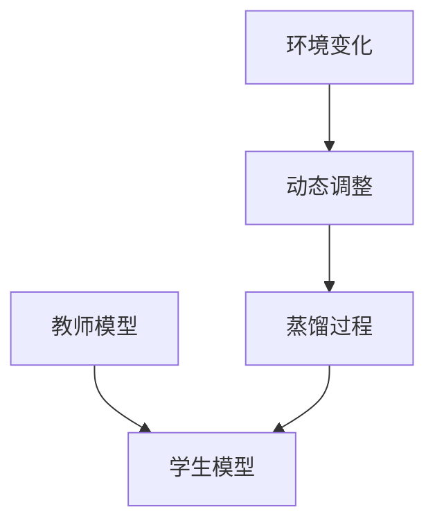
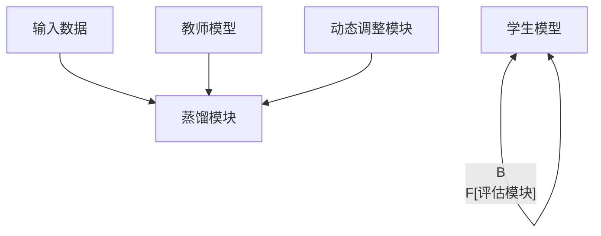
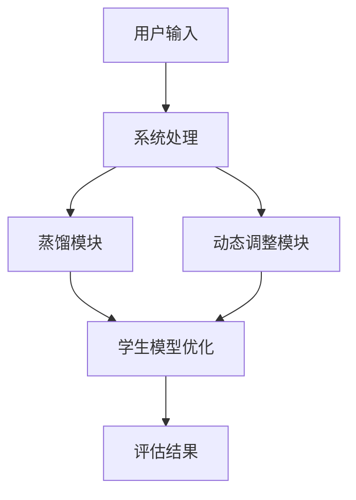

                 


# 《构建AI Agent的动态知识蒸馏机制》

> **关键词**：知识蒸馏、动态知识蒸馏、AI Agent、机器学习、深度学习  
> **摘要**：本文深入探讨了构建AI Agent的动态知识蒸馏机制，分析了动态知识蒸馏的核心概念、算法原理、系统设计及实际应用。通过详细阐述动态蒸馏的实现方法、优化策略及案例分析，为读者提供了一套完整的动态知识蒸馏解决方案。

## 第一部分: 动态知识蒸馏机制概述

### 第1章: 动态知识蒸馏机制的背景与概念

#### 1.1 知识蒸馏的基本概念
- **1.1.1 知识蒸馏的定义**：知识蒸馏是一种将复杂模型（教师模型）的知识迁移到简单模型（学生模型）的技术。
- **1.1.2 知识蒸馏的核心思想**：通过教师模型的软标签（概率分布）引导学生模型学习，从而提升学生模型的性能。
- **1.1.3 知识蒸馏的应用场景**：适用于模型压缩、多任务学习、跨领域迁移等场景。

#### 1.2 动态知识蒸馏的必要性
- **1.2.1 静态蒸馏的局限性**：静态蒸馏在处理动态变化的场景时，难以适应数据分布的变化。
- **1.2.2 动态蒸馏的优势**：能够根据数据分布的变化动态调整蒸馏策略，提升模型的适应性。
- **1.2.3 动态蒸馏的适用场景**：适用于在线学习、流数据处理、实时任务等动态环境。

#### 1.3 AI Agent与知识蒸馏的结合
- **1.3.1 AI Agent的基本概念**：AI Agent是一种能够感知环境、自主决策并执行任务的智能体。
- **1.3.2 知识蒸馏在AI Agent中的作用**：通过蒸馏技术，提升AI Agent的学习效率和决策能力。
- **1.3.3 动态蒸馏对AI Agent性能的提升**：动态蒸馏使AI Agent能够快速适应新任务和环境变化。

### 第2章: 动态知识蒸馏的核心概念与联系

#### 2.1 动态知识蒸馏的原理
- **2.1.1 知识蒸馏的基本流程**：
  1. 教师模型生成软标签（概率分布）。
  2. 学生模型基于软标签进行学习。
  3. 蒸馏过程优化学生模型的参数。
- **2.1.2 动态蒸馏的实现机制**：
  - 动态调整蒸馏温度（Temperature）。
  - 动态选择蒸馏策略（Hard/Soft）。
  - 动态更新教师模型的参数。
- **2.1.3 动态蒸馏的核心算法**：
  - 算法1：动态温度调整的蒸馏算法。
  - 算法2：动态策略选择的蒸馏算法。

#### 2.2 动态知识蒸馏与传统蒸馏的对比
- **2.2.1 传统蒸馏的特点**：
  - 静态温度：蒸馏过程中温度固定。
  - 静态策略：蒸馏策略在整个训练过程中不变。
  - 静态教师模型：教师模型的参数在训练过程中固定。
- **2.2.2 动态蒸馏的创新点**：
  - 动态温度调整：根据数据分布变化动态调整温度。
  - 动态策略选择：根据任务需求动态选择硬蒸馏或软蒸馏。
  - 动态教师更新：根据学生模型的表现动态更新教师模型的参数。
- **2.2.3 两者的优缺点对比**：
  - 传统蒸馏的优点：简单易实现，计算效率高。
  - 传统蒸馏的缺点：无法适应动态变化的环境，模型适应性差。
  - 动态蒸馏的优点：能够适应动态环境，提升模型的适应性。
  - 动态蒸馏的缺点：计算复杂度较高，实现较为复杂。

#### 2.3 动态知识蒸馏的实体关系图
- **2.3.1 实体关系图的构建**：
  - 教师模型与学生模型之间的关系。
  - 蒸馏过程与动态调整的关系。
  - 动态调整与蒸馏策略的关系。
- **2.3.2 Mermaid流程图展示**：


### 第3章: 动态知识蒸馏的算法原理

#### 3.1 动态蒸馏算法的数学模型
- **3.1.1 概率分布的表示**：
  - 教师模型的软标签：$P(y|x) = \text{softmax}(f_T(x)/T)$。
  - 学生模型的预测：$P(y|x) = \text{softmax}(f_S(x)/T)$。
- **3.1.2 动态蒸馏的损失函数**：
  - 知识蒸馏损失：$L_{distill} = -\sum_{i=1}^n P(y_i|x) \log P(y_i|x_S)$。
  - 动态蒸馏损失：$L_{dynamic} = \lambda L_{distill} + (1-\lambda)L_{cross}$，其中$\lambda$为动态调整系数。

#### 3.2 动态蒸馏算法的实现步骤
- **3.2.1 初始化教师模型和学生模型**。
- **3.2.2 训练过程**：
  1. 教师模型生成软标签。
  2. 学生模型基于软标签进行训练。
  3. 动态调整蒸馏参数（温度、策略）。
  4. 评估学生模型的性能，动态更新教师模型的参数。
- **3.2.3 调整策略**：
  - 温度调整：动态调整温度$T$，$T_{new} = T_{old} \times (1 + \alpha \cdot \text{loss})$，其中$\alpha$为调整系数。
  - 策略选择：根据当前损失动态选择硬蒸馏或软蒸馏。

#### 3.3 动态蒸馏算法的数学公式
- **3.3.1 温度调整公式**：
  $$T_{new} = T_{old} \times e^{-\beta \cdot \text{loss}}$$
  其中$\beta$为温度衰减系数。
- **3.3.2 动态策略选择公式**：
  $$\lambda = \frac{1}{1 + e^{-\gamma \cdot (\text{loss}_S - \text{loss}_T)}}$$
  其中$\gamma$为策略选择系数。

### 第4章: 动态知识蒸馏的系统设计

#### 4.1 系统功能设计
- **4.1.1 系统输入**：训练数据、教师模型、动态调整策略。
- **4.1.2 系统输出**：优化后的学生模型。
- **4.1.3 核心功能模块**：
  - 蒸馏模块：负责知识蒸馏过程。
  - 动态调整模块：负责动态调整蒸馏参数。
  - 评估模块：负责评估学生模型的性能。

#### 4.2 系统架构设计
- **4.2.1 系统架构图**：


#### 4.3 接口设计
- **4.3.1 蒸馏模块接口**：
  - 输入：教师模型输出、学生模型输出。
  - 输出：蒸馏损失。
- **4.3.2 动态调整模块接口**：
  - 输入：当前损失、当前蒸馏参数。
  - 输出：调整后的蒸馏参数。
- **4.3.3 评估模块接口**：
  - 输入：学生模型预测结果。
  - 输出：评估指标（如准确率、F1分数等）。

#### 4.4 交互流程图


### 第5章: 动态知识蒸馏的项目实战

#### 5.1 环境配置
- **5.1.1 安装Python**：Python 3.8或更高版本。
- **5.1.2 安装TensorFlow/PyTorch**：选择一个深度学习框架。
- **5.1.3 安装其他依赖**：如numpy、scikit-learn等。

#### 5.2 核心代码实现
- **5.2.1 动态蒸馏算法实现**：
  ```python
  def dynamic_distillation(train_loader, teacher_model, student_model, epochs=100, T=1.0, alpha=0.1):
      for epoch in range(epochs):
          student_model.train()
          for batch_idx, (data, target) in enumerate(train_loader):
              # 教师模型输出
              teacher_output = teacher_model(data)
              # 学生模型输出
              student_output = student_model(data)
              # 软标签
              teacher_probs = F.softmax(teacher_output / T, dim=1)
              student_probs = F.softmax(student_output / T, dim=1)
              # 知识蒸馏损失
              loss_distill = -torch.sum(teacher_probs * torch.log(student_probs))
              # 动态调整温度
              current_loss = loss_distill.item()
              T_new = T * (1 + alpha * current_loss)
              # 动态蒸馏
              loss = loss_distill / len(data)
              # 反向传播和优化
              optimizer.zero_grad()
              loss.backward()
              optimizer.step()
              T = T_new
          # 动态调整策略
          # 更多动态调整逻辑...
  ```

#### 5.3 案例分析与优化
- **5.3.1 案例分析**：在图像分类任务中应用动态蒸馏算法，比较静态蒸馏和动态蒸馏的效果。
- **5.3.2 优化建议**：根据实验结果，调整动态蒸馏的参数（如温度衰减系数、策略选择系数等）。

### 第6章: 最佳实践与总结

#### 6.1 最佳实践
- **6.1.1 动态蒸馏的参数调整**：合理选择动态调整系数，避免过快或过慢的调整。
- **6.1.2 环境适应性**：动态蒸馏适用于在线学习和流数据处理场景。
- **6.1.3 模型选择**：选择合适的教师模型和学生模型，确保蒸馏效果。

#### 6.2 小结
- 动态知识蒸馏通过动态调整蒸馏策略，显著提升了AI Agent的适应性和性能。
- 本文详细讲解了动态蒸馏的核心概念、算法原理、系统设计及实际应用，为读者提供了一套完整的动态知识蒸馏解决方案。

#### 6.3 注意事项
- **6.3.1 训练时间**：动态蒸馏的计算复杂度较高，训练时间较长。
- **6.3.2 模型选择**：教师模型和学生模型的选择直接影响蒸馏效果。
- **6.3.3 超参数调整**：动态蒸馏的性能依赖于多个超参数的合理设置。

#### 6.4 拓展阅读
- 推荐阅读《Distilling the Knowledge in a Neural Network》和《Dynamic Knowledge Distillation for Neural Networks》等论文，深入了解动态蒸馏的最新研究成果。

---

通过以上目录，读者可以系统地学习构建AI Agent的动态知识蒸馏机制，从理论到实践，逐步掌握动态蒸馏的核心技术和实际应用。

