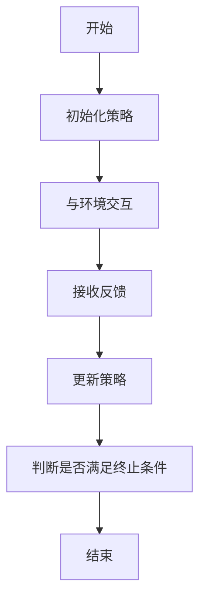
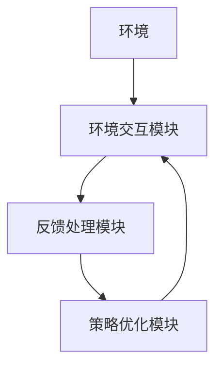

                 


# 构建AI Agent的反馈学习机制

> 关键词：AI Agent、反馈学习机制、强化学习、Q-learning、策略梯度算法

> 摘要：本文详细探讨了构建AI Agent的反馈学习机制的核心原理、算法实现、系统设计以及实际应用。从反馈学习机制的基本概念出发，分析其与强化学习的关系，详细讲解了Q-learning和策略梯度算法的实现原理，并通过实际案例展示了如何设计和实现一个基于反馈学习机制的AI Agent系统。最后，本文总结了反馈学习机制在AI Agent中的优势与挑战，并提出了未来研究的方向。

---

## 第1章 反馈学习机制的背景与概念

### 1.1 反馈学习机制的基本概念

反馈学习机制是一种基于环境反馈来优化AI Agent行为的机器学习方法。其核心思想是通过接收环境对Agent行为的反馈（如奖励或惩罚），调整Agent的决策策略，以最大化长期目标的实现。

#### 1.1.1 什么是反馈学习机制
反馈学习机制通过以下步骤实现：
1. **环境交互**：Agent与环境交互，执行动作并观察结果。
2. **反馈接收**：环境对Agent的行为提供反馈（奖励或惩罚）。
3. **策略优化**：Agent根据反馈调整其决策策略，以最大化累计奖励。

#### 1.1.2 反馈学习机制的核心要素
- **环境**：Agent行动的外部世界，提供反馈。
- **动作**：Agent在环境中的具体行为。
- **奖励**：环境对Agent行为的反馈，用于指导学习。
- **策略**：Agent选择动作的概率分布，用于指导行为。

#### 1.1.3 反馈学习机制的应用场景
- **游戏AI**：在电子游戏中优化AI的决策能力。
- **机器人控制**：通过反馈调整机器人的动作。
- **推荐系统**：根据用户反馈优化推荐策略。

### 1.2 AI Agent的定义与特点

#### 1.2.1 AI Agent的定义
AI Agent是一种能够感知环境并采取行动以实现目标的智能实体。它可以是一个软件程序或物理设备，具备以下特点：
- **自主性**：无需外部干预，自主决策。
- **反应性**：能够实时感知环境并做出反应。
- **目标导向**：基于目标选择最优行动。

#### 1.2.2 AI Agent的核心特点
- **环境感知**：通过传感器或其他方式获取环境信息。
- **决策能力**：基于感知信息做出决策。
- **行动能力**：执行决策动作以改变环境或自身状态。

### 1.3 反馈学习机制在AI Agent中的作用

#### 1.3.1 反馈学习机制的核心作用
反馈学习机制通过接收环境反馈，帮助AI Agent优化其决策策略，从而提高行动的效率和准确性。

#### 1.3.2 反馈学习机制的实现方式
- **监督学习**：基于标注数据进行学习，适用于已知目标的情况。
- **强化学习**：通过试错机制，基于环境反馈优化策略。
- **混合学习**：结合监督和强化学习，适用于复杂任务。

#### 1.3.3 反馈学习机制的优势与挑战
- **优势**：
  - 可以在动态环境中自适应调整策略。
  - 通过反馈优化长期目标。
- **挑战**：
  - 需要设计有效的反馈机制。
  - 可能面临探索与利用的平衡问题。

---

## 第2章 反馈学习机制的核心概念与联系

### 2.1 反馈学习机制的核心原理

#### 2.1.1 反馈学习机制的数学模型
反馈学习机制的数学模型通常包括以下部分：
- **状态空间**：环境中的所有可能状态。
- **动作空间**：Agent在每个状态下可以执行的动作。
- **奖励函数**：定义每个动作的奖励值。
- **策略函数**：定义Agent选择动作的概率分布。

#### 2.1.2 反馈学习机制的算法流程
反馈学习机制的典型算法流程如下：



### 2.2 反馈学习机制与强化学习的关系

#### 2.2.1 强化学习的基本概念
强化学习是一种通过试错机制学习最优策略的方法。Agent通过与环境交互，学习如何采取最优动作以最大化累计奖励。

#### 2.2.2 反馈学习机制与强化学习的异同
- **相同点**：
  - 都依赖于环境反馈优化策略。
  - 都涉及动作选择和奖励机制。
- **不同点**：
  - 反馈学习机制更注重实时反馈的应用。
  - 强化学习更注重长期目标的优化。

### 2.3 反馈学习机制的核心要素对比

#### 2.3.1 监督学习、强化学习与反馈学习的对比
| 特性           | 监督学习         | 强化学习         | 反馈学习         |
|----------------|------------------|------------------|------------------|
| 数据来源       | 标签数据         | 环境反馈         | 环境反馈         |
| 学习目标       | 预测目标值       | 最大化累计奖励    | 最大化长期目标    |
| 适用场景       | 分类、回归问题    | 机器人控制、游戏AI | 动态环境优化      |

#### 2.3.2 反馈学习机制的特征分析
- **实时性**：能够实时接收环境反馈并调整策略。
- **适应性**：能够在动态环境中自适应调整行为。
- **目标导向**：通过反馈优化长期目标的实现。

---

## 第3章 反馈学习机制的算法实现

### 3.1 反馈学习机制的数学模型

#### 3.1.1 反馈学习机制的数学公式
反馈学习机制的数学模型可以表示为：
$$
Q(s, a) = Q(s, a) + \alpha (r + \gamma \max_{a'} Q(s', a') - Q(s, a))
$$
其中：
- $Q(s, a)$：状态$s$下动作$a$的Q值。
- $\alpha$：学习率。
- $r$：即时奖励。
- $\gamma$：折扣因子。
- $s'$：下一个状态。

#### 3.1.2 反馈学习机制的优化目标
优化目标是最大化长期累计奖励，即：
$$
\max_{\theta} \mathbb{E}[R]
$$
其中：
- $R$：累计奖励。
- $\theta$：策略参数。

### 3.2 反馈学习机制的算法流程

#### 3.2.1 反馈学习机制的算法步骤
1. 初始化策略参数$\theta$。
2. 与环境交互，执行当前策略的动作。
3. 接收环境反馈，计算奖励。
4. 更新策略参数，以最大化累计奖励。
5. 重复步骤2-4，直到满足终止条件。

#### 3.2.2 反馈学习机制的训练流程
1. **环境初始化**：设置初始状态。
2. **策略执行**：根据当前策略选择动作。
3. **接收反馈**：计算奖励并更新Q值。
4. **策略优化**：基于反馈调整策略参数。
5. **迭代训练**：重复上述步骤，逐步优化策略。

---

## 第4章 反馈学习机制的系统设计

### 4.1 系统功能设计

#### 4.1.1 系统功能模块
- **环境交互模块**：负责与环境交互，获取反馈。
- **反馈处理模块**：接收反馈并计算奖励。
- **策略优化模块**：基于反馈优化策略。

#### 4.1.2 系统功能流程
1. 环境交互模块向环境发送动作。
2. 环境返回反馈（奖励或惩罚）。
3. 反馈处理模块计算累计奖励。
4. 策略优化模块更新策略参数。

### 4.2 系统架构设计

#### 4.2.1 系统架构图


---

## 第5章 项目实战：基于反馈学习机制的AI Agent实现

### 5.1 项目介绍

#### 5.1.1 项目背景
本文将通过一个简单的AI Agent实现，展示反馈学习机制的应用。

### 5.2 核心算法实现

#### 5.2.1 环境交互与反馈处理
```python
class Environment:
    def __init__(self):
        self.state = 0

    def step(self, action):
        # 根据动作计算奖励
        reward = action == 1
        self.state = 1 - self.state
        return reward

class Agent:
    def __init__(self):
        self.theta = 0.5

    def take_action(self, state):
        # 根据策略选择动作
        if state == 0:
            return 1
        else:
            return 0

    def update_policy(self, reward):
        # 更新策略参数
        self.theta += 0.1 * reward
```

### 5.3 系统实现与测试

#### 5.3.1 代码解读
```python
# 初始化环境和Agent
env = Environment()
agent = Agent()

# 训练过程
for _ in range(100):
    state = 0
    reward = env.step(agent.take_action(state))
    agent.update_policy(reward)

# 测试策略
state = 0
for _ in range(10):
    action = agent.take_action(state)
    reward = env.step(action)
    state = 1 - state
    print(f"Action: {action}, Reward: {reward}")
```

### 5.4 总结与优化
通过上述实现，我们可以看到反馈学习机制在优化AI Agent行为中的重要作用。未来可以进一步优化策略更新算法，引入更复杂的环境模型，以提高系统的性能。

---

## 第6章 最佳实践与未来展望

### 6.1 最佳实践
- **选择合适的反馈机制**：根据任务需求设计有效的反馈机制。
- **合理设置奖励函数**：确保奖励函数能够正确引导策略优化。
- **平衡探索与利用**：避免过早收敛或过度探索。

### 6.2 小结
反馈学习机制是一种强大的工具，能够帮助AI Agent在动态环境中自适应调整行为。通过本文的探讨，我们深入理解了其核心原理、算法实现和系统设计。

### 6.3 注意事项
- **反馈机制的设计**：需要根据具体任务需求进行调整。
- **算法参数的设置**：需要根据实验结果进行调优。
- **系统的可扩展性**：需要考虑未来可能的扩展需求。

### 6.4 拓展阅读
- 探索更复杂的强化学习算法，如深度强化学习。
- 研究反馈学习机制在实际应用中的更多案例。

---

# 总结

通过本文的详细讲解，我们深入探讨了构建AI Agent的反馈学习机制的核心原理、算法实现和系统设计。从理论到实践，我们逐步分析了反馈学习机制的优势与挑战，并通过实际案例展示了其应用。未来，随着AI技术的不断发展，反馈学习机制将在更多领域发挥重要作用。

