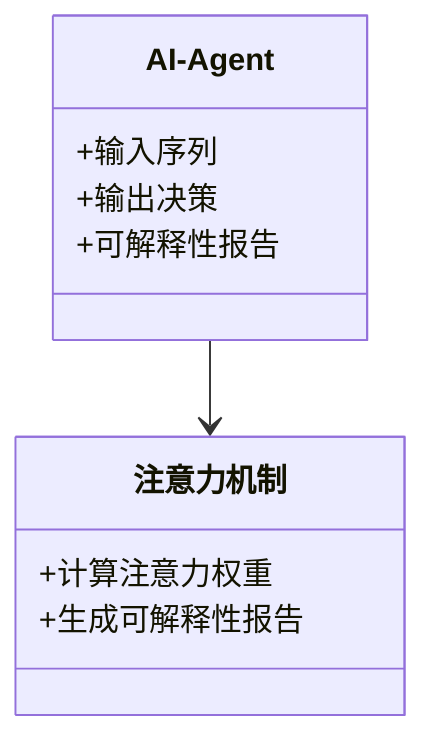
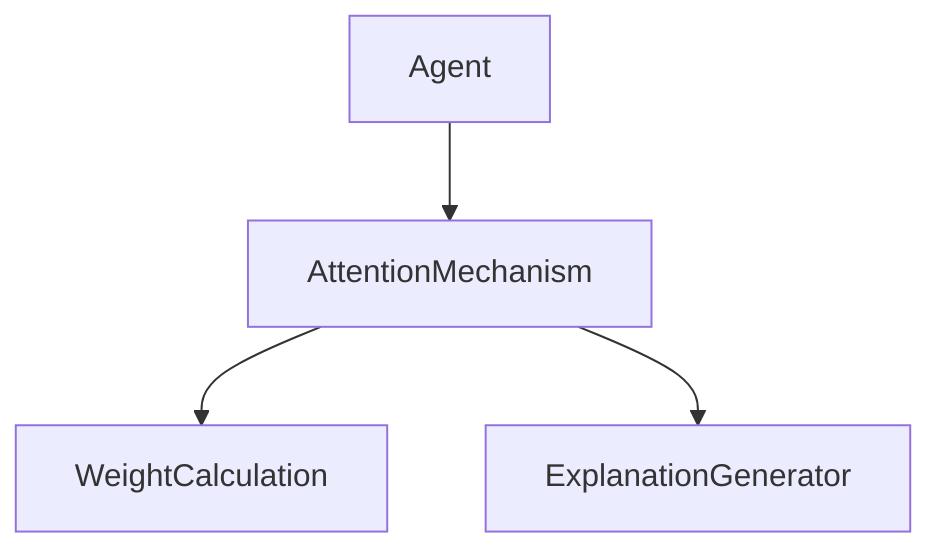
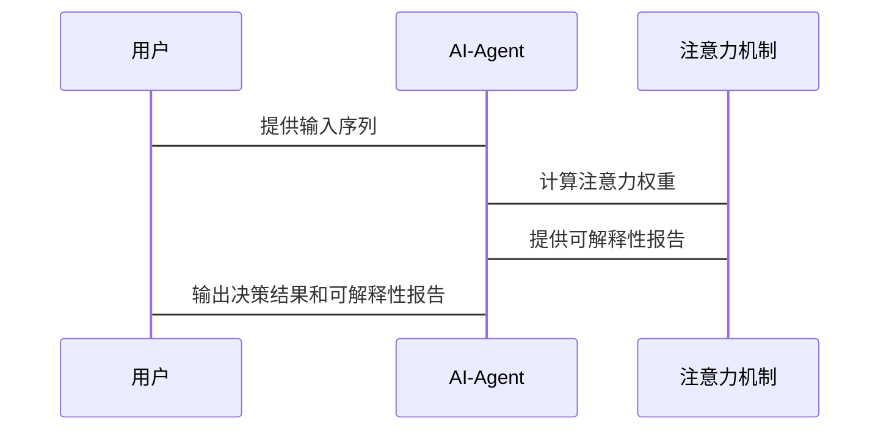

                 


# 构建AI Agent的可解释性注意力机制

## 关键词：AI Agent, 可解释性, 注意力机制, 自然语言处理, 深度学习

## 摘要：本文详细探讨了构建AI Agent的可解释性注意力机制，从背景、核心概念、算法原理到系统设计与项目实战，全面解析如何提升AI Agent的可解释性，特别是在自然语言处理中的应用。通过数学公式、代码实现和系统架构图的详细阐述，为读者提供从理论到实践的深度解析。

---

# 第一部分: AI Agent与可解释性注意力机制的背景介绍

## 第1章: AI Agent的基本概念与应用背景

### 1.1 AI Agent的定义与核心概念

AI Agent（人工智能代理）是指能够感知环境、做出决策并采取行动以实现目标的智能实体。AI Agent可以是软件程序、机器人或其他智能系统，具备以下核心特征：

- **自主性**：能够在没有外部干预的情况下自主决策。
- **反应性**：能够感知环境并实时做出响应。
- **目标导向性**：所有行动都是为了实现特定目标。
- **社会能力**：能够与其他Agent或人类进行交互和协作。

AI Agent的应用场景广泛，包括自然语言处理、机器人控制、自动驾驶、智能推荐系统等。

### 1.2 注意力机制的背景与重要性

注意力机制（Attention Mechanism）最初在自然语言处理领域提出，用于模型在处理序列数据时关注重要的信息。其核心思想是：在生成某个输出时，模型需要关注输入中的某些特定位置的信息，而不是所有位置的信息同等对待。

注意力机制的引入显著提升了模型的性能，特别是在序列到序列的任务（如机器翻译、文本摘要）中表现优异。然而，标准的注意力机制虽然有效，但其权重计算过程通常是“黑箱”，缺乏可解释性。

### 1.3 可解释性AI的重要性

可解释性AI（Explainable AI，XAI）是指AI系统能够以人类可理解的方式解释其决策过程。在AI Agent中，可解释性注意力机制的重要性体现在以下几个方面：

- **提升用户信任**：用户需要理解AI Agent的决策过程，才能信任其输出。
- **调试与优化**：可解释性有助于开发人员识别和修复模型中的问题。
- **合规性与伦理**：在医疗、金融等领域，AI决策需要符合法规和伦理标准，可解释性是必要条件。

---

# 第二部分: 可解释性注意力机制的核心概念与联系

## 第2章: 注意力机制的原理与实现

### 2.1 自注意力机制的原理

自注意力机制（Self-Attention）是通过计算输入序列中每个位置与其他位置的相关性，生成一个注意力权重矩阵。具体步骤如下：

1. **生成查询（Query）、键（Key）、值（Value）向量**：对于输入序列中的每个元素，生成三个向量，分别表示查询、键和值。
2. **计算注意力权重**：通过点积计算查询与键之间的相似性，然后进行缩放和Softmax操作，得到注意力权重。
3. **加权求和**：根据注意力权重对值向量进行加权求和，得到最终的注意力输出。

数学公式如下：

$$
\text{Attention}(Q, K, V) = \text{softmax}\left(\frac{QK^T}{\sqrt{d_k}}\right)V
$$

其中，$d_k$ 是键的维度。

### 2.2 可解释性注意力机制的实现方法

为了提升注意力机制的可解释性，可以采取以下方法：

- **可视化注意力权重**：通过热力图等方式展示注意力权重，帮助理解模型关注的内容。
- **符号化解释**：将注意力权重映射到具体的语义单元，如词语或短语。
- **层次化注意力机制**：通过多层注意力机制，逐步聚焦于不同的语义层次。

### 2.3 可解释性注意力机制的核心要素对比

以下是注意力机制与可解释性注意力机制的核心要素对比：

| **要素**         | **注意力机制**                         | **可解释性注意力机制**                  |
|------------------|---------------------------------------|----------------------------------------|
| **目标**         | 提高模型性能                           | 提高模型性能的同时增强可解释性           |
| **实现方式**     | 基于权重计算                           | 基于权重计算和符号化解释                 |
| **应用场景**     | 自然语言处理、图像处理等               | 医疗诊断、金融决策、自动驾驶等           |

---

# 第三部分: 可解释性注意力机制的算法原理

## 第3章: 自注意力机制的数学模型与公式

### 3.1 自注意力机制的数学模型

自注意力机制的数学模型可以分解为以下几个步骤：

1. **计算查询、键、值向量**：
   $$
   Q = W_qX, \quad K = W_kX, \quad V = W_vX
   $$
   其中，$X$ 是输入序列，$W_q, W_k, W_v$ 是参数矩阵。

2. **计算注意力权重**：
   $$
   \text{AttentionWeights} = \text{softmax}\left(\frac{QK^T}{\sqrt{d_k}}\right)
   $$

3. **计算最终输出**：
   $$
   \text{Output} = V \cdot \text{AttentionWeights}
   $$

### 3.2 可解释性注意力机制的实现公式

为了实现可解释性注意力机制，可以在自注意力机制的基础上引入符号化解释。例如，通过将注意力权重映射到具体的语义单元：

$$
\text{Explanation} = \sum_{i=1}^{n} w_i \cdot s_i
$$

其中，$w_i$ 是注意力权重，$s_i$ 是对应的语义单元。

---

# 第四部分: 可解释性注意力机制的系统分析与架构设计

## 第4章: 系统分析与架构设计方案

### 4.1 系统功能设计

以下是系统功能设计的领域模型：



### 4.2 系统架构设计

以下是系统架构设计的架构图：



### 4.3 系统接口设计

系统接口设计包括以下几个部分：

- **输入接口**：接收输入序列。
- **输出接口**：输出决策结果。
- **解释接口**：输出可解释性报告。

### 4.4 系统交互设计

以下是系统交互设计的序列图：



---

# 第五部分: 可解释性注意力机制的项目实战

## 第5章: 项目实战

### 5.1 环境安装

安装所需的Python库：

```bash
pip install numpy
pip install matplotlib
pip install transformers
```

### 5.2 核心代码实现

以下是实现可解释性注意力机制的核心代码：

```python
import numpy as np
import matplotlib.pyplot as plt

def compute_attention(Q, K, V):
    # 计算注意力权重
    attention_weights = np.dot(Q, K.T) / np.sqrt(K.shape[1])
    attention_weights = np.exp(attention_weights - np.max(attention_weights))
    attention_weights /= np.sum(attention_weights, axis=1, keepdims=True)
    # 计算最终输出
    output = np.dot(attention_weights, V)
    return output, attention_weights

def visualize_attention(weights):
    plt.imshow(weights)
    plt.colorbar()
    plt.show()

# 示例输入
Q = np.random.randn(1, 5, 10)
K = np.random.randn(1, 5, 10)
V = np.random.randn(1, 5, 10)

output, weights = compute_attention(Q, K, V)
visualize_attention(weights)
```

### 5.3 代码解读与分析

上述代码实现了自注意力机制，并通过热力图可视化了注意力权重。其中：

- `compute_attention` 函数实现了注意力机制的计算。
- `visualize_attention` 函数用于可视化注意力权重。

### 5.4 实际案例分析

通过上述代码，我们可以分析模型在不同输入下的注意力分布情况，从而理解模型的关注点。

---

# 第六部分: 总结与展望

## 第6章: 总结与展望

### 6.1 最佳实践 tips

- 在实际应用中，建议结合具体业务需求选择合适的可解释性方法。
- 定期对模型进行可解释性分析，确保模型决策的透明性。

### 6.2 小结

本文详细探讨了构建AI Agent的可解释性注意力机制，从背景、核心概念、算法原理到系统设计与项目实战，全面解析了如何提升AI Agent的可解释性。通过数学公式、代码实现和系统架构图的详细阐述，为读者提供了从理论到实践的深度解析。

### 6.3 注意事项

- 可解释性注意力机制的实现需要结合具体场景，避免“一刀切”。
- 在实际应用中，需注意模型的可解释性可能会影响模型的性能，需在性能与可解释性之间进行权衡。

### 6.4 拓展阅读

- Goodfellow, I. (2016). Deep Learning. MIT Press.
-attention机制相关的论文，如“Attention Is All You Need”。

---

# 《构建AI Agent的可解释性注意力机制》完

