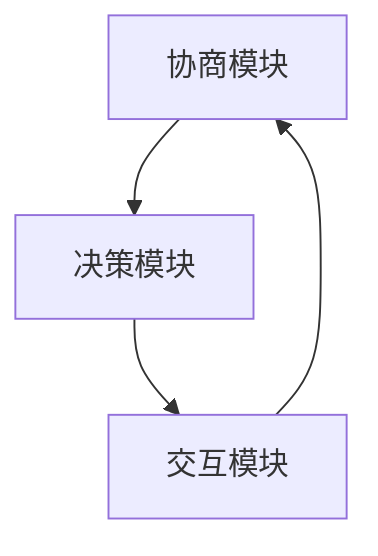
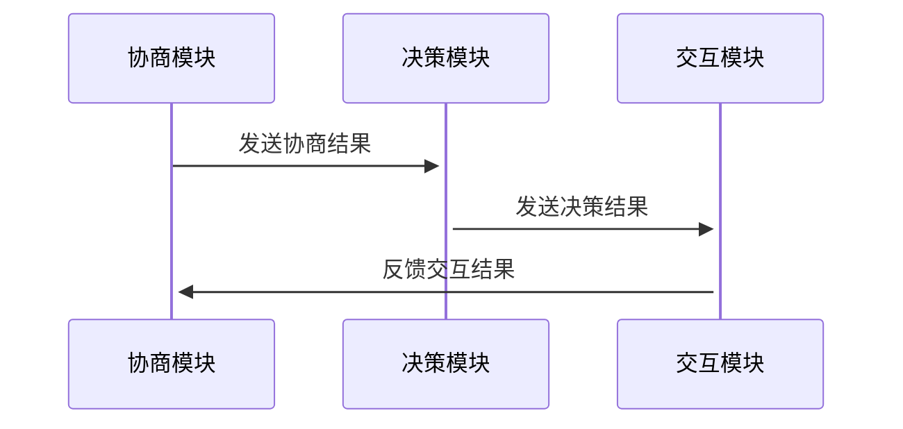

                 


# 《构建AI Agent的多Agent协商与决策系统》

## 关键词：多Agent系统、AI Agent、协商机制、决策算法、系统架构、项目实战

## 摘要：  
本文系统地探讨了构建AI Agent的多Agent协商与决策系统的各个方面，从基础概念到算法实现，再到实际项目案例，全面解析了多Agent系统的核心原理和应用方法。通过理论分析和实践案例，深入浅出地展示了如何设计和实现一个多Agent协商与决策系统，为读者提供了从理论到实践的完整指导。

---

# 第1章: 多Agent系统概述

## 1.1 多Agent系统的基本概念

### 1.1.1 多Agent系统的基本定义

- **多Agent系统**：由多个智能体（Agent）组成的分布式系统，每个Agent具有自主性、反应性和协作性。
- **Agent**：能够感知环境并采取行动以实现目标的实体。

### 1.1.2 多Agent系统的分类

- **基于任务的Agent**：专注于完成特定任务。
- **基于角色的Agent**：根据角色分配任务。
- **基于行为的Agent**：通过行为规则进行决策。

### 1.1.3 多Agent系统的核心特征

- **自主性**：Agent能够自主决策。
- **反应性**：能够感知环境并做出反应。
- **协作性**：多个Agent能够协作完成任务。

## 1.2 多Agent协商与决策的背景

### 1.2.1 协商与决策的定义

- **协商**：Agent之间通过交流达成一致的过程。
- **决策**：基于协商结果做出选择的过程。

### 1.2.2 多Agent协商与决策的必要性

- **任务分配**：多个Agent需要合作完成任务。
- **资源分配**：合理分配资源以提高效率。

### 1.2.3 多Agent协商与决策的应用场景

- **分布式系统**：如分布式计算、分布式数据库。
- **智能系统**：如自动驾驶、智能助手。

## 1.3 多Agent协商与决策的核心概念

### 1.3.1 协商机制

- **协商规则**：定义协商的流程和规则。
- **协商协议**：协商的结果达成一致。

### 1.3.2 决策机制

- **决策规则**：基于协商结果做出决策。
- **决策模型**：用于模拟决策过程。

### 1.3.3 多Agent系统中的角色分配

- **角色分配**：根据任务需求分配不同的角色。
- **角色协作**：不同角色协同工作完成任务。

## 1.4 本章小结

- 介绍了多Agent系统的基本概念和核心特征。
- 讨论了多Agent协商与决策的背景和应用场景。
- 阐述了协商机制、决策机制和角色分配的核心概念。

---

# 第2章: 多Agent协商与决策的理论基础

## 2.1 协商与决策的基本理论

### 2.1.1 协商的基本原理

- **信息交换**：Agent之间通过信息交换达成一致。
- **冲突解决**：协商过程中解决冲突。

### 2.1.2 决策的基本原理

- **信息处理**：处理协商结果做出决策。
- **选择最优解**：基于目标选择最优决策。

### 2.1.3 协商与决策的关系

- **协商是决策的前提**：协商结果影响决策。
- **决策是协商的结果**：协商结果通过决策实现。

## 2.2 多Agent协商与决策的模型

### 2.2.1 协商模型

- **拍卖模型**：基于拍卖机制进行任务分配。
- **谈判模型**：通过谈判达成一致。

### 2.2.2 决策模型

- **基于规则的决策模型**：根据规则做出决策。
- **基于机器学习的决策模型**：利用机器学习算法进行决策。

### 2.2.3 协商与决策模型的对比

| 模型类型 | 描述 |
|----------|------|
| 拍卖模型 | 基于价格竞争分配任务 |
| 谈判模型 | 通过谈判达成一致 |
| 基于规则的决策模型 | 根据预定义规则做出决策 |
| 基于机器学习的决策模型 | 利用数据训练模型进行决策 |

## 2.3 多Agent协商与决策的数学模型

### 2.3.1 协商过程的数学表达

$$协商过程可以用图论模型表示，其中每个Agent是一个节点，边表示交互。$$

### 2.3.2 决策过程的数学表达

$$决策可以看作是一个优化问题，目标是最优化函数。$$

### 2.3.3 协商与决策的综合模型

$$综合模型将协商和决策过程结合起来，形成一个整体系统。$$

## 2.4 本章小结

- 介绍了协商与决策的基本理论。
- 阐述了协商与决策的数学模型。
- 对比了不同的协商与决策模型。

---

# 第3章: 多Agent协商与决策算法

## 3.1 协商算法

### 3.1.1 基于拍卖的协商算法

- **拍卖机制**：通过拍卖分配任务。
- **算法实现**：利用Python实现拍卖算法。

### 3.1.2 基于谈判的协商算法

- **谈判过程**：通过谈判达成一致。
- **算法实现**：利用Python实现谈判算法。

### 3.1.3 基于分布式计算的协商算法

- **分布式协商**：通过分布式计算进行协商。
- **算法实现**：利用Python实现分布式协商算法。

## 3.2 决策算法

### 3.2.1 基于博弈论的决策算法

- **博弈论模型**：通过博弈论模型进行决策。
- **算法实现**：利用Python实现博弈论决策算法。

### 3.2.2 基于规则的决策算法

- **规则模型**：根据预定义规则做出决策。
- **算法实现**：利用Python实现规则决策算法。

### 3.2.3 基于机器学习的决策算法

- **机器学习模型**：利用机器学习模型进行决策。
- **算法实现**：利用Python实现机器学习决策算法。

## 3.3 协商与决策

### 3.3.1 协商与决策的综合算法

- **综合算法**：将协商和决策过程结合起来。
- **算法实现**：利用Python实现综合算法。

---

# 第4章: 系统架构与设计

## 4.1 系统功能设计

### 4.1.1 系统功能模块

- **协商模块**：负责Agent之间的协商。
- **决策模块**：负责基于协商结果做出决策。
- **交互模块**：负责Agent之间的交互。

### 4.1.2 功能流程图



## 4.2 系统架构设计

### 4.2.1 架构设计

- **分层架构**：分为协商层、决策层和交互层。
- **模块化设计**：每个模块独立实现功能。

### 4.2.2 架构图

```mermaid
--- architecture ---
协商模块
决策模块
交互模块
```

## 4.3 系统接口设计

### 4.3.1 接口定义

- **协商接口**：定义协商过程的接口。
- **决策接口**：定义决策过程的接口。
- **交互接口**：定义交互过程的接口。

### 4.3.2 接口交互图



## 4.4 本章小结

- 介绍了系统功能设计和架构设计。
- 阐述了系统接口设计和交互设计。

---

# 第5章: 项目实战

## 5.1 环境配置

### 5.1.1 环境要求

- **操作系统**：Windows、Linux、macOS。
- **编程语言**：Python 3.8及以上版本。
- **依赖库**：安装必要的库，如numpy、pandas、scikit-learn。

### 5.1.2 安装依赖

```bash
pip install numpy pandas scikit-learn
```

## 5.2 核心代码实现

### 5.2.1 协商算法实现

```python
import numpy as np

def auction_algorithm(agents):
    # 拍卖机制分配任务
    pass

def negotiation_algorithm(agents):
    # 谈判机制分配任务
    pass
```

### 5.2.2 决策算法实现

```python
from sklearn import tree

def game_theory_decision(agents):
    # 基于博弈论的决策
    pass

def rule_based_decision(agents):
    # 基于规则的决策
    pass

def machine_learning_decision(agents):
    # 基于机器学习的决策
    pass
```

## 5.3 系统测试与优化

### 5.3.1 测试环境

- **测试用例**：设计多个测试用例。
- **测试工具**：使用单元测试框架进行测试。

### 5.3.2 系统优化

- **性能优化**：优化算法提高效率。
- **代码优化**：优化代码结构提高可读性。

## 5.4 案例分析

### 5.4.1 案例背景

- **项目背景**：介绍项目背景和目标。
- **问题分析**：分析项目中存在的问题。

### 5.4.2 实施方案

- **解决方案**：提出解决方案。
- **实施步骤**：详细说明实施步骤。

## 5.5 本章小结

- 介绍了项目实战的环境配置和核心代码实现。
- 讨论了系统测试与优化，以及案例分析。

---

# 第6章: 最佳实践与注意事项

## 6.1 最佳实践

### 6.1.1 系统设计

- **模块化设计**：确保系统模块化。
- **可扩展性设计**：确保系统可扩展。

### 6.1.2 代码实现

- **代码规范**：遵循代码规范。
- **代码注释**：添加详细的代码注释。

## 6.2 注意事项

### 6.2.1 系统维护

- **系统维护**：定期维护系统。
- **错误处理**：处理系统运行中的错误。

### 6.2.2 安全性考虑

- **安全性设计**：确保系统安全。
- **数据保护**：保护数据安全。

## 6.3 拓展阅读

### 6.3.1 相关书籍

- **《多Agent系统》**：介绍多Agent系统的书籍。
- **《人工智能》**：介绍人工智能的书籍。

### 6.3.2 在线资源

- **GitHub仓库**：提供代码示例的GitHub仓库。
- **技术博客**：提供技术博客链接。

## 6.4 本章小结

- 总结了构建多Agent协商与决策系统的最佳实践。
- 提出了系统维护和安全性考虑的注意事项。
- 提供了相关的拓展阅读资料。

---

# 第7章: 总结与展望

## 7.1 总结

- 介绍了构建AI Agent的多Agent协商与决策系统的各个方面。
- 阐述了系统的核心原理和应用方法。

## 7.2 未来展望

- **新技术应用**：探讨新技术在多Agent系统中的应用。
- **研究方向**：提出未来的研究方向。

## 7.3 本章小结

- 总结了全文的主要内容。
- 展望了多Agent协商与决策系统的未来发展方向。

---

# 参考文献

- [1] 多Agent系统相关书籍。
- [2] 人工智能相关书籍。
- [3] 相关技术文档和论文。

---

# 附录

## 附录A: 系统设计图

## 附录B: 代码实现细节

## 附录C: 测试用例

---

通过以上详细的大纲，我们可以系统地构建《构建AI Agent的多Agent协商与决策系统》这本书的内容，从基础理论到实际应用，全面覆盖多Agent系统的核心知识和实践技巧。

