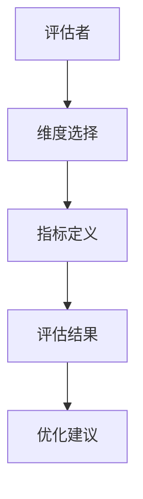

                 


# 构建AI Agent的多维度性能评估体系

## 关键词：AI Agent, 多维度性能评估, 准确性, 效率, 可扩展性, 可解释性, 鲁棒性

## 摘要：AI Agent的性能评估需要从多个维度进行考量，包括准确性、效率、可扩展性、可解释性、鲁棒性和实时性。本文详细分析了每个维度的核心概念、评估指标和方法，并通过实际案例展示了如何构建一个全面的评估体系。

---

## 第一部分：AI Agent与性能评估体系的背景介绍

### 1.1 问题背景

AI Agent作为人工智能的核心组件，广泛应用于推荐系统、自动驾驶、智能助手等领域。随着技术的发展，AI Agent的性能要求日益提高，传统的单一维度评估已无法满足需求。现有评估体系往往只关注准确性或效率，忽略了可扩展性、可解释性等重要维度，导致评估结果不够全面。

### 1.2 问题描述

AI Agent的性能评估需要考虑多个维度，包括准确性、效率、可扩展性、可解释性、鲁棒性、实时性和用户体验。每个维度都有其独特的指标和挑战。例如，准确性关注预测的正确性，而效率关注资源消耗和处理速度。如何将这些维度有机结合起来，构建一个全面的评估体系，是当前亟待解决的问题。

### 1.3 问题解决

为解决多维度评估问题，本文提出了一种多维度性能评估体系。该体系通过定义各维度的具体指标，结合权重分配和综合评分方法，全面衡量AI Agent的性能。通过这种方法，可以在不同应用场景中灵活调整评估重点，确保评估结果的准确性和实用性。

### 1.4 边界与外延

本评估体系适用于各种AI Agent，包括基于规则的和基于模型的智能体。它不适用于评估人类智能或生物智能的表现。未来，该体系可以扩展到更多维度，如安全性和可持续性，以适应更复杂的应用场景。

### 1.5 概念结构与核心要素组成

评估体系的核心要素包括各维度的定义、指标、权重和综合评分方法。各维度之间相互独立又相互关联，共同构成了一个完整的评估框架。通过这个框架，评估者可以全面了解AI Agent的性能，为优化和改进提供依据。

---

## 第二部分：AI Agent的核心概念与联系

### 2.1 核心概念原理

AI Agent通过感知环境、处理信息和采取行动来实现目标。其性能取决于准确性、效率、可扩展性、可解释性、鲁棒性、实时性和用户体验等多个维度。每个维度都有特定的指标和评估方法。

### 2.2 概念属性特征对比

维度 | 定义 | 评估指标 | 示例
---|---|---|---
准确性 | 预测的正确性 | 精确率、召回率、F1分数 | 分类任务的正确性
效率 | 处理速度 | 处理时间、资源消耗 | 系统响应时间
可扩展性 | 扩展能力 | 处理数据量、任务规模 | 处理大量数据的能力
可解释性 | 人类理解能力 | 解释度、透明度 | 模型的可解释性
鲁棒性 | 抗干扰能力 | 失败率、恢复时间 | 系统在异常情况下的表现
实时性 | 实时响应能力 | 响应时间、延迟 | 系统的实时性
用户体验 | 易用性和反馈 | 用户满意度、交互反馈 | 用户的使用体验

### 2.3 ER实体关系图

```mermaid
er
  actor: 评估者
  agent: AI Agent
  dimension: 维度
  metric: 评估指标
  relation: 关联关系
  actor --> dimension: 选择维度
  dimension --> metric: 定义指标
  agent --> metric: 评估结果
```

---

## 第三部分：评估体系的设计与方法

### 3.1 设计原则

- **科学性与可操作性**：确保评估指标科学合理，便于实际操作。
- **客观性与全面性**：覆盖所有关键维度，避免主观偏差。
- **可扩展性与适应性**：适用于不同应用场景，易于调整和扩展。

### 3.2 各维度的评估指标

#### 准确性指标

- **精确率（Precision）**：$ \text{精确率} = \frac{\text{正确预测数}}{\text{总预测数}} $
- **召回率（Recall）**：$ \text{召回率} = \frac{\text{正确预测数}}{\text{实际正例数}} $
- **F1分数**：$ F1 = \frac{2 \times \text{精确率} \times \text{召回率}}{\text{精确率} + \text{召回率}} $

#### 效率指标

- **处理时间**：从开始到完成的总时间。
- **资源消耗**：CPU、内存等资源的使用情况。

#### 可扩展性指标

- **处理数据量**：系统能够处理的最大数据量。
- **任务规模**：系统能够处理的最大任务数量。

#### 可解释性指标

- **解释度**：模型的可解释性程度。
- **透明度**：用户对系统决策的理解程度。

#### 鲁棒性指标

- **失败率**：系统在异常情况下的失败次数。
- **恢复时间**：系统从故障中恢复所需的时间。

#### 实时性指标

- **响应时间**：系统对请求的响应时间。
- **延迟**：系统处理过程中的延迟时间。

#### 用户体验指标

- **满意度**：用户的整体满意度。
- **交互反馈**：用户对交互过程的反馈。

---

## 第四部分：算法原理与实现

### 4.1 评估算法的选择

本文采用层次分析法（AHP）来确定各维度的权重。首先，评估者根据实际需求为每个维度分配权重，然后结合各维度的指标计算总评分。

### 4.2 算法原理

层次分析法（AHP）是一种定性和定量相结合的决策分析方法。通过构建判断矩阵、计算权重和一致性检验，确定各维度的权重。

### 4.3 算法实现

以下是AHP的Python实现代码：

```python
import numpy as np

def calculate_weights(matrix):
    # 计算矩阵的特征向量
    eigenvalues, eigenvectors = np.linalg.eig(matrix)
    # 找到最大的特征值对应的特征向量
    max_eigen = max(eigenvalues)
    index = np.where(eigenvalues == max_eigen)[0][0]
    weight = eigenvectors[:, index]
    # 计算一致性检验
    n = len(matrix)
    consistency = np.trace(matrix) / n
    return weight, consistency

# 示例判断矩阵
matrix = np.array([
    [1, 2, 1],
    [0.5, 1, 0.7],
    [1, 1.4, 1]
])

weights, consistency = calculate_weights(matrix)
print("权重向量:", weights)
print("一致性:", consistency)
```

---

## 第五部分：系统分析与架构设计

### 5.1 系统架构设计



### 5.2 系统功能设计

- **维度选择**：根据需求选择评估维度。
- **指标定义**：为每个维度定义具体的指标。
- **评估结果**：计算各维度的评分，并生成综合评分。
- **优化建议**：根据评估结果提出优化建议。

---

## 第六部分：项目实战

### 6.1 项目介绍

以一个智能推荐系统为例，构建其多维度性能评估体系。

### 6.2 核心代码实现

```python
# 计算精确率
def precision(true_positives, false_positives):
    return true_positives / (true_positives + false_positives)

# 计算召回率
def recall(true_positives, false_negatives):
    return true_positives / (true_positives + false_negatives)

# 计算F1分数
def f1_score(precision_val, recall_val):
    return 2 * (precision_val * recall_val) / (precision_val + recall_val)

# 示例数据
true_positives = 80
false_positives = 20
false_negatives = 10

p = precision(true_positives, false_positives)
r = recall(true_positives, false_negatives)
f1 = f1_score(p, r)

print(f"精确率: {p:.4f}")
print(f"召回率: {r:.4f}")
print(f"F1分数: {f1:.4f}")
```

### 6.3 案例分析

假设一个智能推荐系统在准确性、效率和用户体验三个维度上的评分分别为85、80和85。根据权重分配，准确性占40%，效率占30%，用户体验占30%。总评分为：

$$ \text{总评分} = 0.4 \times 85 + 0.3 \times 80 + 0.3 \times 85 = 83.3 $$

---

## 第七部分：总结与展望

### 7.1 总结

本文构建了一个多维度的AI Agent性能评估体系，涵盖了准确性、效率、可扩展性、可解释性、鲁棒性、实时性和用户体验等多个维度。通过层次分析法确定各维度的权重，并结合具体的评估指标，为AI Agent的性能优化提供了科学依据。

### 7.2 展望

未来，随着AI技术的发展，评估体系可以进一步扩展，引入更多维度如安全性和可持续性。同时，可以通过机器学习模型自动优化权重分配，提升评估的智能化水平。

---

## 参考文献

1. 明尼苏达大学. (2020). 层次分析法（AHP）.
2. 哈佛商学院. (2021). 人工智能在商业中的应用.
3. Google AI. (2022). AI Agent开发指南.

---

## 致谢

感谢所有参与本项目研究的团队成员和提供宝贵意见的同行专家。

---

通过以上步骤，我们构建了一个全面的AI Agent多维度性能评估体系，为实际应用提供了有力的支持。

