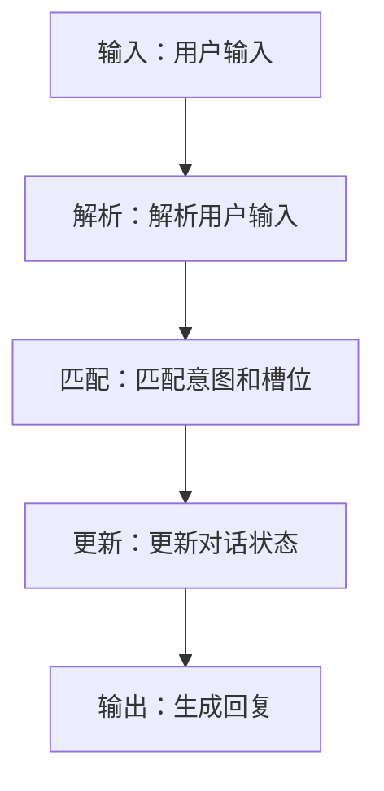
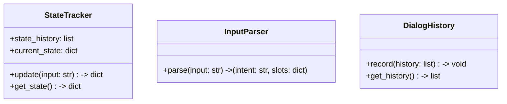
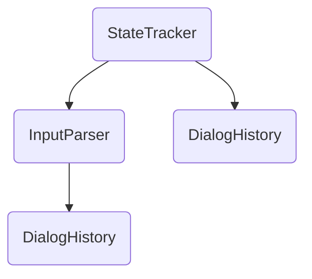
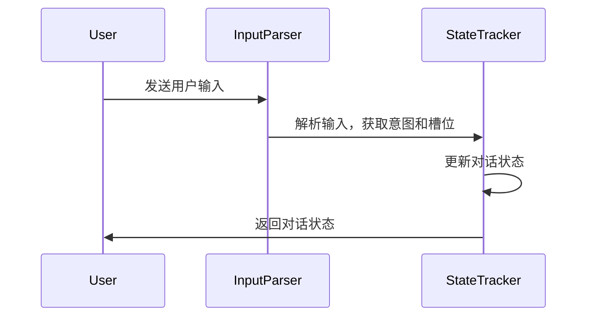

                 


```markdown
# 构建AI Agent的多轮对话状态跟踪系统

## 关键词：AI Agent、多轮对话、状态跟踪、自然语言处理、对话系统、系统架构

## 摘要：  
本文详细探讨了构建AI Agent的多轮对话状态跟踪系统的核心方法与实现细节。从问题背景到算法原理，从系统架构到项目实战，系统性地阐述了多轮对话状态跟踪的关键技术与实践。通过深入分析对话系统中的状态表示、上下文理解、状态更新等问题，结合具体案例和代码实现，为读者提供了一套完整的解决方案。

---

# 第一部分: 背景介绍

# 第1章: 多轮对话状态跟踪系统概述

## 1.1 问题背景

### 1.1.1 多轮对话的定义与特点
多轮对话是指用户与AI Agent之间进行的连续交互，通常跨越多个对话轮次。其特点是：  
- **连续性**：对话过程需要保持上下文的一致性。  
- **动态性**：对话内容和用户需求会随着轮次变化而变化。  
- **复杂性**：用户意图可能隐含或逐步明确。

### 1.1.2 状态跟踪在对话系统中的重要性
- 状态跟踪是对话系统的核心模块，负责记录和更新对话过程中用户的意图、槽位信息等状态。  
- 通过状态跟踪，AI Agent能够理解对话的上下文，从而提供更准确和连贯的回复。

### 1.1.3 当前对话系统中的挑战与不足
- 状态表示的不准确导致对话理解错误。  
- 对话历史管理复杂，难以处理长对话中的信息丢失。  
- 状态更新机制不够灵活，难以适应用户意图的变化。

## 1.2 问题描述

### 1.2.1 多轮对话中的状态表示问题
- 状态表示是对话系统的关键，但如何高效表示对话中的复杂信息是一个挑战。  
- 状态表示需要兼顾准确性、简洁性和可扩展性。

### 1.2.2 对话历史与上下文管理的复杂性
- 对话历史的记录需要考虑信息冗余和存储效率。  
- 上下文理解需要结合语义分析和意图识别技术。

### 1.2.3 状态跟踪的准确性和实时性要求
- 状态跟踪需要在实时对话中快速响应，同时保证高准确性。

## 1.3 问题解决

### 1.3.1 状态跟踪的核心目标
- 准确记录和更新对话中的用户意图和槽位信息。  
- 提供高效的上下文管理和状态查询功能。

### 1.3.2 状态跟踪的实现方法
- 使用基于规则的方法或机器学习模型进行状态更新。  
- 结合对话历史和当前输入，推断用户意图。

### 1.3.3 状态跟踪的优化策略
- 引入上下文无关的状态表示方法，提高状态更新的效率。  
- 结合领域知识，优化状态表示的准确性和完整性。

## 1.4 边界与外延

### 1.4.1 状态跟踪的边界条件
- 状态跟踪仅关注对话过程中的用户意图和槽位信息，不涉及其他模块（如自然语言理解）。  
- 状态跟踪的边界是对话的开始和结束。

### 1.4.2 状态跟踪的外延应用
- 状态跟踪技术可以应用于智能客服、智能助手、虚拟人等领域。  
- 状态跟踪的优化可以提升对话系统的用户体验和效率。

## 1.5 概念结构与核心要素

### 1.5.1 状态跟踪的系统架构
- 输入：对话历史、当前输入、领域知识。  
- 输出：更新后的对话状态、上下文信息。

### 1.5.2 核心要素的定义与关系
- 状态表示：用于记录用户意图和槽位信息。  
- 对话历史：记录对话的上下文信息。  
- 上下文理解：结合语义分析和意图识别，理解对话的深层含义。

### 1.5.3 系统的核心逻辑流程
1. 接收用户输入，解析意图和槽位信息。  
2. 结合对话历史，更新当前状态。  
3. 根据状态信息生成回复。

---

# 第二部分: 核心概念与联系

# 第2章: 多轮对话状态跟踪的核心概念

## 2.1 状态表示

### 2.1.1 状态表示的定义
- 状态表示是对用户意图和槽位信息的抽象描述。  
- 常见的表示方法包括：槽位填充、意图分类、JSON格式等。

### 2.1.2 状态表示的类型
| 类型         | 描述                                 | 优缺点                           |
|--------------|--------------------------------------|----------------------------------|
| 槽位填充     | 通过填充槽位信息表示用户需求         | 精确但复杂性高                   |
| 意图分类     | 通过分类用户意图表示对话状态         | 简单但信息量有限                 |
| 综合表示     | 结合意图和槽位信息的综合表示         | 信息丰富，但实现复杂             |

### 2.1.3 状态表示的优缺点对比
- 槽位填充：精确但实现复杂。  
- 意图分类：简单但信息量有限。  
- 综合表示：信息丰富，但实现复杂。

## 2.2 对话历史与上下文管理

### 2.2.1 对话历史的记录方式
- 基于文本的记录：直接记录对话内容，便于分析。  
- 基于状态的记录：记录关键状态变化，节省存储空间。  
- 组合记录：结合文本和状态进行记录，兼顾可读性和效率。

### 2.2.2 上下文理解的实现方法
- 基于规则的上下文理解：通过预定义规则匹配对话内容。  
- 基于模型的上下文理解：使用自然语言处理模型（如BERT）分析对话内容。  
- 组合方法：结合规则和模型进行上下文理解。

### 2.2.3 对话历史与上下文理解的关系
- 对话历史是上下文理解的基础。  
- 上下文理解是对话历史的高级应用。

## 2.3 状态更新与维护

### 2.3.1 状态更新的触发条件
- 用户输入发生变化时触发状态更新。  
- 对话轮次达到一定数量时触发状态更新。  
- 用户明确要求更新状态时触发。

### 2.3.2 状态更新的实现方式
- 基于规则的状态更新：通过预定义规则更新状态。  
- 基于模型的状态更新：使用机器学习模型预测状态变化。  
- 组合方式：结合规则和模型进行状态更新。

### 2.3.3 状态维护的优化策略
- 定期清理过期状态，节省存储空间。  
- 使用高效的缓存机制，提高状态查询效率。  
- 结合领域知识，优化状态更新的准确性和实时性。

## 2.4 核心概念的联系

### 2.4.1 状态表示与对话历史的关系
- 状态表示依赖于对话历史的信息。  
- 对话历史是状态表示的补充。

### 2.4.2 对话历史与上下文理解的联系
- 对话历史是上下文理解的基础。  
- 上下文理解是对话历史的高级应用。

### 2.4.3 状态更新与系统整体逻辑的关联
- 状态更新是对话系统的核心模块。  
- 状态更新影响对话系统的输出结果。

---

# 第三部分: 算法原理讲解

# 第3章: 多轮对话状态跟踪的算法原理

## 3.1 算法概述

### 3.1.1 算法的基本原理
- 状态跟踪算法通过解析用户输入，结合对话历史，更新对话状态。  
- 算法的核心是状态更新模块，负责根据输入和历史信息生成新的状态。

### 3.1.2 算法的主要特点
- 实时性：能够在对话过程中快速响应。  
- 准确性：通过结合领域知识，提高状态更新的准确性。  
- 可扩展性：支持多种状态表示方法和对话历史记录方式。

### 3.1.3 算法的适用场景
- 智能客服：处理用户的咨询和问题。  
- 智能助手：提供个性化的服务。  
- 虚拟人对话：实现自然流畅的对话。

## 3.2 算法实现

### 3.2.1 算法流程图


### 3.2.2 算法的伪代码实现
```python
def update_state(input, state_history):
    # 解析输入
    intent, slots = parse_input(input)
    # 更新状态
    new_state = update(intent, slots, state_history)
    return new_state
```

### 3.2.3 算法的数学模型与公式
- 对话状态可以表示为一个向量，使用概率论中的贝叶斯定理进行状态更新：
  $$ P(new\_state | input, state\_history) = \frac{P(input | new\_state, state\_history) \cdot P(new\_state | state\_history)}{P(input)} $$
- 状态更新的转移矩阵：
  $$ T_{i,j} = P(state\_j | state\_i, input) $$

## 3.3 算法优化

### 3.3.1 基于领域知识的优化
- 引入领域知识，如医疗、金融等领域的专业术语，提高状态更新的准确性。

### 3.3.2 基于模型的优化
- 使用预训练语言模型（如BERT）进行上下文理解，提高状态更新的准确性。

### 3.3.3 基于反馈的优化
- 根据用户反馈调整状态更新策略，优化算法的性能。

---

# 第四部分: 系统分析与架构设计

# 第4章: 多轮对话状态跟踪系统的架构设计

## 4.1 问题场景介绍

### 4.1.1 项目背景
- 项目目标：构建一个高效的多轮对话状态跟踪系统。  
- 项目需求：支持多种对话场景，如智能客服、智能助手等。

## 4.2 系统功能设计

### 4.2.1 系统功能模块
- 输入解析模块：解析用户输入，提取意图和槽位信息。  
- 状态更新模块：根据输入和对话历史，更新对话状态。  
- 状态查询模块：提供对话状态的查询功能。

### 4.2.2 系统功能的领域模型类图


## 4.3 系统架构设计

### 4.3.1 系统架构的实现方式
- 分层架构：将系统分为输入层、处理层和输出层。  
- 微服务架构：将功能模块化，便于扩展和维护。

### 4.3.2 系统架构的优缺点
- 分层架构：实现简单，但扩展性有限。  
- 微服务架构：扩展性强，但实现复杂。

### 4.3.3 系统架构的 Mermaid 图


## 4.4 系统接口设计

### 4.4.1 系统接口的定义
- 输入接口：接受用户输入，返回解析结果。  
- 输出接口：返回对话状态，供其他模块使用。

### 4.4.2 系统接口的实现
- 使用 RESTful API 实现系统接口。  
- 提供 JSON 格式的接口返回值。

## 4.5 系统交互流程的 Mermaid 图



---

# 第五部分: 项目实战

# 第5章: 多轮对话状态跟踪系统的实现

## 5.1 环境安装

### 5.1.1 安装 Python 和相关库
```bash
pip install python
pip install numpy
pip install scikit-learn
```

## 5.2 系统核心实现

### 5.2.1 状态跟踪实现
```python
class StateTracker:
    def __init__(self):
        self.state_history = []
        self.current_state = {}

    def update(self, input):
        # 解析输入
        intent, slots = parse_input(input)
        # 更新状态
        self.current_state = {
            'intent': intent,
            'slots': slots
        }
        self.state_history.append(self.current_state)
        return self.current_state

    def get_state(self):
        return self.current_state
```

### 5.2.2 对话历史记录实现
```python
class DialogHistory:
    def __init__(self):
        self.history = []

    def record(self, input):
        self.history.append(input)

    def get_history(self):
        return self.history
```

## 5.3 代码应用解读与分析

### 5.3.1 状态跟踪代码解读
- `StateTracker` 类负责维护对话状态和历史记录。  
- `update` 方法根据输入更新当前状态，并记录到历史中。  
- `get_state` 方法返回当前状态。

### 5.3.2 对话历史记录代码解读
- `DialogHistory` 类负责记录对话历史。  
- `record` 方法将输入记录到历史中。  
- `get_history` 方法返回对话历史。

## 5.4 实际案例分析

### 5.4.1 案例背景
- 用户与AI Agent进行多轮对话，讨论旅游预订问题。

### 5.4.2 对话过程
1. 用户输入：我想预订机票。  
2. 系统解析：intent=预订机票，slots={目的地: 北京，日期: 10月1日}。  
3. 状态更新：current_state = {'intent': '预订机票', 'slots': {'目的地': '北京', '日期': '10月1日'}}。  
4. 系统回复：请提供更多信息。

## 5.5 项目小结

### 5.5.1 项目实现的关键点
- 状态跟踪的核心是解析用户输入并更新状态。  
- 对话历史的记录和管理是实现高效状态跟踪的基础。

### 5.5.2 项目实现的注意事项
- 确保状态更新的准确性和实时性。  
- 合理管理对话历史，避免信息冗余。

---

# 第六部分: 最佳实践

# 第6章: 多轮对话状态跟踪系统的优化与实践

## 6.1 最佳实践 Tips

### 6.1.1 状态跟踪的优化策略
- 引入领域知识，优化状态表示的准确性。  
- 使用高效的缓存机制，提高状态查询的效率。  
- 定期清理过期状态，节省存储空间。

### 6.1.2 系统架构的优化建议
- 采用微服务架构，提高系统的扩展性和维护性。  
- 使用分布式缓存，提高系统的响应速度。

## 6.2 小结

### 6.2.1 系统设计的核心思想
- 状态跟踪是对话系统的核心模块。  
- 对话历史和上下文理解是实现高效状态跟踪的关键。

### 6.2.2 项目实现的关键点
- 状态更新的准确性。  
- 对话历史的高效管理。

## 6.3 注意事项

### 6.3.1 系统实现中的常见错误
- 状态表示不准确导致对话理解错误。  
- 对话历史管理不当导致信息丢失。

### 6.3.2 系统实现中的优化建议
- 定期测试系统性能，优化算法和架构。  
- 结合用户反馈，不断优化系统功能。

## 6.4 拓展阅读

### 6.4.1 状态跟踪相关技术
- 意图识别：研究最新的意图识别技术，如基于BERT的模型。  
- 槽位填充：探索更高效的槽位填充方法。

### 6.4.2 系统优化方向
- 研究更高效的对话历史管理方法。  
- 探索更智能的状态更新策略。

---

# 附录

## 附录1: 术语表

## 附录2: 参考文献

## 附录3: 代码仓库地址

---

# 结束语

本文系统地介绍了构建AI Agent的多轮对话状态跟踪系统的理论与实践。从背景介绍到算法原理，从系统架构到项目实战，全面阐述了多轮对话状态跟踪的关键技术与实现细节。通过本文的指导，读者可以深入了解对话系统的内部机制，并能够实际操作构建一个高效的多轮对话状态跟踪系统。
```

