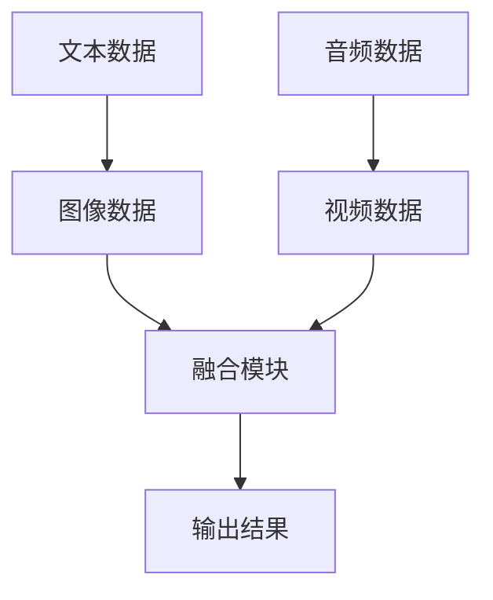
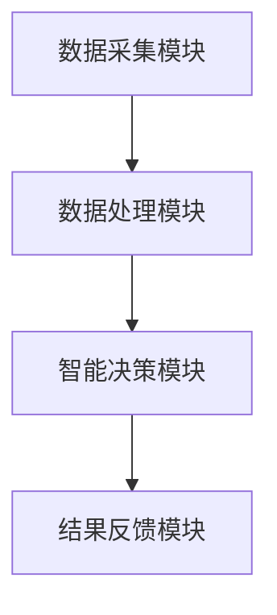
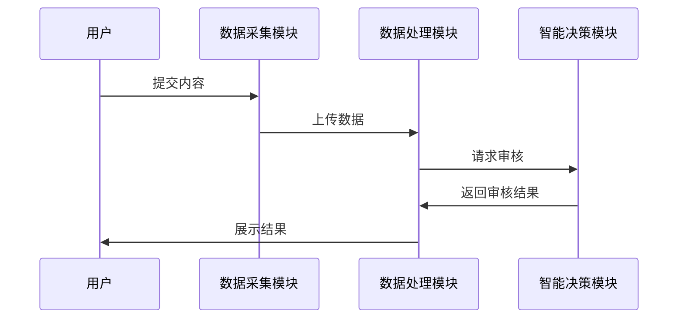

                 


# 构建AI Agent的实时多模态内容审核系统

## 关键词：AI Agent、多模态内容审核、实时处理、系统架构、算法原理

## 摘要：本文详细探讨了构建AI Agent的实时多模态内容审核系统的背景、核心概念、算法原理、系统架构以及项目实现。文章从问题背景出发，分析了多模态数据处理和AI Agent构建的必要性，并通过数学模型和流程图详细阐述了系统的构建过程，最后通过实际案例展示了系统的应用场景和优势。

---

# 第1章: 问题背景与核心概念

## 1.1 问题背景介绍

### 1.1.1 当前内容审核面临的挑战
随着互联网的快速发展，每天都有海量的内容被发布和传播。这些内容包括文本、图像、视频、音频等多种形式，构成了多模态数据。然而，传统的内容审核方法依赖于人工审核，效率低下且成本高昂。此外，人工审核还存在主观性较强、容易疲劳等问题，难以满足实时性和高效性的要求。

### 1.1.2 多模态内容审核的需求
多模态数据的复杂性使得传统的单模态审核方法难以应对。例如，一段视频可能包含丰富的文本信息和视觉信息，仅依赖单一模态的审核可能会遗漏重要信息。因此，如何将多种模态的数据高效融合，实现全面的内容审核，成为当前亟待解决的问题。

### 1.1.3 AI Agent在内容审核中的作用
AI Agent（人工智能代理）是一种能够感知环境、自主决策并执行任务的智能体。在内容审核中，AI Agent可以通过多模态数据的融合和智能决策，实现对内容的实时审核。AI Agent的优势在于其能够快速处理多模态数据，并根据上下文信息做出准确的判断。

## 1.2 问题描述与目标

### 1.2.1 内容审核的核心问题
内容审核的核心问题是如何高效、准确地识别和处理有害信息（如色情、暴力、垃圾广告等）。传统的人工审核方法效率低，难以应对海量数据的挑战。因此，如何利用AI技术实现自动化、智能化的内容审核成为关键。

### 1.2.2 多模态数据的复杂性
多模态数据的复杂性主要体现在以下几个方面：
1. 数据类型多样：包括文本、图像、视频、音频等。
2. 数据量庞大：每天产生的多模态数据量巨大，难以通过传统方法处理。
3. 数据关联性弱：不同模态的数据之间可能存在弱关联，导致融合难度较高。

### 1.2.3 实时性要求的挑战
实时性是内容审核系统的重要要求。例如，在社交媒体平台上，用户发布的内容需要在几秒内完成审核，否则可能会导致有害信息的扩散。因此，如何实现多模态数据的实时处理成为技术难点。

## 1.3 问题解决思路

### 1.3.1 多模态数据融合方案
多模态数据融合是实现内容审核的核心技术。常见的融合方法包括：
1. **早期融合**：在数据预处理阶段将不同模态的数据进行融合。
2. **晚期融合**：分别对每种模态的数据进行处理，最后将结果进行融合。
3. **层次化融合**：根据模态数据的重要性进行分层融合。

### 1.3.2 AI Agent的智能决策机制
AI Agent的智能决策机制包括以下步骤：
1. **感知与理解**：通过多模态数据感知环境，并理解内容的含义。
2. **决策与推理**：基于理解的信息，结合上下文进行智能决策。
3. **执行与反馈**：根据决策结果执行操作，并根据反馈调整策略。

### 1.3.3 实时处理的技术实现
为了实现实时处理，可以采用以下技术：
1. **分布式计算**：通过分布式系统实现多模态数据的并行处理。
2. **流处理技术**：采用流处理框架（如Apache Kafka、Apache Flink）实现实时数据处理。
3. **优化算法**：通过优化算法减少计算复杂度，提高处理效率。

## 1.4 边界与外延

### 1.4.1 系统功能边界
AI Agent的内容审核系统主要功能包括：
1. 多模态数据的采集与预处理。
2. 多模态数据的融合与分析。
3. 内容的智能审核与决策。
4. 审核结果的反馈与优化。

### 1.4.2 与其他系统的交互
AI Agent需要与以下系统进行交互：
1. **数据源**：获取多模态数据。
2. **用户界面**：与用户进行交互，提供审核结果。
3. **第三方服务**：调用外部API（如图像识别API）进行辅助审核。

### 1.4.3 未来可能的扩展方向
随着技术的发展，AI Agent的内容审核系统可以进一步扩展功能，例如：
1. **情感分析**：分析内容的情感倾向。
2. **内容推荐**：基于审核结果推荐相关内容。
3. **自适应学习**：通过机器学习实现自适应优化。

## 1.5 核心概念结构与组成

### 1.5.1 多模态数据的定义与属性
多模态数据是指包含多种模态（如文本、图像、音频等）的数据。其主要属性包括：
1. **模态类型**：数据的种类。
2. **模态特征**：数据的特征描述。
3. **模态关联性**：不同模态之间的关联性。

### 1.5.2 AI Agent的结构与功能
AI Agent的结构包括：
1. **感知模块**：负责数据的采集与理解。
2. **决策模块**：负责智能决策。
3. **执行模块**：负责任务的执行。

### 1.5.3 实时处理的系统架构
实时处理的系统架构包括：
1. **数据采集层**：负责多模态数据的采集。
2. **数据处理层**：负责数据的预处理和融合。
3. **决策层**：负责智能决策。
4. **执行层**：负责任务的执行和反馈。

---

# 第2章: 多模态数据处理原理

## 2.1 多模态数据的定义与特点

### 2.1.1 多模态数据的类型
多模态数据的类型包括：
1. **文本数据**：如文字、对话等。
2. **图像数据**：如图片、视频帧等。
3. **音频数据**：如语音、音乐等。
4. **其他数据**：如地理位置、时间戳等。

### 2.1.2 各模态数据的特征对比
不同模态数据的特征对比如下表所示：

| 模态类型 | 特征描述           |
|----------|--------------------|
| 文本     | 离散性、可读性     |
| 图像     | 高维性、空间性     |
| 音频     | 时间性、连续性     |

### 2.1.3 多模态数据的融合方式
多模态数据的融合方式包括：
1. **特征级融合**：在特征层进行融合。
2. **决策级融合**：在决策层进行融合。
3. **混合融合**：结合特征级和决策级的融合。

## 2.2 多模态数据处理的数学模型

### 2.2.1 多模态数据融合的公式表示
多模态数据融合的公式可以表示为：
$$
f(x_1, x_2, \ldots, x_n) = w_1x_1 + w_2x_2 + \ldots + w_nx_n
$$
其中，$x_i$ 表示第$i$种模态的数据，$w_i$ 表示权重系数。

### 2.2.2 模态间关系的数学建模
模态间关系的数学建模可以采用以下公式：
$$
p(y|x_1, x_2) = \frac{p(x_1|x_2) \cdot p(x_2|y)}{p(x_1)}
$$
其中，$y$ 表示目标类别，$x_1$ 和 $x_2$ 分别表示两种模态的数据。

### 2.2.3 融合效果的评估指标
融合效果的评估指标包括：
1. **准确率**：分类准确率。
2. **召回率**：召回率。
3. **F1值**：F1分数。

## 2.3 多模态数据处理的流程图
以下是多模态数据处理的流程图：



---

# 第3章: AI Agent的构建原理

## 3.1 AI Agent的核心功能

### 3.1.1 感知与理解
AI Agent的感知与理解模块负责多模态数据的采集与理解。例如，通过自然语言处理技术理解文本内容，通过计算机视觉技术分析图像内容。

### 3.1.2 决策与推理
决策与推理模块负责基于多模态数据的理解结果进行智能决策。例如，根据文本和图像的分析结果，判断内容是否违规。

### 3.1.3 执行与反馈
执行与反馈模块负责根据决策结果执行相应的操作，并根据反馈调整决策策略。

## 3.2 AI Agent的构建步骤

### 3.2.1 数据采集与预处理
数据采集与预处理是AI Agent构建的第一步。需要采集多模态数据，并进行预处理（如归一化、降维等）。

### 3.2.2 模型训练与优化
模型训练与优化是AI Agent构建的核心步骤。需要训练多模态数据融合模型，并通过优化算法（如梯度下降）进行模型优化。

### 3.2.3 系统集成与测试
系统集成与测试是AI Agent构建的最后一步。需要将各模块集成到系统中，并进行功能测试和性能测试。

## 3.3 AI Agent的优化策略

### 3.3.1 模型优化
模型优化可以通过以下方法实现：
1. **参数调整**：调整模型的参数，优化模型性能。
2. **模型压缩**：通过模型压缩技术减少模型的计算复杂度。

### 3.3.2 算法优化
算法优化可以通过以下方法实现：
1. **并行计算**：利用多核处理器进行并行计算，提高计算效率。
2. **流处理技术**：采用流处理框架实现实时数据处理。

### 3.3.3 系统优化
系统优化可以通过以下方法实现：
1. **分布式计算**：通过分布式系统实现多模态数据的并行处理。
2. **缓存优化**：通过缓存技术减少数据访问延迟。

---

# 第4章: 系统分析与架构设计

## 4.1 系统功能设计

### 4.1.1 功能模块划分
系统功能模块包括：
1. **数据采集模块**：负责多模态数据的采集。
2. **数据处理模块**：负责数据的预处理和融合。
3. **智能决策模块**：负责内容的智能审核。
4. **结果反馈模块**：负责审核结果的反馈与优化。

### 4.1.2 功能流程图
以下是系统功能流程图：



## 4.2 系统架构设计

### 4.2.1 分层架构设计
系统架构采用分层设计，包括数据层、业务逻辑层和表示层。

1. **数据层**：负责数据的存储和访问。
2. **业务逻辑层**：负责业务逻辑的实现。
3. **表示层**：负责用户界面的展示。

### 4.2.2 组件架构设计
组件架构设计包括：
1. **AI Agent组件**：负责智能决策。
2. **多模态数据处理组件**：负责多模态数据的融合与处理。
3. **结果反馈组件**：负责审核结果的反馈与优化。

## 4.3 系统接口设计

### 4.3.1 API接口设计
系统需要提供以下API接口：
1. **数据接口**：用于数据的上传和下载。
2. **审核接口**：用于内容的智能审核。
3. **反馈接口**：用于审核结果的反馈。

### 4.3.2 API文档
以下是API接口文档的示例：

```http
POST /api/audit
Content-Type: multipart/form-data

{
  "text": "example text",
  "image": "base64图像数据",
  "audio": "base64音频数据"
}
```

## 4.4 系统交互序列图

以下是系统交互序列图：



---

# 第5章: 项目实战

## 5.1 环境安装

### 5.1.1 系统需求
系统需求包括：
1. **操作系统**：Linux/Windows/MacOS
2. **Python版本**：Python 3.8以上
3. **依赖库**：TensorFlow、Keras、OpenCV、Flask等。

### 5.1.2 安装依赖
安装依赖可以通过以下命令实现：

```bash
pip install tensorflow keras opencv-python flask
```

## 5.2 核心代码实现

### 5.2.1 数据处理模块

```python
import numpy as np
from tensorflow.keras.models import Model
from tensorflow.keras.layers import Input, Dense, Concatenate

def multi_modal_fusion(input1, input2):
    fusion_layer = Concatenate()([input1, input2])
    dense_layer = Dense(256, activation='relu')(fusion_layer)
    output_layer = Dense(1, activation='sigmoid')(dense_layer)
    return Model(inputs=[input1, input2], outputs=output_layer)
```

### 5.2.2 AI Agent模块

```python
from flask import Flask, request, jsonify

app = Flask(__name__)

@app.route('/api/audit', methods=['POST'])
def audit():
    data = request.get_json()
    text = data['text']
    image = data['image']
    # 处理文本和图像数据
    result = model.predict([text, image])
    return jsonify({'result': result})

if __name__ == '__main__':
    app.run(debug=True)
```

## 5.3 代码解读与分析

### 5.3.1 数据处理模块解读
数据处理模块的主要功能是将多模态数据进行融合。代码中使用了Keras的Concatenate层将两种模态的数据进行融合，并通过Dense层进行非线性变换，最后输出结果。

### 5.3.2 AI Agent模块解读
AI Agent模块的主要功能是接收用户的请求，调用模型进行内容审核，并返回审核结果。代码中使用了Flask框架实现Web服务，并通过RESTful API接口与前端进行交互。

## 5.4 实际案例分析

### 5.4.1 案例背景
假设我们有一个社交媒体平台，用户需要实时上传文本、图像和音频内容。我们需要对这些内容进行审核，判断是否包含违规信息。

### 5.4.2 案例实现
在代码中，我们可以通过以下步骤实现：
1. 用户上传文本、图像和音频数据。
2. 数据处理模块对数据进行预处理和融合。
3. AI Agent模块对融合后的数据进行审核，判断是否违规。
4. 返回审核结果。

## 5.5 项目小结

### 5.5.1 项目总结
通过本项目，我们实现了一个基于AI Agent的实时多模态内容审核系统。系统能够高效地处理多模态数据，并通过智能决策模块实现内容的自动审核。

### 5.5.2 项目意义
本项目的实现具有重要的现实意义，能够显著提高内容审核的效率和准确性，减少人工审核的工作量，同时降低企业的运营成本。

---

# 第6章: 最佳实践、小结与展望

## 6.1 最佳实践

### 6.1.1 系统优化建议
1. **模型优化**：通过模型压缩和参数优化提高模型的计算效率。
2. **算法优化**：采用流处理技术和并行计算提高系统的实时性。
3. **系统优化**：通过分布式架构和缓存优化提高系统的扩展性。

### 6.1.2 代码优化建议
1. **代码规范**：遵循Python代码规范，提高代码的可读性和可维护性。
2. **性能优化**：通过代码优化和算法优化提高系统的运行效率。
3. **测试优化**：通过单元测试和集成测试提高代码的质量。

## 6.2 小结

通过本文的详细讲解，我们了解了构建AI Agent的实时多模态内容审核系统的背景、核心概念、算法原理、系统架构以及项目实现。本文从问题背景出发，分析了多模态数据处理和AI Agent构建的必要性，并通过数学模型和流程图详细阐述了系统的构建过程，最后通过实际案例展示了系统的应用场景和优势。

## 6.3 注意事项

### 6.3.1 系统维护
系统维护需要注意以下几点：
1. **模型更新**：定期更新模型，保持模型的准确性和适应性。
2. **系统监控**：实时监控系统的运行状态，及时发现和解决问题。
3. **数据备份**：定期备份系统数据，防止数据丢失。

### 6.3.2 安全注意事项
1. **数据安全**：确保系统数据的安全性，防止数据泄露。
2. **系统安全**：加强系统安全防护，防止系统被攻击。
3. **权限管理**：合理分配系统权限，确保系统的安全性。

## 6.4 拓展阅读

### 6.4.1 推荐书籍
1. 《深度学习》—— Ian Goodfellow
2. 《机器学习实战》—— 周志华
3. 《Python机器学习》—— Andreas Müller

### 6.4.2 推荐论文
1. "Attention Is All You Need" —— Vaswesky等人
2. "ImageNet Large Scale Recognition Challenge" —— Krizhevsky等人
3. "BERT: Pre-training of Deep Bidirectional Transformers for NLP" —— Devlin等人

---

# 结语

构建AI Agent的实时多模态内容审核系统是一项复杂而具有挑战性的任务。通过本文的详细讲解，我们了解了系统的构建过程和实现方法。希望本文能够为读者提供有价值的参考，帮助他们在实际应用中更好地构建和优化AI Agent的实时多模态内容审核系统。

