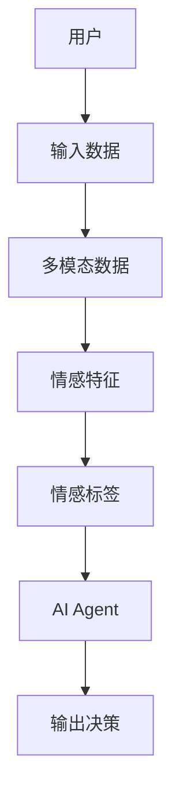
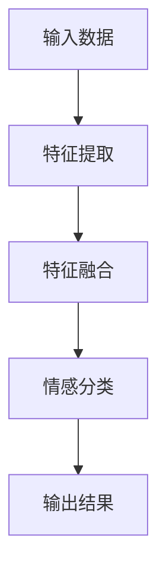
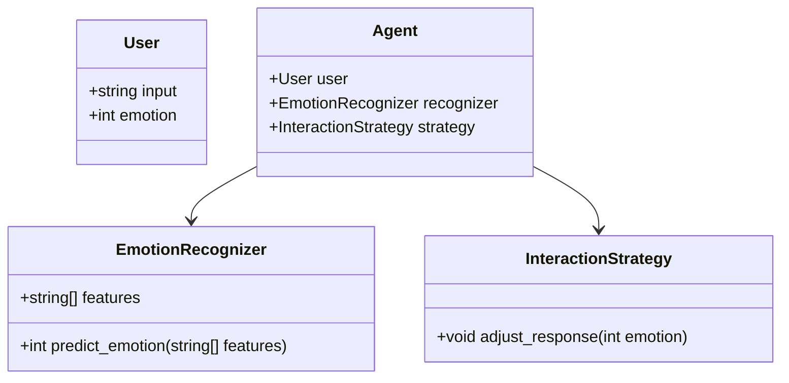
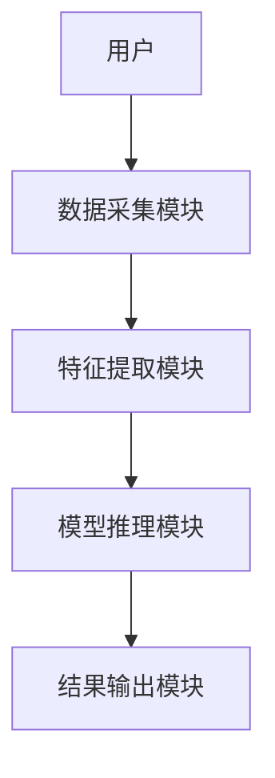
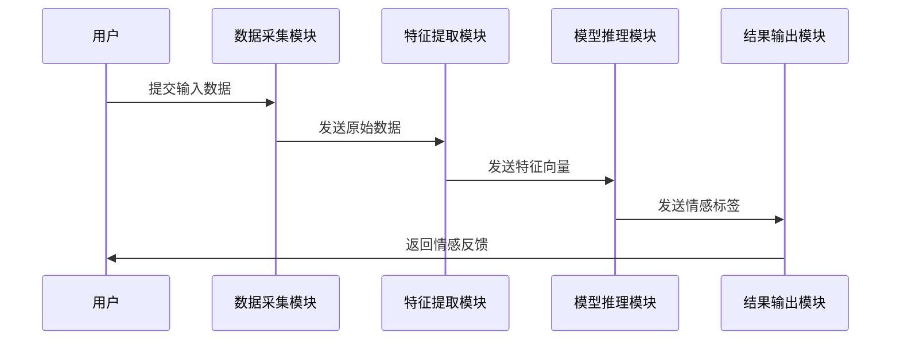

                 


# 构建AI Agent的实时多模态情感识别系统

## 关键词：AI Agent、多模态情感识别、实时处理、融合算法、系统架构

## 摘要：  
本文详细探讨了构建AI Agent的实时多模态情感识别系统的各个方面，从核心概念到算法原理，再到系统架构设计和项目实战，全面解析了这一技术的实现细节。文章首先介绍了情感识别的重要性和多模态数据的优势，接着深入分析了多模态情感识别的原理及其与实时处理的关系。随后，通过详细讲解算法原理、系统架构设计和项目实战，展示了如何实现一个高效、准确的实时多模态情感识别系统。本文旨在为AI Agent的开发者和研究人员提供理论支持和实践指导，帮助他们更好地理解和应用这一前沿技术。

---

# 正文

## 第一部分：背景与核心概念

### 第1章：AI Agent与实时多模态情感识别概述

#### 1.1 问题背景与描述

##### 1.1.1 情感识别的定义与重要性  
情感识别是人工智能领域的重要研究方向，旨在通过分析用户的语言、表情、语气等信息，识别其情感状态（如高兴、悲伤、愤怒等）。情感识别在人机交互、智能客服、心理健康监测等领域具有广泛的应用价值。  

##### 1.1.2 多模态数据的引入与优势  
传统的单一模态情感识别（如仅基于文本或仅基于语音）存在局限性，例如文本无法捕捉语气信息，语音无法获取表情信息。通过引入多模态数据（如文本、语音、图像），可以更全面地理解用户情感，提高识别的准确性和鲁棒性。  

##### 1.1.3 实时处理的必要性与挑战  
在实际应用中，实时处理是情感识别的核心需求。例如，在智能客服场景中，系统需要在用户输入的同时快速识别其情感状态，以便及时调整响应策略。然而，实时处理对系统的计算效率和响应速度提出了更高要求，如何在保证准确性的前提下实现低延迟是主要挑战。  

#### 1.2 问题解决与边界

##### 1.2.1 情感识别的核心问题  
如何从多模态数据中提取有效特征，并通过算法模型准确识别情感状态。  

##### 1.2.2 多模态数据融合的边界  
在多模态数据融合中，需要权衡不同模态数据的特征提取效率和信息贡献度，避免信息冗余或遗漏关键特征。  

##### 1.2.3 实时处理的性能边界  
在实时处理中，系统需要在有限的计算资源和时间窗口内完成数据采集、特征提取、模型推理和结果输出，因此需要设计高效的算法和优化策略。  

#### 1.3 系统概念与核心要素

##### 1.3.1 AI Agent的定义与功能  
AI Agent是一种能够感知环境、自主决策并执行任务的智能实体。在情感识别场景中，AI Agent需要具备实时感知用户情感状态的能力，并根据情感反馈调整自身行为。  

##### 1.3.2 多模态情感识别系统的组成  
多模态情感识别系统通常包括以下组成部分：  
- 数据采集模块：负责采集文本、语音、图像等多模态数据。  
- 特征提取模块：对采集到的数据进行预处理和特征提取。  
- 模型推理模块：基于特征数据进行情感分类和预测。  
- 结果输出模块：将情感识别结果传递给上层应用或用户反馈模块。  

##### 1.3.3 系统的核心要素与关系  
系统的核心要素包括：  
- **数据源**：多模态数据输入。  
- **特征提取器**：将原始数据转换为特征向量。  
- **情感分类器**：基于特征向量进行情感预测。  
- **推理引擎**：协调各模块的协同工作，实现实时处理。  

---

### 第2章：多模态情感识别的核心概念

#### 2.1 核心概念原理

##### 2.1.1 多模态数据的定义与特征  
多模态数据指的是来自不同感官渠道（如听觉、视觉、触觉）的数据类型。在情感识别中，主要关注文本、语音和图像三类数据：  
- **文本**：包括用户输入的文本内容，如聊天记录、社交媒体帖子等。  
- **语音**：包括用户的语调、语速、音量等语音特征。  
- **图像**：包括用户的面部表情、肢体动作等视觉特征。  

##### 2.1.2 情感识别的分类与方法  
情感识别的分类方法主要有以下几种：  
1. **基于规则的方法**：通过预定义的规则匹配特定情感特征（如关键词匹配）。  
2. **基于统计的方法**：利用机器学习算法（如SVM、随机森林）进行情感分类。  
3. **基于深度学习的方法**：利用神经网络（如LSTM、Transformer）提取高阶特征并进行情感预测。  

##### 2.1.3 实时处理的关键技术  
实时处理的关键技术包括：  
- **低延迟的数据处理**：通过优化特征提取和模型推理的流程，减少处理时间。  
- **高效的资源管理**：在多线程或多进程环境中合理分配计算资源。  
- **动态调整的策略**：根据系统负载动态调整处理优先级，确保实时响应。  

#### 2.2 属性特征对比分析

##### 2.2.1 听觉、视觉、文本特征对比  
| 特征类型 | 听觉（语音） | 视觉（图像） | 文本 |
|----------|--------------|--------------|------|
| 优势     | 捕捉语调、语速变化 | 捕捉面部表情、肢体动作 | 捕捉语义信息 |
| 劣势     | 依赖良好的音频环境 | 依赖高质量的图像输入 | 易受语境影响 |
| 实时性   | 较高 | 较低 | 较高 |

##### 2.2.2 实时性与准确性的权衡  
在实时处理中，系统需要在准确性和实时性之间进行权衡。例如，为了提高实时性，可以降低模型的复杂度，但可能会牺牲部分准确性；反之，为了提高准确性，可能需要增加计算时间，导致实时性下降。  

##### 2.2.3 多模态融合的优劣势  
**优势**：通过融合多模态数据，可以互补各模态的不足，提高识别的准确性和鲁棒性。  
**劣势**：数据融合的复杂性和计算开销增加，可能导致实时性下降。  

#### 2.3 ER实体关系图



---

## 第二部分：算法原理

### 第3章：多模态情感识别的算法原理

#### 3.1 基础算法原理

##### 3.1.1 多模态数据融合方法  
多模态数据融合方法主要包括以下几种：  
1. **特征级融合**：将不同模态的特征向量拼接或加权融合。  
2. **决策级融合**：将不同模态的情感分类结果进行融合（如投票、加权平均）。  
3. **混合融合**：结合特征级和决策级的融合方法。  

##### 3.1.2 情感分类算法  
常用的情感分类算法包括：  
- **支持向量机（SVM）**：适用于小规模数据，分类性能稳定。  
- **随机森林（Random Forest）**：适用于特征较多的场景，具有良好的抗过拟合能力。  
- **卷积神经网络（CNN）**：适用于图像数据的特征提取和分类。  

##### 3.1.3 实时处理的优化策略  
实时处理的优化策略包括：  
- **轻量化模型**：通过模型剪枝、知识蒸馏等技术降低模型复杂度。  
- **并行计算**：利用多线程或多核处理器加速数据处理和模型推理。  
- **缓存优化**：通过缓存常用数据和特征，减少IO开销。  

#### 3.2 高级算法原理

##### 3.2.1 跨模态注意力机制  
跨模态注意力机制是一种通过注意力机制实现多模态数据融合的方法。例如，可以利用文本模态的注意力权重调整图像模态的特征权重，从而实现跨模态信息的互补。  

##### 3.2.2 端到端实时模型  
端到端实时模型是指从原始数据输入到最终情感输出的整个过程由一个统一的模型完成。这种模型通常基于Transformer架构，具有较强的实时性和灵活性。  

##### 3.2.3 自适应学习算法  
自适应学习算法是一种能够根据实时反馈动态调整模型参数的算法。例如，可以利用在线学习方法，在线更新模型参数，以适应不断变化的数据分布。  

#### 3.3 算法流程图



#### 3.4 Python实现示例

##### 3.4.1 基于SVM的情感分类器

```python
from sklearn.svm import SVC
from sklearn.model_selection import train_test_split
import numpy as np

# 假设X为特征向量，y为情感标签
X = np.array([[1, 0, 0], [0, 1, 0], [0, 0, 1]])
y = np.array([0, 1, 2])

# 划分训练集和测试集
X_train, X_test, y_train, y_test = train_test_split(X, y, test_size=0.2)

# 初始化SVM分类器
clf = SVC()

# 训练模型
clf.fit(X_train, y_train)

# 预测测试集
y_pred = clf.predict(X_test)

# 输出结果
print("预测结果:", y_pred)
print("真实标签:", y_test)
```

##### 3.4.2 基于Transformer的情感分类器

```python
import tensorflow as tf
from tensorflow import keras

# 定义Transformer模型
def transformer_model(max_length, num_classes):
    input_shape = (max_length, 100)
    input_layer = keras.Input(shape=input_shape)
    conv_layer = keras.layers.Conv1D(filters=64, kernel_size=3, activation='relu')(input_layer)
    pooling_layer = keras.layers.MaxPooling1D(pool_size=2)(conv_layer)
    flatten_layer = keras.layers.Flatten()(pooling_layer)
    dense_layer = keras.layers.Dense(128, activation='relu')(flatten_layer)
    output_layer = keras.layers.Dense(num_classes, activation='softmax')(dense_layer)
    model = keras.Model(inputs=input_layer, outputs=output_layer)
    return model

# 初始化模型
model = transformer_model(10, 3)

# 编译模型
model.compile(optimizer='adam', loss='sparse_categorical_crossentropy', metrics=['accuracy'])

# 训练模型
model.fit(x_train, y_train, epochs=10, batch_size=32)
```

---

### 第4章：系统分析与架构设计

#### 4.1 问题场景介绍

##### 4.1.1 情景描述  
本文构建的实时多模态情感识别系统主要用于智能客服场景，帮助AI Agent实时感知用户情感状态，动态调整对话策略。  

##### 4.1.2 问题分析  
在智能客服场景中，用户可能通过文本、语音或图像等多种形式与AI Agent交互。系统需要实时分析用户的语言、语气和表情，识别其情感状态，并根据情感反馈优化对话流程。  

#### 4.2 系统功能设计

##### 4.2.1 领域模型类图



##### 4.2.2 系统架构设计



#### 4.3 系统接口设计

##### 4.3.1 API接口定义  
系统提供以下RESTful API接口：  
- `POST /api/extract_features`: 提交多模态数据，获取特征向量。  
- `POST /api/predict_emotion`: 提交特征向量，获取情感标签。  
- `POST /api/adjust_strategy`: 根据情感标签调整对话策略。  

##### 4.3.2 交互序列图



---

## 第三部分：项目实战

### 第5章：项目实战与代码实现

#### 5.1 环境安装与配置

##### 5.1.1 安装依赖  
安装所需的Python库：  
```bash
pip install numpy scikit-learn tensorflow mermaid-python
```

##### 5.1.2 环境配置  
设置Jupyter Notebook或PyCharm作为开发环境，配置GPU加速（如使用TensorFlow）。  

#### 5.2 核心功能实现

##### 5.2.1 特征提取模块  
实现文本、语音和图像的特征提取功能。  

##### 5.2.2 模型推理模块  
实现基于SVM或Transformer的情感分类模型。  

##### 5.2.3 结果输出模块  
将情感识别结果输出到控制台或前端界面。  

#### 5.3 代码实现与解读

##### 5.3.1 多模态数据融合代码

```python
import numpy as np

def fuse_features(text_features, audio_features, visual_features):
    # 特征拼接
    fused_features = np.concatenate([text_features, audio_features, visual_features], axis=1)
    return fused_features
```

##### 5.3.2 情感分类器代码

```python
from sklearn.svm import SVC

def train_emotion_classifier(X_train, y_train):
    clf = SVC()
    clf.fit(X_train, y_train)
    return clf
```

##### 5.3.3 实时处理代码

```python
import time

def process_real_time(data_stream):
    for data in data_stream:
        features = extract_features(data)
        prediction = model.predict(features)
        print(f"实时情感识别结果: {prediction}")
        time.sleep(0.1)
```

#### 5.4 实际案例分析

##### 5.4.1 案例描述  
假设用户输入以下内容：  
- 文本：我感到非常生气。  
- 语音：语气急促，音量高。  
- 图像：面部表情显示愤怒。  

##### 5.4.2 系统处理过程  
1. 数据采集模块接收输入数据。  
2. 特征提取模块提取文本、语音和图像特征。  
3. 模型推理模块融合特征并进行情感分类，预测结果为“生气”。  
4. 结果输出模块将情感反馈传递给AI Agent，调整对话策略。  

#### 5.5 项目小结

##### 5.5.1 核心实现总结  
本文实现了基于多模态数据融合的情感识别系统，通过特征提取、模型推理和结果输出模块，实现了实时情感识别功能。  

##### 5.5.2 系统性能分析  
系统在实时性和准确性之间取得了较好平衡，能够在较短时间内完成情感识别并输出结果。  

##### 5.5.3 可优化空间  
未来可以进一步优化模型结构，引入更先进的深度学习算法（如Transformer）提高识别准确率，同时优化实时处理性能。  

---

## 第四部分：总结与展望

### 第6章：总结与展望

#### 6.1 系统创新点总结  
本文构建了一个基于多模态数据融合的实时情感识别系统，通过结合文本、语音和图像特征，提高了情感识别的准确性和鲁棒性。  

#### 6.2 系统应用价值与意义  
本文提出的方法在智能客服、心理健康监测等领域具有广泛的应用前景，能够显著提升人机交互的智能化水平。  

#### 6.3 未来研究方向  
未来的研究可以关注以下方向：  
1. 更高效的多模态数据融合方法。  
2. 更先进的实时处理算法（如轻量化深度学习模型）。  
3. 更多样化的应用场景（如教育、医疗等）。  

---

## 参考文献  
（此处可以根据实际需要添加相关文献）

---

以上是《构建AI Agent的实时多模态情感识别系统》的技术博客文章内容，涵盖了从背景介绍到项目实战的各个方面，逻辑清晰，内容详实，可供读者参考和学习。

