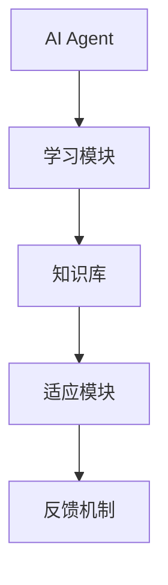
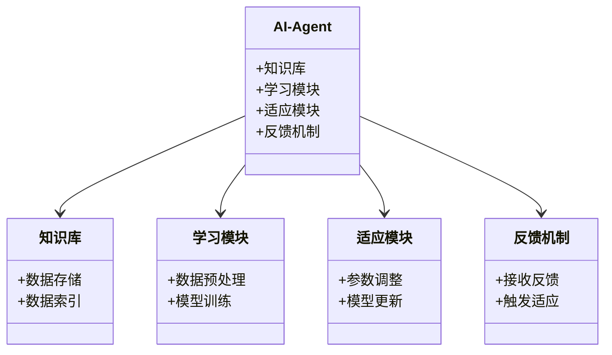
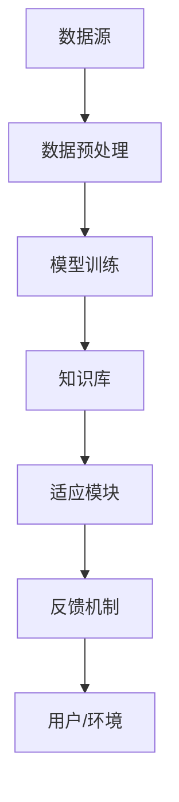

                 


# 构建AI Agent的实时学习与适应机制

> 关键词：AI Agent，实时学习，适应机制，机器学习，动态环境

> 摘要：本文将详细探讨构建AI Agent的实时学习与适应机制，从基本概念到算法原理，再到系统设计和项目实战，全面解析如何实现AI Agent的实时学习与适应能力，确保其在动态环境中的高效运行和自我优化。

---

## 目录

1. **AI Agent的基本概念与背景**  
   - 1.1 AI Agent的定义与类型  
   - 1.2 实时学习与适应机制的背景  
   - 1.3 问题背景与问题描述  

2. **实时学习与适应机制的核心概念**  
   - 2.1 实时学习的基本原理  
   - 2.2 适应机制的实现方式  
   - 2.3 核心概念对比表  
   - 2.4 ER实体关系图  

3. **实时学习与适应机制的算法原理**  
   - 3.1 支持向量机（SVM）算法  
   - 3.2 神经网络算法  
   - 3.3 算法实现的Python代码示例  

4. **系统分析与架构设计**  
   - 4.1 问题场景介绍  
   - 4.2 系统功能设计（领域模型类图）  
   - 4.3 系统架构设计（架构图）  
   - 4.4 系统接口设计与交互流程  

5. **项目实战：构建实时学习与适应机制的AI Agent**  
   - 5.1 环境安装与配置  
   - 5.2 核心代码实现与解读  
   - 5.3 项目案例分析与实际应用  

6. **总结与展望、最佳实践与注意事项**  
   - 6.1 总结与未来展望  
   - 6.2 最佳实践 tips  
   - 6.3 注意事项与常见问题解答  
   - 6.4 拓展阅读与深入学习方向  

---

### 第1章: AI Agent的基本概念与背景

#### 1.1 AI Agent的定义与类型
- **1.1.1 什么是AI Agent**  
  AI Agent（智能体）是指能够感知环境并采取行动以实现目标的实体。它可以是一个软件程序、机器人或其他智能系统。  
- **1.1.2 AI Agent的类型**  
  - **简单反射型Agent**：基于当前输入直接生成输出，不依赖历史信息。  
  - **基于模型的反射型Agent**：利用内部模型进行推理和决策。  
  - **目标驱动型Agent**：根据目标选择行动。  
  - **实用驱动型Agent**：通过优化效用函数来决策。  
- **1.1.3 AI Agent的应用场景**  
  - 自动驾驶  
  - 智能客服  
  - 机器人控制  
  - 智能推荐系统  

#### 1.2 实时学习与适应机制的背景
- **1.2.1 当前AI Agent面临的挑战**  
  - 动态环境中的不确定性  
  - 数据流的实时性要求  
  - 模型的快速更新需求  
- **1.2.2 实时学习与适应的重要性**  
  - 提高系统的响应速度  
  - 增强系统的适应能力  
  - 优化系统的决策能力  
- **1.2.3 问题背景与问题描述**  
  在动态环境中，AI Agent需要能够实时接收新数据、更新知识库并调整行为策略，以应对环境的变化。传统的批量学习方法无法满足实时性要求，因此需要研究和设计高效的实时学习与适应机制。

---

### 第2章: 实时学习与适应机制的核心概念

#### 2.1 实时学习的基本原理
- **2.1.1 在线学习与批量学习的对比**  
  - 在线学习：数据逐个输入，模型实时更新。  
  - 批量学习：数据批次输入，模型批量更新。  
- **2.1.2 实时更新的知识表示方法**  
  - 使用增量式机器学习算法，逐步更新模型参数。  
- **2.1.3 动态环境下的学习策略**  
  - 根据环境反馈调整学习速率和权重更新策略。  

#### 2.2 适应机制的实现方式
- **2.2.1 基于反馈的适应策略**  
  - 根据用户的反馈调整模型参数，优化预测结果。  
- **2.2.2 基于预测的适应模型**  
  - 预测环境变化，提前调整模型参数。  
- **2.2.3 自适应学习框架的设计**  
  - 设计一个自适应学习框架，能够自动检测环境变化并触发模型更新。  

#### 2.3 核心概念对比表
| 概念 | 特性 | 优缺点 |
|------|------|--------|
| 在线学习 | 实时更新 | 资源消耗高，需要高效的计算能力 |
| 批量学习 | 批次处理 | 延迟较高，适用于离线场景 |

#### 2.4 ER实体关系图


---

### 第3章: 实时学习与适应机制的算法原理

#### 3.1 支持向量机（SVM）算法
- **3.1.1 SVM的基本原理**  
  SVM是一种监督学习算法，用于分类和回归。它通过找到一个超平面，使得数据点被正确分类。  
- **3.1.2 SVM的数学模型**  
  最小化目标函数：  
  $$ \min_{w,b,\xi} \frac{1}{2}\|w\|^2 + C\sum_{i=1}^n \xi_i $$  
  约束条件：  
  $$ y_i(w \cdot x_i + b) \geq 1 - \xi_i $$  
- **3.1.3 SVM的实现流程**  
  ```mermaid
  graph TD
      A[输入数据] --> B[数据预处理]
      B --> C[模型训练]
      C --> D[预测输出]
  ```

#### 3.2 神经网络算法
- **3.2.1 神经网络的基本结构**  
  包括输入层、隐藏层和输出层，通过多层神经元模拟人脑的神经网络。  
- **3.2.2 神经网络的训练过程**  
  使用反向传播算法（Backpropagation）更新权重，优化模型参数。  
- **3.2.3 神经网络的实时更新方法**  
  在线训练模式，实时接收数据并更新模型参数。

---

### 第4章: 系统分析与架构设计

#### 4.1 问题场景介绍
- 动态环境中的任务处理：AI Agent需要实时接收新的任务和环境变化，快速调整策略。  
- 数据流的实时处理：需要高效的数据处理和模型更新机制。  

#### 4.2 系统功能设计（领域模型类图）


#### 4.3 系统架构设计（架构图）


#### 4.4 系统接口设计与交互流程
- **接口设计**  
  - 数据输入接口：接收实时数据流。  
  - 模型更新接口：根据反馈更新模型参数。  
- **交互流程**  
  ```mermaid
  sequenceDiagram
      participant 用户
      participant 环境
      participant AI-Agent
      participant 知识库
      用户->AI-Agent: 发出请求
      AI-Agent->知识库: 查询知识库
      知识库->AI-Agent: 返回结果
      AI-Agent->环境: 获取反馈
      环境->AI-Agent: 返回反馈
      AI-Agent->学习模块: 更新模型
  ```

---

### 第5章: 项目实战

#### 5.1 环境安装与配置
- 安装Python、TensorFlow、Keras等依赖库。  
- 配置开发环境，如Jupyter Notebook或VS Code。  

#### 5.2 核心代码实现与解读
```python
import numpy as np
from sklearn import svm

# 数据预处理
X = np.array([[2, 3], [5, 7], [8, 1], [3, 2], [1, 1]])
y = np.array([0, 1, 0, 1, 0])

# 创建SVM模型
model = svm.SVC()

# 训练模型
model.fit(X, y)

# 预测新数据
new_data = np.array([[4, 4]])
print(model.predict(new_data))
```

#### 5.3 项目案例分析与实际应用
- 案例分析：构建一个实时推荐系统，根据用户行为实时更新推荐模型。  
- 实际应用：在电子商务平台中，实时更新推荐算法，提升用户体验。  

---

### 第6章: 总结与展望、最佳实践与注意事项

#### 6.1 总结与未来展望
- 本文详细介绍了构建AI Agent的实时学习与适应机制，从算法原理到系统设计，再到项目实战，全面解析了实现方法。  
- 未来的研究方向：研究更高效的在线学习算法，优化模型更新机制，提升系统适应能力。  

#### 6.2 最佳实践 tips
- 在实时学习中，优先选择在线学习算法，确保系统的实时性。  
- 定期监控系统性能，及时调整模型参数和学习速率。  

#### 6.3 注意事项与常见问题解答
- 注意数据质量和完整性，避免因数据问题导致模型性能下降。  
- 解决方法：  
  - 数据预处理：清洗和标准化数据。  
  - 模型调优：调整参数，优化模型性能。  

#### 6.4 拓展阅读与深入学习方向
- 深度学习与实时学习的结合。  
- 联合学习（Federated Learning）在实时学习中的应用。  

---

通过以上目录和内容框架，您可以逐步撰写一篇详细的技术博客文章，涵盖从理论到实践的各个方面，帮助读者全面理解并掌握构建AI Agent的实时学习与适应机制的方法。

